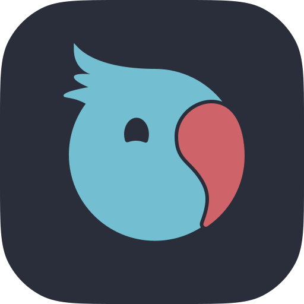

# Pear by Holepunch

> Pear loads applications remotely from peers and allows anyone to create and share applications with peers.

Pear is an installable Peer-to-Peer (P2P) Runtime, Development & Deployment platform.

Build, share & extend unstoppable, zero-infrastructure P2P applications for Mobile, Desktop & Terminal.

Welcome to the Internet of Peers

&nbsp; _– Holepunch, the P2P Company_

## Documentation

* [Showcase](#showcase)
* [Terms](#terms)
* [Legend](#legend)
* [Reference](#reference)
* [Examples](#examples)
* [Guides](#guides)
* [How-tos](#how-tos)
* [Pear Modules](#pear-modules)
* [P2P Modules](#p2p-modules)
* [Bare Modules](#bare-modules)
* [Tools](#tools)

### Showcase

Peer-to-Peer applications built on, deployed with, running on Pear.

|  |  | &nbsp; | &nbsp; | &nbsp; |
| :---: | :---: | :---: | :---: | :---: |
| <a href="https://keet.io" data-pear="pear://keet" title="Encrypted peer-to-peer message, audio & video chat"><strong>Keet</strong></a> | <a href="https://pass.pears.com" data-pear="pear://pass" title="Secure peer-to-peer password & secrets manager"><strong>PearPass</strong></a> | &nbsp; | &nbsp; | &nbsp; |

### Terms

* API - Application-Programming-Interface
* CLI - Command-Line-Interface
* link - a `pear://` link, a `file://` link or an absolute/relative dir path
* P2P - Peer-to-Peer

### Legend

Throughout the documentation, indications of stability are provided. Some modules are well-established and used widely, making them highly unlikely to ever change. Other modules may be new, experimental, or known to have risks associated with their use.

The following stability indices have been used:

|                           Stability                                |                         Description                         |
| ------------------------------------------------------------------ | ----------------------------------------------------------- |
| <mark style="background-color: #80ff80;">**stable**</mark>       | Unlikely to change or be removed in the foreseeable future  |
| <mark style="background-color: #8484ff;">**experimental**</mark> | New, untested, or has known issues                          |
| <mark style="background-color: #ffffa2;">**deprecated**</mark>   | Being removed or replaced in the future                     |
| <mark style="background-color: #ff4242;">**unstable**</mark>     | May change or be removed without warning                    |

### Reference

Pear is a native point-to-point peer-to-peer capable platform that consists of a runtime binary, an API, userland modules, a command-line interface, an on-demand daemon and an application shell to provide the capabilities to develop & deploy production P2P applications. With JavaScript and beyond.

Pear's runtime binary is built on [Bare](https://github.com/holepunchto/bare), a small and modular JavaScript runtime for desktop and mobile. Like Node.js, it provides an asynchronous, event-driven architecture for writing applications in the lingua franca of modern software. Unlike Node.js, embedding and cross-device are supported as core use cases, aiming to run just as well on mobile as desktop.

* [Pear CLI](./reference/cli.md)
* [Pear Configuration](./reference/configuration.md)
* [Bare Overview](./reference/bare-overview.md)
* [Pear API](./reference/api.md#globalpear)
* [Bare API](./reference/api.md#globalbare)
* [Templates](./reference/templates.md)
* [Node.js Compatibility](./reference/node-compat.md)
* [Recommended Practices](./reference/recommended-practices.md)
* [Troubleshooting](./reference/troubleshooting.md)
* [Frequently Asked Questions](./reference/faq.md)
* [Migration](./reference/migration.md)

### Examples

- [Pear Terminal](https://github.com/holepunchto/pear/tree/main/examples/terminal)
- [Pear Desktop (Electron)](https://github.com/holepunchto/pear/tree/main/examples/desktop)
- [Bare Android](https://github.com/holepunchto/bare-android)
- [Bare iOS](https://github.com/holepunchto/bare-ios)

### Guides

Guides on using Pear Runtime to build and share peer-to-peer applications.

* [Getting Started](./guide/getting-started.md)
* [Starting a Pear Desktop Project](./guide/starting-a-pear-desktop-project.md)
* [Making a Pear Desktop Application](./guide/making-a-pear-desktop-app.md)
* [Starting a Pear Terminal Project](./guide/starting-a-pear-terminal-project.md)
* [Making a Pear Terminal Application](./guide/making-a-pear-terminal-app.md)
* [Sharing a Pear Application](./guide/sharing-a-pear-app.md)
* [Releasing a Pear Application](./guide/releasing-a-pear-app.md)
* [Making a Bare Mobile Application](./guide/making-a-bare-mobile-app.md)
* [Debugging a Pear Terminal Application](./guide/debugging-a-pear-terminal-app.md)
* [Creating a `pear init` Template](./guide/creating-a-pear-init-template.md)

### How-tos

Collection of How-tos using the essential peer-to-peer building-blocks in Pear applications.

* [How to connect two peers by key with HyperDHT](./howto/connect-two-peers-by-key-with-hyperdht.md)
* [How to connect to many peers by topic with Hyperswarm](./howto/connect-to-many-peers-by-topic-with-hyperswarm.md)
* [How to replicate and persist with Hypercore](./howto/replicate-and-persist-with-hypercore.md)
* [How to work with many Hypercores using Corestore](./howto/work-with-many-hypercores-using-corestore.md)
* [How to share append-only databases with Hyperbee](./howto/share-append-only-databases-with-hyperbee.md)
* [How to create a full peer-to-peer filesystem with Hyperdrive](./howto/create-a-full-peer-to-peer-filesystem-with-hyperdrive.md)

### Pear Modules

The `Pear` global API is minimal and not intended as a standard library.
Application & Integration libraries are supplied via installable modules prefixed with `pear-`.

#### Application Libraries

Pear modules related directly to application environment.

| Module                                                                        | Description                                                          | Systems       | Stability                                                  |
| ----------------------------------------------------------------------------- | -------------------------------------------------------------------- | ---------------------------------------------------------------- | ---------------------------------------------------------- |
| [pear-crasher](https://github.com/holepunchto/pear-crasher)                   | Uncaught exceptions & uncaught rejections crash logger               | 
<picture><source media="(prefers-color-scheme:light)" srcset="assets/windows-light.svg"></picture> <picture><source media="(prefers-color-scheme:light)" srcset="assets/macos-light.svg"></picture> 
                            | <mark style="background-color:#80ff80;">**stable**</mark>  |
| [pear-message](https://github.com/holepunchto/pear-message)                   | Send inter-app pattern-matched object messages                       | 
<picture><source media="(prefers-color-scheme:light)" srcset="assets/windows-light.svg"></picture> <picture><source media="(prefers-color-scheme:light)" srcset="assets/macos-light.svg"></picture> 
                            | <mark style="background-color:#80ff80;">**stable**</mark>  |
| [pear-messages](https://github.com/holepunchto/pear-messages)                 | Receive object messages that match a given object pattern            | 
<picture><source media="(prefers-color-scheme:light)" srcset="assets/windows-light.svg"></picture> <picture><source media="(prefers-color-scheme:light)" srcset="assets/macos-light.svg"></picture> 
                            | <mark style="background-color:#80ff80;">**stable**</mark>  |
| [pear-pipe](https://github.com/holepunchto/pear-pipe)                         | Parent-app-connected pipe, the other end of pear-run pipe            | 
<picture><source media="(prefers-color-scheme:light)" srcset="assets/windows-light.svg"></picture> <picture><source media="(prefers-color-scheme:light)" srcset="assets/macos-light.svg"></picture> 
                            | <mark style="background-color:#80ff80;">**stable**</mark>  |
| [pear-run](https://github.com/holepunchto/pear-run)                           | Run Pear child app by link. Returns a pipe to the child pipe         | 
<picture><source media="(prefers-color-scheme:light)" srcset="assets/windows-light.svg"></picture> <picture><source media="(prefers-color-scheme:light)" srcset="assets/macos-light.svg"></picture> 
                            | <mark style="background-color:#80ff80;">**stable**</mark>  |
| [pear-updates](https://github.com/holepunchto/pear-updates)                   | Receive platform and application update notifications                | 
<picture><source media="(prefers-color-scheme:light)" srcset="assets/windows-light.svg"></picture> <picture><source media="(prefers-color-scheme:light)" srcset="assets/macos-light.svg"></picture> 
                            | <mark style="background-color:#80ff80;">**stable**</mark>  |
| [pear-user-dirs](https://github.com/holepunchto/pear-user-dirs)               | Get the path of user-specific directories                            | 
<picture><source media="(prefers-color-scheme:light)" srcset="assets/windows-light.svg"></picture> <picture><source media="(prefers-color-scheme:light)" srcset="assets/macos-light.svg"></picture> 
                            | <mark style="background-color:#80ff80;">**stable**</mark>  |
| [pear-wakeups](https://github.com/holepunchto/pear-wakeups)                   | Receive wakeup events, including link clicks external to app         | 
<picture><source media="(prefers-color-scheme:light)" srcset="assets/windows-light.svg"></picture> <picture><source media="(prefers-color-scheme:light)" srcset="assets/macos-light.svg"></picture> 
                            | <mark style="background-color:#80ff80;">**stable**</mark>  |

#### User Interface Libraries

Pear modules that supply User Interface runtime capabilities.

| Module                                                                        | Description                                                          | Systems       | Stability                                                  |
| ----------------------------------------------------------------------------- | -------------------------------------------------------------------- | ---------------------------------------------------------------- | ---------------------------------------------------------- |
| [pear-electron](https://github.com/holepunchto/pear-electron)                 | Pear User-Interface Library for Electron                            | 
<picture><source media="(prefers-color-scheme:light)" srcset="assets/windows-light.svg"></picture> <picture><source media="(prefers-color-scheme:light)" srcset="assets/macos-light.svg"></picture> 
                            | <mark style="background-color:#80ff80;">**stable**</mark>  |
| [pear-bridge](https://github.com/holepunchto/pear-bridge)                     | Local HTTP bridge for pear-electron applications                     | 
<picture><source media="(prefers-color-scheme:light)" srcset="assets/windows-light.svg"></picture> <picture><source media="(prefers-color-scheme:light)" srcset="assets/macos-light.svg"></picture> 
                            | <mark style="background-color:#80ff80;">**stable**</mark>  |

#### Common Libraries

Pear modules for general usage, including applications per case.

| Module                                                                        | Description                                                          | Systems       | Stability                                                  |
| ----------------------------------------------------------------------------- | -------------------------------------------------------------------- | ---------------------------------------------------------------- | ---------------------------------------------------------- |
| [pear-drop](https://github.com/holepunchto/pear-drop)                         | Drop data, including application reset                               | 
<picture><source media="(prefers-color-scheme:light)" srcset="assets/windows-light.svg"></picture> <picture><source media="(prefers-color-scheme:light)" srcset="assets/macos-light.svg"></picture> 
                            | <mark style="background-color:#80ff80;">**stable**</mark>  |
| [pear-dump](https://github.com/holepunchto/pear-dump)                         | Synchronize files from link to dir peer-to-peer or from-disk         | 
<picture><source media="(prefers-color-scheme:light)" srcset="assets/windows-light.svg"></picture> <picture><source media="(prefers-color-scheme:light)" srcset="assets/macos-light.svg"></picture> 
                            | <mark style="background-color:#80ff80;">**stable**</mark>  |
| [pear-gracedown](https://github.com/holepunchto/pear-gracedown)               | Pear graceful closer. For use with `pipe.autoexit = false`           | 
<picture><source media="(prefers-color-scheme:light)" srcset="assets/windows-light.svg"></picture> <picture><source media="(prefers-color-scheme:light)" srcset="assets/macos-light.svg"></picture> 
                            | <mark style="background-color:#80ff80;">**stable**</mark>  |
| [pear-info](https://github.com/holepunchto/pear-info)                         | Read Pear project information by link                                | 
<picture><source media="(prefers-color-scheme:light)" srcset="assets/windows-light.svg"></picture> <picture><source media="(prefers-color-scheme:light)" srcset="assets/macos-light.svg"></picture> 
                            | <mark style="background-color:#80ff80;">**stable**</mark>  |
| [pear-link](https://github.com/holepunchto/pear-link)                         | Parser-Serializer for `pear://` links. Includes alias resolution     | 
<picture><source media="(prefers-color-scheme:light)" srcset="assets/windows-light.svg"></picture> <picture><source media="(prefers-color-scheme:light)" srcset="assets/macos-light.svg"></picture>  <picture><source media="(prefers-color-scheme:light)" srcset="assets/android-light.svg"></picture> <picture><source media="(prefers-color-scheme:light)" srcset="assets/ios-light.svg"></picture>
    | <mark style="background-color:#80ff80;">**stable**</mark>  |
| [pear-opwait](https://github.com/holepunchto/pear-opwait)                     | Pear operation stream promise wrapper                                | 
<picture><source media="(prefers-color-scheme:light)" srcset="assets/windows-light.svg"></picture> <picture><source media="(prefers-color-scheme:light)" srcset="assets/macos-light.svg"></picture> 
                            | <mark style="background-color:#80ff80;">**stable**</mark>  |
| [pear-release](https://github.com/holepunchto/pear-release)                   | Set application production release version length                    | 
<picture><source media="(prefers-color-scheme:light)" srcset="assets/windows-light.svg"></picture> <picture><source media="(prefers-color-scheme:light)" srcset="assets/macos-light.svg"></picture> 
                            | <mark style="background-color:#80ff80;">**stable**</mark>  |
| [pear-seed](https://github.com/holepunchto/pear-seed)                         | Seed or reseed a Pear app drive by link                              | 
<picture><source media="(prefers-color-scheme:light)" srcset="assets/windows-light.svg"></picture> <picture><source media="(prefers-color-scheme:light)" srcset="assets/macos-light.svg"></picture> 
                            | <mark style="background-color:#80ff80;">**stable**</mark>  |
| [pear-stage](https://github.com/holepunchto/pear-stage)                       | Synchronize from-disk to app drive peer-to-peer                      | 
<picture><source media="(prefers-color-scheme:light)" srcset="assets/windows-light.svg"></picture> <picture><source media="(prefers-color-scheme:light)" srcset="assets/macos-light.svg"></picture> 
                            | <mark style="background-color:#80ff80;">**stable**</mark>  |
| [pear-stamp](https://github.com/holepunchto/pear-stamp)                       | Interleave locals into a template, sync and stream                   | 
<picture><source media="(prefers-color-scheme:light)" srcset="assets/windows-light.svg"></picture> <picture><source media="(prefers-color-scheme:light)" srcset="assets/macos-light.svg"></picture> 
                            | <mark style="background-color:#80ff80;">**stable**</mark>  |

#### Developer Libraries

Pear modules to assist with developing & debugging

| Module                                                                        | Description                                                          | Systems      | Stability                                                  |
| ----------------------------------------------------------------------------- | -------------------------------------------------------------------- | --------------------------------------------------------------- | ---------------------------------------------------------- |
| [pear-inspect](https://github.com/holepunchto/pear-inspect)                   | Securely enable remote debugging protocol over Hyperswarm            | 
<picture><source media="(prefers-color-scheme:light)" srcset="assets/windows-light.svg"></picture> <picture><source media="(prefers-color-scheme:light)" srcset="assets/macos-light.svg"></picture>  <picture><source media="(prefers-color-scheme:light)" srcset="assets/android-light.svg"></picture> <picture><source media="(prefers-color-scheme:light)" srcset="assets/ios-light.svg"></picture>
   | <mark style="background-color:#80ff80;">**stable**</mark>  |
| [pear-hotmods](https://github.com/holepunchto/pear-hotmods)                   | For `pear-electron` UI apps. Frontend framework-agnostic live-reload | 
<picture><source media="(prefers-color-scheme:light)" srcset="assets/windows-light.svg"></picture> <picture><source media="(prefers-color-scheme:light)" srcset="assets/macos-light.svg"></picture> 
                           | <mark style="background-color:#80ff80;">**stable**</mark>  |

#### Integration Libraries

Pear modules for runtime integrations. Such as [pear-electron](https://github.com/holepunchto/pear-electron).

| Module                                                                        | Description                                                          | Systems      | Stability                                                  |
| ----------------------------------------------------------------------------- | -------------------------------------------------------------------- | --------------------------------------------------------------- | ---------------------------------------------------------- |
| [pear-appdrive](https://github.com/holepunchto/pear-appdrive)                 | Read-only Hyperdrive API subset interface for application drives     | 
<picture><source media="(prefers-color-scheme:light)" srcset="assets/windows-light.svg"></picture> <picture><source media="(prefers-color-scheme:light)" srcset="assets/macos-light.svg"></picture> 
                           | <mark style="background-color:#80ff80;">**stable**</mark>  |
| [pear-aliases](https://github.com/holepunchto/pear-aliases)                   | List of aliases for `pear://<alias>` links                           | 
<picture><source media="(prefers-color-scheme:light)" srcset="assets/windows-light.svg"></picture> <picture><source media="(prefers-color-scheme:light)" srcset="assets/macos-light.svg"></picture>  <picture><source media="(prefers-color-scheme:light)" srcset="assets/android-light.svg"></picture> <picture><source media="(prefers-color-scheme:light)" srcset="assets/ios-light.svg"></picture>
   | <mark style="background-color:#80ff80;">**stable**</mark>  |
| [pear-api](https://github.com/holepunchto/pear-api)                           | global.Pear API class                                                | 
<picture><source media="(prefers-color-scheme:light)" srcset="assets/windows-light.svg"></picture> <picture><source media="(prefers-color-scheme:light)" srcset="assets/macos-light.svg"></picture>  <picture><source media="(prefers-color-scheme:light)" srcset="assets/android-light.svg"></picture> <picture><source media="(prefers-color-scheme:light)" srcset="assets/ios-light.svg"></picture>
   | <mark style="background-color:#80ff80;">**stable**</mark>  |
| [pear-changelog](https://github.com/holepunchto/pear-changelog)               | Changelog parsing and diffing                                        | 
<picture><source media="(prefers-color-scheme:light)" srcset="assets/windows-light.svg"></picture> <picture><source media="(prefers-color-scheme:light)" srcset="assets/macos-light.svg"></picture>  <picture><source media="(prefers-color-scheme:light)" srcset="assets/android-light.svg"></picture> <picture><source media="(prefers-color-scheme:light)" srcset="assets/ios-light.svg"></picture>
   | <mark style="background-color:#80ff80;">**stable**</mark>  |
| [pear-constants](https://github.com/holepunchto/pear-constants)               | Shared Pear constants                                                | 
<picture><source media="(prefers-color-scheme:light)" srcset="assets/windows-light.svg"></picture> <picture><source media="(prefers-color-scheme:light)" srcset="assets/macos-light.svg"></picture>  <picture><source media="(prefers-color-scheme:light)" srcset="assets/android-light.svg"></picture> <picture><source media="(prefers-color-scheme:light)" srcset="assets/ios-light.svg"></picture>
   | <mark style="background-color:#80ff80;">**stable**</mark>  |
| [pear-cmd](https://github.com/holepunchto/pear-cmd)                           | Command parser & definitions                                         | 
<picture><source media="(prefers-color-scheme:light)" srcset="assets/windows-light.svg"></picture> <picture><source media="(prefers-color-scheme:light)" srcset="assets/macos-light.svg"></picture> 
                           | <mark style="background-color:#80ff80;">**stable**</mark>  |
| [pear-errors](https://github.com/holepunchto/pear-errors)                     | Shared Pear error types                                              | 
<picture><source media="(prefers-color-scheme:light)" srcset="assets/windows-light.svg"></picture> <picture><source media="(prefers-color-scheme:light)" srcset="assets/macos-light.svg"></picture>  <picture><source media="(prefers-color-scheme:light)" srcset="assets/android-light.svg"></picture> <picture><source media="(prefers-color-scheme:light)" srcset="assets/ios-light.svg"></picture>
   | <mark style="background-color:#80ff80;">**stable**</mark>  |
| [pear-gunk](https://github.com/holepunchto/pear-gunk)                         | Shared builtins, overrides & linker mappings                         | 
<picture><source media="(prefers-color-scheme:light)" srcset="assets/windows-light.svg"></picture> <picture><source media="(prefers-color-scheme:light)" srcset="assets/macos-light.svg"></picture> 
                           | <mark style="background-color:#ff4242;">**unstable**</mark>|
| [pear-ipc](https://github.com/holepunchto/pear-ipc)                           | Interprocess Communication library                                   | 
<picture><source media="(prefers-color-scheme:light)" srcset="assets/windows-light.svg"></picture> <picture><source media="(prefers-color-scheme:light)" srcset="assets/macos-light.svg"></picture> 
                           | <mark style="background-color:#80ff80;">**stable**</mark>  |
| [pear-ref](https://github.com/holepunchto/pear-ref)                           | IO handle reference counter & tracker                                | 
<picture><source media="(prefers-color-scheme:light)" srcset="assets/windows-light.svg"></picture> <picture><source media="(prefers-color-scheme:light)" srcset="assets/macos-light.svg"></picture>  <picture><source media="(prefers-color-scheme:light)" srcset="assets/android-light.svg"></picture> <picture><source media="(prefers-color-scheme:light)" srcset="assets/ios-light.svg"></picture>
   | <mark style="background-color:#80ff80;">**stable**</mark>  |
| [pear-rti](https://github.com/holepunchto/pear-rti)                           | Runtime Information state bootstrap for API building                 | 
<picture><source media="(prefers-color-scheme:light)" srcset="assets/windows-light.svg"></picture> <picture><source media="(prefers-color-scheme:light)" srcset="assets/macos-light.svg"></picture>  <picture><source media="(prefers-color-scheme:light)" srcset="assets/android-light.svg"></picture> <picture><source media="(prefers-color-scheme:light)" srcset="assets/ios-light.svg"></picture>
   | <mark style="background-color:#80ff80;">**stable**</mark>  |
| [pear-state](https://github.com/holepunchto/pear-state)                       | Shared state structure & capabilities                                | 
<picture><source media="(prefers-color-scheme:light)" srcset="assets/windows-light.svg"></picture> <picture><source media="(prefers-color-scheme:light)" srcset="assets/macos-light.svg"></picture>  <picture><source media="(prefers-color-scheme:light)" srcset="assets/android-light.svg"></picture> <picture><source media="(prefers-color-scheme:light)" srcset="assets/ios-light.svg"></picture>
   | <mark style="background-color:#80ff80;">**stable**</mark>  |
| [pear-terminal](https://github.com/holepunchto/pear-terminal)                 | Terminal User Interface library                                      | 
<picture><source media="(prefers-color-scheme:light)" srcset="assets/windows-light.svg"></picture> <picture><source media="(prefers-color-scheme:light)" srcset="assets/macos-light.svg"></picture> 
                           | <mark style="background-color:#80ff80;">**stable**</mark>  |
| [pear-tryboot](https://github.com/holepunchto/pear-tryboot)                   | Used with `pear-ipc`, tries to boot sidecar on connect failure       | 
<picture><source media="(prefers-color-scheme:light)" srcset="assets/windows-light.svg"></picture> <picture><source media="(prefers-color-scheme:light)" srcset="assets/macos-light.svg"></picture> 
                           | <mark style="background-color:#80ff80;">**stable**</mark>  |

### P2P Modules

Modules that supply point-to-point peer-to-peer connection and storage capabilities.

#### Building-Block Libraries

The essential building-blocks for building powerful P2P applications using Pear.

| Name                                                     | Description                                                                         | Systems         | Stability                                                 |
| -------------------------------------------------------- | ----------------------------------------------------------------------------------- | ------------------------------------------------------------------ | --------------------------------------------------------- |
| [hypercore](https://github.com/holepunchto/hypercore)    | A distributed, secure append-only log for creating fast, scalable P2P applications  | 
<picture><source media="(prefers-color-scheme:light)" srcset="assets/windows-light.svg"></picture> <picture><source media="(prefers-color-scheme:light)" srcset="assets/macos-light.svg"></picture>  <picture><source media="(prefers-color-scheme:light)" srcset="assets/android-light.svg"></picture> <picture><source media="(prefers-color-scheme:light)" srcset="assets/ios-light.svg"></picture>
      | <mark style="background-color:#80ff80;">**stable**</mark> |
| [hyperbee](https://github.com/holepunchto/hyperbee)      | An append-only B-tree running on a Hypercore. Allows sorted iteration and more      | 
<picture><source media="(prefers-color-scheme:light)" srcset="assets/windows-light.svg"></picture> <picture><source media="(prefers-color-scheme:light)" srcset="assets/macos-light.svg"></picture>  <picture><source media="(prefers-color-scheme:light)" srcset="assets/android-light.svg"></picture> <picture><source media="(prefers-color-scheme:light)" srcset="assets/ios-light.svg"></picture>
      | <mark style="background-color:#80ff80;">**stable**</mark> |
| [hyperdrive](https://github.com/holepunchto/hyperdrive)  | A secure, real-time, efficient distributed P2P file-system                          | 
<picture><source media="(prefers-color-scheme:light)" srcset="assets/windows-light.svg"></picture> <picture><source media="(prefers-color-scheme:light)" srcset="assets/macos-light.svg"></picture>  <picture><source media="(prefers-color-scheme:light)" srcset="assets/android-light.svg"></picture> <picture><source media="(prefers-color-scheme:light)" srcset="assets/ios-light.svg"></picture>
      | <mark style="background-color:#80ff80;">**stable**</mark> |
| [autobase](https://github.com/holepunchto/autobase)      | A "virtual Hypercore" layer over many Hypercores owned by many different peers      | 
<picture><source media="(prefers-color-scheme:light)" srcset="assets/windows-light.svg"></picture> <picture><source media="(prefers-color-scheme:light)" srcset="assets/macos-light.svg"></picture>  <picture><source media="(prefers-color-scheme:light)" srcset="assets/android-light.svg"></picture> <picture><source media="(prefers-color-scheme:light)" srcset="assets/ios-light.svg"></picture>
      | <mark style="background-color:#80ff80;">**stable**</mark> |
| [hyperdht](https://github.com/holepunchto/hyperdht)      | The Distributed Hash Table (DHT) powering Hyperswarm                                | 
<picture><source media="(prefers-color-scheme:light)" srcset="assets/windows-light.svg"></picture> <picture><source media="(prefers-color-scheme:light)" srcset="assets/macos-light.svg"></picture>  <picture><source media="(prefers-color-scheme:light)" srcset="assets/android-light.svg"></picture> <picture><source media="(prefers-color-scheme:light)" srcset="assets/ios-light.svg"></picture>
      | <mark style="background-color:#80ff80;">**stable**</mark> |
| [hyperswarm](https://github.com/holepunchto/hyperswarm)  | A high-level API for finding and connecting to peers by topic                       | 
<picture><source media="(prefers-color-scheme:light)" srcset="assets/windows-light.svg"></picture> <picture><source media="(prefers-color-scheme:light)" srcset="assets/macos-light.svg"></picture>  <picture><source media="(prefers-color-scheme:light)" srcset="assets/android-light.svg"></picture> <picture><source media="(prefers-color-scheme:light)" srcset="assets/ios-light.svg"></picture>
      | <mark style="background-color:#80ff80;">**stable**</mark> |

#### Helper Libraries

Helper modules can be used together with the building-blocks to create cutting-edge P2P tools and application-modules.

| Name                                                                                | Description                                                         | Systems      | Stability                                                 |
|-------------------------------------------------------------------------------------|-------------------------------------------------------------------- | --------------------------------------------------------------- | --------------------------------------------------------- |
| [corestore](https://github.com/holepunchto/corestore)                               | A Hypercore factory that simplifies managing Hypercore collections | 
<picture><source media="(prefers-color-scheme:light)" srcset="assets/windows-light.svg"></picture> <picture><source media="(prefers-color-scheme:light)" srcset="assets/macos-light.svg"></picture>  <picture><source media="(prefers-color-scheme:light)" srcset="assets/android-light.svg"></picture> <picture><source media="(prefers-color-scheme:light)" srcset="assets/ios-light.svg"></picture>
   | <mark style="background-color:#80ff80;">**stable**</mark> |
| [localdrive](https://github.com/holepunchto/localdrive)                             | A file system interoperable with Hyperdrive                         | 
<picture><source media="(prefers-color-scheme:light)" srcset="assets/windows-light.svg"></picture> <picture><source media="(prefers-color-scheme:light)" srcset="assets/macos-light.svg"></picture>  <picture><source media="(prefers-color-scheme:light)" srcset="assets/android-light.svg"></picture> <picture><source media="(prefers-color-scheme:light)" srcset="assets/ios-light.svg"></picture>
   | <mark style="background-color:#80ff80;">**stable**</mark> |
| [mirror-drive](https://github.com/holepunchto/mirror-drive)                         | Mirror between a Hyperdrive and/or Localdrive                       | 
<picture><source media="(prefers-color-scheme:light)" srcset="assets/windows-light.svg"></picture> <picture><source media="(prefers-color-scheme:light)" srcset="assets/macos-light.svg"></picture>  <picture><source media="(prefers-color-scheme:light)" srcset="assets/android-light.svg"></picture> <picture><source media="(prefers-color-scheme:light)" srcset="assets/ios-light.svg"></picture>
   | <mark style="background-color:#80ff80;">**stable**</mark> |
| [@hyperswarm/secret-stream](https://github.com/holepunchto/hyperswarm-secret-stream)| Securely create connections between peers in a Hyperswarm           | 
<picture><source media="(prefers-color-scheme:light)" srcset="assets/windows-light.svg"></picture> <picture><source media="(prefers-color-scheme:light)" srcset="assets/macos-light.svg"></picture>  <picture><source media="(prefers-color-scheme:light)" srcset="assets/android-light.svg"></picture> <picture><source media="(prefers-color-scheme:light)" srcset="assets/ios-light.svg"></picture>
   | <mark style="background-color:#80ff80;">**stable**</mark> |
| [compact-encoding](https://github.com/holepunchto/compact-encoding)                 | Binary encoding schemes for efficient parser-serializers.           | 
<picture><source media="(prefers-color-scheme:light)" srcset="assets/windows-light.svg"></picture> <picture><source media="(prefers-color-scheme:light)" srcset="assets/macos-light.svg"></picture>  <picture><source media="(prefers-color-scheme:light)" srcset="assets/android-light.svg"></picture> <picture><source media="(prefers-color-scheme:light)" srcset="assets/ios-light.svg"></picture>
   | <mark style="background-color:#80ff80;">**stable**</mark> |
| [protomux](https://github.com/holepunchto/protomux)                                 | Multiplex multiple message oriented protocols over a stream         | 
<picture><source media="(prefers-color-scheme:light)" srcset="assets/windows-light.svg"></picture> <picture><source media="(prefers-color-scheme:light)" srcset="assets/macos-light.svg"></picture>  <picture><source media="(prefers-color-scheme:light)" srcset="assets/android-light.svg"></picture> <picture><source media="(prefers-color-scheme:light)" srcset="assets/ios-light.svg"></picture>
   | <mark style="background-color:#80ff80;">**stable**</mark> |

### Bare Modules

Pear's native runtime is [Bare](https://github.com/holepunchto/bare). The `Bare` global API is minimal and not intended as a standard library.
Standard runtime functionality is provided via installable modules. prefixed with `bare-`.

| Module                                                                        | Description                                                          | Systems     | Stability                                                  |
| ----------------------------------------------------------------------------- | -------------------------------------------------------------------- | -------------------------------------------------------------- | ---------------------------------------------------------- |
| [bare-abort](https://github.com/holepunchto/bare-abort)                       | Cause abnormal program termination and generate a crash report       | 
<picture><source media="(prefers-color-scheme:light)" srcset="assets/windows-light.svg"></picture> <picture><source media="(prefers-color-scheme:light)" srcset="assets/macos-light.svg"></picture>  <picture><source media="(prefers-color-scheme:light)" srcset="assets/android-light.svg"></picture> <picture><source media="(prefers-color-scheme:light)" srcset="assets/ios-light.svg"></picture>
      |  <mark style="background-color:#80ff80;">**stable**</mark> |
| [bare-ansi-escapes](https://github.com/holepunchto/bare-ansi-escapes)         | Parse and produce ANSI escape sequences                              | 
<picture><source media="(prefers-color-scheme:light)" srcset="assets/windows-light.svg"></picture> <picture><source media="(prefers-color-scheme:light)" srcset="assets/macos-light.svg"></picture>  <picture><source media="(prefers-color-scheme:light)" srcset="assets/android-light.svg"></picture> <picture><source media="(prefers-color-scheme:light)" srcset="assets/ios-light.svg"></picture>
      |  <mark style="background-color:#80ff80;">**stable**</mark> |
| [bare-assert](https://github.com/holepunchto/bare-assert)                     | Assertion library for JavaScript                                     | 
<picture><source media="(prefers-color-scheme:light)" srcset="assets/windows-light.svg"></picture> <picture><source media="(prefers-color-scheme:light)" srcset="assets/macos-light.svg"></picture>  <picture><source media="(prefers-color-scheme:light)" srcset="assets/android-light.svg"></picture> <picture><source media="(prefers-color-scheme:light)" srcset="assets/ios-light.svg"></picture>
      |  <mark style="background-color:#80ff80;">**stable**</mark> |
| [bare-atomics](https://github.com/holepunchto/bare-atomics)                   | Native synchronization primitives for JavaScript                     | 
<picture><source media="(prefers-color-scheme:light)" srcset="assets/windows-light.svg"></picture> <picture><source media="(prefers-color-scheme:light)" srcset="assets/macos-light.svg"></picture>  <picture><source media="(prefers-color-scheme:light)" srcset="assets/android-light.svg"></picture> <picture><source media="(prefers-color-scheme:light)" srcset="assets/ios-light.svg"></picture>
      |  <mark style="background-color:#80ff80;">**stable**</mark> |
| [bare-buffer](https://github.com/holepunchto/bare-buffer)                     | Native buffers for JavaScript                                        | 
<picture><source media="(prefers-color-scheme:light)" srcset="assets/windows-light.svg"></picture> <picture><source media="(prefers-color-scheme:light)" srcset="assets/macos-light.svg"></picture>  <picture><source media="(prefers-color-scheme:light)" srcset="assets/android-light.svg"></picture> <picture><source media="(prefers-color-scheme:light)" srcset="assets/ios-light.svg"></picture>
      |  <mark style="background-color:#80ff80;">**stable**</mark> |
| [bare-bundle](https://github.com/holepunchto/bare-bundle)                     | Application bundle format for JavaScript                             | 
<picture><source media="(prefers-color-scheme:light)" srcset="assets/windows-light.svg"></picture> <picture><source media="(prefers-color-scheme:light)" srcset="assets/macos-light.svg"></picture>  <picture><source media="(prefers-color-scheme:light)" srcset="assets/android-light.svg"></picture> <picture><source media="(prefers-color-scheme:light)" srcset="assets/ios-light.svg"></picture>
      |  <mark style="background-color:#80ff80;">**stable**</mark> |
| [bare-channel](https://github.com/holepunchto/bare-channel)                   | Inter-thread messaging for JavaScript                                | 
<picture><source media="(prefers-color-scheme:light)" srcset="assets/windows-light.svg"></picture> <picture><source media="(prefers-color-scheme:light)" srcset="assets/macos-light.svg"></picture>  <picture><source media="(prefers-color-scheme:light)" srcset="assets/android-light.svg"></picture> <picture><source media="(prefers-color-scheme:light)" srcset="assets/ios-light.svg"></picture>
      |  <mark style="background-color:#80ff80;">**stable**</mark> |
| [bare-console](https://github.com/holepunchto/bare-console)                   | WHATWG debugging console for JavaScript                              | 
<picture><source media="(prefers-color-scheme:light)" srcset="assets/windows-light.svg"></picture> <picture><source media="(prefers-color-scheme:light)" srcset="assets/macos-light.svg"></picture>  <picture><source media="(prefers-color-scheme:light)" srcset="assets/android-light.svg"></picture> <picture><source media="(prefers-color-scheme:light)" srcset="assets/ios-light.svg"></picture>
      |  <mark style="background-color:#80ff80;">**stable**</mark> |
| [bare-crypto](https://github.com/holepunchto/bare-crypto)                     | Cryptographic primitives for JavaScript                              | 
<picture><source media="(prefers-color-scheme:light)" srcset="assets/windows-light.svg"></picture> <picture><source media="(prefers-color-scheme:light)" srcset="assets/macos-light.svg"></picture>  <picture><source media="(prefers-color-scheme:light)" srcset="assets/android-light.svg"></picture> <picture><source media="(prefers-color-scheme:light)" srcset="assets/ios-light.svg"></picture>
      |  <mark style="background-color:#80ff80;">**stable**</mark> |
| [bare-daemon](https://github.com/holepunchto/bare-daemon)                     | Create and manage daemon processes in JavaScript                     | 
<picture><source media="(prefers-color-scheme:light)" srcset="assets/windows-light.svg"></picture> <picture><source media="(prefers-color-scheme:light)" srcset="assets/macos-light.svg"></picture> 
                              |  <mark style="background-color:#80ff80;">**stable**</mark> |
| [bare-dgram](https://github.com/holepunchto/bare-dgram)                       | Native UDP for JavaScript                                            | 
<picture><source media="(prefers-color-scheme:light)" srcset="assets/windows-light.svg"></picture> <picture><source media="(prefers-color-scheme:light)" srcset="assets/macos-light.svg"></picture>  <picture><source media="(prefers-color-scheme:light)" srcset="assets/android-light.svg"></picture> <picture><source media="(prefers-color-scheme:light)" srcset="assets/ios-light.svg"></picture>
      |  <mark style="background-color:#80ff80;">**stable**</mark> |
| [bare-dns](https://github.com/holepunchto/bare-dns)                           | Domain name resolution for JavaScript                                | 
<picture><source media="(prefers-color-scheme:light)" srcset="assets/windows-light.svg"></picture> <picture><source media="(prefers-color-scheme:light)" srcset="assets/macos-light.svg"></picture>  <picture><source media="(prefers-color-scheme:light)" srcset="assets/android-light.svg"></picture> <picture><source media="(prefers-color-scheme:light)" srcset="assets/ios-light.svg"></picture>
      |  <mark style="background-color:#80ff80;">**stable**</mark> |
| [bare-encoding](https://github.com/holepunchto/bare-encoding)                 | WHATWG text encoding interfaces for JavaScript                       | 
<picture><source media="(prefers-color-scheme:light)" srcset="assets/windows-light.svg"></picture> <picture><source media="(prefers-color-scheme:light)" srcset="assets/macos-light.svg"></picture>  <picture><source media="(prefers-color-scheme:light)" srcset="assets/android-light.svg"></picture> <picture><source media="(prefers-color-scheme:light)" srcset="assets/ios-light.svg"></picture>
      |  <mark style="background-color:#80ff80;">**stable**</mark> |
| [bare-env](https://github.com/holepunchto/bare-env)                           | Environment variable support for JavaScript                          | 
<picture><source media="(prefers-color-scheme:light)" srcset="assets/windows-light.svg"></picture> <picture><source media="(prefers-color-scheme:light)" srcset="assets/macos-light.svg"></picture>  <picture><source media="(prefers-color-scheme:light)" srcset="assets/android-light.svg"></picture> <picture><source media="(prefers-color-scheme:light)" srcset="assets/ios-light.svg"></picture>
      |  <mark style="background-color:#80ff80;">**stable**</mark> |
| [bare-events](https://github.com/holepunchto/bare-events)                     | Event emitters for JavaScript                                        | 
<picture><source media="(prefers-color-scheme:light)" srcset="assets/windows-light.svg"></picture> <picture><source media="(prefers-color-scheme:light)" srcset="assets/macos-light.svg"></picture>  <picture><source media="(prefers-color-scheme:light)" srcset="assets/android-light.svg"></picture> <picture><source media="(prefers-color-scheme:light)" srcset="assets/ios-light.svg"></picture>
      |  <mark style="background-color:#80ff80;">**stable**</mark> |
| [bare-fetch](https://github.com/holepunchto/bare-fetch)                       | WHATWG Fetch implementation for Bare                                 | 
<picture><source media="(prefers-color-scheme:light)" srcset="assets/windows-light.svg"></picture> <picture><source media="(prefers-color-scheme:light)" srcset="assets/macos-light.svg"></picture>  <picture><source media="(prefers-color-scheme:light)" srcset="assets/android-light.svg"></picture> <picture><source media="(prefers-color-scheme:light)" srcset="assets/ios-light.svg"></picture>
      |  <mark style="background-color:#80ff80;">**stable**</mark> |
| [bare-form-data](https://github.com/holepunchto/bare-form-data)               | Form data support for Bare                                           | 
<picture><source media="(prefers-color-scheme:light)" srcset="assets/windows-light.svg"></picture> <picture><source media="(prefers-color-scheme:light)" srcset="assets/macos-light.svg"></picture>  <picture><source media="(prefers-color-scheme:light)" srcset="assets/android-light.svg"></picture> <picture><source media="(prefers-color-scheme:light)" srcset="assets/ios-light.svg"></picture>
      |  <mark style="background-color:#80ff80;">**stable**</mark> |
| [bare-format](https://github.com/holepunchto/bare-format)                     | String formatting for JavaScript                                     | 
<picture><source media="(prefers-color-scheme:light)" srcset="assets/windows-light.svg"></picture> <picture><source media="(prefers-color-scheme:light)" srcset="assets/macos-light.svg"></picture>  <picture><source media="(prefers-color-scheme:light)" srcset="assets/android-light.svg"></picture> <picture><source media="(prefers-color-scheme:light)" srcset="assets/ios-light.svg"></picture>
      |  <mark style="background-color:#80ff80;">**stable**</mark> |
| [bare-fs](https://github.com/holepunchto/bare-fs)                             | Native file system for JavaScript                                    | 
<picture><source media="(prefers-color-scheme:light)" srcset="assets/windows-light.svg"></picture> <picture><source media="(prefers-color-scheme:light)" srcset="assets/macos-light.svg"></picture>  <picture><source media="(prefers-color-scheme:light)" srcset="assets/android-light.svg"></picture> <picture><source media="(prefers-color-scheme:light)" srcset="assets/ios-light.svg"></picture>
      |  <mark style="background-color:#80ff80;">**stable**</mark> |
| [bare-hrtime](https://github.com/holepunchto/bare-hrtime)                     | High-resolution timers for JavaScript                                | 
<picture><source media="(prefers-color-scheme:light)" srcset="assets/windows-light.svg"></picture> <picture><source media="(prefers-color-scheme:light)" srcset="assets/macos-light.svg"></picture>  <picture><source media="(prefers-color-scheme:light)" srcset="assets/android-light.svg"></picture> <picture><source media="(prefers-color-scheme:light)" srcset="assets/ios-light.svg"></picture>
      |  <mark style="background-color:#80ff80;">**stable**</mark> |
| [bare-http1](https://github.com/holepunchto/bare-http1)                       | HTTP/1 library for JavaScript                                        | 
<picture><source media="(prefers-color-scheme:light)" srcset="assets/windows-light.svg"></picture> <picture><source media="(prefers-color-scheme:light)" srcset="assets/macos-light.svg"></picture>  <picture><source media="(prefers-color-scheme:light)" srcset="assets/android-light.svg"></picture> <picture><source media="(prefers-color-scheme:light)" srcset="assets/ios-light.svg"></picture>
      |  <mark style="background-color:#80ff80;">**stable**</mark> |
| [bare-https](https://github.com/holepunchto/bare-https)                       | HTTPS library for JavaScript                                         | 
<picture><source media="(prefers-color-scheme:light)" srcset="assets/windows-light.svg"></picture> <picture><source media="(prefers-color-scheme:light)" srcset="assets/macos-light.svg"></picture>  <picture><source media="(prefers-color-scheme:light)" srcset="assets/android-light.svg"></picture> <picture><source media="(prefers-color-scheme:light)" srcset="assets/ios-light.svg"></picture>
      |  <mark style="background-color:#80ff80;">**stable**</mark> |
| [bare-inspect](https://github.com/holepunchto/bare-inspect)                   | Inspect objects as strings for debugging                             | 
<picture><source media="(prefers-color-scheme:light)" srcset="assets/windows-light.svg"></picture> <picture><source media="(prefers-color-scheme:light)" srcset="assets/macos-light.svg"></picture>  <picture><source media="(prefers-color-scheme:light)" srcset="assets/android-light.svg"></picture> <picture><source media="(prefers-color-scheme:light)" srcset="assets/ios-light.svg"></picture>
      |  <mark style="background-color:#80ff80;">**stable**</mark> |
| [bare-inspector](https://github.com/holepunchto/bare-inspector)               | V8 inspector support for Bare                                        | 
<picture><source media="(prefers-color-scheme:light)" srcset="assets/windows-light.svg"></picture> <picture><source media="(prefers-color-scheme:light)" srcset="assets/macos-light.svg"></picture>  <picture><source media="(prefers-color-scheme:light)" srcset="assets/android-light.svg"></picture> <picture><source media="(prefers-color-scheme:light)" srcset="assets/ios-light.svg"></picture>
      |  <mark style="background-color:#80ff80;">**stable**</mark> |
| [bare-ipc](https://github.com/holepunchto/bare-ipc)                           | Lightweight pipe-based IPC for Bare                                  | 
<picture><source media="(prefers-color-scheme:light)" srcset="assets/windows-light.svg"></picture> <picture><source media="(prefers-color-scheme:light)" srcset="assets/macos-light.svg"></picture>  <picture><source media="(prefers-color-scheme:light)" srcset="assets/android-light.svg"></picture> <picture><source media="(prefers-color-scheme:light)" srcset="assets/ios-light.svg"></picture>
      |  <mark style="background-color:#80ff80;">**stable**</mark> |
| [bare-logger](https://github.com/holepunchto/bare-logger)                     | Low-level logger for Bare with system log integration                | 
<picture><source media="(prefers-color-scheme:light)" srcset="assets/windows-light.svg"></picture> <picture><source media="(prefers-color-scheme:light)" srcset="assets/macos-light.svg"></picture>  <picture><source media="(prefers-color-scheme:light)" srcset="assets/android-light.svg"></picture> <picture><source media="(prefers-color-scheme:light)" srcset="assets/ios-light.svg"></picture>
      |  <mark style="background-color:#80ff80;">**stable**</mark> |
| [bare-module](https://github.com/holepunchto/bare-module)                     | Module support for JavaScript                                        | 
<picture><source media="(prefers-color-scheme:light)" srcset="assets/windows-light.svg"></picture> <picture><source media="(prefers-color-scheme:light)" srcset="assets/macos-light.svg"></picture>  <picture><source media="(prefers-color-scheme:light)" srcset="assets/android-light.svg"></picture> <picture><source media="(prefers-color-scheme:light)" srcset="assets/ios-light.svg"></picture>
      |  <mark style="background-color:#80ff80;">**stable**</mark> |
| [bare-os](https://github.com/holepunchto/bare-os)                             | Operating system utilities for JavaScript                            | 
<picture><source media="(prefers-color-scheme:light)" srcset="assets/windows-light.svg"></picture> <picture><source media="(prefers-color-scheme:light)" srcset="assets/macos-light.svg"></picture>  <picture><source media="(prefers-color-scheme:light)" srcset="assets/android-light.svg"></picture> <picture><source media="(prefers-color-scheme:light)" srcset="assets/ios-light.svg"></picture>
      |  <mark style="background-color:#80ff80;">**stable**</mark> |
| [bare-pack](https://github.com/holepunchto/bare-pack)                         | Bundle packing for Bare                                              | 
<picture><source media="(prefers-color-scheme:light)" srcset="assets/windows-light.svg"></picture> <picture><source media="(prefers-color-scheme:light)" srcset="assets/macos-light.svg"></picture>  <picture><source media="(prefers-color-scheme:light)" srcset="assets/android-light.svg"></picture> <picture><source media="(prefers-color-scheme:light)" srcset="assets/ios-light.svg"></picture>
      |  <mark style="background-color:#80ff80;">**stable**</mark> |
| [bare-path](https://github.com/holepunchto/bare-path)                         | Path manipulation library for JavaScript                             | 
<picture><source media="(prefers-color-scheme:light)" srcset="assets/windows-light.svg"></picture> <picture><source media="(prefers-color-scheme:light)" srcset="assets/macos-light.svg"></picture>  <picture><source media="(prefers-color-scheme:light)" srcset="assets/android-light.svg"></picture> <picture><source media="(prefers-color-scheme:light)" srcset="assets/ios-light.svg"></picture>
      |  <mark style="background-color:#80ff80;">**stable**</mark> |
| [bare-performance](https://github.com/holepunchto/bare-performance)           | Performance monitoring for Bare                                      | 
<picture><source media="(prefers-color-scheme:light)" srcset="assets/windows-light.svg"></picture> <picture><source media="(prefers-color-scheme:light)" srcset="assets/macos-light.svg"></picture>  <picture><source media="(prefers-color-scheme:light)" srcset="assets/android-light.svg"></picture> <picture><source media="(prefers-color-scheme:light)" srcset="assets/ios-light.svg"></picture>
      |  <mark style="background-color:#80ff80;">**stable**</mark> |
| [bare-pipe](https://github.com/holepunchto/bare-pipe)                         | Native I/O pipes for JavaScript                                      | 
<picture><source media="(prefers-color-scheme:light)" srcset="assets/windows-light.svg"></picture> <picture><source media="(prefers-color-scheme:light)" srcset="assets/macos-light.svg"></picture>  <picture><source media="(prefers-color-scheme:light)" srcset="assets/android-light.svg"></picture> <picture><source media="(prefers-color-scheme:light)" srcset="assets/ios-light.svg"></picture>
      |  <mark style="background-color:#80ff80;">**stable**</mark> |
| [bare-queue-microtask](https://github.com/holepunchto/bare-queue-microtask)   | Microtask queuing for Bare                                           | 
<picture><source media="(prefers-color-scheme:light)" srcset="assets/windows-light.svg"></picture> <picture><source media="(prefers-color-scheme:light)" srcset="assets/macos-light.svg"></picture>  <picture><source media="(prefers-color-scheme:light)" srcset="assets/android-light.svg"></picture> <picture><source media="(prefers-color-scheme:light)" srcset="assets/ios-light.svg"></picture>
      |  <mark style="background-color:#80ff80;">**stable**</mark> |
| [bare-readline](https://github.com/holepunchto/bare-readline)                 | Line editing for interactive CLIs with command history               | 
<picture><source media="(prefers-color-scheme:light)" srcset="assets/windows-light.svg"></picture> <picture><source media="(prefers-color-scheme:light)" srcset="assets/macos-light.svg"></picture>  <picture><source media="(prefers-color-scheme:light)" srcset="assets/android-light.svg"></picture> <picture><source media="(prefers-color-scheme:light)" srcset="assets/ios-light.svg"></picture>
      |  <mark style="background-color:#80ff80;">**stable**</mark> |
| [bare-realm](https://github.com/holepunchto/bare-realm)                       | Realm support for Bare                                               | 
<picture><source media="(prefers-color-scheme:light)" srcset="assets/windows-light.svg"></picture> <picture><source media="(prefers-color-scheme:light)" srcset="assets/macos-light.svg"></picture>  <picture><source media="(prefers-color-scheme:light)" srcset="assets/android-light.svg"></picture> <picture><source media="(prefers-color-scheme:light)" srcset="assets/ios-light.svg"></picture>
      |  <mark style="background-color:#80ff80;">**stable**</mark> |
| [bare-repl](https://github.com/holepunchto/bare-repl)                         | Read-Evaluate-Print-Loop environment for JavaScript                  | 
<picture><source media="(prefers-color-scheme:light)" srcset="assets/windows-light.svg"></picture> <picture><source media="(prefers-color-scheme:light)" srcset="assets/macos-light.svg"></picture>  <picture><source media="(prefers-color-scheme:light)" srcset="assets/android-light.svg"></picture> <picture><source media="(prefers-color-scheme:light)" srcset="assets/ios-light.svg"></picture>
      |  <mark style="background-color:#80ff80;">**stable**</mark> |
| [bare-rpc](https://github.com/holepunchto/bare-rpc)                           | <https://github.com/holepunchto/librpc> ABI compatible RPC for Bare  | 
<picture><source media="(prefers-color-scheme:light)" srcset="assets/windows-light.svg"></picture> <picture><source media="(prefers-color-scheme:light)" srcset="assets/macos-light.svg"></picture>  <picture><source media="(prefers-color-scheme:light)" srcset="assets/android-light.svg"></picture> <picture><source media="(prefers-color-scheme:light)" srcset="assets/ios-light.svg"></picture>
      |  <mark style="background-color:#80ff80;">**stable**</mark> |
| [bare-semver](https://github.com/holepunchto/bare-semver)                     | Minimal semantic versioning library for Bare                         | 
<picture><source media="(prefers-color-scheme:light)" srcset="assets/windows-light.svg"></picture> <picture><source media="(prefers-color-scheme:light)" srcset="assets/macos-light.svg"></picture>  <picture><source media="(prefers-color-scheme:light)" srcset="assets/android-light.svg"></picture> <picture><source media="(prefers-color-scheme:light)" srcset="assets/ios-light.svg"></picture>
      |  <mark style="background-color:#80ff80;">**stable**</mark> |
| [bare-signals](https://github.com/holepunchto/bare-signals)                   | Native signal handling for JavaScript                                | 
<picture><source media="(prefers-color-scheme:light)" srcset="assets/windows-light.svg"></picture> <picture><source media="(prefers-color-scheme:light)" srcset="assets/macos-light.svg"></picture>  <picture><source media="(prefers-color-scheme:light)" srcset="assets/android-light.svg"></picture> <picture><source media="(prefers-color-scheme:light)" srcset="assets/ios-light.svg"></picture>
      |  <mark style="background-color:#80ff80;">**stable**</mark> |
| [bare-stream](https://github.com/holepunchto/bare-stream)                     | Streaming data for JavaScript                                        | 
<picture><source media="(prefers-color-scheme:light)" srcset="assets/windows-light.svg"></picture> <picture><source media="(prefers-color-scheme:light)" srcset="assets/macos-light.svg"></picture>  <picture><source media="(prefers-color-scheme:light)" srcset="assets/android-light.svg"></picture> <picture><source media="(prefers-color-scheme:light)" srcset="assets/ios-light.svg"></picture>
      |  <mark style="background-color:#80ff80;">**stable**</mark> |
| [bare-structured-clone](https://github.com/holepunchto/bare-structured-clone) | Structured cloning algorithm for JavaScript                          | 
<picture><source media="(prefers-color-scheme:light)" srcset="assets/windows-light.svg"></picture> <picture><source media="(prefers-color-scheme:light)" srcset="assets/macos-light.svg"></picture>  <picture><source media="(prefers-color-scheme:light)" srcset="assets/android-light.svg"></picture> <picture><source media="(prefers-color-scheme:light)" srcset="assets/ios-light.svg"></picture>
      |  <mark style="background-color:#80ff80;">**stable**</mark> |
| [bare-subprocess](https://github.com/holepunchto/bare-subprocess)             | Native process spawning for JavaScript                               | 
<picture><source media="(prefers-color-scheme:light)" srcset="assets/windows-light.svg"></picture> <picture><source media="(prefers-color-scheme:light)" srcset="assets/macos-light.svg"></picture> 
                              |  <mark style="background-color:#80ff80;">**stable**</mark> |
| [bare-tcp](https://github.com/holepunchto/bare-tcp)                           | Native TCP sockets for JavaScript                                    | 
<picture><source media="(prefers-color-scheme:light)" srcset="assets/windows-light.svg"></picture> <picture><source media="(prefers-color-scheme:light)" srcset="assets/macos-light.svg"></picture>  <picture><source media="(prefers-color-scheme:light)" srcset="assets/android-light.svg"></picture> <picture><source media="(prefers-color-scheme:light)" srcset="assets/ios-light.svg"></picture>
      |  <mark style="background-color:#80ff80;">**stable**</mark> |
| [bare-timers](https://github.com/holepunchto/bare-timers)                     | Native timers for JavaScript                                         | 
<picture><source media="(prefers-color-scheme:light)" srcset="assets/windows-light.svg"></picture> <picture><source media="(prefers-color-scheme:light)" srcset="assets/macos-light.svg"></picture>  <picture><source media="(prefers-color-scheme:light)" srcset="assets/android-light.svg"></picture> <picture><source media="(prefers-color-scheme:light)" srcset="assets/ios-light.svg"></picture>
      |  <mark style="background-color:#80ff80;">**stable**</mark> |
| [bare-tls](https://github.com/holepunchto/bare-tls)                           | Transport Layer Security (TLS) streams for JavaScript                | 
<picture><source media="(prefers-color-scheme:light)" srcset="assets/windows-light.svg"></picture> <picture><source media="(prefers-color-scheme:light)" srcset="assets/macos-light.svg"></picture>  <picture><source media="(prefers-color-scheme:light)" srcset="assets/android-light.svg"></picture> <picture><source media="(prefers-color-scheme:light)" srcset="assets/ios-light.svg"></picture>
      |  <mark style="background-color:#80ff80;">**stable**</mark> |
| [bare-tty](https://github.com/holepunchto/bare-tty)                           | Native TTY streams for JavaScript                                    | 
<picture><source media="(prefers-color-scheme:light)" srcset="assets/windows-light.svg"></picture> <picture><source media="(prefers-color-scheme:light)" srcset="assets/macos-light.svg"></picture>  <picture><source media="(prefers-color-scheme:light)" srcset="assets/android-light.svg"></picture> <picture><source media="(prefers-color-scheme:light)" srcset="assets/ios-light.svg"></picture>
      |  <mark style="background-color:#80ff80;">**stable**</mark> |
| [bare-type](https://github.com/holepunchto/bare-type)                         | Cross-realm type predicates for Bare                                 | 
<picture><source media="(prefers-color-scheme:light)" srcset="assets/windows-light.svg"></picture> <picture><source media="(prefers-color-scheme:light)" srcset="assets/macos-light.svg"></picture>  <picture><source media="(prefers-color-scheme:light)" srcset="assets/android-light.svg"></picture> <picture><source media="(prefers-color-scheme:light)" srcset="assets/ios-light.svg"></picture>
      |  <mark style="background-color:#80ff80;">**stable**</mark> |
| [bare-unpack](https://github.com/holepunchto/bare-unpack)                     | Bundle unpacking for Bare                                            | 
<picture><source media="(prefers-color-scheme:light)" srcset="assets/windows-light.svg"></picture> <picture><source media="(prefers-color-scheme:light)" srcset="assets/macos-light.svg"></picture>  <picture><source media="(prefers-color-scheme:light)" srcset="assets/android-light.svg"></picture> <picture><source media="(prefers-color-scheme:light)" srcset="assets/ios-light.svg"></picture>
      |  <mark style="background-color:#80ff80;">**stable**</mark> |
| [bare-url](https://github.com/holepunchto/bare-url)                           | WHATWG URL implementation for JavaScript                             | 
<picture><source media="(prefers-color-scheme:light)" srcset="assets/windows-light.svg"></picture> <picture><source media="(prefers-color-scheme:light)" srcset="assets/macos-light.svg"></picture>  <picture><source media="(prefers-color-scheme:light)" srcset="assets/android-light.svg"></picture> <picture><source media="(prefers-color-scheme:light)" srcset="assets/ios-light.svg"></picture>
      |  <mark style="background-color:#80ff80;">**stable**</mark> |
| [bare-worker](https://github.com/holepunchto/bare-worker)                     | Higher-level worker threads for JavaScript                           | 
<picture><source media="(prefers-color-scheme:light)" srcset="assets/windows-light.svg"></picture> <picture><source media="(prefers-color-scheme:light)" srcset="assets/macos-light.svg"></picture>  <picture><source media="(prefers-color-scheme:light)" srcset="assets/android-light.svg"></picture> <picture><source media="(prefers-color-scheme:light)" srcset="assets/ios-light.svg"></picture>
      |  <mark style="background-color:#80ff80;">**stable**</mark> |
| [bare-ws](https://github.com/holepunchto/bare-ws)                             | WebSocket library for JavaScript                                     | 
<picture><source media="(prefers-color-scheme:light)" srcset="assets/windows-light.svg"></picture> <picture><source media="(prefers-color-scheme:light)" srcset="assets/macos-light.svg"></picture>  <picture><source media="(prefers-color-scheme:light)" srcset="assets/android-light.svg"></picture> <picture><source media="(prefers-color-scheme:light)" srcset="assets/ios-light.svg"></picture>
      |  <mark style="background-color:#80ff80;">**stable**</mark> |
| [bare-zlib](https://github.com/holepunchto/bare-zlib)                         | Stream-based zlib bindings for JavaScript                            | 
<picture><source media="(prefers-color-scheme:light)" srcset="assets/windows-light.svg"></picture> <picture><source media="(prefers-color-scheme:light)" srcset="assets/macos-light.svg"></picture>  <picture><source media="(prefers-color-scheme:light)" srcset="assets/android-light.svg"></picture> <picture><source media="(prefers-color-scheme:light)" srcset="assets/ios-light.svg"></picture>
      |  <mark style="background-color:#80ff80;">**stable**</mark> |
| [bare-zmq](https://github.com/holepunchto/bare-zmq)                           | Low-level ZeroMQ bindings for JavaScript                             | 
<picture><source media="(prefers-color-scheme:light)" srcset="assets/windows-light.svg"></picture> <picture><source media="(prefers-color-scheme:light)" srcset="assets/macos-light.svg"></picture>  <picture><source media="(prefers-color-scheme:light)" srcset="assets/android-light.svg"></picture> <picture><source media="(prefers-color-scheme:light)" srcset="assets/ios-light.svg"></picture>
      |  <mark style="background-color:#80ff80;">**stable**</mark> |

Compatibility modules for Node.js builtins in Bare can be found in [bare-node](https://github.com/holepunchto/bare-node).

### Tools

Beyond the [Pear CLI](./reference/cli.md) these ecosystem P2P CLI tools are additionally useful for day-to-day development and operations.

| Name                                                    | Description                                              | Systems     | Stability                                                 |
|-------------------------------------------------------- | -------------------------------------------------------- | -------------------------------------------------------------- | --------------------------------------------------------- |
| [Hypershell](https://github.com/holepunchto/hypershell) | A CLI to create and connect to P2P E2E encrypted shells  | 
<picture><source media="(prefers-color-scheme:light)" srcset="assets/windows-light.svg"></picture> <picture><source media="(prefers-color-scheme:light)" srcset="assets/macos-light.svg"></picture> 
                          | <mark style="background-color:#80ff80;">**stable**</mark> |
| [Hypertele](https://github.com/bitfinexcom/hypertele)   | A swiss-knife proxy powered by `hyperdht`                | 
<picture><source media="(prefers-color-scheme:light)" srcset="assets/windows-light.svg"></picture> <picture><source media="(prefers-color-scheme:light)" srcset="assets/macos-light.svg"></picture> 
                          | <mark style="background-color:#80ff80;">**stable**</mark> |
| [Hyperbeam](https://github.com/holepunchto/hyperbeam)   | A one-to-one and end-to-end encrypted internet pipe      | 
<picture><source media="(prefers-color-scheme:light)" srcset="assets/windows-light.svg"></picture> <picture><source media="(prefers-color-scheme:light)" srcset="assets/macos-light.svg"></picture> 
                          | <mark style="background-color:#80ff80;">**stable**</mark> |
| [Hyperssh](https://github.com/holepunchto/hyperssh)     | A CLI to run SSH over the DHT.                           | 
<picture><source media="(prefers-color-scheme:light)" srcset="assets/windows-light.svg"></picture> <picture><source media="(prefers-color-scheme:light)" srcset="assets/macos-light.svg"></picture> 
                          | <mark style="background-color:#80ff80;">**stable**</mark> |
| [Drives](https://github.com/holepunchto/drives)         | CLI that interacts with `hyperdrive` & `localdrive`      | 
<picture><source media="(prefers-color-scheme:light)" srcset="assets/windows-light.svg"></picture> <picture><source media="(prefers-color-scheme:light)" srcset="assets/macos-light.svg"></picture> 
                          | <mark style="background-color:#80ff80;">**stable**</mark> |
