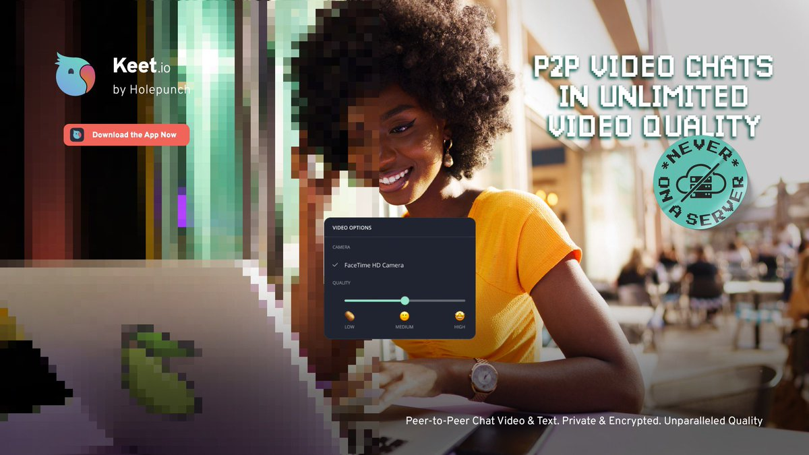
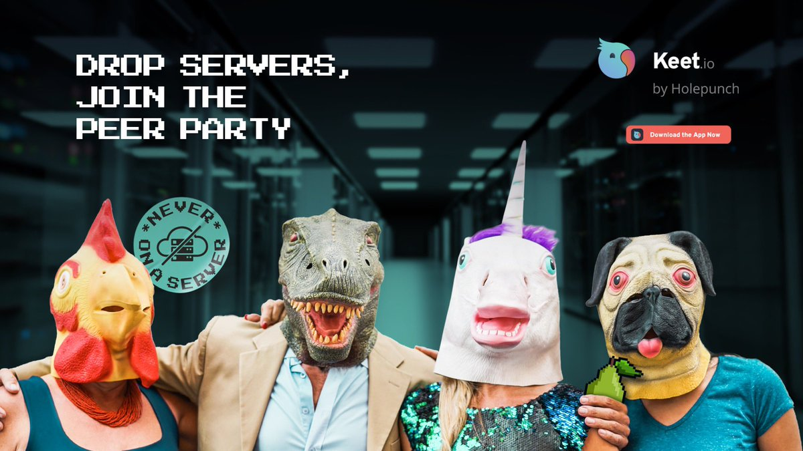
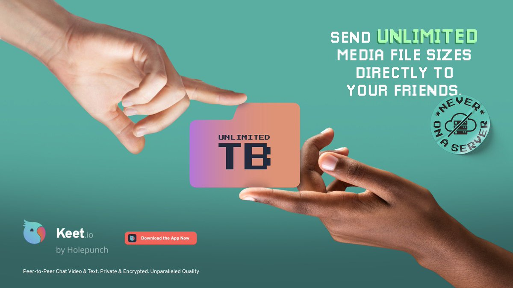

# Keet.io

[Keet](https://keet.io) is a fully P2P communications tool that's built entirely on Holepunch. Give it a try!

### Features

|| | |
| --- | --- | --- |
|**Video quality that impresses! 🎥**|**Private and encrypted 🔒**  |   **Handle any file size 📂✅** |
|Keet video calls operate over direct connections between you and your friends, without using servers that can throttle your performance. You'll notice the difference.| Keet only shares end-to-end encrypted data between participants in your calls. Without middlemen, third-parties, or servers, there’s nobody left who can snoop or leak data. |  When you share a file in Keet, you don’t have to wait for it to upload. Other peers can immediately download it straight from the source. Megabytes, gigabytes, or terabytes. No limits.|

> Built-in Bitcoin Lightning and USDt micro-payments make it easy to incorporate powerful paid features into apps. Peers control their data, including buying/selling, eliminating tokens, ads, incentives, and data harvesting. Future updates will introduce P2P payments to send tips, pay for services, bandwidth, storage, etc.

### How it works

What makes Keet so powerful? How does it allow users to securely exchange data over a distributed peer-to-peer network?

Here is the step-by-step process of how it works:

1. First, users generate and announce a cryptographic public key to a swarm of distributed computers, known as a Distributed Hash Table (DHT). No sign-ups are required when using Keet.
2. Using this public key, other Keet users can locate and, when authorized, connect to your computer. This process is called distributed hole punching, which makes it possible for computers on home networks to connect to each other without involving centralized servers.
3. During hole punching, Keet uses partial information from multiple peers in the network to ensure privacy.
4. Once connected, peers can safely and privately exchange chunks of data directly with each other without having to send the data to servers.
5. When you write a message in Keet, you don't have to directly send it to everyone. Any peer who receives it can relay it to others, and everyone can easily verify that the message came from you.
6. If you go offline, anyone can continue to serve your messages on your behalf. In fact, everything in Keet, including the app itself, is distributed this way, fully encrypted, private, and only shared with the people you want.

### Join the Internet of Peers

#### Desktop

Keet is available for download on Windows, macOS, and Linux desktops. [Download](https://keet.io/) now and discover the power of communication without compromises!

#### Mobile

Experience P2P communications on your mobile devices. Download Keet Mobile on your [Android](https://play.google.com/store/apps/details?id=io.keet.app) and [iOS](https://apps.apple.com/us/app/keet-by-holepunch/id6443880549) mobile devices today!