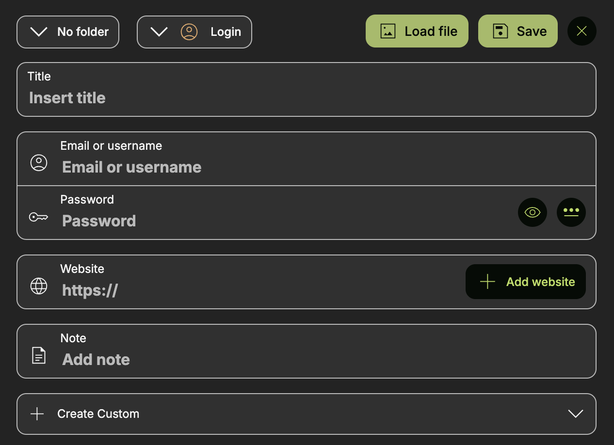
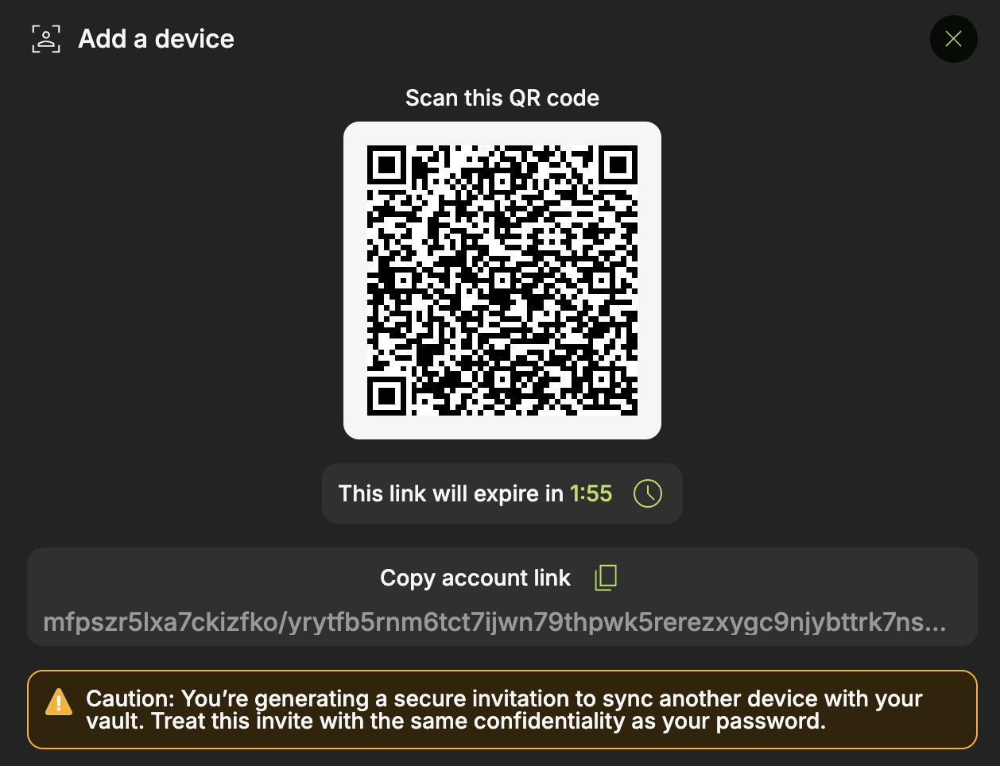
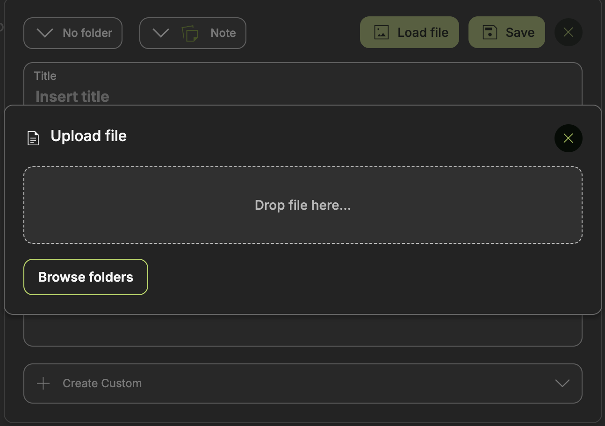

# PearPass 🔒

[PearPass](https://pass.pears.com) is is a secure and private password manager that uses Holepunch tech instead of cloud services to sync between your private devices. Your data is stored securely in your device and gets replicated only to those devices you wish.

## Features

|| | |
| --- | --- | --- |
|**Store passwords, IDs and notes!**|**Sync privately between devices**  |   **Add documents and files** |
|PearPass lets you securely store your passwords, passkeys, IDs, and notes — and generate strong new ones with ease.| PearPass includes built-in sync for effortless and secure access across all your devices. |  Passport or ID photo? A health record linked to your identity? PearPass lets you securely store files and sync them across all your devices.|

PearPass consists of three applications:
- A desktop app available on Max, Linux and Windows.
- A mobile app available on iOS and Android
- A browser extension available on Chrome (more browsers to follow) that links to the desktop app to bring PearPass autofill and autosave features from the browser.

## General architecture

PearPass is a distributed, serverless password manager designed to work across desktop and mobile without any reliance on central servers. Pear Runtime (Desktop) and Expo + Bare Runtime (Mobile) with Hypercore-based data structures, which ensure that all vaults and records remain fully under the user’s control.

Behind the scenes, PearPass uses the autopass module, a core engine responsible for storage encryption, device pairing, and replication. The module is built on top of several Holepunch primitives and modules, including:

- Autobase – for managing append-only logs and consistent data state across peers.
- HyperDB / Hyperbee – for structured data views and queries.
- Blind Pairing – for secure device-to-device pairing via invites.
- Hyperswarm – for peer-to-peer networking and replication.

Each vault operates a single autopass  instance, which acts as the authoritative source of truth for their vault. When new records are created, modified, or shared, the updates are written into this pass and automatically replicated across devices through Hyperswarm. Pairing new devices is achieved with Blind Pairing and invites, ensuring that only explicitly authorized peers can participate in replication.

This architecture allows PearPass to guarantee:

- No servers, no third parties – data only lives on the user’s devices.
- End-to-end encrypted sync – storage and transport encryption handled by autopass.
- Offline-first design – vaults are always available, even without connectivity

### Data Storage

All data in PearPass - including vaults, records, user information, and encryption keys - is stored using Hyperbee structures, which provide strong consistency and efficient replication across devices.

- **Master vault instance:** Stores the list of vaults, user information, and the main encryption metadata.
- **Individual vault instances:** Each vault maintains its own encrypted storage space for records. These instances and also the master vault are secured by a unique encryption key.
- **Records:** Stored inside the vault where they were created. Alongside the encrypted payload, metadata such as timestamps, versioning, folder name, and flags (e.g., favorite) are persisted directly in the data layer.
- **Assets:** Icons, files, and images associated with records are also stored inside their respective vault instances.

All information remains decentralized, fully encrypted, and available offline while replicating across authorized devices.

```
// Create a new instance or open an existing one
const store = new Corestore(storagePath)
const instance = new Autopass(store, {encryptionKey: encryptionKey})
await instance.ready()

// Add or update a record
await instance.add(`record/<recordId>`, data)

// Retrieve a record
const record = await instance.get(`record/<recordId>`)
```

### Data encryption

The master vault is protected by an encryption key derived from the user’s provided password. Each protected vault has its own randomly generated encryption key, which is secured in the same way as the master vault. Unprotected vaults use the master vault’s encryption key directly.

This approach ensures that vault data is undecryptable without the correct credentials. When a user updates their password:

- The master vault encryption key remains unchanged
- The protected vault keys are re-encrypted with the new password, preserving data security while allowing seamless key rotation

```
// Derive a hashed password and salt from the user’s input
const { hashedPassword, salt } = await hashPassword(password)

// Encrypt the vault key with the hashed password
const { ciphertext, nonce } = await encryptKeyWithHashedPassword(hashedPassword)

// Decrypt the vault key when needed
const encryptionKey = await decryptKey({
  ciphertext,
  nonce,
  hashedPassword
})
```

### Data sharing

Vaults can be shared across devices or with other users using QR codes or invite links. An invite contains a vault ID and public key, and is time-limited. Data replication happens only between authorized peers, ensuring no third-party servers are involved. For multi-device setups, PearPass supports blind mirroring so devices can sync even if one of them goes offline.

```
// Create invite key
const inviteKey = await createInvite()

// Pair a new device
const store = new Corestore(storagePath)
const pair = Autopass.pair(store, inviteKey)
const instance = await pair.finished()
await instance.ready()
```

### Browser extension and native messaging

PearPass includes a browser extension (starting with Chrome) that integrates seamlessly with the desktop app. The browser extension:

- Detects login and signup forms.
- Autofills credentials stored in PearPass.
- Suggests saving new logins when credentials are entered.

Any data created or modified in the extension is synchronized with the desktop app using native messaging and IPC server.

The IPC server is started by the desktop app from the settings page. Running inside the app, it listens on a local socket for incoming commands and interfaces with the worker process (spawned via Pear worker) to manage vault data.

Native Host Bridge is a lightweight Node.js script installed by the desktop app in the device’s storage. When launched by the browser extension, it connects to the IPC server using pear-ipc, communicates with the extension through stdin/stdout (Chrome Native Messaging) and forwards messages between the extension and the IPC server, acting as a secure bridge

Security specifications

**Authentication**
- Desktop identity verified during handshake
- Initial identity exchange requires a pairing token
- The user manually verifies fingerprints for trust

**Confidentiality**
- Sensitive data encrypted with XSalsa20-Poly1305
- Session keys derived via X25519 ECDH
- A fresh nonce is used for every message

**Integrity**
- Poly1305 MAC ensures message integrity
- Handshake transcripts signed with Ed25519

**Replay protection**
- Monotonically increasing sequence numbers.
- Server tracks lastRecvSeq per session and rejects duplicates

**Forward secrecy**
- Ephemeral X25519 keys generated for each session
- Session keys are never derived from long-term keys
- Old sessions cannot be decrypted once ephemeral keys are deleted

### Mobile app

The PearPass mobile applications for iOS and Android are built with Bare Expo (React Native) and Bare Runtime, sharing the same cryptographic and replication logic as the desktop version. 

**Autofill integration**
- On Android, PearPass registers as an Autofill Service, making stored credentials available directly in login forms across apps and browsers
- On iOS, PearPass provides a Password Autofill extension, integrating with Safari and system-wide login fields
In both cases, autofill actions require biometric verification (Face ID, Touch ID, or fingerprint) or a master password, depending on user settings.

**Security and storage**
- Mobile vaults are fully synchronized with desktop vaults using Autopass replication (Hyperswarm + Blind Pairing)
- Encryption is handled in the same way as on desktop: each vault is secured by its own encryption key, making data inaccessible without the correct credentials
- Cached icons, files, and images are stored locally on the device, encrypted within the vault instance

**Features**
- Create, view, and edit items (logins, identities, credit cards, secure notes)
- Unlock with Password or biometrics for quick access
- Support for password generation, folder organization, and item favoriting

## Initial steps

### Onboarding
<p>Open PearPass and learn about its features during the onboarding flow:</p>
<div align="center"><video src="../assets/pearpass/1-Onboarding.mov" width="640" height="480" autoplay controls></video></div>

### Set a master password
<p>Set a secure master password to secure the access to your app and its content. Remember! This master password is only yours and we can't help you recover it if you lose it</p>
<div align="center"><video src="../assets/pearpass/2-MasterPassword.mov" width="640" height="480" autoplay controls></video></div>

### Add a vault
<p>Create a new vault or load one from an existing device. Adding a password is optional to enhance the security even further</p>
<div align="center"><video src="../assets/pearpass/3-CreateVault.mov" width="640" height="480" autoplay controls></video></div>

### Add a device
<p>Pairing PearPass between your devices is as simple as scanning a QR code or copying and pasting the pairing key.</p>
<div align="center"><video src="../assets/pearpass/4-AddDevice.mov" width="640" height="480" autoplay controls></video></div>

### Create a backup
<p>The safest way to secure access to your items is by pairing your vaults in multiple devices. Additionally, you may also save a backup in csv or json format and store it safely in the location of your choice.</p>
<div align="center"><video src="../assets/pearpass/5-Backup.mov" width="640" height="480" autoplay controls></video></div>


## Start storing your passwords privately. Download PearPass.
### Desktop
PearPass is available for download on Windows, macOS, and Linux desktops.
### Mobile
Synchronize your password across mobile devices. Download PearPass on your Android and iOS mobile devices today!