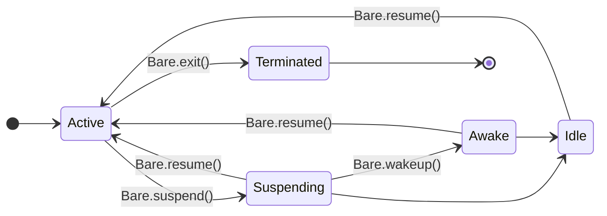

[Bare](https://github.com/holepunchto/bare) is the JavaScript runtime every Pear app runs on. Like Node.js, it gives you an asynchronous, event-driven environment for writing applications in JavaScript. Unlike Node.js, it treats **embedding** and **cross-device support** as core use cases—it aims to run just as well inside a phone app as on a laptop or a server. This page explains what that buys you and why the runtime is shaped the way it is. 

<Callout type="info">
- For the exact API, see the [`Bare` runtime reference](/bare/reference/bare/runtime).
- For where Bare sits relative to Pear, see [How Pear and Bare fit together](/pear/explanation/pear-and-bare).
</Callout>

## What Bare adds, and what it leaves out

Bare is built on two C libraries: [`libjs`](https://github.com/holepunchto/libjs), which provides low-level bindings to V8 (or QuickJS, via [`libqjs`](https://github.com/holepunchto/libqjs)) in an engine-independent way, and [`libuv`](https://github.com/libuv/libuv), which provides the asynchronous I/O event loop. On top of those primitives Bare adds only a few missing pieces:

1. A **module system** supporting both CommonJS and ESM, with bidirectional interoperability between the two.
2. A **native-addon system** supporting both statically and dynamically linked addons.
3. **Lightweight threads** with synchronous joins and `SharedArrayBuffer` support.

Everything else is left to userland. There is no built-in `fs`, no built-in `http`, no bundled standard library—those live in installable [`bare-*` modules](/bare/reference/modules/bare-modules) you add only when you need them. The runtime itself stays succinct and, well, *bare*.

That minimalism is a deliberate "less is more" stance, and it pays off in two ways. Bundles only carry the modules an app actually declares, so they stay small enough to embed on a phone. And because the standard library isn't baked into the runtime, you can upgrade Bare without being forced to refactor dependencies in lockstep.

## Engine independence

By abstracting the JavaScript engine behind the `libjs` ABI and platform I/O behind `libuv`, Bare lets a native addon run on *any* engine that implements the `libjs` ABI and *any* system `libuv` supports. In practice that means Bare can be compiled against V8, through [`libqjs`](https://github.com/holepunchto/libqjs), QuickJS, or through [`libjsc`](https://github.com/holepunchto/libjsc), JavaScriptCore — useful on platforms like iOS where JSC is the sanctioned engine. The addon you wrote against Bare doesn't change.

## The lifecycle

A server runtime can assume it owns the process and runs until it's killed. A runtime embedded in a mobile app can't: the operating system suspends apps that move to the background and may reclaim them entirely. Bare models this explicitly with a process lifecycle that an embedder — or your JavaScript — can drive.

Calling `Bare.suspend()` emits a `suspend` event, signalling that outstanding work (network activity, file access) should be deferred or paused. When the loop runs out of work it emits `idle` and blocks rather than exiting, keeping the process alive but quiet. `Bare.resume()` emits `resume` and lets the loop continue; `Bare.wakeup()` allows a bounded burst of work (**awake** state) during suspension before the process settles back to idle.

This is what lets a peer-to-peer core behave correctly when a phone locks the screen: it parks its sockets on `suspend`, sits quietly at `idle`, and picks back up on `resume`—instead of being killed mid-replication. The [full state machine and event list](/bare/reference/bare/runtime#lifecycle) is in the reference.

## Common questions

### Is Bare a fork of Node.js?

No. Bare is a separate runtime built on `libjs` and `libuv`. The surface looks familiar—asynchronous, event-driven, module-based—but Bare drops Node's server-oriented assumptions and its bundled standard library. The [`bare-node`](https://github.com/holepunchto/bare-node) shim maps many Node.js builtins onto their `bare-*` equivalents to ease porting.

### Can I use npm modules with Bare?

Pure-JavaScript packages from npm generally work, and Bare uses the npm dependency model. Packages that depend on Node's built-in modules need the corresponding [`bare-*` module](/bare/reference/modules/bare-modules) (or the `bare-node` shim), and packages with native addons need to be built against Bare's addon API rather than Node's N-API (the [`bare-compat-napi`](https://github.com/holepunchto/bare-compat-napi) headers ease that transition).

<Callout type="info">
For the full builtin-to-`bare-*` mapping, see [Node.js compatibility](/bare/reference/modules/bare-modules#nodejs-compatibility).
</Callout>

### Do users need Node.js installed to run a Bare app?

No. A Bare program can be compiled into a single standalone executable with `bare-build`—this is how the [`hello-pear-bare`](/pear/getting-started/from-a-template/start-from-hello-pear-bare) template ships—so no Node.js, Bare, or [Pear CLI](/pear/reference/pear/cli) is required on the user's machine.

### Which JavaScript engine does Bare use?

It depends on the build. Bare talks to the engine through the `libjs` ABI, so it can be compiled against V8 (the default), QuickJS via `libqjs`, or JavaScriptCore via `libjsc`. Your application and addons don't change between engines.

## See also

- [Using Bare on its own](/bare/explanation/use-bare-standalone)—the runtime-only path, for adopting Bare without Pear.
- [`Bare` runtime reference](/bare/reference/bare/runtime)—the `Bare` global API, lifecycle events, addons, and threads.
- [`bare` CLI reference](/bare/reference/bare/cli)—running scripts and the REPL from the command line.
- [Bare modules](/bare/reference/modules/bare-modules)—the `bare-*` standard library you opt into.
- [One core, many platforms](/bare/explanation/bare-on-native)—embedding the runtime in native and mobile apps.
- [Handle app suspension](/bare/how-to/run-on-native/handle-app-suspension)—stop all I/O on `suspend` or the OS will force-terminate the app.
- [Runtime and languages](/pear/explanation/runtime-and-languages)—why Pear is JavaScript and how other languages plug in.
- [How Pear and Bare fit together](/pear/explanation/pear-and-bare)—where the runtime sits relative to Pear.
