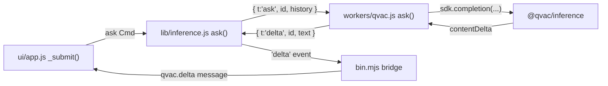

This guide extends [hello-pear-bare](/p2p/getting-started/from-a-template/start-from-hello-pear-bare) with a second worker that loads and runs a language model **on the user's own machine**, and a [`bare-tui`](https://github.com/holepunchto/bare-tui) terminal UI on top. The reference implementation is [`hello-pear-qvac-tui`](https://github.com/holepunchto/hello-pear-qvac-tui).

```text skip="sample-output"
╭──────────────────────────────────────────────────────────────────╮
│ ◆ hello-pear-qvac  v0.0.0-rc.0                                   │
│ model LLAMA_3_2_1B_INST_Q4_0   ready                             │
╰──────────────────────────────────────────────────────────────────╯
 LLAMA_3_2_1B_INST_Q4_0 loaded — ask it anything.

 ❯ Name one ocean. Answer in 3 words.

 Pacific Ocean

╭──────────────────────────────────────────────────────────────────╮
│ ❯ ask the model something…                                       │
╰──────────────────────────────────────────────────────────────────╯
  ↵ send · ctrl+t thinking · pgup/pgdn scroll · ctrl+c quit
```

Ask a question, watch the answer stream back—generated entirely on the machine it's running on. No API key, and it works offline once the model is cached.

This is a **delta-only** how-to. `hello-pear-bare`'s CLI entry, `App`/[`ready-resource`](https://github.com/holepunchto/ready-resource) shape, and its `hello-pear-worker`-backed over-the-air updates are covered in [Start from the hello-pear-bare template](/p2p/getting-started/from-a-template/start-from-hello-pear-bare)—read that first if you haven't. This guide covers what's added: the inference worker, the [`bare-tui`](https://github.com/holepunchto/bare-tui) UI, and QVAC's model/context knobs.

## Before you begin

- A working clone of [`hello-pear-bare`](https://github.com/holepunchto/hello-pear-bare) (or read [`hello-pear-qvac-tui`](https://github.com/holepunchto/hello-pear-qvac-tui) directly—it's the same shape with inference and a UI added).
- Comfort with Bare [workers](/pear/explanation/workers) and [`pear-runtime`](/pear/reference/pear/runtime#running-workers)—`hello-pear-bare`'s single worker becomes two.
- [Node.js](https://nodejs.org) and [Bare](https://github.com/holepunchto/bare) (`npm i -g bare-runtime`) on `PATH`.

## What's added

| Layer | Change |
| --- | --- |
| Dependency | Add [`@qvac/inference`](https://www.npmjs.com/package/@qvac/inference), which registers the `llamacpp-completion` plugin it ships for GGUF/llama.cpp (backed by the native `@qvac/llm-llamacpp` peer dependency), plus [`bare-tui`](https://github.com/holepunchto/bare-tui) and [`bare-tui-updater`](https://github.com/holepunchto/bare-tui-updater). |
| A second worker | `workers/qvac.js` owns the QVAC SDK and the loaded model, alongside `workers/main.js`—the same `hello-pear-worker` OTA worker `hello-pear-bare` already ships. |
| A client for it | `lib/inference.js`—a [`ready-resource`](https://github.com/holepunchto/ready-resource) that runs the worker and turns its frames into events, deliberately the same shape as `app.js`. |
| A UI | `ui/app.js` (state, keys, layout) and `ui/transcript.js` (drawing one conversation entry), a plain `bare-tui` model—your "frontend" is the terminal. |

`bin.mjs` is still the only place everything meets: it constructs both workers' clients and bridges their events into `bare-tui` messages.

## Clone and run

```bash skip="install-instruction"
git clone https://github.com/holepunchto/hello-pear-qvac-tui
cd hello-pear-qvac-tui
npm install
npm start
```

First run downloads the default model (`LLAMA_3_2_1B_INST_Q4_0`, 0.77 GB—see the table below) and caches it, so it takes a while; later runs start in seconds. Any other model is one flag away:

```bash skip="interactive"
npm start -- --model QWEN3_1_7B_INST_Q4
```

| key | does |
| --- | --- |
| `↵` | send |
| `esc` | interrupt the answer being generated |
| `ctrl+t` | show/hide a thinking model's reasoning |
| `pgup`/`pgdn` | scroll the transcript (mouse wheel too) |
| `ctrl+c` | interrupt if busy, otherwise quit |

Over-the-air updates work exactly as in `hello-pear-bare`—see [Create a valid upgrade link](/p2p/getting-started/from-a-template/start-from-hello-pear-bare#2-create-a-valid-upgrade-link). Until you set a real `pear://` link, `bin.mjs` here skips constructing the updater rather than throwing, and just runs without it.

## Map the template

| Path | What it is | Do you edit it? |
| --- | --- | --- |
| [`bin.mjs`](https://github.com/holepunchto/hello-pear-qvac-tui/blob/main/bin.mjs) | CLI flags, and the only place both workers meet the UI. | Yes—your startup and CLI. |
| [`app.js`](https://github.com/holepunchto/hello-pear-qvac-tui/blob/main/app.js) | The OTA updater client—identical role to `hello-pear-bare`'s `app.js`. | Sometimes—app lifecycle. |
| [`workers/main.js`](https://github.com/holepunchto/hello-pear-qvac-tui/blob/main/workers/main.js) | The `hello-pear-worker` OTA worker—same package `hello-pear-bare` ships. | Rarely. |
| [`lib/inference.js`](https://github.com/holepunchto/hello-pear-qvac-tui/blob/main/lib/inference.js) | The UI-side client for the inference worker. | Rarely—it's a thin, stable wrapper. |
| [`workers/qvac.js`](https://github.com/holepunchto/hello-pear-qvac-tui/blob/main/workers/qvac.js) | Owns the QVAC SDK and the loaded model. Registers the plugin, loads the model, runs completions. | **Yes—this is where you change what's asked and how.** |
| [`ui/app.js`](https://github.com/holepunchto/hello-pear-qvac-tui/blob/main/ui/app.js) | The whole UI—state, keys, layout. | Yes—change how it looks. |
| [`ui/transcript.js`](https://github.com/holepunchto/hello-pear-qvac-tui/blob/main/ui/transcript.js) | Draws one conversation entry (pure). | Sometimes—rendering. |

<Callout type="info">
`workers/main.js` is [`hello-pear-worker`](https://github.com/holepunchto/hello-pear-worker) inlined, the same worker every `hello-pear-*` template ships—see [Map the template](/p2p/getting-started/from-a-template/start-from-hello-pear-bare#map-the-template) on the `hello-pear-bare` page. It has nothing to do with inference; it only carries the OTA updater.
</Callout>

## Two workers, one pattern

Loading a GGUF model blocks the thread it runs on for seconds—in-process, the spinner would visibly stutter. So, like the OTA updater, inference gets its own Bare [worker](/pear/explanation/workers), spoken to over a [`FramedStream`](https://www.npmjs.com/package/framed-stream). `lib/inference.js` is deliberately the same shape as `app.js`: a [`ready-resource`](https://github.com/holepunchto/ready-resource) whose `_open()` spawns the worker with [`PearRuntime.run`](/pear/reference/pear/runtime#running-workers) and wraps its IPC in a `FramedStream`. Learning one teaches you the other.

`hello-pear-bare`'s updater client:

```js file=<rootDir>/examples/getting-started/hello-pear-bare/app.js#L20-L38 title="app.js" skip="example-import"
```

The inference client, same shape:

```js file=<rootDir>/examples/how-to/add-on-device-ai/hello-pear-qvac-tui/lib/inference.js#L22-L60 title="lib/inference.js" skip="example-import"
```

A resident model holds native handles that keep the process alive, so `_close()` sends `{ t: 'close' }` and waits (with a grace period) for the worker to confirm it unloaded before destroying the pipe—skip that handshake and the app hangs on exit instead of quitting.

## How one question flows

Press enter, and the answer comes back through four layers:



The `id` on every frame is how a late token from an interrupted answer gets dropped instead of appended to the next one—`ui/app.js` tracks the current `askId` and ignores anything else.

One JSON object per frame, `t` is the tag:

| direction | frame | meaning |
| --- | --- | --- |
| → | `{ t:'ask', id, history }` | answer this conversation |
| → | `{ t:'cancel', id }` | stop that answer |
| → | `{ t:'close' }` | unload the model and shut down |
| ← | `{ t:'progress', percentage }` | model download, 0–100 |
| ← | `{ t:'loaded', model, ctxSize }` | resident and ready |
| ← | `{ t:'thinking', id, text }` | reasoning, from a thinking model |
| ← | `{ t:'delta', id, text }` | a token of the answer |
| ← | `{ t:'end', id, stopReason }` | finished, cancelled, or cut short |
| ← | `{ t:'error', id, message }` | something went wrong |
| ← | `{ t:'closed' }` | safe to terminate the thread |

`workers/qvac.js`'s `ask()` produces the outgoing half of that table:

```js file=<rootDir>/examples/how-to/add-on-device-ai/hello-pear-qvac-tui/workers/qvac.js#L254-L286 title="workers/qvac.js" skip="example-import"
```

Two things worth keeping if you touch this loop: `run.events` ends **normally** even when a completion failed or ran out of context—the reason only surfaces on `run.final`, which is why `ask()` awaits it and forwards `stopReason` rather than declaring victory once the loop exits. And **`ui/app.js` never imports the QVAC SDK**—inference reaches it only as the `qvac.*` messages in the table above, which is why the UI's own tests run in well under a second with no model and no GPU.

## The two knobs that matter

Both are CLI flags, parsed in `bin.mjs` alongside `--storage` and `--no-updates`:

```js file=<rootDir>/examples/how-to/add-on-device-ai/hello-pear-qvac-tui/bin.mjs#L17-L26 title="bin.mjs" skip="example-import"
```

and resolved, falling back to `package.json`'s `qvac` field:

```js file=<rootDir>/examples/how-to/add-on-device-ai/hello-pear-qvac-tui/bin.mjs#L38-L39 title="bin.mjs" skip="example-import"
```

**`--model`**—any model constant [`@qvac/inference`](https://www.npmjs.com/package/@qvac/inference) exports. Nothing else in the template changes.

**`--ctx`**—everything the model holds at once shares this budget: the conversation so far, its reasoning, and the answer it's writing. The addon's own default is small enough that a couple of turns leave no room to reply and answers stop mid-sentence, which is why this template overrides it:

```js file=<rootDir>/examples/how-to/add-on-device-ai/hello-pear-qvac-tui/workers/qvac.js#L36-L41 title="workers/qvac.js" skip="example-import"
```

If an answer does hit the ceiling, `workers/qvac.js` reports that in `stopReason` rather than pretending the model finished (see [How one question flows](#how-one-question-flows) above)—that's what makes the UI able to say so instead of silently truncating.

A handful of models that work out of the box with the `llamacpp-completion` plugin this template already registers:

| Model | Size | Good for |
| --- | --- | --- |
| `SMOLLM2_360M_INST_Q8` | 0.39 GB | fastest—smoke tests, weak hardware |
| `LLAMA_3_2_1B_INST_Q4_0` | 0.77 GB | the default—a good general baseline |
| `QWEN3_1_7B_INST_Q4` | 1.06 GB | noticeably better answers, still fast |
| `QWEN3_4B_INST_Q4_K_M` | 2.50 GB | the sweet spot on most laptops |
| `QWEN3_8B_INST_Q4_K_M` | 5.03 GB | the largest that stays comfortable on a 16 GB machine |

`Q4` is the everyday quantisation; anything above ~4B on an integrated GPU runs at a few tokens per second. Sizes above are as reported by upstream's README at the pinned commit—not vendored in this repo, so re-check them against the [full model table](https://github.com/holepunchto/hello-pear-qvac-tui#models-that-work-out-of-the-box) on refresh.

## Remix it

Most ideas need no new dependency—just a different prompt and output shape in `workers/qvac.js`'s `ask()`:

| Build | Change |
| --- | --- |
| Text adventure, NPC dialogue | a system prompt; `responseFormat` for parseable game state instead of prose |
| An agent that runs things | `tools` on `completion()`; execute in the worker and loop |
| Commit messages, a diff explainer | pipe input in as the first history entry, drop the TUI |

`workers/qvac.js` registers exactly one plugin—nothing you don't register is linked in. Swapping the modality (embedding, transcription, translation, image generation, …) means swapping that plugin and installing its peer dependency, which npm won't do for you automatically since QVAC declares peers as optional. The full plugin table, including the non-obvious transitive peers, is in the upstream repo's [CLAUDE.md](https://github.com/holepunchto/hello-pear-qvac-tui/blob/main/CLAUDE.md#a-different-modality)—point a coding agent at that file before asking for changes here; it's dense with the traps this template has already hit and fixed.

## Where to go next

- [Start from the hello-pear-bare template](/p2p/getting-started/from-a-template/start-from-hello-pear-bare)—the base this guide extends.
- [Workers](/pear/explanation/workers)—the Bare threading model both the updater and inference build on.
- [Pear OTA](/pear/reference/pear/runtime#updates)—the updater `workers/main.js` and `app.js` wrap.
- [Bundle a Bare app](/bare/how-to/run-on-native/bundle-a-bare-app)—package this template the same way as `hello-pear-bare` once you're ready to ship it.
- [Troubleshoot common issues](/bare/how-to/troubleshooting)—if `bare` or `pear-runtime` misbehave.
