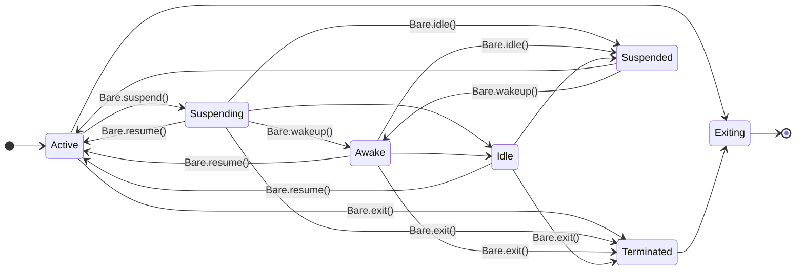

{/* Maintainer note: this page's doc-states come from src/lib/bare-runtime-docs-states.json,
generated from holepunchto/bare's npm/index.d.ts by scripts/gen-bare-docs-states.ts — run
`npm run gen:bare-docs-states` to refresh, then review the printed delta and add/adjust
the markers below for anything that changed. `Since` = added in that release, `Until` =
removed in it; pass `label` to override the badge text. Four tools, by the size of what
changed:
  <Since v="x.y.z" />                  inline badge on a sentence. Never hidden — it is the warning.
  <VersionSection since="x.y.z" />     one line directly under a heading; gates that whole section.
  <VersionGate since="x.y.z">…</…>     gates a block that is not a whole section, for example a single <Callout>.
  --flag  Description  [!version since=x.y.z]    gates one row inside a fenced help block.
This axis is independent of `bare-cli` and `bare-kit` — each Bare page tracks its own
surface, not one shared "Bare version."

As of 2026-09-17, across the tracked window (1.26.0 -> 1.32.0 — the window is a
rolling 5 doc-states, so it dropped 1.23.5 as 1.32.0 entered):

Re-ran `npm run gen:bare-docs-states` after Bare shipped 1.33.0/.1/.2/.3: the
1.32.0 doc-state's release list grew to include all four (`releases: 1.32.0,
1.33.0, 1.33.1, 1.33.2, 1.33.3`) with an empty delta — `npm/index.d.ts`'s
`Bare` global namespace is byte-for-byte unchanged since 1.32.0, so nothing
below needs a new `<Since>` marker. 1.33.0's real news is elsewhere: it ships
`bare-module` v7.0.0 and a new module-loading threat model (the loader no
longer carries its own filesystem-read capability — an embedder now supplies
one via `Module.Protocol`). That's a `bare-module` surface change, not a
`Bare` global one, so it's documented on
[Bare modules → bare-module](/bare/reference/bare/modules/bare-module)
instead of here.

`Addon.seal()`/`Addon.sealed` (added in 1.32.0 by holepunchto/bare#170) are real,
shipped API — see the package README and `docs/threat-model.md` — but are absent
from `npm/index.d.ts` as of 1.32.0, so they do not appear in the printed delta
above and `scripts/bare-model-surface.ts` cannot fingerprint them. They are
documented below from the README/threat-model instead, marked `<Since v="1.32.0" />`
by the release that shipped them. Re-run `npm run gen:bare-docs-states` on future
Bare releases to check whether the `.d.ts` catches up; if it does, this note can go.

1.32.0's delta is otherwise narrow: `Thread`'s constructor and `Thread.create()`
gained overloads so `source` can be passed positionally
(`new Thread(filename, source[, options])`) or as a bare callback, and
`ThreadOptions.source` is newly `@deprecated` in favor of that positional form.

`Bare.Addon`/`Bare.Thread` becoming top-level siblings in 1.31.0 (same release as the
delta below) is a .d.ts authoring change only — both remain reachable as
`Bare.Addon`/`Bare.Thread` at runtime via the namespace merge, so that part is not a real
surface change. BUT the same commit (holepunchto/bare#172, "Add `new Addon(url)` and
deprecate existing addon APIs") also added a genuine new `Addon` constructor and deprecated
four existing members — `Addon.cache`/`.load()`/`.resolve()`, `Thread.create()` — which
IS a real, marker-worthy change and is now reflected in the `## Bare.Addon` / `## Bare.Thread`
sections below with `<Since v="1.31.0" />`. First pass at this delta wrongly lumped the whole
block in with the cosmetic rename because most of it (host/url/exports/etc.) genuinely was
just the rename — the giveaway missed on first read was that `Addon.constructor` had no `-`
counterpart, that is it wasn't a rename at all. `scripts/bare-model-surface.ts`'s fingerprint was
also blind to `deprecated` status at the time (fixed since — it's now a first-class fingerprinted
field, and deprecated members surface explicitly in the printed delta, including across a
rename boundary). `Bare.simulator` was ALSO marked `@deprecated` back in 1.27.0, per the
delta below — left undocumented here on purpose, since it was never described on this page to
begin with and isn't worth introducing now just to badge it deprecated.

The `Bare.versions` index-signature parameter rename (`package` -> `library`, 1.28.2) is a
type-only cosmetic change — no marker needed. `Bare.exiting`/`Bare.suspended`/
`Bare.suspending` were removed in 1.27.0 but carried no JSDoc upstream and were never
documented on this page, so there is nothing accurate to backfill with <Until> — do not
guess their semantics from the property names alone. */}

<mark style={{ backgroundColor: '#7dde9a', padding: '2px 8px', borderRadius: '4px', fontSize: '0.85em', fontWeight: 500 }}>stable</mark>

The core JavaScript API of [Bare](/bare/explanation/bare-runtime) is exposed through the global `Bare` namespace. This page documents that surface. For the command-line runner, see the [`bare` CLI](/bare/reference/bare/cli); for the standard-library modules layered on top, see [Bare modules](/bare/reference/modules/bare-modules).

## Process properties

#### `Bare.platform`

The operating system Bare was compiled for. One of `android`, `darwin`, `ios`, `linux`, `win32`.

#### `Bare.arch`

The processor architecture Bare was compiled for. One of `arm`, `arm64`, `ia32`, `mips`, `mipsel`, `riscv64`, `x64`.

#### `Bare.argv`

The command-line arguments passed to the process when launched.

#### `Bare.pid`

The ID of the current process.

#### `Bare.exitCode`

The code returned once the process exits. If the process exits via `Bare.exit()` without a code, `Bare.exitCode` is used.

#### `Bare.version`

The Bare version string.

#### `Bare.versions`

An object of version strings for Bare and its dependencies.

## Lifecycle methods

#### `Bare.exit([code])`

Immediately terminate the process or current thread with exit status `code`, defaulting to `Bare.exitCode`.

#### `Bare.suspend([linger])`

Suspend the process and all threads, emitting a `suspend` event so work can stop. When no work remains and the process would otherwise exit, an `idle` event is emitted and the loop blocks instead of exiting.

#### `Bare.wakeup([deadline])`

Wake the process and all threads during suspension, emitting a `wakeup` event. Work may run until `deadline`, after which the process suspends again.

#### `Bare.idle()`

Immediately suspend the event loop and trigger the `idle` event.

#### `Bare.resume()`

Resume the process and all threads after suspension, emitting a `resume` event. May be called from a `suspend`, `wakeup`, or `idle` listener to cancel suspension.

## Events

Listeners attach with `Bare.on(event, listener)`.

#### `uncaughtException`— `(err)`

A JavaScript exception was thrown without being caught. By default uncaught exceptions are printed to `stderr` and the process is aborted; adding a listener overrides that default.

#### `unhandledRejection`— `(reason, promise)`

A promise was rejected without being handled. Default behaviour (print to `stderr`, abort) is overridden by adding a listener.

#### `beforeExit`— `(code)`

Emitted when the loop runs out of work, before the process or thread exits. Scheduling more work here keeps the process alive and re-arms the event. Not emitted on explicit `Bare.exit()` or an uncaught exception.

#### `exit`— `(code)`

Emitted when the process or thread exits.

<Callout type="warn">
Additional work **must not** be scheduled from an `exit` listener. If the process is forcefully terminated from within an `exit` listener, the remaining listeners will not run.
</Callout>

#### `suspend`— `(linger)`, `wakeup`— `(deadline)`, `idle`— `()`, `resume`— `()`

The lifecycle events described under [Lifecycle methods](#lifecycle-methods). Defer or pause outstanding work on `suspend`, do bounded work on `wakeup`, expect the loop to block after `idle`, and continue work on `resume`. A listener may call `Bare.resume()` to cancel the suspension before it completes.

## Lifecycle

Bare exposes process suspension so it can behave on platforms with strict application-lifecycle rules—mobile in particular. A suspended loop stays alive but idle rather than exiting, and can be woken for bounded bursts of work. The same transitions are available from C (`bare_suspend()`, `bare_wakeup()`, `bare_resume()`) and from JavaScript.



For the rationale, see [Inside Bare](/bare/explanation/bare-runtime#the-lifecycle); for driving it from a native host, see [One core, many platforms](/bare/explanation/bare-on-native).

## `Bare.Addon`

Loads native addons—typically C/C++ shared libraries.

<Callout type="info">
This is an advanced API most users never touch directly; native addons are normally loaded for you by the modules that need them.
</Callout>

- `new Addon(url)` <Since v="1.31.0" /> — load a static or dynamic addon from a `url` whose protocol is `builtin:`, `linked:`, or `file:`. Throws for any other protocol, or if loading fails. Returns an `addon` with `addon.url` and `addon.exports`.
- `Addon.host`— the target triplet identifying the current addon host.
- `Addon.seal()` <Since v="1.32.0" /> — freeze addon loading. Once sealed, no dynamic addon can be loaded by the current thread or any other thread of the process, now or in the future; loading one throws. Statically linked addons are unaffected. This is one-way for the lifetime of the process, and applies to this process alone—intended for embedders that load a fixed set of trusted addons up front and then want to block any further native code, for example when building a sandbox. See the [threat model](https://github.com/holepunchto/bare/blob/main/docs/threat-model.md) for what sealing does and doesn't guarantee.
- `Addon.sealed` <Since v="1.32.0" /> — whether `Addon.seal()` has been called.
- <Until v="1.31.0" label="Deprecated in 1.31.0" /> `Addon.cache`, `Addon.load(url)`, `Addon.resolve(specifier, parentURL[, options])`— superseded by `new Addon(url)`. Still work, but new code should use the constructor.

## `Bare.Thread`

Lightweight threads with synchronous joins—similar to Node.js workers but with a minimal surface.

- `Thread.isMainThread`— `true` on the main thread.
- `Thread.self`— the current thread as a `ThreadProxy`, or `null` on the main thread. `Thread.self.data` is the data passed on creation.
- `new Thread([filename][, options][, callback])`— start a thread running `filename`. If `callback` is given, its body runs on the new thread with `Thread.self.data` as its argument. Options: `data`, `transfer`, `encoding`, `stackSize`, and <Until v="1.32.0" label="Deprecated in 1.32.0" /> `source`.
- `new Thread(callback)`, `new Thread(filename, source[, options])` <Since v="1.32.0" /> — a plain callback can be passed with no `filename`, and `source` (a string or Buffer) can be passed positionally right after `filename` instead of via `options.source`.
- <Until v="1.31.0" label="Deprecated in 1.31.0" /> `Thread.create(...)`— equivalent to `new Thread(...)`. Still works, but new code should use the constructor.
- `thread.joined`— whether the thread has been joined.
- `thread.join()`— block until the thread exits.
- `thread.suspend([linger])`, `thread.wakeup([deadline])`, `thread.resume()`, `thread.terminate()`— drive the thread's lifecycle, equivalent to calling the matching `Bare.*` method inside it.

Higher-level worker threads are available in [`bare-worker`](/bare/reference/modules/bare-modules).

## `Bare.IPC`

Optional streaming communication between an embedder and JavaScript. Defaults to `null`, meaning no streaming channel is set. When an embedder provides one, `Bare.IPC` is a [`bare-stream`](/bare/reference/modules/bare-modules) `Duplex`. The higher-level [`bare-kit`](/bare/reference/bare/bare-kit) IPC abstraction is built on this.

## Embedding

Bare can be embedded with the C API in [`include/bare.h`](https://github.com/holepunchto/bare/blob/main/include/bare.h):

```c
#include <bare.h>
#include <uv.h>

bare_t *bare;
bare_setup(uv_default_loop(), platform, &env /* Optional */, argc, argv, options, &bare);
bare_load(bare, filename, source, &module /* Optional */);
bare_run(bare, UV_RUN_DEFAULT);

int exit_code;
bare_teardown(bare, UV_RUN_DEFAULT, &exit_code);
```

If `source` is `NULL`, the contents of `filename` are read at runtime. For platform shells that wrap this API, see [`bare-ios`](https://github.com/holepunchto/bare-ios) and [`bare-android`](https://github.com/holepunchto/bare-android), or use [`bare-kit`](/bare/reference/bare/bare-kit), which packages embedding behind a worklet API.

## See also

- [Inside Bare](/bare/explanation/bare-runtime)—what the runtime adds and why.
- [`bare` CLI](/bare/reference/bare/cli)—run scripts and start a REPL.
- [`bare-kit` reference](/bare/reference/bare/bare-kit)—embed a Bare worklet in a native app.
- [Bare modules](/bare/reference/modules/bare-modules)—the `bare-*` standard library.
