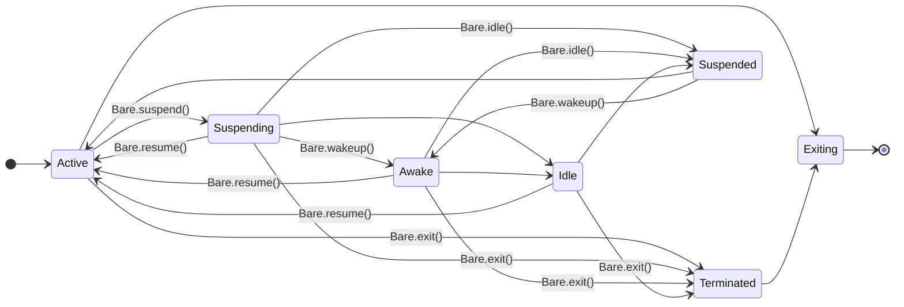

{/* Maintainer note: this page's doc-states come from src/lib/bare-runtime-docs-states.json,
generated from holepunchto/bare's npm/index.d.ts by scripts/gen-bare-docs-states.ts — run
`npm run gen:bare-docs-states` to refresh, then review the printed delta and add/adjust
the markers below for anything that changed. `Since` = added in that release, `Until` =
removed in it; pass `label` to override the badge text. Four tools, by the size of what
changed:
  <Since v="x.y.z" />                  inline badge on a sentence. Never hidden — it is the warning.
  <VersionSection since="x.y.z" />     one line directly under a heading; gates that whole section.
  <VersionGate since="x.y.z">…</…>     gates a block that is not a whole section, for example a single <Callout>.
  --flag  Description  [!version since=x.y.z]    gates one row inside a fenced help block.
This axis is independent of `bare-cli` and `bare-kit` — each Bare page tracks its own
surface, not one shared "Bare version."

As of 2026-09-17, across the tracked window (1.26.0 -> 1.32.0 — the window is a
rolling 5 doc-states, so it dropped 1.23.5 as 1.32.0 entered):

Re-ran `npm run gen:bare-docs-states` after Bare shipped 1.33.0/.1/.2/.3: the
1.32.0 doc-state's release list grew to include all four (`releases: 1.32.0,
1.33.0, 1.33.1, 1.33.2, 1.33.3`) with an empty delta — `npm/index.d.ts`'s
`Bare` global namespace is byte-for-byte unchanged since 1.32.0, so nothing
below needs a new `<Since>` marker. 1.33.0's real news is elsewhere: it ships
`bare-module` v7.0.0 and a new module-loading threat model (the loader no
longer carries its own filesystem-read capability — an embedder now supplies
one via `Module.Protocol`). That's a `bare-module` surface change, not a
`Bare` global one, so it's documented on
[Bare modules → bare-module](/bare/reference/bare/modules/bare-module)
instead of here.

`Addon.seal()`/`Addon.sealed` (added in 1.32.0 by holepunchto/bare#170) are real,
shipped API — see the package README and `docs/threat-model.md` — but are absent
from `npm/index.d.ts` as of 1.32.0, so they do not appear in the printed delta
above and `scripts/bare-model-surface.ts` cannot fingerprint them. They are
documented below from the README/threat-model instead, marked `<Since v="1.32.0" />`
by the release that shipped them. Re-run `npm run gen:bare-docs-states` on future
Bare releases to check whether the `.d.ts` catches up; if it does, this note can go.

Re-ran `npm run gen:bare-docs-states` after Bare shipped 1.33.4 -> 1.34.1: the
1.32.0 doc-state's release list grew to include them with an empty delta again
(`npm/index.d.ts` did not change). 1.34's real news is the C embedding API
(`bare_poll()`, `bare_attach()`, `bare_detach()` in `include/bare.h`) and the
platform floors (macOS 13.0 and iOS 15.0 as of 1.34.1). The C API is not in the
.d.ts, so the doc-state machinery cannot see it and there is no registered
doc-state to badge it against: it is marked in prose ("From Bare 1.34.0"), like
the 1.33.0 additions to the embedder context API. Do not add a Since badge for 1.34.0.

That is also why the C API reference under Embedding is written by hand, from
`include/bare.h` and `include/bare/module.h`, and why nothing in CI notices when a Bare
release adds to it. After each Bare release, run `npm run check:bare-c-api`: it lists the
functions and types the headers declare that no page documents, and the `bare_*` names the
docs use that the headers no longer declare. It exits 0 unless passed `--strict`, and
takes `--ref <tag>` to read the headers at a particular release. Both lists are empty as of
Bare 1.34.1. The embedder context pages are covered by the same check.

1.32.0's delta is otherwise narrow: `Thread`'s constructor and `Thread.create()`
gained overloads so `source` can be passed positionally
(`new Thread(filename, source[, options])`) or as a bare callback, and
`ThreadOptions.source` is newly `@deprecated` in favor of that positional form.

`Bare.Addon`/`Bare.Thread` becoming top-level siblings in 1.31.0 (same release as the
delta below) is a .d.ts authoring change only — both remain reachable as
`Bare.Addon`/`Bare.Thread` at runtime via the namespace merge, so that part is not a real
surface change. BUT the same commit (holepunchto/bare#172, "Add `new Addon(url)` and
deprecate existing addon APIs") also added a genuine new `Addon` constructor and deprecated
four existing members — `Addon.cache`/`.load()`/`.resolve()`, `Thread.create()` — which
IS a real, marker-worthy change and is now reflected in the `## Bare.Addon` / `## Bare.Thread`
sections below with `<Since v="1.31.0" />`. First pass at this delta wrongly lumped the whole
block in with the cosmetic rename because most of it (host/url/exports/etc.) genuinely was
just the rename — the giveaway missed on first read was that `Addon.constructor` had no `-`
counterpart, that is it wasn't a rename at all. `scripts/bare-model-surface.ts`'s fingerprint was
also blind to `deprecated` status at the time (fixed since — it's now a first-class fingerprinted
field, and deprecated members surface explicitly in the printed delta, including across a
rename boundary). `Bare.simulator` was ALSO marked `@deprecated` back in 1.27.0, per the
delta below — left undocumented here on purpose, since it was never described on this page to
begin with and isn't worth introducing now just to badge it deprecated.

The `Bare.versions` index-signature parameter rename (`package` -> `library`, 1.28.2) is a
type-only cosmetic change — no marker needed. `Bare.exiting`/`Bare.suspended`/
`Bare.suspending` were removed in 1.27.0 but carried no JSDoc upstream and were never
documented on this page, so there is nothing accurate to backfill with <Until> — do not
guess their semantics from the property names alone. */}

<mark style={{ backgroundColor: '#7dde9a', padding: '2px 8px', borderRadius: '4px', fontSize: '0.85em', fontWeight: 500 }}>stable</mark>

The core JavaScript API of [Bare](/bare/explanation/bare-runtime) is exposed through the global `Bare` namespace. This page documents that surface. For the command-line runner, see the [`bare` CLI](/bare/reference/bare/cli); for the standard-library modules layered on top, see [Bare modules](/bare/reference/bare/modules).

## Process properties

#### `Bare.platform`

The operating system Bare was compiled for. One of `android`, `darwin`, `ios`, `linux`, `win32`.

#### `Bare.arch`

The processor architecture Bare was compiled for. One of `arm`, `arm64`, `ia32`, `mips`, `mipsel`, `riscv64`, `x64`.

#### `Bare.argv`

The command-line arguments passed to the process when launched.

#### `Bare.pid`

The ID of the current process.

#### `Bare.exitCode`

The code returned once the process exits. If the process exits via `Bare.exit()` without a code, `Bare.exitCode` is used. Assigned values are truncated to eight bits, so `256` becomes `0`.

#### `Bare.version`

The Bare version string, with a leading `v`, such as `v1.34.1`.

#### `Bare.versions`

An object of version strings for Bare and its dependencies.

## Lifecycle methods

#### `Bare.exit([code])`

Immediately terminate the process or current thread with exit status `code`, defaulting to `Bare.exitCode`. Like `Bare.exitCode`, `code` is truncated to eight bits.

#### `Bare.suspend([linger])`

Suspend the process and all threads, emitting a `suspend` event so work can stop. When no work remains and the process would otherwise exit, an `idle` event is emitted and the loop blocks instead of exiting.

#### `Bare.wakeup([deadline])`

Wake the process and all threads during suspension, emitting a `wakeup` event. Work may run until `deadline`, after which the process suspends again.

#### `Bare.idle()`

Immediately suspend the event loop and trigger the `idle` event.

#### `Bare.resume()`

Resume the process and all threads after suspension, emitting a `resume` event. May be called from a `suspend`, `wakeup`, or `idle` listener to cancel suspension.

## Events

Listeners attach with `Bare.on(event, listener)`.

#### `uncaughtException`— `(err)`

A JavaScript exception was thrown without being caught. By default uncaught exceptions are printed to `stderr` and the process is aborted; adding a listener overrides that default.

#### `unhandledRejection`— `(reason, promise)`

A promise was rejected without being handled. Default behaviour (print to `stderr`, abort) is overridden by adding a listener.

#### `beforeExit`— `(code)`

Emitted when the loop runs out of work, before the process or thread exits. Scheduling more work here keeps the process alive and re-arms the event. Not emitted on explicit `Bare.exit()` or an uncaught exception.

#### `exit`— `(code)`

Emitted when the process or thread exits.

<Callout type="warn">
Additional work **must not** be scheduled from an `exit` listener. If the process is forcefully terminated from within an `exit` listener, the remaining listeners will not run.
</Callout>

#### `suspend`— `(linger)`, `wakeup`— `(deadline)`, `idle`— `()`, `resume`— `()`

The lifecycle events described under [Lifecycle methods](#lifecycle-methods). Defer or pause outstanding work on `suspend`, do bounded work on `wakeup`, expect the loop to block after `idle`, and continue work on `resume`. A listener may call `Bare.resume()` to cancel the suspension before it completes.

## Lifecycle

Bare exposes process suspension so it can behave on platforms with strict application-lifecycle rules—mobile in particular. A suspended loop stays alive but idle rather than exiting, and can be woken for bounded bursts of work. The same transitions are available from C (`bare_suspend()`, `bare_wakeup()`, `bare_resume()`) and from JavaScript.


```mermaid
stateDiagram-v2
  direction LR
  [*] --> Active
  Active --> Suspending: Bare.suspend()
  Active --> Terminated: Bare.exit()
  Active --> Exiting
  Suspending --> Active: Bare.resume()
  Suspending --> Awake: Bare.wakeup()
  Suspending --> Suspended: Bare.idle()
  Suspending --> Terminated: Bare.exit()
  Suspending --> Idle
  Awake --> Active: Bare.resume()
  Awake --> Suspended: Bare.idle()
  Awake --> Terminated: Bare.exit()
  Awake --> Idle
  Idle --> Suspended
  Idle --> Active: Bare.resume()
  Idle --> Terminated: Bare.exit()
  Suspended --> Active
  Suspended --> Awake: Bare.wakeup()
  Terminated --> Exiting
  Exiting --> [*]
```

For the rationale, see [Inside Bare](/bare/explanation/bare-runtime#the-lifecycle); for driving it from a native host, see [One core, many platforms](/bare/explanation/bare-on-native).

## `Bare.Addon`

Loads native addons—typically C/C++ shared libraries.

<Callout type="info">
This is an advanced API most users never touch directly; native addons are normally loaded for you by the modules that need them.
</Callout>

- `new Addon(url)` <Since v="1.31.0" /> — load a static or dynamic addon from a `url` whose protocol is `builtin:`, `linked:`, or `file:`. Throws for any other protocol, or if loading fails. Returns an `addon` with `addon.url` and `addon.exports`.
- `Addon.host`— the target triplet identifying the current addon host.
- `Addon.seal()` <Since v="1.32.0" /> — freeze addon loading. Once sealed, no dynamic addon can be loaded by the current thread or any other thread of the process, now or in the future; loading one throws. Statically linked addons are unaffected. This is one-way for the lifetime of the process, and applies to this process alone—intended for embedders that load a fixed set of trusted addons up front and then want to block any further native code, for example when building a sandbox. From Bare 1.33.0, sealing also freezes the [embedder context](/bare/reference/bare/embedder-context) registry, after which no further handles can be published. See the [threat model](https://github.com/holepunchto/bare/blob/main/docs/threat-model.md) for what sealing does and doesn't guarantee.
- `Addon.sealed` <Since v="1.32.0" /> — whether `Addon.seal()` has been called.
- <Until v="1.31.0" label="Deprecated in 1.31.0" /> `Addon.cache`, `Addon.load(url)`, `Addon.resolve(specifier, parentURL[, options])`— superseded by `new Addon(url)`. Still work, but new code should use the constructor.

## `Bare.Thread`

Lightweight threads with synchronous joins—similar to Node.js workers but with a minimal surface.

- `Thread.isMainThread`— `true` on the main thread.
- `Thread.self`— the current thread as a `ThreadProxy`, or `null` on the main thread. `Thread.self.data` is the data passed on creation, or `null` if none was passed.
- `new Thread([filename][, options][, callback])`— start a thread running `filename`. If `callback` is given, its body runs on the new thread with `Thread.self.data` as its argument. Options: `data` (default `null`), `transfer` (a transfer list, default `[]`), `encoding` (the encoding of `source` when it is a string, default `'utf8'`), `stackSize` (in bytes, `0` for the default), and <Until v="1.32.0" label="Deprecated in 1.32.0" /> `source`.
- `new Thread(callback)`, `new Thread(filename, source[, options])` <Since v="1.32.0" /> — a plain callback can be passed with no `filename`, and `source` (a string or Buffer) can be passed positionally right after `filename` instead of via `options.source`.
- <Until v="1.31.0" label="Deprecated in 1.31.0" /> `Thread.create(...)`— equivalent to `new Thread(...)`. Still works, but new code should use the constructor.
- A thread is loaded through a protocol that reaches nothing, so it runs only the source it was given. `filename` names that source rather than locating it, and a thread does not inherit the module protocol of the thread that spawned it. Anything else the thread needs, including the modules it imports, must travel with it as `source` or `data`. To run a module graph on a thread, bundle it with [`bare-bundle`](https://github.com/holepunchto/bare-bundle) and pass the bundle as `source`, which is what [`bare-thread`](https://github.com/holepunchto/bare-thread) does.
- `thread.joined`— whether the thread has been joined.
- `thread.join()`— block until the thread exits.
- `thread.suspend([linger])`, `thread.wakeup([deadline])`, `thread.resume()`, `thread.terminate()`— drive the thread's lifecycle, equivalent to calling the matching `Bare.*` method inside it.

Higher-level worker threads are available in [`bare-worker`](/bare/reference/bare/modules).

## `Bare.IPC`

Optional streaming communication between an embedder and JavaScript. Defaults to `null`, meaning no streaming channel is set. When an embedder provides one, `Bare.IPC` is a [`bare-stream`](/bare/reference/bare/modules) `Duplex`. The higher-level [`bare-kit`](/bare/reference/bare/bare-kit) IPC abstraction is built on this.

## Embedding

Bare can be embedded with the C API in [`include/bare.h`](https://github.com/holepunchto/bare/blob/main/include/bare.h):

```c
#include <bare.h>
#include <uv.h>

bare_t *bare;
bare_setup(uv_default_loop(), platform, &env /* Optional */, argc, argv, options, &bare);
bare_load(bare, filename, source, &module /* Optional */);
bare_run(bare, UV_RUN_DEFAULT);

int exit_code;
bare_teardown(bare, UV_RUN_DEFAULT, &exit_code);
```

If `source` is `NULL`, the contents of `filename` are read at runtime. For platform shells that wrap this API, see [`bare-ios`](https://github.com/holepunchto/bare-ios) and [`bare-android`](https://github.com/holepunchto/bare-android), or use [`bare-kit`](/bare/reference/bare/bare-kit), which packages embedding behind a worklet API.

From Bare 1.34.0, an embedder whose thread belongs to a host loop, such as the run loop of a user interface, drives Bare with `bare_poll()` instead of `bare_run()`. It runs the loop without blocking and reports how long the host may sleep before calling again:

```c
int timeout;
bare_poll(bare, &timeout);
```

`timeout` is in milliseconds, and may be `NULL` if the host has no use for it. A timeout of `-1` means the host may sleep until the loop's backend descriptor, as given by `uv_backend_fd()`, becomes readable. With a timeout of `0`, poll again without sleeping. `bare_poll()` returns zero once the process has exited, and sets `timeout` to `0` when it does, so check the return value rather than the timeout. Tear the process down at that point rather than polling it again.

<Callout type="warn">
Do not sleep on the timeout alone. Work can arrive from another thread while the host sleeps, and a host that waits only for the timeout to elapse will not notice it until then. Wait on the descriptor from `uv_backend_fd()` as well, and wake on whichever comes first.
</Callout>

To hand addons a native handle that only the embedder can produce, such as the Android `JavaVM *`, publish it with `bare_context_set()` before the first `bare_load()`. See the [embedder context API](/bare/reference/bare/embedder-context).

### Attaching

From Bare 1.34.0, `bare_attach()` and `bare_detach()` let embedder code call into JavaScript from a place Bare did not call. `bare_run()` attaches the process to the thread while it runs, and so does loading an addon, so native code reached through either is already attached. A call the embedder makes itself, such as `js_call_function()` from a host callback, is not, so attach the process around it and run the loop once afterwards:

```c
bare_t *previous;
bare_attach(bare, &previous);

js_call_function(env, receiver, fn, argc, argv, &result);

bare_detach(bare, previous);

bare_run(bare, UV_RUN_NOWAIT);
```

Attachments nest, so detach on the same thread and in the reverse order of attaching. A process that has terminated, is exiting, or has exited cannot be attached. The [embedder context API](/bare/reference/bare/embedder-context#attaching) documents both functions in full, and why `bare_context_get()` depends on which process is attached.

### C API reference

Everything below is declared in [`include/bare.h`](https://github.com/holepunchto/bare/blob/main/include/bare.h), except where a different header is named. Unless a function says otherwise, it returns `0` on success and a negative value on failure.

#### Setup and teardown

```c
int
bare_version(int *major, int *minor, int *patch);
```

Stores the version of the Bare that is linked in. Any of the pointers may be `NULL`. Use it when Bare is linked dynamically, where the version of the header can differ from the version of the library. For the version of the header, see [`BARE_VERSION`](#headers-and-macros).

```c
int
bare_setup(uv_loop_t *loop, js_platform_t *platform, js_env_t **env, int argc, const char *argv[], const bare_options_t *options, bare_t **result);
```

Sets up a Bare process on `loop` and stores it in `result`. `platform` is the JavaScript platform to create the environment with. If `env` is given, it receives the JavaScript environment of the process, for use with the `js_*` functions. `argc` and `argv` become `Bare.argv`, and are copied. `options` may be `NULL` for the defaults; see [`bare_options_t`](#bare_options_t). Returns a negative value on failure, in which case nothing is allocated and `result` is untouched.

```c
int
bare_load(bare_t *bare, const char *filename, const uv_buf_t *source, js_value_t **result);
```

Loads the module identified by `filename`, which may be any of the formats the module system supports; see [`bare-module`](/bare/reference/bare/modules/bare-module). If `source` is `NULL` the contents of `filename` are read from disk. Otherwise `source` must remain alive until `bare_teardown()` has returned. If `result` is given, it receives the exports of the module. The process is attached to the calling thread while the module loads.

```c
int
bare_run(bare_t *bare, uv_run_mode mode);
```

Runs the I/O event loop in `mode`, emitting `beforeExit` and `exit` as the loop runs out of work. It returns zero once the process has exited. With `UV_RUN_ONCE` or `UV_RUN_NOWAIT` it can return a non-zero value, meaning work remains and it should be called again. If the process is suspended, it does not return until another thread resumes it. To drive the loop from a host loop that owns the thread, use [`bare_poll()`](#embedding) instead.

```c
int
bare_poll(bare_t *bare, int *timeout);
```

Runs the loop without blocking and stores in `timeout` how long the host may sleep before polling again. Returns zero once the process has exited. See [Embedding](#embedding). Requires Bare `>=1.34.0`.

```c
int
bare_teardown(bare_t *bare, uv_run_mode mode, int *exit_code);
```

Tears the process down and frees it, storing the exit code in `exit_code` if given. Do not use the JavaScript environment, or `bare`, once it has returned zero. It runs the loop in `mode` first. If handles are still open afterwards it returns a positive value and leaves `bare` valid, in which case call it again.

```c
int
bare_exit(bare_t *bare, int exit_code);
```

Immediately terminates the process with an exit status of `exit_code`. It works by calling `Bare.exit()` in the JavaScript environment, so call it from the thread that owns the environment. To terminate from any other thread, use `bare_terminate()`.

```c
int
bare_terminate(bare_t *bare);
```

Terminates the process as soon as possible. Safe to call from any thread.

#### Suspension

These are the C counterparts of [`Bare.suspend()`](#baresuspendlinger), [`Bare.wakeup()`](#barewakeupdeadline) and [`Bare.resume()`](#bareresume), and are safe to call from any thread. Each returns the result of waking the loop, so it returns a negative value only if that fails.

```c
int
bare_suspend(bare_t *bare, int linger);
```

Suspends the process as soon as possible. Once it has suspended, `bare_run()` does not return until another thread resumes the process.

```c
int
bare_wakeup(bare_t *bare, int deadline);
```

Wakes the process up if it is suspended, and gives it time until `deadline` to do background work.

```c
int
bare_resume(bare_t *bare);
```

Resumes the process as soon as possible. If the process is not yet idle after being suspended, the suspension is cancelled.

#### Sealing, context and attaching

```c
int
bare_seal(bare_t *bare);
```

Seals addon loading for the process, equivalent to [`Bare.Addon.seal()`](#bareaddon). Once sealed, the process cannot load a further dynamic addon on any of its threads, now or in the future, and statically linked addons stay available. The seal applies to the process alone and is lifted when it is torn down. It also freezes the context registry, so nothing can be published to it afterwards. Requires Bare `>=1.32.0`.

`bare_context_set()` and `bare_context_get()`, which require Bare `>=1.33.0`, and `bare_attach()` and `bare_detach()`, which require Bare `>=1.34.0`, are documented in the [embedder context API](/bare/reference/bare/embedder-context).

#### `bare_options_t`

```c
struct bare_options_s {
  int version;
  size_t memory_limit;
};
```

Options for `bare_setup()`. Set `version` to `0`, the only version there is, and any field you leave unset takes its default. A `NULL` `options` takes every default.

| Field | Since | Description |
| ----- | ----- | ----------- |
| `version` | 0 | The version of the struct. Fields newer than this version are ignored. |
| `memory_limit` | 0 | The memory limit of each JavaScript heap in bytes. The limit applies to each thread individually, including the main thread. By default it is inferred from the amount of physical memory of the device. The default can be changed at build time with `BARE_MEMORY_LIMIT`. |

#### Listeners

Each of these attaches a native listener that is the C counterpart of a JavaScript event on `Bare`. `data` is passed back to the listener as its last argument. A listener is a single slot, so a second call replaces the first, and `NULL` clears it. The event listeners run after the JavaScript listeners for the same event, and only for the main thread, not for the other threads of the process.

| Function | Listener type | Equivalent to |
| -------- | ------------- | ------------- |
| `bare_on_before_exit(bare, cb, data)` | `void (*)(bare_t *, void *data)` | `Bare.on('beforeExit', cb)` |
| `bare_on_exit(bare, cb, data)` | `void (*)(bare_t *, void *data)` | `Bare.on('exit', cb)` |
| `bare_on_suspend(bare, cb, data)` | `void (*)(bare_t *, int linger, void *data)` | `Bare.on('suspend', cb)` |
| `bare_on_wakeup(bare, cb, data)` | `void (*)(bare_t *, int deadline, void *data)` | `Bare.on('wakeup', cb)` |
| `bare_on_idle(bare, cb, data)` | `void (*)(bare_t *, void *data)` | `Bare.on('idle', cb)` |
| `bare_on_resume(bare, cb, data)` | `void (*)(bare_t *, void *data)` | `Bare.on('resume', cb)` |
| `bare_on_thread(bare, cb, data)` | `void (*)(bare_t *, js_env_t *, void *data)` | none |

The listener types are `bare_before_exit_cb`, `bare_exit_cb`, `bare_suspend_cb`, `bare_wakeup_cb`, `bare_idle_cb`, `bare_resume_cb` and `bare_thread_cb`. Unlike the others, a `bare_on_thread()` listener is called with the JavaScript environment of each thread created with the [`Thread`](#barethread) constructor, before that thread runs any JavaScript, so it is the place to modify the environment of the thread. The `beforeExit` and `exit` listeners are not passed the exit code.

#### Headers and macros

`include/bare.h` includes three more headers, available to embedders and native addons alike.

| Header | Provides |
| ------ | -------- |
| `bare/version.h` | `BARE_VERSION_MAJOR`, `BARE_VERSION_MINOR`, `BARE_VERSION_PATCH`, and `BARE_VERSION`, the version of the header as a string such as `"1.34.1"`. |
| `bare/target.h` | `BARE_PLATFORM` (`"ios"`, `"darwin"`, `"android"`, `"linux"` or `"win32"`), `BARE_ARCH` (`"arm64"`, `"arm"`, `"x64"`, `"ia32"`, `"riscv64"`, `"mips"` or `"mipsel"`), `BARE_LIBC` (`"gnu"`, `"musl"` or `"bionic"`, on Linux and Android only), `BARE_SIMULATOR`, and the combined `BARE_TARGET`, equal to `BARE_HOST`. Each platform and architecture also has a matching flag, such as `BARE_PLATFORM_LINUX` or `BARE_ARCH_X64`. |
| `bare/module.h` | The native addon API below. |

`bare/module.h` is how a native addon registers itself, which is the C side of [`Bare.Addon`](#bareaddon):

```c
BARE_MODULE(id, fn)
```

Registers the addon, where `fn` is `js_value_t *fn(js_env_t *env, js_value_t *exports)` and returns the exports. `id` is an identifier that is unique within the library, used to name the generated registration code. Define `BARE_MODULE_NAME` before including the header to name the addon, which a statically linked addon requires. A library registers one module. By default the addon registers through exported symbols that Bare looks up once the library is loaded, which suits a dynamic addon. Define `BARE_MODULE_REGISTER_CONSTRUCTOR` to register from a library constructor instead, which suits both dynamic and statically linked addons.

```c
uv_lib_t *
bare_module_find(const char *query);
```

Finds a loaded addon by name, optionally suffixed with `.bare`. Addons are named `<name>@<version>`, and the version may be cut off at a component boundary, so `foo@1` matches `foo@1.2.3` but not `foo@10.0.0`. A query with no version matches only an addon registered without one, and if several addons match, the most recently loaded is returned. Only the addons loaded by the process running on the calling thread are matched, along with the statically linked addons. Returns `NULL` if nothing matches or no process is running on the thread. The library belongs to Bare and must not be closed. It stays loaded for as long as the process that loaded the addon, so a caller that keeps it past the call must take a reference of its own.

```c
void
bare_module_register(bare_module_t *module);
```

Registers a module with Bare. `BARE_MODULE()` calls it for you, so you do not normally call it directly. A module registered while the thread is loading a dynamic addon becomes that addon, owned by the process doing the load. A module registered at any other time is a statically linked addon, owned by no process, available to every process including a sealed one, and registered for the life of the operating system process. `module->version` must be `BARE_MODULE_VERSION`. The module is copied, so it need not outlive the call.

## Supported platforms

Bare sorts the platforms it targets into two tiers. **Tier 1** targets have prebuilds, and a compilation or test failure on one fails the project's CI. **Tier 2** targets are known to work, but are not compiled or tested automatically, so a regression can slip into a release and counts as a bug. A target can move between tiers in a minor release, and that is not a breaking change.

| Platform | Architectures | Minimum | Tier |
| --- | --- | --- | --- |
| Linux (glibc) | `arm64`, `x64` | Linux 5.15, GNU C Library 2.35 | 1 |
| Linux (glibc) | `riscv64` | Linux 6.8, GNU C Library 2.39 | 2 |
| Linux (musl) | `arm`, `arm64`, `ia32`, `x64`, `mips`, `mipsel` | Linux 5.10, musl 1.2 | 2 |
| Linux (musl) | `riscv64` | Linux 6.6, musl 1.2 | 2 |
| Android | `arm`, `arm64`, `ia32`, `x64` | Android 10 | 1 |
| macOS | `arm64`, `x64` | macOS 13.0 | 1 |
| iOS | `arm64`, `x64` (simulator only) | iOS 15.0 | 1 |
| Windows | `x64` | Windows 10 | 1 |
| Windows | `arm64` | Windows 11 | 1 |

The macOS and iOS minimums rose in Bare 1.34.1, from 12.0 and 14.0. A project that ships to macOS 12 or iOS 14 stays on Bare 1.34.0 or earlier. The table follows [Bare's README](https://github.com/holepunchto/bare#platform-support), which is the authority if the two ever differ.

## See also

- [Inside Bare](/bare/explanation/bare-runtime)—what the runtime adds and why.
- [Embedder context API](/bare/reference/bare/embedder-context)—pass native handles from the embedder to addons.
- [`bare` CLI](/bare/reference/bare/cli)—run scripts and start a REPL.
- [`bare-kit` reference](/bare/reference/bare/bare-kit)—embed a Bare worklet in a native app.
- [Bare modules](/bare/reference/bare/modules)—the `bare-*` standard library.
