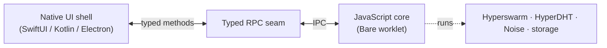

A peer-to-peer app has two very different halves.
1. One is the **core**: swarm identity, storage, replication, and the protocol logic—code that should be identical on every device.
2. The other is the **UI**: windows, views, and gestures—code that is necessarily different on a desktop, a phone, and a terminal.

Bare's answer is to keep the core in one place and let only the UI change. This page explains that pattern and the machinery that connects the two halves. For the runtime itself, see [Inside Bare](/explanation/bare-runtime); for where this sits in the wider picture, see [The Pears stack](/explanation/the-pears-stack).

## The shape: shell, seam, core

A cross-platform Bare app has three parts:

* The **native shell** is written in the platform's own language and owns nothing but presentation.
* The **core** runs as a Bare *worklet*—an isolated Bare thread—and owns everything peer-to-peer:
   * it holds the swarm identity
   * opens the [Corestore](/reference/helpers/corestore)
   * runs [Hyperswarm](/reference/building-blocks/hyperswarm) and [HyperDHT](/reference/building-blocks/hyperdht)
   * handles the Noise-encrypted connections to other peers.
* The shell never imports a networking library
* The core never imports a UI framework
* Between them is a [**typed RPC seam**](#the-typed-rpc-seam)

## Worklets carry the core

[`bare-kit`](/reference/bare/bare-kit) is the toolkit that runs a Bare core inside a native app. It exposes a web-worker-like API for starting and managing isolated Bare threads—called *worklets*—each with an IPC channel to the host.
* On iOS you drive a worklet from Objective-C or Swift;
* on Android, from Kotlin or Java;
* from React Native or Expo, [`react-native-bare-kit`](/reference/bare/bare-kit) gives you the same `Worklet` and `IPC` objects in JavaScript;
* The worklet honours the Bare [lifecycle](/explanation/bare-runtime#the-lifecycle), so the host can suspend and resume the core in step with the OS's app-lifecycle rules.

Because the worklet is just Bare, the core you ship to mobile is the *same JavaScript* you'd run in a desktop [worker](/explanation/workers) or a standalone terminal binary. Write it once; embed it everywhere.

## The typed RPC seam

The shell and the core could exchange raw bytes over the IPC pipe, but that pushes framing and parsing into hand-written code on both sides. The Bare RPC ecosystem replaces those raw bytes with **typed methods generated from a shared schema**:

* [`hyperschema`](https://github.com/holepunchto/hyperschema) defines versioned, append-only data structures and generates [`compact-encoding`](/reference/helpers/compact-encoding) codecs for them.
* [`bare-rpc`](/reference/modules/bare-modules) frames requests and replies over a duplex stream, with a unique command number per method.
* Code generators turn the schema into typed bindings for each language. JavaScript bindings are generated today, and a Swift toolchain (`hyperschema-swift`, `bare-rpc-swift`, `compact-encoding-swift`, `hrpc-swift`) produces wire-compatible Swift structs and a typed RPC class, with C and Kotlin generators following.

The seam supports the RPC patterns a real app needs:
* **unary** request/response,
* **send-only** events,
* **response-stream** (the handler writes a sequence of chunks),
* **request-stream** (the caller streams input), and
* **duplex** (both at once).
Update the schema, regenerate, and both sides get the new types—no hand-maintained parsing, and a compiler error if the shell and core drift apart.

## One core, many platforms

Put the pieces together and the payoff is structural.
* The JavaScript core is portable and unchanged across devices.
* Each platform adds two cheap, generated or layout-only pieces: a native shell and the bindings for the seam.
* Swapping from iOS to Android to desktop changes the shell and the generated bindings—never the protocol logic.

This is the architecture behind Keet's identical behaviour on phones, laptops, and terminals: one core, several UIs. The desktop ([Electron](/explanation/pear-desktop-architecture)) and terminal ([standalone Bare binary](/getting-started/from-a-template/start-from-hello-pear-bare)) hosts ship today. On mobile, [`pear-runtime`](/reference/pear/runtime) is [not yet supported](/explanation/runtime-and-languages#one-codebase-many-platforms-the-pear-end-pattern)—you wire the worklet and updates yourself with `bare-kit`—and Pear v2 lands the same core/UI separation as a built-in default, at which point mobile reaches parity.

## Common questions

### Does Bare run on iOS and Android?

Yes. `bare-kit` embeds a Bare worklet in native iOS and Android apps today, and `react-native-bare-kit` does the same for React Native and Expo. What's still landing is the built-in `pear-runtime` integration for mobile (noted earlier on this page).

### How does native code talk to the JavaScript core?

Through an IPC channel between the host and the worklet. You can write bytes directly, or—recommended—put a [typed RPC seam](#the-typed-rpc-seam) on top so both sides call generated, type-checked methods instead.

### How is this different from React Native's own JavaScript engine?

React Native runs your UI's JavaScript on the main JS thread. A Bare worklet is a *separate*, isolated runtime for your peer-to-peer core, running off the UI thread with its own module system and native addons. The two communicate over IPC; the worklet keeps networking and storage out of the UI's way.

### Do I have to write the protocol twice—once in JS, once in Swift?

No. You define the schema once with `hyperschema` and generate bindings for each language. The Swift, JavaScript (and forthcoming C/Kotlin) sides are all generated from—and wire-compatible with—that single source.

## See also

- [`bare-kit` reference](/reference/bare/bare-kit)—the Worklet and IPC API for iOS, Android, and React Native.
- [Embed Bare in a React Native app](/how-to/run-on-native/embed-bare-in-react-native)—start a worklet and exchange messages.
- [Type a native RPC bridge](/how-to/run-on-native/type-a-native-rpc-bridge)—generate a typed seam with `hyperschema` and `bare-rpc`.
- [Bundle a Bare app](/how-to/run-on-native/bundle-a-bare-app)—produce an embeddable bundle or a standalone binary.
- [Workers](/explanation/workers)—the same host-and-core split on the desktop.
- [Inside Bare](/explanation/bare-runtime)—the runtime the worklet is an instance of.
