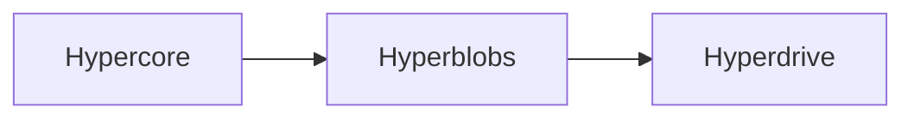

Pear storage is built from a small set of composable primitives stacked on top of one another:



At the bottom is **[Hypercore](#hypercore-append-only-blocks)**, an append-only log of verified blocks. Everything else in Pear storage ultimately replicates through one or more cores.

**[Hyperblobs](#hyperblobs-large-opaque-objects)** sits on a core when you need opaque objects larger than a single block—it handles chunking and returns stable ids you can store elsewhere.

**[Hyperdrive](#hyperdrive-paths-metadata-and-directories)** is the top layer: path-addressed files and directories, with metadata in a [Hyperbee](/reference/building-blocks/hyperbee) tree and file contents in **[Hyperblobs](#hyperblobs-large-opaque-objects)**.

Understanding that ladder helps you pick the right building block before you reach for a full filesystem API.

<Callout type="info">
This page is conceptual. For API details, see [Hypercore](/reference/building-blocks/hypercore), [Hyperdrive](/reference/building-blocks/hyperdrive), and [Hyperbee](/reference/building-blocks/hyperbee).
</Callout>

## Hypercore: append-only blocks

[Hypercore](/reference/building-blocks/hypercore) is a secure, sparse-replicated append-only log. Each `append` adds one block; readers verify integrity and optionally decrypt per-block. Hypercore is the foundation for nearly every other Pear data structure.

You can store arbitrary bytes directly in a core:

```js
import Hypercore from 'hypercore'

const core = new Hypercore('./my-core')
await core.ready()

await core.append(Buffer.from('I am a block of data'))
```

That works for small payloads, but Hypercore blocks have a practical size limit. Storing a large file as one block is inefficient; splitting it manually means tracking chunk order, offsets, and retrieval yourself.

## Hyperblobs: large opaque objects

[Hyperblobs](https://github.com/holepunchto/hyperblobs) chunks large data across Hypercore blocks and exposes a simple put/get API. A `put` returns an **id** (block and byte offsets and lengths) that you store elsewhere—for example in a [Hyperbee](/reference/building-blocks/hyperbee) key.

```js
import Hypercore from 'hypercore'
import Hyperblobs from 'hyperblobs'

const core = new Hypercore('./blob-core')
const blobs = new Hyperblobs(core)
await blobs.ready()

const id = await blobs.put(Buffer.from('hello world', 'utf-8'))
const data = await blobs.get(id)
```

Hyperblobs is the right choice when you need **object storage**—attachments, media, serialized blobs—without file paths or directory semantics. Replication still flows through the underlying Hypercore; peers fetch missing blob blocks like any other core data.

Hyperdrive uses Hyperblobs internally for file contents. You do not need Hyperdrive if all you want is keyed blob storage.

## Hyperdrive: paths, metadata, and directories

[Hyperdrive](/reference/building-blocks/hyperdrive) combines a [Hyperbee](/reference/building-blocks/hyperbee) metadata tree with a Hyperblobs content store. You get path-based operations—`get`, `put`, `del`, `list`, existence checks—similar to a filesystem, with the same replication properties as Hypercore.

```js
import Hyperdrive from 'hyperdrive'
import Corestore from 'corestore'

const store = new Corestore('./drive-storage')
const drive = new Hyperdrive(store)
await drive.ready()

await drive.put('/notes/readme.txt', Buffer.from('hello'))
const buffer = await drive.get('/notes/readme.txt')
```

Pear application bundles are Hyperdrives: code, assets, and dependencies staged with `pear stage` live in a drive that peers replicate. User-facing apps often keep **application state** in separate cores or drives under [Corestore](/reference/helpers/corestore).

Helpers extend the model without changing the stack:

- [Localdrive](/reference/helpers/localdrive)—mirror between a Hyperdrive and a local folder.
- [Mirrordrive](/reference/helpers/mirrordrive)—copy or sync between two drives.

## Choosing a layer

| Need | Use |
| --- | --- |
| Ordered event log, small messages | Hypercore directly |
| Large binary object, no path | Hyperblobs on a dedicated core |
| Files, directories, bundle layout | Hyperdrive |
| Sorted key/value over one log | Hyperbee (often inside Hyperdrive or standalone) |

If you do not need path-addressed files shared between peers, prefer Hyperblobs over Hyperdrive. Hyperdrive pays for directory semantics and metadata indexing you may not use.

## See also

- [Storage and distribution](/explanation/storage-and-distribution)—where cores and drives live on disk in a Pear installation.
- [Share append-only databases with Hyperbee](/how-to/store-and-replicate/share-append-only-databases-with-hyperbee)—key/value patterns on Hypercore.
- [Work with many Hypercores using Corestore](/how-to/store-and-replicate/work-with-many-hypercores-using-corestore)—managing multiple cores from one storage root.
- [Hypercore reference](/reference/building-blocks/hypercore)—append-only log API.
- [Hyperdrive reference](/reference/building-blocks/hyperdrive)—filesystem API.
- [Hyperbee reference](/reference/building-blocks/hyperbee)—sorted key/value tree.
