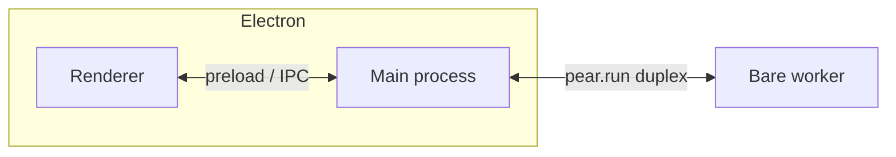

This page explains **why** a production-style Pear **Electron** app usually separates three concerns: **over-the-air (OTA) updates**, **persistent peer-to-peer storage**, and **Bare workers** behind a single IPC stream.

Read it if you are sketching your own main/renderer/worker split or comparing a full runtime setup to the minimal [getting started chat](/getting-started/chat). The prose here stays **template-agnostic**.

## The short version

The pattern optimizes for: **ship new builds without a central server**, **keep replication-capable storage beside the app**, and **keep native P2P modules out of the renderer**. Electron’s main process owns a [`pear-runtime`](/reference/runtime) instance; the renderer stays a normal web view; a **Bare worker** holds Hyperswarm, Hypercore, and similar modules. Updates flow when the **application Hyperdrive** changes; the runtime signals the UI, then swaps paths on disk so the **next process start** runs the new code.

## Process model

The renderer does not load `hyperswarm`, `hypercore`, or other Bare-oriented modules directly. The main process starts the worker with [`pear.run`](/reference/runtime#running-workers) and forwards bytes between the worker’s [`Bare.IPC`](/reference/runtime#running-workers) stream and whatever bridge you expose to the renderer.

## Updates

An **update** is triggered when a **seeded application drive** gains new writes: the replicated [Hyperdrive](/reference/building-blocks/hyperdrive) behind your `pear://` link reflects a new staged or provisioned build. The runtime emits **`updating`** while it syncs, then **`updated`** when the new bundle is ready. Handlers attach with [`pear.on('updating')` / `pear.on('updated')`](/reference/runtime#updates) (some sample apps use a nested `updater` object — same events, different accessor).

After `updated`, a common shell **repoints the active application path** to the freshly synced build and removes the old tree from disk so the **next start** runs the new code. That matches OTA expectations: sync in the background, switch on restart (or after your UI explicitly restarts).

Disable updates per run (`--no-updates`) or with [`package.json` `updates: false`](/reference/runtime#disabling-updates) during local development so a seeded link does not replace your working tree mid-session.

## Storage

The runtime’s **`dir`** option is the root for **peer-to-peer and local application data**. In production that usually maps to per-OS application support directories; in development many teams use a **separate dev default** or a flag. [`pear.storage`](/reference/runtime#storage) is the string you pass into [`Corestore`](/reference/helpers/corestore) so every core shares one coherent on-disk layout.

Passing **`--storage /path`** (or equivalent) spins up an **isolated Corestore** — the same idea as running two app instances on two machines: different storage roots, no key collisions.

## Workers

**Application P2P logic** — swarms, cores, drives — belongs in the worker entrypoint. Arguments you pass from `pear.run('./workers/main.js', [pear.storage, …])` show up as [`Bare.argv`](/reference/api#bare-argv) inside the worker (`argv[0]`/`argv[1]` are reserved; **`argv[2]`** is the first user argument, which is why sample apps often pass storage at index `2`).

Rule of thumb: **main = shell + IPC**, **worker = data plane**, **renderer = view**.

## Where this differs from the minimal tutorial

The [getting started chat](/getting-started/chat) walkthrough uses [`PearRuntime.run()`](/reference/runtime#running-workers) so you can paste a tiny worker without configuring `upgrade` or `dir`. A shipped desktop app switches on the **full constructor** so OTA, storage, and workers share one runtime object — the shape in [`pear-runtime` reference](/reference/runtime).

## Where to go next

- [Release pipeline](/explanation/release-pipeline) — stage, provision, multisig, and diagrams for moving builds between links.
- [Release pipeline glossary](/reference/release-pipeline-glossary) — terminology in one table.
- [Storage and distribution](/explanation/storage-and-distribution) — Pear-wide layout versus per-app `dir`.
- [Deploy your application](/how-to/operate-an-app/deployment) — when you are ready to run commands.

<Callout type="info">

**Related documentation**

**Getting Started** — [Part 1: Chat](/getting-started/chat) · [Part 2: Production-shaped](/getting-started/production-shape) · [Part 3: Ship](/getting-started/ship) · [Part 4: Update](/getting-started/update)

**Operating an app**

- [Build desktop distributables](/how-to/operate-an-app/build-desktop-distributables)
- [Desktop release npm scripts](/reference/desktop-release-npm-scripts)
- [Distribute as a binary](/how-to/operate-an-app/distribute-as-binary)
- [Manage installed applications](/how-to/operate-an-app/manage-installed-applications)
- [Apply recommended practices](/how-to/operate-an-app/recommended-practices)
- [Troubleshoot desktop releases](/how-to/operate-an-app/troubleshoot-desktop-releases)
- [Troubleshoot common issues](/how-to/operate-an-app/troubleshooting)

</Callout>
