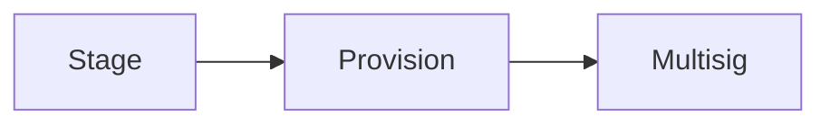
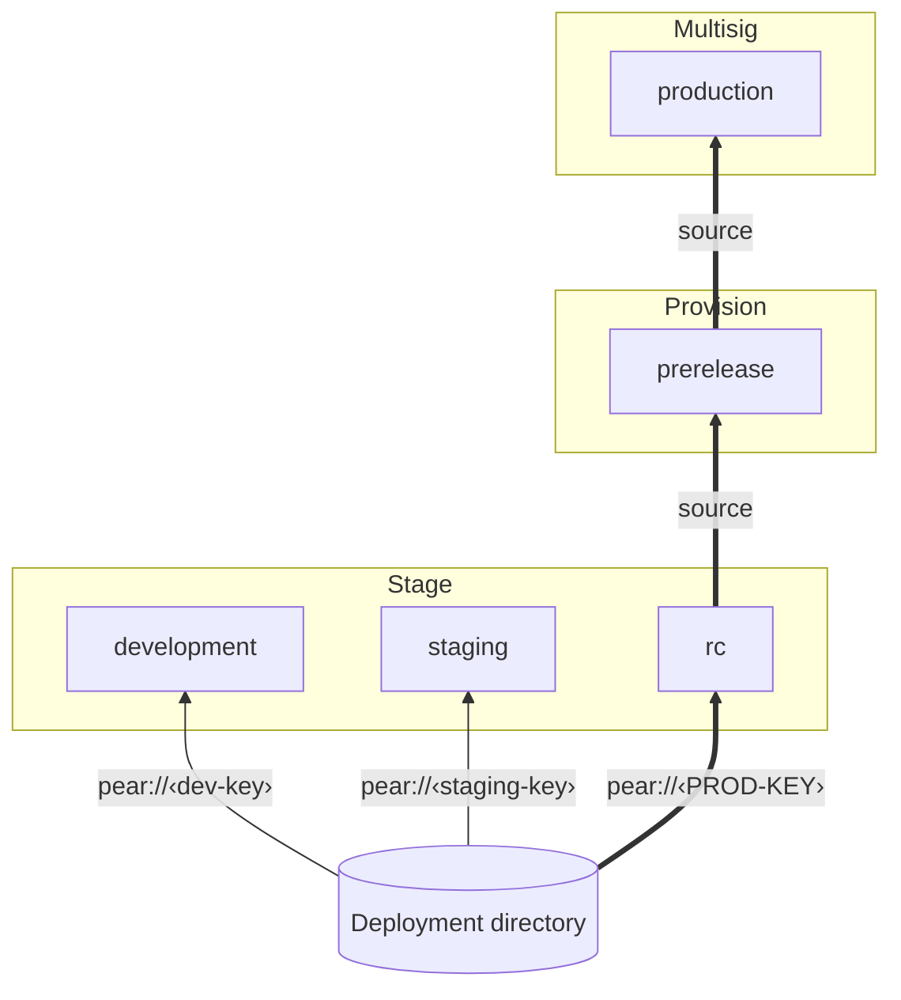
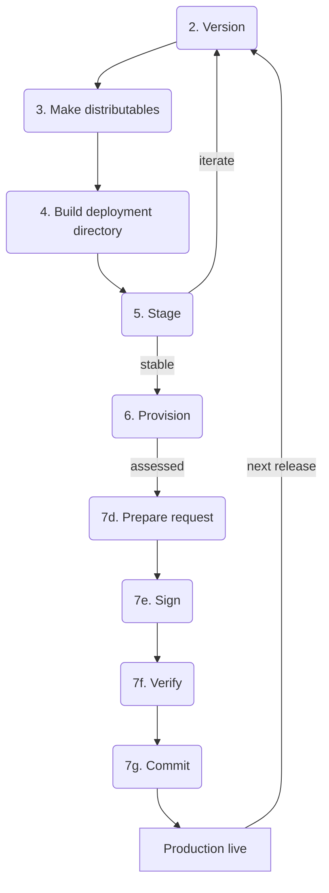
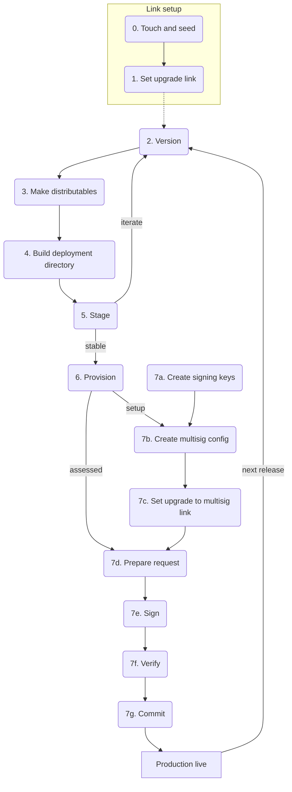
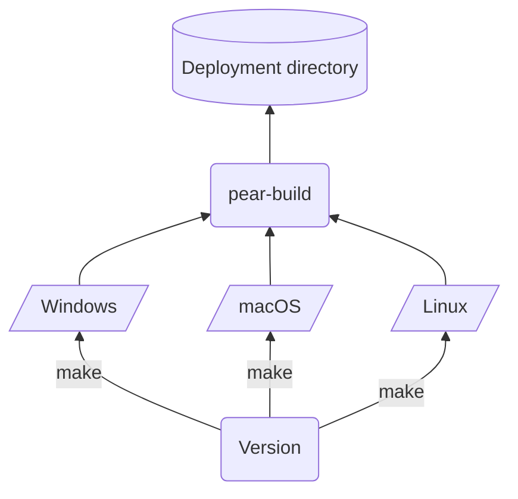
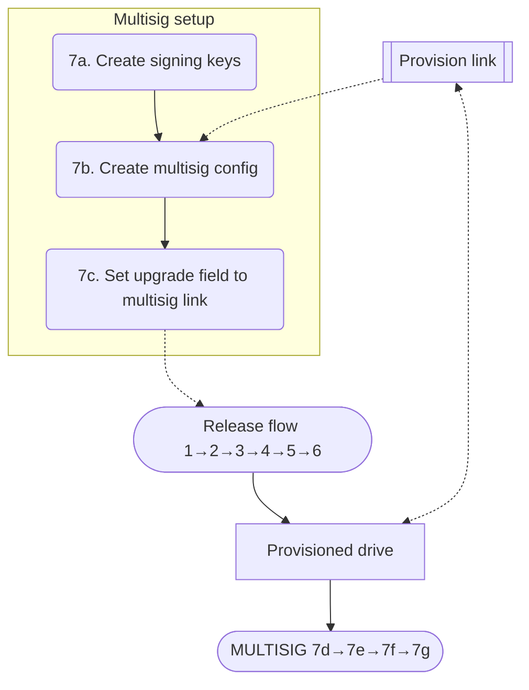
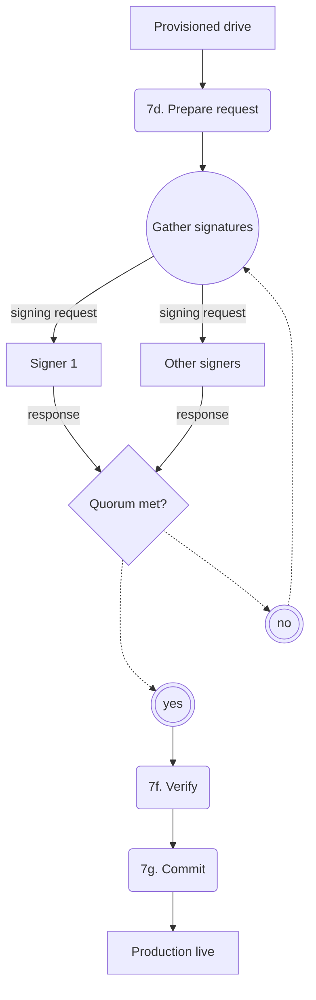
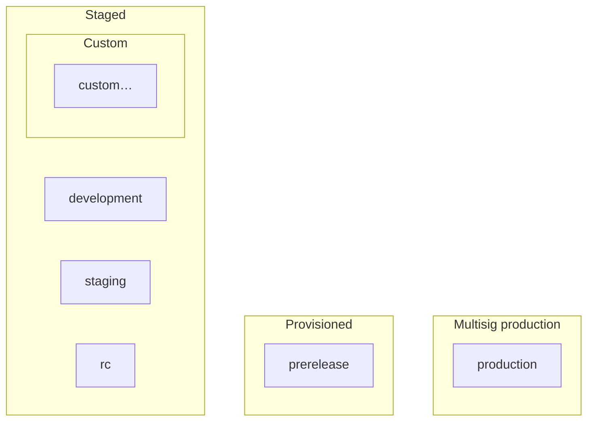

This page explains **why** many Pear **desktop** release flows use three operations — **stage**, **provision**, and **multisig** — and how **release lines** and the **deployment directory** fit around them. Read it before you run commands so the mental model matches the CLI (concrete steps live under [Deploy your application](/how-to/operate-an-app/deployment) and [Build desktop distributables](/how-to/operate-an-app/build-desktop-distributables)).

<Callout type="info">

**Operator detail:** [Deploy your application](/how-to/operate-an-app/deployment), [Build desktop distributables](/how-to/operate-an-app/build-desktop-distributables), and [Troubleshoot desktop releases](/how-to/operate-an-app/troubleshoot-desktop-releases) carry the same pipeline as these diagrams. [Release pipeline glossary](/reference/release-pipeline-glossary) defines the terms.

</Callout>

## The short version

Centralized deploy pipelines often separate *staging servers*, *preview*, and *production*. Pear can fold similar **trust boundaries** into **different Hyperdrives addressed by different `pear://` links**: you **stage** a folder of builds into a drive used for iteration, **provision** from a versioned stage into a leaner prerelease drive, then **multisig-commit** into production so a **quorum of signers** must agree. Each hop can shrink history or raise assurance.

## OTA update event lifecycle

A running Pear desktop app polls the [Hyperdrive](/reference/building-blocks/hyperdrive) behind its `upgrade` link, downloads new application data when the [Hypercore](/reference/building-blocks/hypercore) length advances, and emits two events from [`pear.updater`](/reference/runtime). The host process forwards them to renderers so the UI can react:

```mermaid
sequenceDiagram
    participant Peer as Seeder peer
    participant Updater as pear.updater
    participant Main as Electron main
    participant UI as Renderer
    Peer-->>Updater: new core length
    Updater-->>Main: 'updating' (download in progress)
    Main-->>UI: webContents.send('pear:event:updating')
    Updater-->>Main: 'updated' (download ready)
    Main-->>UI: webContents.send('pear:event:updated')
    UI->>Main: applyUpdate()
    Main->>Updater: updater.applyUpdate()
    Note over Updater,Main: swap app path on disk, remove old build
    UI->>Main: appAfterUpdate()
    Main->>Main: app.relaunch(); app.exit(0)
```

- `updating` fires when the updater begins streaming new blocks; treat it as "background work in progress".
- `updated` fires when the new build is fully on disk; it is safe to swap.
- `bridge.applyUpdate()` (renderer side) calls `pear.updater.applyUpdate()` (main side). `applyUpdate` renames the application directory to the new build and deletes the old one — until the process restarts, the running code is still the old build.
- `bridge.appAfterUpdate()` triggers `app.relaunch()` and `app.exit(0)`. On Linux AppImage you usually relaunch with `process.env.APPIMAGE` instead of `process.execPath` so the host wrapper script gets re-executed.

You can disable updates per run with `--no-updates` (handy in development) or globally by setting `"updates": false` in `package.json` and spreading the package config into the `PearRuntime` options.

The two-event split is what lets you build UI like the "Update ready!" banner in [Add persistence with Corestore](/getting-started/production-shape): show a spinner on `updating`, swap to a restart button on `updated`, restart the app on click.

## Stage, provision, multisig



- **Stage** — Local and team checks: feature branches, unsigned or lightly signed builds, ephemeral links. Appends to the application drive; good for iteration.
- **Provision** — Prerelease / QA / dogfood: synchronizes from a **versioned** stage source onto a target link while **compacting** additions and deletions so the drive is closer to what stakeholders mirror.
- **Multisig** — Production: writes require **co-signing** up to a configured quorum so one compromised machine cannot redefine the release line.

Each stage link can feed the next operation; a **provisioned** link becomes the source for **multisig** commits once signers agree.

## Deployment directory and release lines

A **deployment directory** is the multi-architecture output you assemble after per-OS **make** steps (often with `pear-build` merging `darwin`, `linux`, and `win32` artifacts). That directory is what **`pear stage`** reads from disk and writes into Hypercore-backed storage for a given **release line** link.

**Release lines** are parallel stability tracks: common names are **development**, **staging**, **rc** (each a **staged** link), then **prerelease** (provisioned from `rc`), then **production** (multisig’d from prerelease). The **`upgrade`** field in `package.json` decides **which link** a shipped binary follows for OTA — so different builds can track different lines intentionally.



A common pattern is that **`rc`’s `upgrade` pins the production multisig key**, so `rc` builds **do not** receive casual OTA bumps — you ship new installers when that line moves.

## Release cycle (steady state)

Once bootstrapping finishes, the steady **release cycle** is repetitive: bump **`version`**, **make** per platform, **build** the deployment directory, **stage**, iterate; when stable, **provision**; when assessed, run **multisig** prepare → sign → verify → commit; production goes live; the next cycle starts again at **version**.



Numbered labels align with common documentation ordering (touch/seed and upgrade-link setup happen **before** this loop is warm).

## Foundational steps (bootstrap + loop)

The **foundational** diagram adds multisig **key creation** and config **beside** the main loop: signing keys, `multisig.json`, pointing `upgrade` at the multisig link, then joining the same release flow.



**Stage-only** is enough for proofs of concept; **production** benefits from quorum signing and machine-independent drives.

## From per-OS builds to one directory



That directory must at least contain `package.json` and `by-arch/.../app` trees before `pear stage` is meaningful.

## Multisig setup and signing





## Release lines



**Custom** lines are optional forks for spikes, hotfixes, or instrumented builds — same mechanics, different seeded link.

## Relationship to Pear’s global storage story

Platform installs still use Pear’s OS-wide tree described in [Storage and distribution](/explanation/storage-and-distribution). The diagrams here are about **application release artifacts** moving between links — not replacing that global layout.

## Where to go next

- [Release pipeline glossary](/reference/release-pipeline-glossary) — OTA, versioned links, seeding, and related terms.
- [Pear desktop application architecture](/explanation/pear-desktop-architecture) — workers, storage, and update events in the running app.
- [Deploy your application](/how-to/operate-an-app/deployment) — operator checklist for `pear stage` / `pear provision` / multisig tooling.
- [Build desktop distributables](/how-to/operate-an-app/build-desktop-distributables) — per-OS makes and signing pointers.
- [Desktop release npm scripts](/reference/desktop-release-npm-scripts) — common `package.json` scripts.
- [Troubleshoot desktop releases](/how-to/operate-an-app/troubleshoot-desktop-releases) — OTA, staging, and `pear-build` pitfalls.
