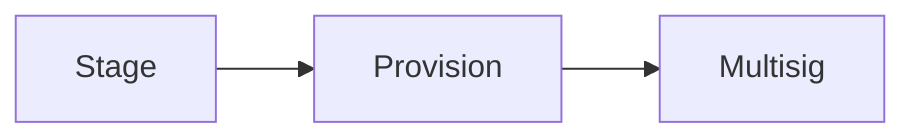
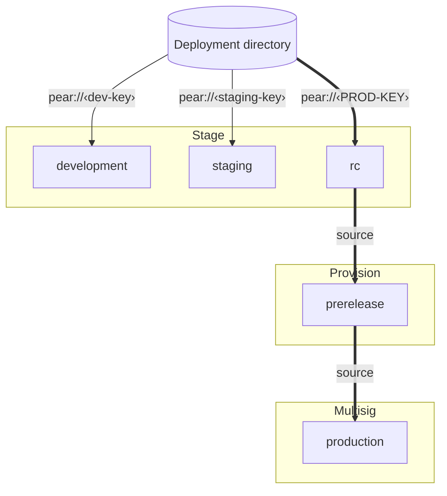
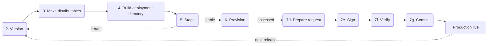
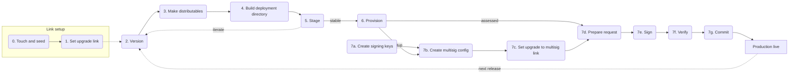
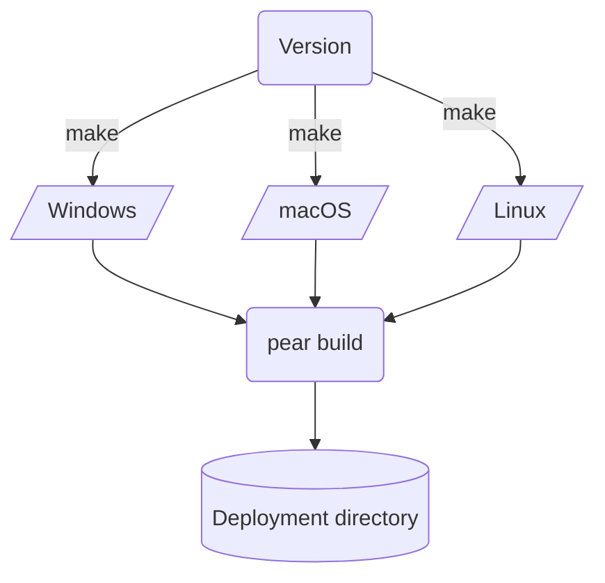
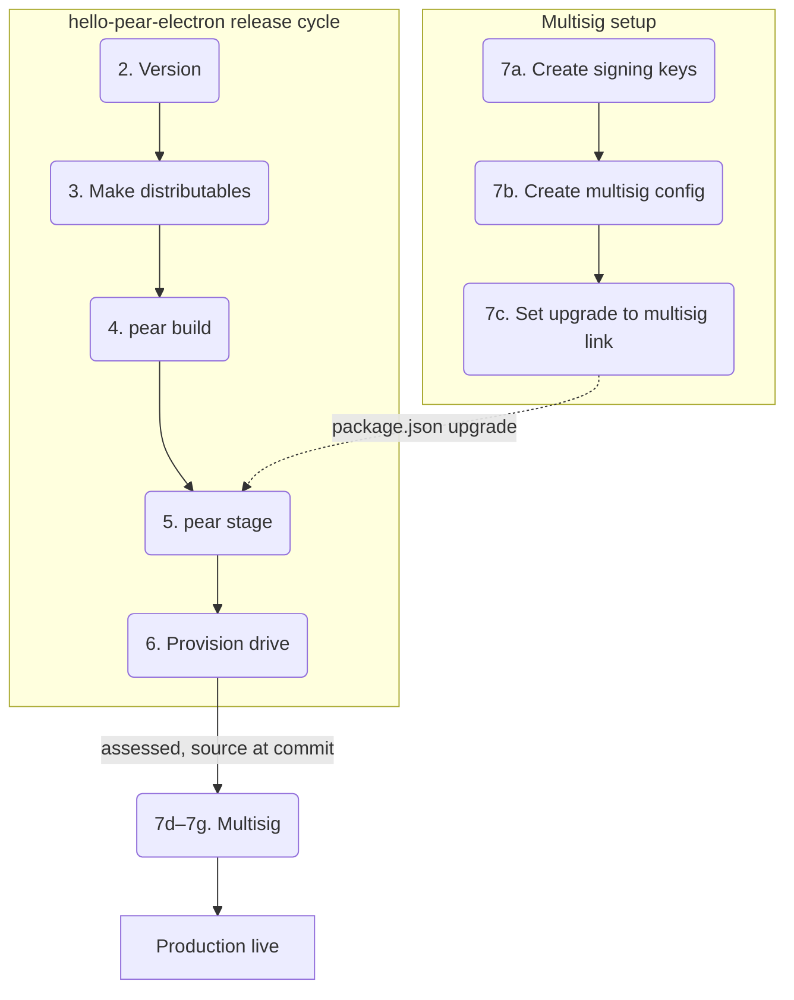
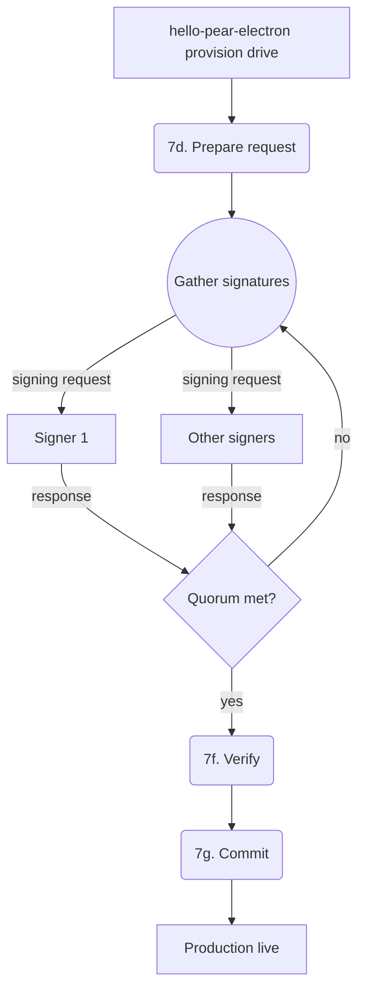
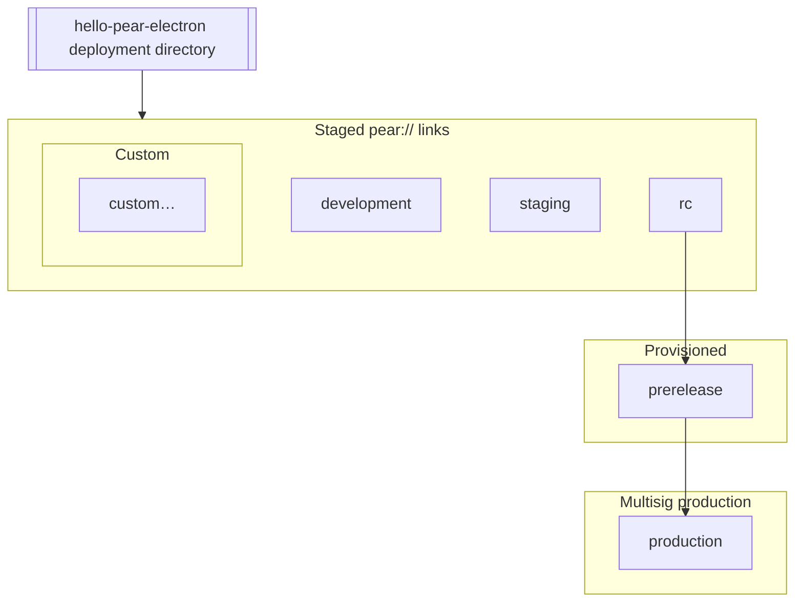

This page explains **why** many Pear **desktop** release flows use three operations: **stage**, **provision**, and **multisig**, and how **release lines** and the **deployment directory** fit around them.

Read it before you run commands so the mental model matches the CLI (concrete steps live under [Deploy your application](/how-to/operate-an-app/manual-deployment/deployment) and [Build desktop distributables](/how-to/operate-an-app/build-and-package/build-desktop-distributables)).

<include>../_snippets/_ci-publish-shortcut-callout.mdx</include>

<Callout type="info">
**Operator detail:** [Deploy your application](/how-to/operate-an-app/manual-deployment/deployment), [Build desktop distributables](/how-to/operate-an-app/build-and-package/build-desktop-distributables), and [Troubleshoot desktop releases](/how-to/operate-an-app/manual-deployment/troubleshoot-desktop-releases) carry the same pipeline as these diagrams. The [Glossary](#glossary) below defines the terms.

</Callout>

## The short version

Centralized deploy pipelines often separate *staging servers*, *preview*, and *production*. Pear can fold similar **trust boundaries** into **different Hyperdrives addressed by different `pear://` links**: 
1. You **stage** a folder of builds into a drive used for iteration,
2. You **provision** from a versioned stage into a leaner prerelease drive, and
3. You **multisig-commit** into production so a **quorum of signers** must agree. **Each hop can shrink history or raise assurance.**

## OTA update event lifecycle

A running Pear desktop app polls the [Hyperdrive](/reference/building-blocks/hyperdrive) behind its `upgrade` link, downloads new application data when the [Hypercore](/reference/building-blocks/hypercore) length advances, and emits two events from [`pear.updater`](/reference/pear/runtime). The host process forwards them to renderers so the UI can react:

```mermaid
sequenceDiagram
    participant Peer as Seeder peer
    participant Updater as pear.updater
    participant Main as Electron main
    participant UI as Renderer
    Peer-->>Updater: new core length
    Updater-->>Main: 'updating' (download in progress)
    Main-->>UI: webContents.send('pear:event:updating')
    Updater-->>Main: 'updated' (download ready)
    Main-->>UI: webContents.send('pear:event:updated')
    UI->>Main: applyUpdate()
    Main->>Updater: updater.applyUpdate()
    Note over Updater,Main: swap app path on disk, remove old build
    UI->>Main: appAfterUpdate()
    Main->>Main: app.relaunch(); app.quit()
```

- [`updating`](/reference/pear/runtime#updates) fires when the updater begins streaming new blocks; treat it as "background work in progress."
- [`updated`](/reference/pear/runtime#updates) fires when the new build is fully on disk; it is safe to swap.
- [`bridge.applyUpdate()`](https://github.com/holepunchto/pear-docs/blob/preview/examples/getting-started/pear-chat/electron/preload.js#L9) (renderer side) calls [`pear.updater.applyUpdate()`](https://github.com/holepunchto/pear-runtime-updater#await-updaterapplyupdate) (updater worker side). [`applyUpdate()`](https://github.com/holepunchto/pear-runtime-updater#await-updaterapplyupdate) renames the application directory to the new build and deletes the old one—until the process restarts, the running code is still the old build.
- [`bridge.appAfterUpdate()`](https://github.com/holepunchto/pear-docs/blob/preview/examples/getting-started/pear-chat/electron/preload.js#L10) triggers [`app.relaunch()`](https://www.electronjs.org/docs/latest/api/app#apprelaunchoptions) and [`app.quit()`](https://www.electronjs.org/docs/latest/api/app#appquit). On Linux AppImage you usually relaunch with `process.env.APPIMAGE` instead of `process.execPath` so the host wrapper script gets re-executed—see [`app:afterUpdate` in pear-chat](https://github.com/holepunchto/pear-docs/blob/preview/examples/getting-started/pear-chat/electron/main.js#L234).

<Callout type="idea">
You can disable updates per run with `--no-updates` (handy in development) or globally by setting `"updates": false` in `package.json` and spreading the package config into the `PearRuntime` options.
</Callout>

The two-event split is what lets you build UI like the "Update ready" banner in [Reshape into a production app](/getting-started/build-a-peer-to-peer-chat/reshape-into-a-production-app): show a spinner on `updating`, swap to a restart button on `updated`, restart the app on click.

## Stage, provision, multisig



- **Stage**—Local and team checks: feature branches, unsigned or lightly signed builds, ephemeral links. Appends to the application drive; good for iteration.
- **Provision**—Prerelease / QA / dogfood: synchronizes from a **versioned** stage source onto a target link while **compacting** additions and deletions so the drive is closer to what stakeholders mirror.
- **Multisig**—Production: writes require **co-signing** up to a configured quorum so one compromised machine cannot redefine the release line.

Each stage link can feed the next operation; a **provisioned** link becomes the source for **multisig** commits once signers agree.

## Deployment directory and release lines

A **deployment directory** is the multi-architecture output you assemble after per-OS **make** steps (often with `pear build` merging `darwin`, `linux`, and `win32` artifacts). That directory is what **`pear stage`** reads from disk and writes into [Hypercore](/reference/building-blocks/hypercore)-backed storage for a given **release line** link.

**Release lines** are parallel stability tracks: common names are **development**, **staging**, **rc** (each a **staged** link), then **prerelease** (provisioned from `rc`), then **production** (multisig’d from prerelease). The **`upgrade`** field in `package.json` decides **which link** a shipped binary follows for OTA—so different builds can track different lines intentionally.



A common pattern is that **`rc`’s `upgrade` pins the production multisig key**, so `rc` builds **do not** receive casual OTA bumps—you ship new installers when that line moves.

## Release cycle (steady state)

Once bootstrapping finishes, the steady **release cycle** is repetitive: bump **`version`**, **make** per platform, **build** the deployment directory, **stage**, iterate; when stable, **provision**; when assessed, run **multisig** prepare → sign → verify → commit; production goes live; the next cycle starts again at **version**.



Numbered labels align with common documentation ordering (touch/seed and upgrade-link setup happen **before** this loop is warm).

## Foundational steps (bootstrap + loop)

The **foundational** diagram adds multisig **key creation** and config **beside** the main loop: signing keys, the multisig config in `pear.json`, pointing `upgrade` at the multisig link, then joining the same release flow.



**Stage-only** is enough for proofs of concept; **production** benefits from quorum signing and machine-independent drives.

## From per-OS builds to one directory



That directory must at least contain `package.json` and `by-arch/.../app` trees before `pear stage` is meaningful.

## Multisig setup and signing

The diagrams below follow [`hello-pear-electron`'s Foundational Steps](https://github.com/holepunchto/hello-pear-electron#foundational-steps)—the same Electron + Bare worker template [Keet](https://keet.io) and [PearPass](https://pass.pears.com) ship. **One-time** multisig wiring is in [Set up multisig](/how-to/operate-an-app/multisig/set-up-multisig); every production shipment after that uses [Sign with multisig](/how-to/operate-an-app/multisig/sign-with-multisig). If a commit fails mid-flight, see [Troubleshoot multisig](/how-to/operate-an-app/multisig/troubleshoot-multisig).

### How setup connects to the release cycle

The [multisig config](/how-to/operate-an-app/multisig/set-up-multisig#create-the-multisig-config) in `pear.json` derives the **multisig link** from its `namespace`, `publicKeys`, and `quorum` alone—it does **not** reference the provision drive. The provision link from the most recent [`hello-pear-electron`](https://github.com/holepunchto/hello-pear-electron) `pear stage` / [`pear provision`](/how-to/operate-an-app/manual-deployment/deployment#6-provision) is instead supplied as the **source** when you prepare and commit each signing request. Shipped binaries read the **multisig link** from [`package.json` `upgrade`](/how-to/operate-an-app/multisig/set-up-multisig#set-upgrade-to-the-multisig-link).



### Quorum signing

Each production commit runs the four steps in [Sign with multisig](/how-to/operate-an-app/multisig/sign-with-multisig): [`pear multisig request`](/how-to/operate-an-app/multisig/sign-with-multisig#prepare-the-request), [`pear multisig sign`](/how-to/operate-an-app/multisig/sign-with-multisig#sign) from each signer until [quorum](/how-to/operate-an-app/multisig/set-up-multisig#create-the-multisig-config) is met, [`pear multisig verify`](/how-to/operate-an-app/multisig/sign-with-multisig#verify), then [`pear multisig commit`](/how-to/operate-an-app/multisig/sign-with-multisig#commit).



## Release lines

For [`hello-pear-electron`](https://github.com/holepunchto/hello-pear-electron), one [`pear build`](https://github.com/holepunchto/hello-pear-electron#deploying) output can feed parallel **stage** links; **prerelease** and **production** are the provision and multisig gates on the trust ladder.



**Custom** lines are optional forks for spikes, hotfixes, or instrumented builds—same mechanics, different seeded link.

## Relationship to Pear’s global storage story

Platform installs still use Pear’s OS-wide tree described in [Storage and distribution](/explanation/storage-and-distribution). The diagrams here are about **application release artifacts** moving between links—not replacing that global layout.

## Glossary

Terms you will see across the **Pear desktop release** and **OTA update** docs:

| Term | Meaning |
| --- | --- |
| **OTA** | Over-the-air: delivering a new app build without a traditional reinstall flow from a store. |
| **OTA updates** | Syncing the running app’s bundle from a peer-to-peer source when the [application drive](#deployment-directory-and-release-lines) changes. |
| **P2P** | Peer-to-peer: machines replicate directly; distribution does not require a single central server if seeders exist. |
| **Application drive** | The [Hyperdrive](/reference/building-blocks/hyperdrive) that holds the published app files and version history for a given `pear://` link. |
| **Deployment directory** | The multi-architecture folder produced after per-OS builds are assembled (for example with `pear build`) and before `pear stage`. See [Deployment directory and release lines](#deployment-directory-and-release-lines). |
| **Multisig** | Co-signing: a quorum of signers must approve before writes land on the production drive. |
| **Pear link** | Stable `pear://…` identifier the swarm routes on; see the **Links** row in [Command Line Interface](/reference/pear/cli) and [Storage and distribution](/explanation/storage-and-distribution). |
| **Quorum** | Minimum number of multisig signers required to commit a release. |
| **Release line** | A parallel deployment stream (for example development, staging, rc) at its own stability level, each with its own staged link. |
| **Seeding** | Keeping a drive announced and available so peers can discover and replicate it (`pear seed`). |
| **Vendor signing** | OS-level code signing (Apple notarization, Windows Authenticode, etc.) so distributables run on other machines without quarantine. |
| **Versioned link** | A `pear://` link that pins `fork`, `length`, and `key` of the [Hypercore](/reference/building-blocks/hypercore) behind the application Hyperdrive—used when provisioning between known versions. |

## Where to go next

- [Pear desktop application architecture](/explanation/pear-desktop-architecture)—workers, storage, and update events in the running app.
- [Deploy your application](/how-to/operate-an-app/manual-deployment/deployment)—operator checklist for `pear stage` / `pear provision` / multisig tooling.
- [Build desktop distributables](/how-to/operate-an-app/build-and-package/build-desktop-distributables)—per-OS makes and signing pointers.
- [Desktop release npm scripts](/reference/ci-and-release/desktop-release-npm-scripts)—common `package.json` scripts.
- [Troubleshoot desktop releases](/how-to/operate-an-app/manual-deployment/troubleshoot-desktop-releases)—OTA, staging, and `pear build` pitfalls.
