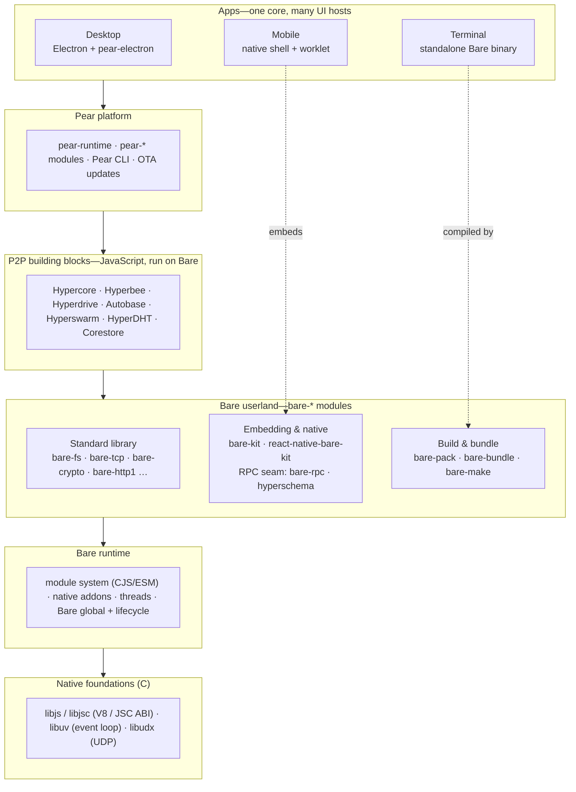

Pear is the platform people see: a runtime, a CLI, and over-the-air updates for peer-to-peer apps. [Bare](/explanation/bare-runtime) is the engine underneath it. They're often named together—"the Pear stack"—but they sit at different layers, and knowing which layer you're working at makes the rest of these docs easier to navigate.

This page lays out the whole stack, bottom to top, and shows where each library you'll meet elsewhere belongs.

## The stack at a glance

Each layer runs on the one beneath it. Read from the bottom up, it's a story about how raw C bindings become a peer-to-peer app you can install.

## The engine room: native foundations and the Bare runtime

At the very bottom are C libraries: [`libjs`](https://github.com/holepunchto/libjs) (and its JavaScriptCore-backed sibling [`libjsc`](https://github.com/holepunchto/libjsc)) give an engine-independent, ABI-stable way to talk to a JavaScript engine; [`libuv`](https://github.com/libuv/libuv) provides the asynchronous I/O event loop; [`libudx`](https://github.com/holepunchto/libudx) carries the reliable UDP streams the networking stack rides on.

[Bare](/explanation/bare-runtime) sits directly on top. It's a small, embeddable JavaScript runtime that adds only what those C primitives can't supply on their own: a module system (with CommonJS/ESM interop), a native-addon loader, and lightweight threads. Everything else is left to userland—which is the next layer up.

## Bare userland: the `bare-*` modules

Bare ships almost no standard library. The familiar runtime surface—file system, sockets, crypto, HTTP—lives in installable [`bare-*` modules](/reference/modules/bare-modules) you opt into. The same layer holds two other families that matter for cross-platform apps:

- **Embedding & native** ([`bare-kit`](/reference/bare/bare-kit), [`react-native-bare-kit`](/reference/bare/bare-kit), and the typed RPC seam of [`bare-rpc`](/reference/modules/bare-modules) + [`hyperschema`](https://github.com/holepunchto/hyperschema)) let a native app run a Bare core on a background thread. See [One core, many platforms](/explanation/bare-on-native).
- **Build & bundle** (`bare-pack`, `bare-bundle`, `bare-make`, `bare-build`) turn a Bare program and its dependencies into an embeddable bundle or a standalone executable.

## The peer-to-peer building blocks

The libraries Pear is famous for—[Hypercore](/reference/building-blocks/hypercore), [Hyperbee](/reference/building-blocks/hyperbee), [Hyperdrive](/reference/building-blocks/hyperdrive), [Autobase](/reference/building-blocks/autobase), [Hyperswarm](/reference/building-blocks/hyperswarm), [HyperDHT](/reference/building-blocks/hyperdht), and [Corestore](/reference/helpers/corestore)—are ordinary JavaScript modules. They have no special status in the runtime; they run *on* Bare like any other dependency. That's why the same storage and networking code works unchanged whether it's hosted by Electron on the desktop or a worklet on a phone.

## The Pear platform

[Pear](/) is the layer that turns those building blocks into a product: [`pear-runtime`](/reference/pear/runtime) spawns and updates your app, the [`pear-*` modules](/reference/modules/pear-modules) supply application services, and the [Pear CLI](/reference/pear/cli) stages, seeds, and releases it. Pear is built *on* Bare and the building blocks—it doesn't replace them.

## Apps: one core, many UI hosts

At the top are the apps—[Keet](https://keet.io), [PearPass](https://pass.pears.com), and whatever you build. The recommended shape splits an app into a portable JavaScript **core** (peer-to-peer logic and storage) and a thin **UI host** that changes per platform: Electron on desktop, a native shell on mobile, a standalone binary in the terminal. The core is the same code everywhere; only the host swaps. That split is the subject of [Runtime and languages](/explanation/runtime-and-languages) and [One core, many platforms](/explanation/bare-on-native).

## See also

- [Inside Bare](/explanation/bare-runtime)—what the runtime layer actually adds.
- [One core, many platforms](/explanation/bare-on-native)—how the portable core reaches mobile and native apps.
- [Runtime and languages](/explanation/runtime-and-languages)—why the stack is JavaScript and how other languages join in.
- [Bare modules](/reference/modules/bare-modules)—the catalog of `bare-*` userland modules.
- [Pear modules](/reference/modules/pear-modules)—the `pear-*` libraries at the platform layer.
