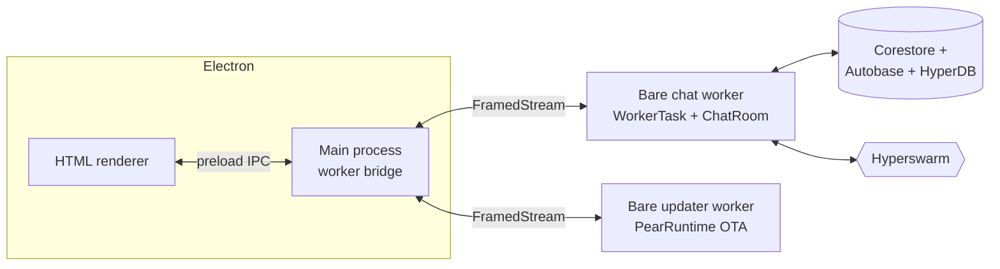

import { Steps, Step } from 'fumadocs-ui/components/steps'

This is **part 2 of 4** in the [getting started path](/getting-started). [Part 1](/getting-started/build-a-peer-to-peer-chat/build-a-peer-to-peer-chat) built a working chat from scratch with the simplest form of the runtime ([`PearRuntime.run`](/reference/pear/runtime#running-workers)). This part reshapes it into a **production-shaped scaffold** built on the same patterns as Pear's official [`hello-pear-electron`](https://github.com/holepunchto/hello-pear-electron) template—a Bare worker behind a preload bridge, an OTA updater worker, and Electron Forge packaging—the same patterns [Keet](https://keet.io) and [PearPass](https://pass.pears.com) use under the hood.

By the end you have the shared **`pear-chat` scaffold** every chat-family and media how-to in [the How To guides](/how-to) extends. There is no separate intermediate app—part 2 is the finished template shape:

- A separate [Bare worker](/explanation/runtime-and-languages) that owns all the P2P code.
- An [Autobase](/reference/building-blocks/autobase)-backed shared room with [blind-pairing](https://www.npmjs.com/package/blind-pairing) invite codes, so two peers join from a short string without exposing keys.
- On-disk persistence via [Corestore](/reference/helpers/corestore) + a [HyperDB](https://www.npmjs.com/package/hyperdb) view—the conversation survives restarts.
- A separate [OTA updater worker](/explanation/release-pipeline#ota-update-event-lifecycle), wired but inert, ready for [part 3](/getting-started/build-a-peer-to-peer-chat/ship) and [part 4](/getting-started/build-a-peer-to-peer-chat/update) to flip on.
- A polished [Tailwind CSS](https://tailwindcss.com/) UI (compiled by the CLI, not the CDN) with a peer counter and a **copy-invite** button.

<include>../../_snippets/_hello-pear-electron-callout.mdx</include>

## What you'll build

A standalone Electron app that:

- Runs the actual peer-to-peer code inside a [Bare worker](/explanation/runtime-and-languages), keeping native modules out of the renderer and Electron's main thread:
  - [Hyperswarm](/reference/building-blocks/hyperswarm) finds and connects peers over the DHT.
  - [Corestore](/reference/helpers/corestore) is the on-disk store that holds the app's Hypercores.
  - [Autobase](/reference/building-blocks/autobase) is the multi-writer log that merges every peer's messages into one shared room view.
  - [blind-pairing](https://www.npmjs.com/package/blind-pairing) lets a new peer join from a short invite code without either side exposing its keys.
- Pairs two peers via an **invite code** generated from the room owner's Autobase key—the UI exposes it behind a copy button.
- Persists every message to disk in an [Autobase-backed HyperDB view](/reference/building-blocks/autobase), so reopening the app replays the conversation.
- Embeds the [`pear-runtime`](/reference/pear/runtime) OTA updater in its **own** Bare worker, so update traffic never blocks the chat.
- Renders a vanilla HTML + [Tailwind CSS](https://tailwindcss.com/) UI that talks to the worker by exchanging JSON over a framed pipe—no bundler, no framework.



<Callout type="info">
For the conceptual picture behind this split—why a production app separates OTA updates, storage, and workers—read [Pear desktop application architecture](/explanation/pear-desktop-architecture).
</Callout>

## Before you start

You need:

- [Node.js](https://nodejs.org/) v22.17 or newer and npm v10.9 or newer.
- A POSIX-style terminal (macOS, Linux, or Windows with WSL).
- An IDE or text editor.
- The working chat from [part 1—build the peer-to-peer chat](/getting-started/build-a-peer-to-peer-chat/build-a-peer-to-peer-chat), so you are comfortable with [`PearRuntime.run()`](/reference/pear/runtime#running-workers), [Bare workers](/explanation/workers), and [Hyperswarm](/reference/building-blocks/hyperswarm) topics.

<Callout type="info">
Part 1 was type-along in five files. The production scaffold is ~14 files and a generated `spec/` directory—too much to retype. **Clone the repo** and walk the working code as this part explains it. Every snippet points to a real file so you can read the surrounding context.
</Callout>

<Steps>

<Step>

## Clone the example

```bash skip="desktop-gui"
git clone https://github.com/holepunchto/pear-docs
cd pear-docs
git switch published
cd examples/getting-started/pear-chat
npm install
npm run build
```

`npm run build` does two things you must run before the first `npm start`:

- `build:db` runs `node schema.js` to generate the `spec/` directory (HyperSchema records, the HyperDB view, and the HyperDispatch encoders).
- `build:tailwind` compiles `input.css` into `renderer/build/output.css` with the [Tailwind CLI](https://tailwindcss.com/docs/installation)—replacing part 1's in-browser CDN script.

You should now have a `pear-chat/` directory laid out like this:

```text
pear-chat/
├─ build/                # icons + per-OS packaging assets
├─ electron/
│  ├─ main.js            # spawns the chat worker + the updater worker
│  └─ preload.js         # contextBridge exposing window.bridge
├─ renderer/
│  ├─ app.js             # vanilla DOM + worker bridge
│  └─ index.html         # chat shell (Tailwind classes)
├─ spec/                 # generated HyperDispatch + HyperDB schemas
├─ workers/
│  ├─ chat-room.js       # Autobase + blind-pairing room
│  ├─ index.js           # Bare chat worker entrypoint
│  ├─ main.js            # Bare updater worker (PearRuntime OTA)
│  └─ worker-task.js     # WorkerTask: Corestore + Hyperswarm + ChatRoom
├─ forge.config.js       # Electron Forge makers + signing hooks
├─ input.css             # Tailwind v4 entrypoint
├─ package.json          # app metadata, scripts, deps
├─ pear.json             # multisig namespace for OTA releases
└─ schema.js             # regenerates spec/ from schema definitions
```

The four "moving parts" are `electron/`, `workers/`, `spec/`, and `renderer/`. Everything else is plumbing or build config.

</Step>

<Step>

## Read the Bare chat worker

The worker is the **only** place P2P code lives. The renderer never imports [Hyperswarm](/reference/building-blocks/hyperswarm) or [Corestore](/reference/helpers/corestore); the main process barely touches them. That isolation keeps native modules out of the browser-style sandbox and off Electron's main thread.

Open `workers/index.js`. It is the Bare-side entrypoint and is intentionally tiny:

```js file=<rootDir>/examples/getting-started/pear-chat/workers/index.js title="workers/index.js" lineNumbers {9-13,15-16,23-24,26-27,29-30,32-34,37-40}
```

Things to notice:

- **Lines 9–13:** the worker declares its flags with [`paparam`](https://www.npmjs.com/package/paparam): `--invite`/`-i` (the room code a joining peer pastes), `--name`/`-n`, and `--reset`.
- **Lines 15–16:** `Bare.argv[2]` is the storage directory the main process passes when it spawns the worker; the remaining flags are parsed on line 16.
- **Lines 23–24:** the worker wraps [`Bare.IPC`](/reference/pear/runtime#running-workers) in a [`framed-stream`](https://www.npmjs.com/package/framed-stream), then pauses it until the task is ready. From here on, worker and renderer talk by exchanging JSON over this framed pipe—no typed RPC layer.
- **Lines 26–27 and 29–30:** `WorkerTask` extends [`ready-resource`](https://www.npmjs.com/package/ready-resource) so open/close are explicit lifecycle steps. [`graceful-goodbye`](https://www.npmjs.com/package/graceful-goodbye) registers its `close()` for shutdown. Once ready, line 30 resumes the stream so buffered frames flow.
- **Lines 32–34:** the `console.log` lines print the storage path, the chosen name, and the room invite—handy when running two peers from the terminal.

</Step>

<Step>

## Trace `WorkerTask`

Open `workers/worker-task.js`. This is the worker's "main object"—it owns a Corestore, a Hyperswarm, and a `ChatRoom`, and it speaks JSON to the renderer over the pipe:

```js file=<rootDir>/examples/getting-started/pear-chat/workers/worker-task.js title="workers/worker-task.js" lineNumbers {18-28,42-49,58-61,63-67}
```

The lifecycle is canonical Pear shape:

- **Construct (L9–L29)**—wire dependencies, do not perform I/O. The [Corestore](/reference/helpers/corestore), [Hyperswarm](/reference/building-blocks/hyperswarm), and `ChatRoom` are created. On every swarm `connection` the store replicates and the peer count ticks (L20–L24); the room's `update` event is wired to a debounced `_messages()` push (L27–L28).
- **`_open()` (L31–L50)**—open the store and room, subscribe to incoming renderer IPC (JSON parsed off the pipe, L35–L45), then push the room's invite (L48) and the first batch of messages (L49) to the renderer.
- **`_peers()` (L58–L61)**—every connect/disconnect writes a `{ type: 'peers', count }` frame, which lights the renderer's status dot.
- **`_messages()` (L63–L67)**—read every message from the room, sort by timestamp, and write a `{ type: 'messages', messages }` frame. Runs once on open and again, debounced, on every room `update`.

The two additions over the bare scaffold are the **peer counter** and the **invite push** (L48)—the worker hands the renderer the room code so the UI can show a working "Copy invite" button.

<Callout type="info">
For why P2P state is owned by the worker rather than the renderer, read [Workers](/explanation/workers).
</Callout>

</Step>

<Step>

## Read `ChatRoom`

`workers/chat-room.js` is the actual peer-to-peer data structure. It combines four building blocks:

- An [Autobase](/reference/building-blocks/autobase) so multiple writers (each peer's local core) merge into one deterministic materialised view.
- A [HyperDB](https://www.npmjs.com/package/hyperdb) view (a [Hyperbee](/reference/building-blocks/hyperbee)-derived database) for the `messages` and `invites` tables.
- [HyperDispatch](https://www.npmjs.com/package/hyperdispatch) for typed Autobase `append` payloads (`@pear-chat/add-message`, `@pear-chat/add-writer`, `@pear-chat/add-invite`).
- [`blind-pairing`](https://www.npmjs.com/package/blind-pairing) so a new peer joins with only a short invite code—the inviter never sees the joiner's key in plaintext.

These come together when peer **B** joins peer **A**'s room.

**1. A creates an invite.** `getInvite()` appends a `@pear-chat/add-invite` record to the Autobase and returns a [z32](https://www.npmjs.com/package/z32)-encoded invite code (this is the string the worker pushes to the renderer's copy button):

```js file=<rootDir>/examples/getting-started/pear-chat/workers/chat-room.js#L127-L137 title="workers/chat-room.js"
```

**2. B pairs as a candidate.** In `_open`, an empty local core *and* an `--invite` means the room uses [`blind-pairing`](https://www.npmjs.com/package/blind-pairing) as a candidate to reach **A** over the swarm and receive the Autobase keys:

```js file=<rootDir>/examples/getting-started/pear-chat/workers/chat-room.js#L37-L47 title="workers/chat-room.js"
```

**3. A confirms and adds B as a writer.** A's `pairing.addMember` `onadd` handler resolves the invite, calls `addWriter(B.key)`, and hands back the Autobase root and encryption keys:

```js file=<rootDir>/examples/getting-started/pear-chat/workers/chat-room.js#L72-L85 title="workers/chat-room.js"
```

**4. B opens the shared Autobase.** With those keys, **B** opens the base, joins the discovery topic on the swarm, and waits for the writable signal before replicating:

```js file=<rootDir>/examples/getting-started/pear-chat/workers/chat-room.js#L52-L68 title="workers/chat-room.js"
```

Any message either peer adds is appended to its local Autobase core, replicated through the swarm, and applied to the shared HyperDB view. The room emits `update` on every Autobase update; `WorkerTask` debounces those into a single `{ type: 'messages', messages }` write back to the renderer.

<Callout type="info">
For the deeper picture of Autobase merging, read [From append-only logs to files](/explanation/from-logs-to-files).
</Callout>

</Step>

<Step>

## Understand `spec/`

The `spec/` directory holds **generated** code—that's why `npm run build` had to run before the first start. `schema.js` at the repo root regenerates everything in `spec/` from declarative definitions, in three blocks.

`spec/schema/`—the canonical record shapes (`writer`, `invite`, `message`) registered with HyperSchema:

```js file=<rootDir>/examples/getting-started/pear-chat/schema.js#L9-L34 title="schema.js — records"
```

`spec/db/`—typed HyperDB collections (`@pear-chat/messages`, `@pear-chat/invites`), each keyed by `id`:

```js file=<rootDir>/examples/getting-started/pear-chat/schema.js#L36-L48 title="schema.js — collections"
```

`spec/dispatch/`—typed [Autobase](/reference/building-blocks/autobase) append-payload encoders, one per record type:

```js file=<rootDir>/examples/getting-started/pear-chat/schema.js#L50-L55 title="schema.js — dispatch"
```

You do not normally edit files under `spec/`. To change a message shape or add a record type, edit `schema.js` and re-run `npm run build:db`. For why P2P apps benefit from schema-first design, see [Schema-first design](/explanation/workers#schema-first-design).

</Step>

<Step>

## Read the Electron main process

Open `electron/main.js`. The whole app is CommonJS—mirroring [`hello-pear-electron`](https://github.com/holepunchto/hello-pear-electron). The main process keeps Electron's UI thread free of P2P work by spawning two [workers](/explanation/workers)—separate Bare processes—and brokering messages between them and the renderer.

### Chat worker

The chat worker (`workers/index.js`) owns the Corestore, swarm, and `ChatRoom`. The main process spawns it and relays its byte streams to every window. Because `Bare.IPC` is a raw byte stream, the main process wraps the worker in a [`FramedStream`](https://www.npmjs.com/package/framed-stream) and forwards deframed frames:

```js file=<rootDir>/examples/getting-started/pear-chat/electron/main.js#L101-L138 title="electron/main.js — chat worker"
```

`getWorker` spawns the worker with the `PearRuntime.run` shortcut and fans four named IPC channels out to every window (`pear:worker:ipc`, `:stdout`, `:stderr`, `:exit`), plus a `pear:worker:writeIPC` handler the renderer calls to send bytes back.

### Updater worker

The updater worker (`workers/main.js`) runs the [`pear-runtime`](/reference/pear/runtime) OTA updater with its **own** swarm and Corestore, downloads new application drives from peers, and emits `updating`/`updated`. When the main process asks it to apply a downloaded release, it calls `pear.updater.applyUpdate()` and replies `pear:updateApplied`. Upstream ships this **exact** worker as the [`hello-pear-worker`](https://github.com/holepunchto/hello-pear-worker) package—here it's inlined so you can read what it does:

```js file=<rootDir>/examples/getting-started/pear-chat/workers/main.js title="workers/main.js — updater worker" lineNumbers {10-13,15-22,24-27,30-36,40-41,49-56}
```

Things to notice:

- **Lines 10–13:** an `argv()` helper offsets `Bare.argv` so the same worker reads its arguments identically on desktop and on mobile (`bare-kit`), where the executable and entry paths aren't present.
- **Lines 15–22:** the runtime config the host passed positionally—`updates`, `version`, `upgrade`, `name`, storage `dir`, and the running `app` path—reassembled into one object, with `dir` falling back to the persistent per-app directory.
- **Lines 24–27:** the worker opens its **own** `FramedStream` pipe, [Corestore](/reference/helpers/corestore), and [Hyperswarm](/reference/building-blocks/hyperswarm), then constructs the `pear-runtime` updater over them—independent of the chat worker's swarm and store.
- **Lines 30–36:** with updates enabled, it replicates the store on every connection and joins the update drive's discovery key as a client to pull new releases from seeding peers.
- **Lines 40–41:** the updater's `updating` and `updated` events are forwarded to the main process as pipe messages.
- **Lines 49–56:** on `pear:applyUpdate` from the main process, it awaits `pear.ready()`, applies the release, and replies `pear:updateApplied`.

The main process does **not** embed `new PearRuntime({ ... })`; like the template, it keeps the updater in its own Bare worker so update traffic never blocks the chat. It only spawns the worker, wraps it in a `FramedStream`, and relays `pear:event:updating` / `pear:event:updated`:

```js file=<rootDir>/examples/getting-started/pear-chat/electron/main.js#L142-L179 title="electron/main.js — updater worker"
```

`applyUpdate` swaps the app on disk; `app:afterUpdate` relaunches the process. The renderer wires both into a button:

```js file=<rootDir>/examples/getting-started/pear-chat/electron/main.js#L215-L247 title="electron/main.js — apply + relaunch"
```

### Single-instance lock + deep links

`requestSingleInstanceLock` makes a `pear-chat://` deep link from the OS go to the running instance instead of spawning a second one. `setAsDefaultProtocolClient(protocol)` registers the scheme:

```js file=<rootDir>/examples/getting-started/pear-chat/electron/main.js#L253-L292 title="electron/main.js — single instance"
```

</Step>

<Step>

## Expose the bridge in `electron/preload.js`

The renderer never sees the worker handle directly. It only sees `window.bridge`:

```js file=<rootDir>/examples/getting-started/pear-chat/electron/preload.js title="electron/preload.js" {8,16,27-39}
```

This is the **single door** between the HTML renderer and the Bare workers. It is intentionally narrow—`startWorker`, `writeWorkerIPC`, `onWorkerIPC`, `onWorkerExit` for the worker, `onPearEvent` / `applyUpdate` / `appAfterUpdate` for OTA, and one extra this part adds:
* `writeClipboard` (line 8), which the copy-invite button calls.
* The renderer sends `{ type: 'add-message', text }` and receives `{ type: 'messages' }`, `{ type: 'peers' }`, and `{ type: 'invite' }`—all plain JSON over the bridge.

<Callout type="info">
For *why* this split exists, read [the process model](/explanation/pear-desktop-architecture#process-model).
</Callout>

</Step>

<Step>

## Read the renderer

The renderer is **vanilla HTML + JavaScript**—no framework, no bundler—styled with [Tailwind CSS v4](https://tailwindcss.com/) compiled by the CLI (the `build:tailwind` script), not the part-1 CDN script. Two files matter.

### `renderer/index.html`

The static chat shell: 
* a header with the Pear logo, a peer-status dot,
* a **Copy invite** button,
* an "Update ready" button (hidden until OTA fires),
* a scrollable message list,
* a composer form, and
* every class is a Tailwind utility scanned out of the markup at build time:

```html file=<rootDir>/examples/getting-started/pear-chat/renderer/index.html#L12-L47 title="renderer/index.html — header"
```

### `renderer/app.js`

The entrypoint. It talks to the worker entirely through `window.bridge`. The composer sends `{ type: 'add-message', text }`; the worker pushes back `messages`, `peers`, and `invite` frames:

```js file=<rootDir>/examples/getting-started/pear-chat/renderer/app.js#L90-L105 title="renderer/app.js — worker IPC"
```

The copy button writes the cached invite to the clipboard through the bridge:

```js file=<rootDir>/examples/getting-started/pear-chat/renderer/app.js#L73-L78 title="renderer/app.js — copy invite"
```

And the OTA banner is driven entirely by `bridge.onPearEvent`—inert in development, live once [part 4](/getting-started/build-a-peer-to-peer-chat/update) ships a second version:

```js file=<rootDir>/examples/getting-started/pear-chat/renderer/app.js#L80-L88 title="renderer/app.js — OTA banner"
```

Peer-supplied text is always written with `textContent`, never `innerHTML`, so a message can't inject markup.

**The split is deliberate.** The renderer treats the worker like a remote API—and that's exactly what it is. Swap the worker specifier and the same plumbing works.

</Step>

<Step>

## Run two peers locally

[Corestore](/reference/helpers/corestore) takes an exclusive lock on its directory, so each peer needs its own `--storage`. From the project root:

```bash skip="desktop-gui"
npm run build

# user1: create the room + print an invite
npm start -- --storage /tmp/pear-chat-user1 --name user1
```

Watch the terminal for an `Invite: …` line—or click **Copy invite** in the window. Copy that z32-encoded string.

In a second terminal, still in `pear-chat/`:

```bash skip="desktop-gui"
npm start -- --storage /tmp/pear-chat-user2 --name user2 --invite <paste-invite>
```

A second window opens. Within a few seconds the two peers pair via [`blind-pairing`](https://www.npmjs.com/package/blind-pairing), the second becomes a writer on the shared [Autobase](/reference/building-blocks/autobase), and both windows show the message history and tick the peer dot to green. Type in one window, hit Enter, and watch it appear in the other.

Both peers persist messages under `--storage`. Close the apps, reopen them with the same paths, and the conversation is still there. To wipe a peer's local state:

```bash skip="desktop-gui"
npm start -- --storage /tmp/pear-chat-user1 --name user1 --reset
```

`npm start` already forwards `--no-updates`, so the OTA updater stays inert in development—[part 4](/getting-started/build-a-peer-to-peer-chat/update) flips it on.

</Step>

</Steps>

## What you built

A complete P2P desktop chat with persistence, pairing, OTA-update wiring, and three-platform packaging config—all on the canonical Pear + Electron template.

| Layer | File | Concept |
| --- | --- | --- |
| Distribution | `forge.config.js`, `build/`, `pear.json` | [Build desktop distributables](/how-to/operate-an-app/build-and-package/build-desktop-distributables) |
| Shell | `electron/main.js`, `electron/preload.js` | [Pear desktop application architecture](/explanation/pear-desktop-architecture) |
| Updater | `workers/main.js` (PearRuntime OTA in Bare) | [Pear OTA](/reference/pear/runtime) |
| Worker | `workers/index.js`, `workers/worker-task.js` | [Workers](/explanation/workers) |
| Room | `workers/chat-room.js` | [Autobase](/reference/building-blocks/autobase) + [blind-pairing](https://www.npmjs.com/package/blind-pairing) |
| Storage | `Corestore`, `HyperDB` view | [Corestore](/reference/helpers/corestore), [Hyperbee](/reference/building-blocks/hyperbee) |
| Transport | `electron/preload.js`, framed worker pipe | JSON messages over `window.bridge` IPC |
| UI | `renderer/index.html`, `renderer/app.js` | Vanilla DOM + [Tailwind CSS](https://tailwindcss.com/); copy-invite + peer dot |

## Where to go next

- **Continue the path:** [Ship your app](/getting-started/build-a-peer-to-peer-chat/ship) (part 3 of 4)—mint a `pear://` link, build per-OS distributables, and stage your first release. Then [Deploy over-the-air updates](/getting-started/build-a-peer-to-peer-chat/update) (part 4 of 4) ships a second version live and the OTA banner you wired here goes hot.

Or pick a capability to add on top of this scaffold—each how-to under [the How To guides](/how-to) documents only the **delta** over this exact code:

- [Add blind peering to a chat app](/how-to/blind-peering/add-blind-peering-to-a-chat-app)—keep the room online when its writers are offline.
- [Add Keet identity to a chat app](/how-to/manage-identity/add-keet-identity-to-a-chat-app)—anchor messages to a portable identity key.
- [Host multiple rooms in one chat app](/how-to/connect-to-peers/host-multiple-rooms-in-one-chat-app)—extend from one room to an account with many.
- [Share files in a peer-to-peer app](/how-to/stream-and-share-media/share-files-in-a-peer-to-peer-app)—swap the room's HyperDB view for a [Hyperdrive](/reference/building-blocks/hyperdrive).

Or zoom out to the conceptual picture:

- [Pear desktop application architecture](/explanation/pear-desktop-architecture)—why a production app splits OTA updates, storage, and workers.
- [Workers](/explanation/workers)—what a Bare worker is and why P2P state lives there.
- [Release pipeline](/explanation/release-pipeline)—staging links, multisig, and the OTA loop.
  