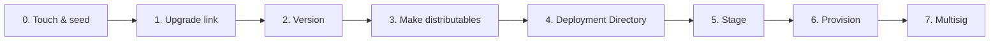

import { Steps, Step } from 'fumadocs-ui/components/steps'

This is **part 3 of 4** in the [getting started path](/getting-started). You take the production-shaped app from [part 2](/getting-started/build-a-peer-to-peer-chat/reshape-into-a-production-app) and walk it through the first half of Pear's release pipeline:
1. [Minting a `pear://` link](#touch-set-the-upgrade-link-and-seed)
2. [Building per-OS distributables](#make-distributables)
3. [Staging and provisioning the first version onto those links](#stage-and-provision-the-first-version)

<Callout type="info">
[Deploy over-the-air updates](/getting-started/build-a-peer-to-peer-chat/update) (part 4 of 4) continues from here and demonstrates the live OTA cycle on the provision link, plus a tour of multisig.
</Callout>


The full pipeline looks like this:



This part stops after step 6—the first `pear stage` plus `pear provision`. You do not need cosigners, a Windows machine, or Apple signing credentials. The deeper guides cover the production-only material:

- [Deploy a Pear desktop app](/how-to/operate-an-app/manual-deployment/deployment)—every command, every release line.
- [Build desktop distributables](/how-to/operate-an-app/build-and-package/build-desktop-distributables)—code-signing, notarization, MSIX publisher details.
- [Release pipeline](/explanation/deployment-releasing-apps-p2p)—the conceptual picture.

<include>../../_snippets/_hello-pear-electron-callout.mdx</include>

## Before you start

You need:
1. The working production-shaped app from [part 2](/getting-started/build-a-peer-to-peer-chat/reshape-into-a-production-app).
2. [`pear`](/reference/pear/cli):
    - Install it with `npm i -g pear` or run via `npx pear`.
    - Every `pear` command in this part also works as `npx pear ...`. This is useful if you want to run the commands from a different directory than the one you installed `pear` in.
3. `pear build`—assembles per-OS makes into a deployment directory. It ships with the `pear` CLI above, so there is nothing extra to install: run it as `pear build` (or `npx pear build`).

<Steps>

<Step>

### Touch, set the upgrade link, and seed

[`pear touch`](/reference/pear/cli) mints a **new `pear://` link you own**—one backed by a fresh [Hypercore](/reference/building-blocks/hypercore) whose write key is stored locally on this machine. This becomes your **stage link**: the append-only core you sync builds into before each provision. (The link you set in part 2 was a public placeholder so the app would boot; you replace it now with your own.)

```bash
pear touch
# pear://<stage-link>
```

<Callout type="warning">
Stage and provision only work against links you **own**—ones you minted on this machine with `pear touch`. If you stage to someone else's link (for example the public placeholder from part 2), `pear stage` prints the header and then fails with `✖ Destination must be writable`. Always use the link `pear touch` just printed.
</Callout>

Point `package.json#upgrade` at the stage link for now—you will switch it to the **provision link** after the first provision:

```bash
npm pkg set upgrade=pear://<stage-link>
```

[`pear seed`](/reference/pear/cli#pear-seed) keeps that core online so other peers can fetch updates from you.
Your output will be different.

```bash
pear seed pear://<stage-link>

Seeding:        pear://<stage-link>
Drive Key:      <stage-key>
Drive Length:   0
Discovery Key:  qx138e5wnc3bmnjcbks68xpp17m6bj6h5165hud9ps4tr8zad4fo
Content Key:    pending
Firewalled:     true
NAT Type:       consistent
Whoami:         t8kgj1p3a4e9x8p1etsgks1rc4j58yu9xjh11bbjkgys7zkfmabo
Network:        [ Peers 0 ]  [ ⬆ 0B - 0B/s ]  [ ⬇ 0B - 0B/s ]
────────────────────────────────────────────────────────
^_^ announced
```

Leave `pear seed` running in its own terminal for the rest of the tutorial—without an active seeder, peers cannot download your build. 
In production, run `pear seed` on at least one always-online machine (a small VPS works) so updates keep flowing while developer laptops sleep.

</Step>

<Step>

### Bump the version

[`pear-runtime`](/reference/pear/runtime) only swaps the application drive when the new build advertises a higher version. If you forget this step, peers see your stage and do nothing:

```bash
npm version [<newversion> | major | minor | patch | premajor | preminor | prepatch | prerelease]
```

This rewrites `package.json` (`1.0.0` → `1.0.1`) and creates a git tag. From now on, every release iteration starts with `npm version patch` (or `major`, `minor`, `patch`, etc.).

</Step>

<Step>

### Make distributables

A "distributable" is the platform-native installer—`.app` on macOS, `.msix` on Windows, `.AppImage` on Linux. Pear uses [`electron-forge`](https://www.electronforge.io/) with a single [`forge.config.js`](https://github.com/holepunchto/hello-pear-electron/blob/main/forge.config.js) that configures makers for every platform, including Linux AppImage via [`pear-electron-forge-maker-appimage`](https://www.npmjs.com/package/pear-electron-forge-maker-appimage).

#### Install `electron-forge` and the makers you need

```bash
npm install --save-dev \
  @electron-forge/cli@^7.11.1 \
  @electron-forge/maker-dmg@^7.11.1 \
  @electron-forge/maker-msix@^7.11.1 \
  pear-electron-forge-maker-appimage@^2.0.0 \
  pear-electron-forge-maker-flatpak@^0.0.6 \
  pear-electron-forge-maker-snap@^1.0.0 \
  electron-forge-plugin-universal-prebuilds@^1.0.0 \
  electron-forge-plugin-prune-prebuilds@^1.0.0
```

Two electron-forge plugins matter:

- [`electron-forge-plugin-universal-prebuilds`](https://www.npmjs.com/package/electron-forge-plugin-universal-prebuilds)—bundles native prebuilds for every supported architecture.
- [`electron-forge-plugin-prune-prebuilds`](https://www.npmjs.com/package/electron-forge-plugin-prune-prebuilds)—trims the prebuilds you do not need for the current platform, keeping installers small.

#### Add scripts to `package.json`

Use one make entry point on every OS—Forge runs only the makers whose `platforms` match the host:

```json
"scripts": {
  "start": "electron-forge start -- --no-updates",
  "package": "electron-forge package",
  "make": "electron-forge make"
}
```

#### Add `forge.config.js`

In your project's root, copy or diff against the canonical [`hello-pear-electron` `forge.config.js`](https://github.com/holepunchto/hello-pear-electron/blob/main/forge.config.js). That file configures:

- **Packager**: `build/icon`, URL schemes from `package.json` `name`, optional macOS signing when `MAC_CODESIGN_IDENTITY` is set (notarization via `KEYCHAIN_PROFILE`).
- **Makers**: `@electron-forge/maker-dmg` (darwin), `@electron-forge/maker-msix` (win32), and Pear makers for Linux AppImage, Flatpak, and Snap.
- **Hooks**: `preMake` rewrites `build/AppxManifest.xml` version for MSIX; `postMake` moves Windows `.msix` artifacts into `out/<AppName>-win32-<arch>/`.
- **Plugins**: universal-prebuilds and prune-prebuilds.

```js file=<rootDir>/examples/getting-started/pear-chat/forge.config.js title="forge.config.js"
```

#### Add the template `build/` assets to your project

Createa a `build/` folder in your project's root and copy the template's `build/` assets (`AppxManifest.xml`, `entitlements.mac.plist`, icon set under `build/icon/`, and Linux Flatpak/Snap metadata). 

#### Run the maker on your OS

`npm run make` builds distributables for the **current host OS** only. Run it on macOS, Linux, and Windows (or on CI runners per OS) when you need a multi-arch deployment directory.

<Callout type="warning">
Brand icons before you make:
- `build/icon.icns` (macOS), 
- `build/icon.ico` (Windows), 
- `build/icon.png` plus sized PNGs under `build/icon/` (Linux makers). 

You can copy the set from [`hello-pear-electron`'s `build/` tree](https://github.com/holepunchto/hello-pear-electron/tree/main/build).
</Callout>

```bash
npm run make   # .app + .dmg on macOS; .AppImage (+ Flatpak/Snap) on Linux; .msix on Windows
```

The output lands in `out/PearChat-darwin-arm64/PearChat.app` (or the matching path for your platform).

<Callout type="info">
If the make fails with a `NODE_MODULE_VERSION` mismatch (for example after `nvm use` or upgrading Node between `npm install` and `npm run make`), run `npm rebuild` and try again. See [Node ABI mismatch during make](/how-to/operate-an-app/manual-deployment/troubleshoot-desktop-releases#node-abi-mismatch-during-make).
</Callout>

<Callout type="info">
Code-signing, notarization, and MSIX publisher requirements are full topics on their own—production builds need them, but you can skip them for this dry run.

The full coverage is in [Build desktop distributables](/how-to/operate-an-app/build-and-package/build-desktop-distributables). See [Desktop release npm scripts](/reference/ci-and-release/desktop-release-npm-scripts) for common `npm` entry points in sample repos.
</Callout>

</Step>

<Step>

### Build the deployment directory

You should run `pear build` from **outside** the project folder (`pear build` and the project folder must not be parent/child—see [stage size increases](https://github.com/holepunchto/hello-pear-electron#stage-size-increases)). Each `--<platform-arch>-app` flag points at one make's output. For example:

```bash
cd ..
pear build \
  --package=./pear-chat/package.json \
  --darwin-arm64-app ./pear-chat/out/PearChat-darwin-arm64/PearChat.app \
  --target pear-chat-1.0.1
```

The result is `./pear-chat-1.0.1/by-arch/darwin-arm64/app/...` ready for the next step.

If you have makes from more than one platform—for example a Linux AppImage built on a colleague's machine—pass each one:

```bash
pear build \
  --package=./pear-chat/package.json \
  --darwin-arm64-app ./pear-chat/out/PearChat-darwin-arm64/PearChat.app \
  --linux-x64-app ./pear-chat/out/PearChat-linux-x64/PearChat.AppImage \
  --win32-x64-app ./pear-chat/out/PearChat-win32-x64/PearChat.msix \
  --target pear-chat-1.0.1
```

`pear build` assembles a Pear deployment directory from the per-platform makes. The layout must be as follows:

```text
PearChat-1.0.1/
├─ package.json
└─ by-arch/
   └─ <platform-arch>/
      └─ app/
```

</Step>

<Step>


### Stage and provision the first version

Run these from the **parent directory** of your app (same place you ran `pear build`) unless noted. [`pear stage`](/reference/pear/cli) syncs the deployment directory into the [Hypercore](/reference/building-blocks/hypercore) behind your **stage link**.

#### 1. Dry-run the stage

Always run `--dry-run` first and read the file-by-file diff:

```bash
pear stage --dry-run pear://<stage-link> ./pear-chat-1.0.1
```

Your keys and byte counts will differ; the shape looks like this:

```text
🍐 Staging pear-chat

[  pear://<stage-link>  ]
pear://0.0.<stage-key>

Current: 1

NOTE: This is a dry run, no changes will be persisted.

+ /package.json (+2.1kB)
+ /by-arch/darwin-arm64/app/PearChat.app/Contents/Info.plist (+1.4kB)
+ /by-arch/darwin-arm64/app/PearChat.app/Contents/MacOS/PearChat (+55kB)
+ /by-arch/darwin-arm64/app/PearChat.app/Contents/Frameworks/Electron Framework.framework/Versions/A/Electron Framework (+165MB)
+ /by-arch/darwin-arm64/app/PearChat.app/Contents/Resources/app/electron/main.js (+12.4kB)
+ /by-arch/darwin-arm64/app/PearChat.app/Contents/Resources/app/workers/chat-room.js (+8.7kB)
+ /by-arch/darwin-arm64/app/PearChat.app/Contents/Resources/app/renderer/index.html (+3.2kB)
  ... more files under /by-arch/ ...
✔ Skipping (dry-run)

Staging dry run complete!
```

How to read it:

- **`+` lines**—files that would be written or updated, as `/`-prefixed drive paths with byte counts in parentheses. Scan for surprises before you run without `--dry-run`.
- **Versioned link in the header**—the line under the bracketed stage link shows the drive at its **current** length. On a first stage nothing is staged yet, so it reads `pear://0.0.<stage-key>`. The versioned link you need for `pear provision` is printed by the real stage in the next step, after the sync actually happens.

Look for:

- Only two entries at the drive root—`/package.json` and `/by-arch/...`. That is everything `pear build` writes into the deployment directory. Your app source (`electron/`, `workers/`, `renderer/`, `node_modules/`) ships **inside** the packaged app—for example under `/by-arch/darwin-arm64/app/PearChat.app/Contents/Resources/app/`—never as loose files at the root.
- No surprise additions—stray `.DS_Store`, editor swap files, secrets, the deployment directory itself.
- Sensible byte counts—the Electron framework binary dominates (a hundred-plus MB per platform-arch); if an unrelated file is suddenly 100 MB, something is wrong.

#### 2. Stage for real

If the diff looks right, drop the `--dry-run` flag and run it for real:

```bash
pear stage pear://<stage-link> ./pear-chat-1.0.1
```

The live output repeats the dry-run diff, then ends with the post-stage **versioned link** after the `^Latest:` line:

```text
🍐 Staging pear-chat

[  pear://<stage-link>  ]
pear://0.0.<stage-key>

Current: 1

+ /package.json (+2.1kB)
  ... same diff as the dry run ...

Staging complete!

^Latest: 1426

pear://0.1426.<stage-key>
[  pear://<stage-link>  ]
```

Copy the versioned link printed under `^Latest:`—`pear://0.<length>.<stage-key>`, where `<length>` is the Hypercore length **after** this stage (a few hundred to a few thousand on a first stage). Don't copy the versioned link at the top of the output—that one shows the drive **before** staging (`pear://0.0.<stage-key>` on a first stage).

Use the full versioned string as the first argument to `pear provision` below (not the unversioned `<stage-link>` you passed to `pear stage`).

#### 3. Mint the provision link

Peers should not poll the stage link directly—it keeps the full append-only history. [`pear provision`](/reference/pear/cli#pear-provision) block-syncs the staged snapshot onto a lean **provision link** that packaged apps poll instead. That target is a **second** link—mint it now with another `pear touch` (the first touch in step 1 was only for staging). Cwd does not matter; `pear touch` does not read your project:

```bash
pear touch
# pear://<provision-link>   ← different key from <stage-link>
```

`pear touch` prints the link on its own line—copy the whole `pear://…` string.

#### 4. Provision onto the provision link

Dry-run first, then run for real. Fill the three arguments like this:

| Argument | What to paste |
| --- | --- |
| `<source-verlink>` | The versioned link from `pear stage`: `pear://0.<length>.<stage-key>` |
| `<target-link>` | The unversioned provision link from `pear touch`: `pear://<provision-link>` |
| `<production-verlink>` | On first ship: `pear://0.0.<provision-key>` where `<provision-key>` is everything after `pear://` in `<provision-link>` |

Paste all three links on **one line**—backslash continuations are easy to break if a line has trailing spaces:

```bash
pear provision --dry-run pear://0.<length>.<stage-key> pear://<provision-link> pear://0.0.<provision-key>

pear provision pear://0.<length>.<stage-key> pear://<provision-link> pear://0.0.<provision-key>
```

Example with concrete keys (yours will differ):

```bash
pear provision --dry-run pear://0.1426.9mdt6h676phg7nuwp1urs7457nsz3juyeuqcbw4h7r1tqz8e84ay pear://o11z79iogfzx1ckthrhwoeyk7pyxxhy7par4edq5sy1dmwieutso pear://0.0.o11z79iogfzx1ckthrhwoeyk7pyxxhy7par4edq5sy1dmwieutso
```

Provision syncs the target, prints the same file diff you just staged plus a summary, and—on the real run—ends with the provisioned links. The dry run stops after `Dry Run Complete`; the real run pauses for a 10-second cooldown before writing:

```text
Syncing existing metadata, please wait...

Completed metadata sync
Checking diff

+ /package.json (+2.1kB)
  ... same diff as the stage ...
Diffing complete
Total changes: 1425
Package version: 1.0.1

Core:
  Key: o11z79iogfzx1ckthrhwoeyk7pyxxhy7par4edq5sy1dmwieutso
  ...

NOT A DRY RUN! Waiting 10s for certainty. Use ctrl+c to bail
Staging to target...
  ... same diff again ...

Provisioned:
  Verlink: pear://0.1426.o11z79iogfzx1ckthrhwoeyk7pyxxhy7par4edq5sy1dmwieutso

  Hashlink: pear://0.1426.o11z79iogfzx1ckthrhwoeyk7pyxxhy7par4edq5sy1dmwieutso.<hash>

Seed with:

   pear seed pear://o11z79iogfzx1ckthrhwoeyk7pyxxhy7par4edq5sy1dmwieutso
```

The diff should mirror what you just staged. The `Seed with` line at the end names the unversioned provision link peers will poll—set `upgrade` to that link in the next step, not the versioned stage link.

#### 5. Switch `upgrade` to the provision link

From the **app root** (`pear-chat/`), point `package.json#upgrade` at the provision link and seed it—this is what shipped binaries poll:

```bash
npm pkg set upgrade=pear://<provision-link>
pear seed pear://<provision-link>
```

#### 6. Rebuild once

Rebuild so the packaged app embeds the new `upgrade` field (the provision link already holds v1.0.1—no restage needed):

```bash
npm run make
cd ..
pear build \
  --package=./pear-chat/package.json \
  --darwin-arm64-app ./pear-chat/out/PearChat-darwin-arm64/PearChat.app \
  --target pear-chat-1.0.1
```

Your first version is now published on the provision link. Peers running a build with that `upgrade` field will see it on their next poll.

<Callout type="info">
Keep both links: **stage** for `pear stage` on every iteration; **provision** for what apps install and poll. Part 4 repeats `pear stage` → `pear provision` for v1.0.2. The full operator reference is [Deploy your application—provision](/how-to/operate-an-app/manual-deployment/deployment#6-provision).
</Callout>

</Step>

</Steps>

## What you've learned

You now have a stage link and a provision link with your first build published:

| Stage | What it is | Reversible? |
| --- | --- | --- |
| `pear touch` | Mints a new `pear://` link | Yes—just abandon it |
| Make + `pear build` | Per-OS distributable folded into a Deployment Directory | Yes—rebuild |
| `pear stage` | Append-only sync into the stage [Hypercore](/reference/building-blocks/hypercore) | History is permanent; updates are not |
| `pear provision` | Block-sync onto the provision link peers poll | Yes—reprovision from a different stage length |

Every release iteration after this is the same pattern: `npm version patch`, `npm run make` (on each OS you ship), `pear build`, `pear stage --dry-run`, `pear stage`, `pear provision`. Part 4 puts that loop on a running app and shows the OTA cycle from both sides.

## Where to go next

- **Continue the path:** [Deploy over-the-air updates](/getting-started/build-a-peer-to-peer-chat/update) (part 4 of 4)—run the installed build, ship a second version, watch OTA fire end-to-end, and preview multisig.
- **Automate it:** [Publish with GitHub Actions](/how-to/operate-an-app/github-actions/publish-with-github-actions)—skip the manual staging and let CI stage a stable `pear://` link on every push.
- [Deploy a Pear desktop app](/how-to/operate-an-app/manual-deployment/deployment)—the canonical how-to with every command, every flag, and every recovery procedure.
- [Build desktop distributables](/how-to/operate-an-app/build-and-package/build-desktop-distributables)—code-signing, notarization, MSIX publisher details.
- [Publish a changelog for your app](/how-to/operate-an-app/publish-a-changelog)—ship a `CHANGELOG.md` so users read your release notes with `pear changelog`.
- [Troubleshoot desktop releases](/how-to/operate-an-app/manual-deployment/troubleshoot-desktop-releases)—"the app did not update," lost write-access, stage size blowups.
- [Release pipeline](/explanation/deployment-releasing-apps-p2p)—the conceptual picture, deployment layers, and release lines.
- [Release pipeline glossary](/explanation/deployment-releasing-apps-p2p#glossary)—terminology.
- [`hello-pear-electron`](https://github.com/holepunchto/hello-pear-electron)—the upstream template every snippet in this getting started path is based on.
