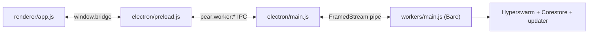

This is an alternative to the [four-part getting started path](/getting-started). Instead of building a chat from five files and reshaping it into the production template, you start from the finished template and learn your way around it.

[`holepunchto/hello-pear-electron`](https://github.com/holepunchto/hello-pear-electron) is Holepunch's official Electron template—the same shape [Keet](https://keet.io) and [PearPass](https://pass.pears.com) ship. This is a clone-first tour: where to put your UI, where to put your peer-to-peer logic, and how the two halves talk. For the conceptual "why" behind the split, read [Pear desktop application architecture](/explanation/pear-desktop-architecture).

<include>../../_snippets/_p2p-intro-callout.mdx</include>

Take this path when you want a production-shaped Electron app from the first commit. If you would rather learn the moving parts by building up from scratch, follow the [four-part path](/getting-started) instead.

<include>../../_snippets/_install-pear-cli-callout.mdx</include>

## Clone and run

### 1. Clone the repository

Clone the repository and install dependencies with the following commands:

```bash
git clone https://github.com/holepunchto/hello-pear-electron
cd hello-pear-electron
npm install
```

### 2. Create a valid `upgrade` link

Before the app will boot, set a valid `upgrade` link. To do this, run the following command:

```bash
pear touch
```

This will output a link, for example: `pear://qxenz5wmspmryjc13m9yzsqj1conqotn8fb4ocbufwtz9mtbqq5o`.

### 3. Set the `upgrade` link in `package.json`

Set the `upgrade` link in `package.json` to the link you just created:

```json
"upgrade": "pear://qxenz5wmspmryjc13m9yzsqj1conqotn8fb4ocbufwtz9mtbqq5o"
```

### 4. Run the app

`npm start` runs `electron-forge start -- --no-updates`: the app launches in development mode with over-the-air updates disabled, so a live release never replaces your working tree while you hack. 

```bash
npm start
```

## Map the template

| Path | What it is | Do you edit it? |
| --- | --- | --- |
| [`renderer/`](https://github.com/holepunchto/hello-pear-electron/tree/main/renderer) | The frontend—`index.html` plus `app.js`, plain DOM with no bundler. | Yes—this is your UI. |
| [`workers/main.js`](https://github.com/holepunchto/hello-pear-electron/blob/main/workers/main.js) | The app logic—a [Bare](/reference/modules/bare-modules) worker that owns the swarm, storage, and updater. | Yes—this is your backend. |
| [`electron/main.js`](https://github.com/holepunchto/hello-pear-electron/blob/main/electron/main.js) | The Electron main process. Spawns the worker and proxies messages; you rarely change it. | Occasionally. |
| [`electron/preload.js`](https://github.com/holepunchto/hello-pear-electron/blob/main/electron/preload.js) | Exposes the safe `window.bridge` API to the renderer. | Only to add typed methods. |
| [`package.json`](https://github.com/holepunchto/hello-pear-electron/blob/main/package.json) | App metadata, scripts, and the `upgrade` link. | Yes—branding and release link. |
| [`forge.config.js`](https://github.com/holepunchto/hello-pear-electron/blob/main/forge.config.js) | Electron Forge packagers, makers, and signing hooks. | For packaging and signing. |
| [`build/`](https://github.com/holepunchto/hello-pear-electron/tree/main/build) | Icons and per-OS manifests (`AppxManifest.xml`, entitlements, Flatpak/Snap metadata). | Yes—brand assets. |
| [`pear.json`](https://github.com/holepunchto/hello-pear-electron/blob/main/pear.json) | Multisig config placeholder for production releases. | At production time. |

The three pieces you care about day to day are:
- `renderer/` (view)
- `workers/main.js` (logic)
- the bridge that connects them

## How the three processes connect



The renderer never touches `ipcRenderer` directly—it only calls `window.bridge`. The main process is a thin proxy: it relays bridge calls to a [FramedStream](https://www.npmjs.com/package/framed-stream) byte stream connected to the Bare worker, and fans the worker's output back out to the renderer on per-worker channels named after the worker specifier (`/workers/main.js`).

The boilerplate ships a "hello" round-trip you can trace on boot:

1. The renderer calls `bridge.startWorker('/workers/main.js')` (`renderer/app.js`).
2. The main process handles `pear:startWorker` and launches the worker with `PearRuntime.run()` ([see below](#where-the-app-logic-goes) for more details).
3. The worker runs `pipe.write('Hello from worker')` ([see below](#where-the-app-logic-goes) for more details).
4. The main process forwards it on `pear:worker:ipc:/workers/main.js`.
5. The renderer's `bridge.onWorkerIPC` callback receives it and replies `bridge.writeWorkerIPC('/workers/main.js', 'Hello from renderer')` ([see below](#how-to-connect-them) for more details).

## Where the frontend goes

Your UI lives in `renderer/`. `index.html` is a static shell loaded by the main process; `renderer/app.js` is loaded as an ES module and drives the DOM:

```js file=<rootDir>/examples/getting-started/hello-pear-electron/renderer/app.js#L1-L4 title="renderer/app.js"
```

There is no framework or build step—bring your own (React, Vue, plain DOM) by editing these files. The only rule is: the renderer talks to the rest of the app **only** through `window.bridge`. It has no Node or Bare access of its own, which is what keeps the renderer sandboxed.

If you prefer to develop the UI against a dev server (hot reload, a framework toolchain), set `PEAR_DEV_SERVER_URL` and the main process loads that URL instead of `renderer/index.html`.

The full production bridge—including how `window.bridge` is assembled—is walked through in [Reshape your app for production](/getting-started/build-a-peer-to-peer-chat/reshape-into-a-production-app).

## Where the app logic goes

Everything peer-to-peer lives in `workers/main.js`, which runs in Bare (not Node). The host passes the runtime configuration as positional arguments; the worker reads them (with an `argv` helper for cross-platform compatibility) and constructs the [`pear-runtime`](/reference/pear/runtime) instance:

```js file=<rootDir>/examples/getting-started/hello-pear-electron/workers/main.js#L15-L27 title="workers/main.js"
```

This is where you add your [Corestore](/reference/helpers/corestore) cores, join [Hyperswarm](/reference/building-blocks/hyperswarm) topics, and run your protocols. Use `pear.storage` as the storage root so your data lands in the same per-app directory Pear manages—see [Storage and distribution](/explanation/storage-and-distribution). For why the logic belongs here rather than in the renderer, see [Workers](/explanation/workers).

<Callout type="info">
Upstream now ships this worker as the [`hello-pear-worker`](https://github.com/holepunchto/hello-pear-worker) package—the template's `workers/main.js` is just `require('hello-pear-worker')`. The code above is that worker inlined so you can see what it does; write your own peer-to-peer logic in `workers/main.js` the same way.
</Callout>

## How to connect them

The bridge is the contract between the two halves. `electron/preload.js` exposes these methods on `window.bridge`:

| `window.bridge` method | Purpose |
| --- | --- |
| [`pkg()`](https://github.com/holepunchto/hello-pear-electron/blob/main/electron/preload.js#L9-L11) | Read `package.json` synchronously (used for the version label). |
| [`startWorker(specifier)`](https://github.com/holepunchto/hello-pear-electron/blob/main/electron/preload.js#L14) | Spawn a worker by path, for example `/workers/main.js`. |
| [`writeWorkerIPC(specifier, data)`](https://github.com/holepunchto/hello-pear-electron/blob/main/electron/preload.js#L35-L37) | Send a message to that worker. |
| [`onWorkerIPC(specifier, listener)`](https://github.com/holepunchto/hello-pear-electron/blob/main/electron/preload.js#L25-L29) | Receive messages from that worker. Returns an unsubscribe function. |
| [`onWorkerStdout`](https://github.com/holepunchto/hello-pear-electron/blob/main/electron/preload.js#L15-L19) / [`onWorkerStderr`](https://github.com/holepunchto/hello-pear-electron/blob/main/electron/preload.js#L20-L24) / [`onWorkerExit`](https://github.com/holepunchto/hello-pear-electron/blob/main/electron/preload.js#L30-L34) | Observe worker output and lifecycle. |
| [`applyUpdate()`](https://github.com/holepunchto/hello-pear-electron/blob/main/electron/preload.js#L12) / [`appAfterUpdate()`](https://github.com/holepunchto/hello-pear-electron/blob/main/electron/preload.js#L13) | Apply a downloaded OTA update and relaunch. |

Messages over the worker pipe are raw bytes—the boilerplate sends plain UTF-8 strings (`'Hello from worker'`, `'updating'`, `'pear:applyUpdate'`). You have two ways to add functionality:

1. Stay on the generic channel. Send and receive your own messages with `writeWorkerIPC` / `onWorkerIPC`. Define a small message protocol (a `type` field is enough). This is the lightest option and is shown below.
2. Add a typed bridge method. For something first-class (not tied to a worker), add a method to `electron/preload.js` and a matching `ipcMain.handle(...)` in `electron/main.js`, the way `applyUpdate` is wired.

## Example: add a "ping" feature

You can add a button that asks the worker for the current time and shows the reply. It exercises the full round-trip: renderer to worker and back. You can switch the pipe from bare strings to small JSON messages so several message types can coexist. This example uses the generic channel.

### 1. Add a button to the renderer UI

In `renderer/index.html`, add a button and an output line inside `.container`:

```diff
     <div class="container">
       <h1 id="v">v</h1>
       <button id="update-btn">Apply update</button>
+      <button id="ping-btn">Ping worker</button>
+      <p id="pong"></p>
     </div>
```

### 2. Send and receive in the renderer

In `renderer/app.js`, wire the button to `writeWorkerIPC` and handle the reply in the existing `onWorkerIPC` callback. The boilerplate currently treats every worker message as an updater event string; route messages through `JSON.parse` and fall back to the old strings so the updater keeps working:

```diff
 const offWorkerIpc = bridge.onWorkerIPC(workers.main, (data) => {
   const message = decoder.decode(data)
   console.log('worker ipc', '[', workers.main, ']:', message)
-  onWorkerUpdaterEvent(message)
+
+  let parsed
+  try {
+    parsed = JSON.parse(message)
+  } catch {
+    onWorkerUpdaterEvent(message) // 'updating' / 'updated'
+    parsed = null
+  }
+
+  if (parsed?.type === 'pong') {
+    document.getElementById('pong').innerText = 'Worker time: ' + parsed.time
+  }

   if (!sentHello) {
     sentHello = true
     bridge.writeWorkerIPC(workers.main, 'Hello from renderer')
   }
 })
+
+document.getElementById('ping-btn').onclick = () => {
+  bridge.writeWorkerIPC(workers.main, JSON.stringify({ type: 'ping' }))
+}
```

### 3. Handle it in the worker

In `workers/main.js`, parse incoming messages and reply to `ping`. Keep the existing `pear:applyUpdate` handling:

```diff
 pipe.on('data', async (data) => {
   const message = data.toString()
   if (message === 'pear:applyUpdate') {
     await pear.ready()
     await pear.updater.applyUpdate()
     pipe.write('pear:updateApplied')
-  } else console.log(message)
+    return
+  }
+
+  try {
+    const msg = JSON.parse(message)
+    if (msg.type === 'ping') {
+      pipe.write(JSON.stringify({ type: 'pong', time: new Date().toISOString() }))
+    }
+  } catch {
+    console.log(message)
+  }
 })
```

Run `npm start`, click **Ping worker**, and the worker's timestamp appears in the renderer. You now have a request/response path you can grow into real features—swap the `pong` handler for a [Corestore](/reference/helpers/corestore) read, a [Hyperswarm](/reference/building-blocks/hyperswarm) lookup, or any protocol your app needs.

## Customize for your brand

Before you ship, [deploy your application](/how-to/operate-an-app/manual-deployment/deployment):

- `package.json`—set `name`, `productName`, `description`, `author`, `license`, and the `upgrade` `pear://` link (see [Set the upgrade link](/how-to/operate-an-app/manual-deployment/deployment#1-set-the-upgrade-link)).
- `build/`—replace `icon.icns` / `icon.ico` / `icon.png` and the sized icons, and edit `build/AppxManifest.xml` (`DisplayName`, `Publisher`) for Windows.
- `pear.json`—fill the multisig public-key placeholders when you set up production signing.

Then build and release with [Build desktop distributables](/how-to/operate-an-app/build-and-package/build-desktop-distributables), or automate it with [Build and sign desktop apps in CI](/how-to/operate-an-app/github-actions/build-and-sign-in-ci).

## Where to go next

- [Pear desktop application architecture](/explanation/pear-desktop-architecture)—the conceptual model behind the renderer/main/worker split.
- [Workers](/explanation/workers)—why peer-to-peer logic lives in a Bare worker and where the boundary should sit.
- [Reshape into a production app](/getting-started/build-a-peer-to-peer-chat/reshape-into-a-production-app)—the hello-pear-electron-shaped scaffold with an [Autobase](/reference/building-blocks/autobase)-backed room, blind-pairing invites, and a vanilla HTML renderer.
- [Start from a template](/getting-started/from-a-template)—both boilerplates, side by side.
- [Start from the hello-pear-bare template](/getting-started/from-a-template/start-from-hello-pear-bare)—the terminal counterpart: a standalone Bare CLI with OTA updates and no GUI.
- [Publish with GitHub Actions](/how-to/operate-an-app/github-actions/publish-with-github-actions)—stage a stable `pear://` link on every push with the `pear-ci` action.
- [Build and sign desktop apps in CI](/how-to/operate-an-app/github-actions/build-and-sign-in-ci)—build, sign, and notarize macOS, Windows, and Linux distributables on hosted runners.
- [Seeding with `pear seed`](/explanation/availability-and-blind-peering#seeding-with-pear-seed)—keep your `pear://` link online so peers can fetch releases.
- [Deploy your application](/how-to/operate-an-app/manual-deployment/deployment)—stage, seed, and release your build.
