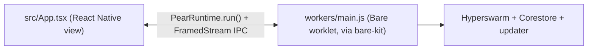

This is the mobile counterpart to [Start from the hello-pear-electron template](/getting-started/from-a-template/start-from-hello-pear-electron). Instead of an Electron window, you start from a finished Expo/React Native boilerplate and learn where your view lives, where your peer-to-peer logic lives, and how [`pear-mobile`](/reference/pear/mobile) connects them.

[`holepunchto/hello-pear-react-native`](https://github.com/holepunchto/hello-pear-react-native) is Holepunch's official React Native template—end-to-end boilerplate for embedding [`pear-mobile`](/reference/pear/mobile) into an Expo app and deploying peer-to-peer application updates. It's a clone-first tour, the same shape as the [hello-pear-electron](/getting-started/from-a-template/start-from-hello-pear-electron) tour: where to put your UI, where to put your peer-to-peer logic, and how the two talk.

This is a different page from [Embed Bare in a React Native app](/how-to/run-on-native/embed-bare-in-react-native). That how-to shows the raw [`bare-kit`](/reference/bare/bare-kit) primitive—a `Worklet` and an `IPC` channel, nothing else. This page is the production-shaped template built on top of it: over-the-air updates, application storage, and a staged deployment pipeline, the mobile equivalent of what `hello-pear-electron`'s page is to the desktop primitives.

<Callout type="warn">
Both `hello-pear-react-native` and the [`pear-mobile`](/reference/pear/mobile) module it embeds are MVP and experimental—expect the API to keep moving.
</Callout>

<include>../../_snippets/_install-pear-cli-callout.mdx</include>

<include>../../_snippets/_interactive-menu-callout.mdx</include>

## Clone and run

### 1. Clone the repository

Clone the repository and install dependencies with the following commands:

```bash
git clone https://github.com/holepunchto/hello-pear-react-native
cd hello-pear-react-native
npm install
```

### 2. Create a valid `upgrade` link

The committed `upgrade` field is the placeholder `pear://<YOUR_KEY_HERE>`. Create a real link with [`pear touch`](/reference/pear/cli#pear-touch-flags):

```bash
pear touch
```

This prints a link, for example: `pear://qxenz5wmspmryjc13m9yzsqj1conqotn8fb4ocbufwtz9mtbqq5o`. Set it in `package.json`:

```json
"upgrade": "pear://qxenz5wmspmryjc13m9yzsqj1conqotn8fb4ocbufwtz9mtbqq5o"
```

### 3. Bundle the worker

Unlike the desktop templates, mobile has one extra step before the app can run. Pack the Bare worker into a worklet bundle with [`bare-pack`](https://github.com/holepunchto/bare-pack):

```bash
npm run bundle:bare
```

This writes `src/worker.bundle.js`, imported directly by `src/App.tsx`. Rerun it after every change to `workers/main.js` or a package it imports—nothing rebuilds it automatically, and a stale bundle fails **silently**: the app still boots and looks normal, it's just running old worker code.

### 4. Run the app

```bash
npm run ios
# or
npm run android
```

<Callout type="info">
Both scripts run `scripts/check-upgrade.js` first, which parses `package.json`'s `upgrade` field with [`pear-link`](https://github.com/holepunchto/pear-link) and refuses to launch on an invalid link—so a leftover placeholder fails fast with a clear message instead of silently killing the worklet at startup. Requires Node.js ≥ 20.19.4, plus Xcode ≥ 26.2 for iOS (iOS ≥ 15.1) and Android ≥ API 29.
</Callout>

Development builds always load JavaScript from Metro, so the update path itself isn't exercised. Use the release variants for that:

```bash
npm run production:ios
npm run production:android
```

## Map the template

| Path | What it is | Do you edit it? |
| --- | --- | --- |
| [`src/App.tsx`](https://github.com/holepunchto/hello-pear-react-native/blob/main/src/App.tsx) | The frontend—starts the worklet, wires the update UI. | Yes—this is your UI. |
| [`workers/main.js`](https://github.com/holepunchto/hello-pear-react-native/blob/main/workers/main.js) | The app logic—a [Bare](/reference/modules/bare-modules) worker that owns the swarm, storage, and updater. | Yes—this is your backend. |
| [`package.json`](https://github.com/holepunchto/hello-pear-react-native/blob/main/package.json) | App metadata, scripts, and the `upgrade` link. | Yes—branding and release link. |
| [`pear.json`](https://github.com/holepunchto/hello-pear-react-native/blob/main/pear.json) | The `updates.minver` compatibility floor. Ships inside every OTA payload, so a `multisig` block added here travels with it. | At production time. |
| [`app.json`](https://github.com/holepunchto/hello-pear-react-native/blob/main/app.json) | Expo config—icons, bundle identifiers, and the `pear-runtime-react-native` config plugin registration. | Yes—brand assets and platform identifiers. |
| [`metro.config.js`](https://github.com/holepunchto/hello-pear-react-native/blob/main/metro.config.js) | Merges the React Native and Expo Metro defaults, used to produce OTA payloads. | Rarely. |
| [`scripts/check-upgrade.js`](https://github.com/holepunchto/hello-pear-react-native/blob/main/scripts/check-upgrade.js) | Validates `package.json#upgrade` before `npm run ios`/`android` hand off to Expo. | Rarely. |

The two pieces you care about day to day are `src/App.tsx` (view) and `workers/main.js` (logic).

## How the pieces connect



Desktop's `hello-pear-electron` splits into three processes—renderer, Electron main, and Bare worker—connected by a preload bridge and an IPC proxy. Mobile collapses that into two: the React Native view starts the worklet directly and talks to it over one IPC duplex. There's no separate main process to proxy through.

## Where the frontend goes

Your UI lives in `src/App.tsx`. On mount, it starts the worklet with [`PearRuntime.run`](/reference/pear/mobile#starting-the-worklet-react-native-side) and wraps its `IPC` in a [`FramedStream`](https://www.npmjs.com/package/framed-stream):

```js file=<rootDir>/examples/getting-started/hello-pear-react-native/src/App.tsx#L24-L30 title="src/App.tsx"
```

There is no framework requirement beyond Expo/React Native itself—the template ships plain `View`/`Text`/`Pressable`, but bring your own component library. The only rule is: your UI reaches the peer-to-peer core **only** through this one IPC pipe.

## Where the app logic goes

<include>../../_snippets/_hello-pear-worker-source-callout.mdx</include>

This is the *same* worker every `hello-pear-*` template uses—see [One core, many platforms](/explanation/bare-on-native) for why that portability is the point. On mobile, `hello-pear-worker`'s own `require('pear-runtime')` resolves to [`pear-mobile`](/reference/pear/mobile) instead of the desktop package; nothing in `workers/main.js` itself has to change. Remember to re-run [`npm run bundle:bare`](#3-bundle-the-worker) after editing it.

## How to connect them

There's no bridge or preload layer here—`src/App.tsx` talks to the worker directly over the `FramedStream`-framed pipe, in plain strings:

| Direction | Message | Meaning |
| --- | --- | --- |
| view → worker | `pear:applyUpdate` | Apply a downloaded update and report back. |
| worker → view | `Hello from worker` | Sent once when the worker comes up. The template's view ignores it; it's there as a liveness check you can hook. |
| worker → view | `updating` | An update started downloading. |
| worker → view | `updated` | The update is staged; ready to apply. |
| worker → view | `minver-required` | The available update needs a newer native build—see [the `minver` gate](/reference/pear/mobile#the-minver-gate). Mobile-only; desktop has no equivalent. |
| worker → view | `pear:updateApplied` | Reply once `applyUpdate()` has finished. |

## Mobile-only concerns

<Callout type="info">
**Worklet lifecycle.** The worklet must stop active I/O when the app is backgrounded or the OS force-terminates it. See [Handle app suspension](/how-to/run-on-native/handle-app-suspension) for the suspend/resume patterns.
</Callout>

<Callout type="info">
**OTA differs from desktop.** A mobile OTA payload is a JavaScript bundle per host, not a set of native distributables, and native/OTA releases share one SemVer sequence gated by `pear.json`'s `updates.minver`—see [Pear Mobile OTA](/reference/pear/mobile#the-minver-gate). The full staging, provisioning, and multisig ceremony is documented in the upstream [`hello-pear-react-native` README](https://github.com/holepunchto/hello-pear-react-native#deployments)—it reuses [Deploy your application](/how-to/operate-an-app/manual-deployment/deployment)'s model but with a different build step, so that page's distributables flow doesn't apply here verbatim.
</Callout>

## Customize for your brand

Before you ship:

- `package.json`—set `name`, `productName`, `version`, and the `upgrade` `pear://` link.
- `app.json`—replace the icons and splash assets, and set `ios.bundleIdentifier` and `android.package`.
- `pear.json`—set `updates.minver` whenever a release changes the native/OTA contract (see [the `minver` gate](/reference/pear/mobile#the-minver-gate)). The template ships this file with `updates.minver` only; add a `multisig` block at production time, and note that editing it derives a different production key while editing `minver` does not.

## Where to go next

- [Start from a template](/getting-started/from-a-template)—all three boilerplates, side by side.
- [Start from the hello-pear-electron template](/getting-started/from-a-template/start-from-hello-pear-electron)—the desktop counterpart.
- [Pear Mobile OTA](/reference/pear/mobile)—the full `pear-mobile` API this template embeds.
- [Embed Bare in a React Native app](/how-to/run-on-native/embed-bare-in-react-native)—the raw `bare-kit` primitive this template builds on.
- [One core, many platforms](/explanation/bare-on-native)—the pattern behind sharing `workers/main.js` across every template.
- [Handle app suspension](/how-to/run-on-native/handle-app-suspension)—keep the worklet in step with the OS lifecycle.
- [Type a native RPC bridge](/how-to/run-on-native/type-a-native-rpc-bridge)—replace raw IPC strings with a typed, schema-generated seam.
- [Bundle a Bare app](/how-to/run-on-native/bundle-a-bare-app)—more on the `bare-pack` step behind `npm run bundle:bare`.

For a real app extending this template, see [`holepunchto/snake-mobile`](https://github.com/holepunchto/snake-mobile)—a production-shaped P2P multiplayer game built on `hello-pear-react-native`. Its worker keeps its own custom Hyperswarm protocol in `workers/main.js` instead of `hello-pear-worker`, layered on the same updater scaffolding—worth reading if you're about to add real peer-to-peer logic of your own.
