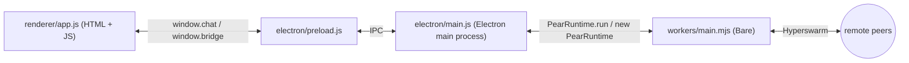

import { Cards, Card } from 'fumadocs-ui/components/card'

Build a peer-to-peer desktop chat app with [Pear](https://docs.pears.com), then evolve it into the same shape as the official [`hello-pear-electron`](https://github.com/holepunchto/hello-pear-electron) template, and finally release it over the air.

Each part is a single sitting. Read them in order — every part starts from the previous part's code.

<Cards>
  <Card
    href="/getting-started/chat"
    title="Build a peer-to-peer chat"
    description="Five files, ~15 minutes. Static PearRuntime.run, Hyperswarm, no persistence."
  />
  <Card
    href="/getting-started/production-shape"
    title="Add persistence with Corestore"
    description="Switch to new PearRuntime({ ... }), add OTA wiring, persist the chat transcript with Corestore, run multiple local peers with --storage."
  />
  <Card
    href="/getting-started/ship"
    title="Ship your app"
    description="pear touch + upgrade link, electron-forge make, pear-build, and pear stage to publish your first version."
  />
  <Card
    href="/getting-started/update"
    title="Deploy over-the-air updates"
    description="Run the installed app, ship a second version, watch the OTA cycle, and preview pear provision and multisig."
  />
</Cards>

## What you'll build

A small Electron window with a message list, an input, and a peer counter. Two instances on the same machine — or on different machines anywhere on the public internet — discover each other through the [DHT](/reference/building-blocks/hyperdht) and stream messages directly.

Each part adds one layer to that picture:

- Part 1 wires the renderer ↔ main ↔ worker ↔ peers path with the smallest amount of code.
- Part 2 replaces the static `PearRuntime.run` with the real `new PearRuntime({ ... })` instance, plumbs OTA events through the bridge, and gives the worker a [Corestore](/reference/helpers/corestore) so messages survive a restart.
- Part 3 turns the project into a release pipeline: signed distributables, a `pear://` upgrade link, and the first published version on a Hypercore.
- Part 4 puts that release pipeline in motion: run the installed app, ship a second version, watch OTA fire end-to-end, and preview the production `stage → provision → multisig` flow from the [release pipeline](/explanation/release-pipeline).

## Before you start

- [Node.js](https://nodejs.org/) v22.17 or newer and npm v10.9 or newer
- A POSIX-style terminal (macOS, Linux, or Windows with WSL)
- An IDE or text editor
- The [`pear`](/reference/cli) CLI (`npx pear`) — only required for parts 3 and 4

Each part lists any extra npm packages it adds.

## Where to go next

- [Pear desktop application architecture](/explanation/pear-desktop-architecture) — why Bare workers, the preload bridge, and the OTA updater look the way they do.
- [Storage and distribution](/explanation/storage-and-distribution) — where `pear.storage` lives in development versus production.
- [Release pipeline](/explanation/release-pipeline) — the `stage → provision → multisig` flow parts 3 and 4 walk through.
- [Release pipeline glossary](/reference/release-pipeline-glossary) — terms used across the desktop release docs.
- The upstream template: [`holepunchto/hello-pear-electron`](https://github.com/holepunchto/hello-pear-electron).
