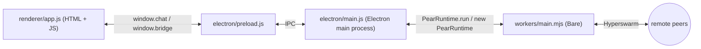

import { Cards, Card } from 'fumadocs-ui/components/card'
import { Tabs, Tab } from 'fumadocs-ui/components/tabs'

Build a peer-to-peer desktop chat app with [Pear](https://docs.pears.com), then evolve it into the same shape as the official [`hello-pear-electron`](https://github.com/holepunchto/hello-pear-electron) template, and finally release it over the air.

There are two ways in. Start from the finished template and learn your way around it, or build the same app up from scratch across a four-part path.

<include>../_snippets/_p2p-intro-callout.mdx</include>

## Install Pear

Get the [`pear`](/reference/pear/cli) CLI from **[install.pears.com](https://install.pears.com)**:

<Tabs items={['curl (macOS / Linux)', 'irm (Windows)', 'npx', 'docker']}>
<Tab value="curl (macOS / Linux)">
```sh
curl https://install.pears.com/pear.sh | sh
```
</Tab>
<Tab value="irm (Windows)">
```powershell
irm https://install.pears.com/pear.ps1 | iex
```
</Tab>
<Tab value="npx">
```sh
npx pear
```
</Tab>
<Tab value="docker">
```sh
docker run -it --rm tetherto/pear
```
</Tab>
</Tabs>

Follow the `PATH` instructions the installer prints, then run `pear` directly. See [Install & upgrade](/reference/pear/cli#install) for the npm-global alternative and upgrade details. The [`tetherto/pear`](https://hub.docker.com/r/tetherto/pear) image runs Pear inside Ubuntu with `pear` and `pear-install` ready to go—handy for trying this walkthrough without installing anything locally.

## Start from a template

The fastest way to a production-shaped app: clone an official boilerplate and learn where each piece lives. Pick the one that matches what you're shipping—a desktop GUI app or a standalone terminal binary.

<Cards>
  <Card
    href="/getting-started/from-a-template/start-from-hello-pear-electron"
    title="hello-pear-electron (desktop)"
    description="Clone the Electron boilerplate, map renderer ↔ main ↔ worker, and add a feature end to end."
  />
  <Card
    href="/getting-started/from-a-template/start-from-hello-pear-bare"
    title="hello-pear-bare (terminal)"
    description="Clone the standalone Bare boilerplate: pear-runtime OTA updates and cross-platform binaries, no GUI."
  />
</Cards>

## Build it up from scratch

Prefer to learn the moving parts by building them? Take the four-part path. Each part is a single sitting. Read them in order—every part starts from the previous part's code.

<Cards>
  <Card
    href="/getting-started/build-a-peer-to-peer-chat/build-a-peer-to-peer-chat"
    title="Build a peer-to-peer chat"
    description="Five files, ~15 minutes. Static PearRuntime.run, Hyperswarm, no persistence."
  />
  <Card
    href="/getting-started/build-a-peer-to-peer-chat/reshape-into-a-production-app"
    title="Reshape into a production app"
    description="Reshape part 1 into the hello-pear-electron scaffold: a Bare chat worker, an Autobase room with blind-pairing invites, on-disk persistence, a separate OTA updater worker, and a polished Tailwind UI with a copy-invite button."
  />
  <Card
    href="/getting-started/build-a-peer-to-peer-chat/ship"
    title="Ship your app"
    description="pear touch + upgrade link, electron-forge make, pear build, and pear stage to publish your first version."
  />
  <Card
    href="/getting-started/build-a-peer-to-peer-chat/update"
    title="Deploy over-the-air updates"
    description="Run the installed app, ship a second version, watch the OTA cycle, and preview multisig."
  />
</Cards>

## What you'll build

A small Electron window with a message list, an input, and a peer counter. Two instances on the same machine—or on different machines anywhere on the public internet—discover each other through the [DHT](/reference/building-blocks/hyperdht) and stream messages directly.



Each part adds one layer to that picture:

- Part 1 wires the renderer ↔ main ↔ worker ↔ peers path with the smallest amount of code.
- Part 2 reshapes that into the full [`hello-pear-electron`](https://github.com/holepunchto/hello-pear-electron) production scaffold: a dedicated Bare chat worker, an [Autobase](/reference/building-blocks/autobase)-backed room with [blind-pairing](https://www.npmjs.com/package/blind-pairing) invites, a HyperDB schema, on-disk persistence, a separate OTA updater worker, and a polished Tailwind UI—the vanilla renderer that every peer-to-peer how-to extends.
- Part 3 turns the project into a release pipeline: signed distributables, a `pear://` upgrade link, and the first published version on a Hypercore.
- Part 4 puts that release pipeline in motion: run the installed app, ship a second version, watch OTA fire end-to-end, and preview the production `stage → provision → multisig` flow from the [release pipeline](/explanation/release-pipeline).

## Before you start

- [Node.js](https://nodejs.org/) v22.17 or newer and npm v10.9 or newer
- A POSIX-style terminal (macOS, Linux, or Windows with WSL)
- An IDE or text editor
- The [`pear`](/reference/pear/cli) CLI—[install it above](#install-pear); only required for parts 3 and 4 (shipping and updating)

Each part lists any extra npm packages it adds.

## Where to go next

- [Pear desktop application architecture](/explanation/pear-desktop-architecture)—why Bare workers, the preload bridge, and the OTA updater look the way they do.
- [Storage and distribution](/explanation/storage-and-distribution)—where `pear.storage` lives in development versus production.
- [Release pipeline](/explanation/release-pipeline)—the `stage → provision → multisig` flow parts 3 and 4 walk through.
- [Release pipeline glossary](/explanation/release-pipeline#glossary)—terms used across the desktop release docs.
- The upstream template: [`holepunchto/hello-pear-electron`](https://github.com/holepunchto/hello-pear-electron).
