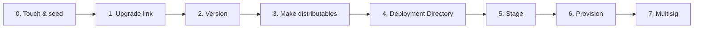

import { Steps, Step } from 'fumadocs-ui/components/steps'

This is **part 3 of 4** in the [getting started path](/getting-started). You take the production-shaped app from [part 2](/getting-started/production-shape) and walk it through the first half of Pear's release pipeline — minting a `pear://` link, building per-OS distributables, and staging the very first version onto that link. [Deploy over-the-air updates](/getting-started/update) (part 4 of 4) picks up from here and demonstrates the live OTA cycle, plus a tour of `pear provision` and multisig.

<include>./_hello-pear-electron-callout.mdx</include>

The full pipeline looks like this:



This part stops after step 5 — the first `pear stage` plus `pear release`. You do not need cosigners, a Windows machine, or Apple signing credentials. The deeper guides cover the production-only material:

- [Deploy a Pear desktop app](/how-to/operate-an-app/deployment) — every command, every release line.
- [Build desktop distributables](/how-to/operate-an-app/build-desktop-distributables) — code-signing, notarization, MSIX publisher details.
- [Release pipeline](/explanation/release-pipeline) — the conceptual picture.

## Before you start

You need:
1. The working production-shaped app from [part 2](/getting-started/production-shape).
2. [`pear`](/reference/cli):
    - Install it with `npm i -g pear` or run via `npx pear`.
    - Every `pear` command in this part also works as `npx pear ...`. This is useful if you want to run the commands from a different directory than the one you installed `pear` in.
3. [`pear-build`](https://npm.im/pear-build) — assembles per-OS makes into a deployment directory:
    - Install it with `npm i -g pear-build` or run via `npx pear-build`.

<Steps>

<Step>

### Touch and seed

`pear touch` mints a new `pear://` link backed by a fresh [Hypercore](/reference/building-blocks/hypercore). `pear seed` keeps that core online so other peers can fetch updates from you. The output should look like this (your link will be different):

```bash
pear touch
# pear://qxenz5wmspmryjc13m9yzsqj1conqotn8fb4ocbufwtz9mtbqq5o

pear seed pear://qxenz5wmspmryjc13m9yzsqj1conqotn8fb4ocbufwtz9mtbqq5o
```

Leave `pear seed` running in its own terminal for the rest of the tutorial — without an active seeder, peers cannot download your build. In production, run `pear seed` on at least one always-online machine (a small VPS works) so updates keep flowing while developer laptops sleep. See [hello-pear-electron 0. Touch and Seed](https://github.com/holepunchto/hello-pear-electron#touch-and-seed).

</Step>

<Step>

### Set the `upgrade` link

In a separate terminal, set the `upgrade` field in `package.json` to the link you just minted:

```bash
npm pkg set upgrade=pear://<your-pear-link>
```

After this, every distributable you build is opinionated about which `pear://` link it pulls updates from.

</Step>

<Step>

### Bump the version

`pear-runtime` only swaps the application drive when the new build advertises a higher version. If you forget this step, peers see your stage and do nothing:

```bash
npm version patch
```

This rewrites `package.json` (`1.0.0` → `1.0.1`) and creates a git tag. From now on, every release iteration starts with `npm version patch`.

</Step>

<Step>

### Make distributables

A "distributable" is the platform-native installer — `.app` on macOS, `.msix` on Windows, `.AppImage` on Linux. Pear uses [`electron-forge`](https://www.electronforge.io/) for `.app`/`.msix` and a small shell script (`build-app-image.sh`) for `.AppImage`.

#### Install `electron-forge` and the makers you need

```bash
npm install --save-dev \
  @electron-forge/cli@^7.11.1 \
  @electron-forge/maker-dmg@^7.11.1 \
  @electron-forge/maker-msix@^7.11.1 \
  app-builder-lib@^26.8.1 \
  electron-forge-plugin-universal-prebuilds@^1.0.0 \
  electron-forge-plugin-prune-prebuilds@^1.0.0
```

Two electron-forge plugins matter:

- [`electron-forge-plugin-universal-prebuilds`](https://www.npmjs.com/package/electron-forge-plugin-universal-prebuilds) — bundles native prebuilds for every supported architecture.
- [`electron-forge-plugin-prune-prebuilds`](https://www.npmjs.com/package/electron-forge-plugin-prune-prebuilds) — trims the prebuilds you do not need for the current platform, keeping installers small.

#### Add the make scripts to `package.json`

The Linux maker is a shell script because AppImage build tooling is not in the electron-forge ecosystem:

```json
"scripts": {
  "start": "electron . --no-updates",
  "make:darwin": "electron-forge make --platform=darwin",
  "make:win32": "electron-forge make --platform=win32",
  "make:linux": "electron-forge package && ./scripts/build-app-image.sh"
},
```

#### Create `forge.config.js`

Create a `forge.config.js` file for your project next to `package.json` — this is the file `electron-forge` reads to configure:
* makers (`.app`/`.msix`/`.AppImage`)
* packager options
* code-signing hooks
* a Windows MSIX version-rewrite step

```js
const fs = require('fs')
const path = require('path')
const pkg = require('./package.json')
const appName = pkg.productName ?? pkg.name
const { isWindows } = require('which-runtime')

function getWindowsKitVersion() {
  const programFiles = process.env['PROGRAMFILES(X86)'] || process.env.PROGRAMFILES
  if (!programFiles) return undefined
  const kitsDir = path.join(programFiles, 'Windows Kits')
  try {
    for (const kit of fs.readdirSync(kitsDir).sort().reverse()) {
      const binDir = path.join(kitsDir, kit, 'bin')
      if (!fs.existsSync(binDir)) continue
      const version = fs
        .readdirSync(binDir)
        .filter((d) => /^\d+\.\d+\.\d+\.\d+$/.test(d))
        .sort()
        .pop()
      if (version) return version
    }
  } catch {
    return undefined
  }
}

let packagerConfig = {
  icon: 'build/icon',
  protocols: [{ name: appName, schemes: [pkg.name] }],
  derefSymlinks: true
}

if (process.env.MAC_CODESIGN_IDENTITY) {
  packagerConfig = {
    ...packagerConfig,
    osxSign: {
      identity: process.env.MAC_CODESIGN_IDENTITY,
      optionsForFile: () => ({
        entitlements: path.join(__dirname, 'build', 'entitlements.mac.plist')
      })
    },
    osxNotarize: {
      appleId: process.env.APPLE_ID,
      appleIdPassword: process.env.APPLE_PASSWORD,
      teamId: process.env.APPLE_TEAM_ID
    }
  }
}

module.exports = {
  packagerConfig,
  makers: [
    { name: '@electron-forge/maker-dmg', platforms: ['darwin'], config: {} },
    {
      name: '@electron-forge/maker-msix',
      platforms: ['win32'],
      config: {
        appManifest: path.join(__dirname, 'build', 'AppxManifest.xml'),
        windowsKitVersion: getWindowsKitVersion(),
        ...(process.env.WINDOWS_CERTIFICATE_FILE
          ? {
              windowsSignOptions: {
                certificateFile: process.env.WINDOWS_CERTIFICATE_FILE,
                certificatePassword: process.env.WINDOWS_CERTIFICATE_PASSWORD
              }
            }
          : {})
      }
    }
  ],
  hooks: {
    preMake: async () => {
      fs.rmSync(path.join(__dirname, 'out', 'make'), { recursive: true, force: true })
      const manifest = path.join(__dirname, 'build', 'AppxManifest.xml')
      if (!fs.existsSync(manifest)) return
      const msixVersion = pkg.version.replace(/^(\d+\.\d+\.\d+)$/, '$1.0')
      const xml = fs.readFileSync(manifest, 'utf-8')
      fs.writeFileSync(manifest, xml.replace(/Version="[^"]*"/, `Version="${msixVersion}"`))
    },
    postMake: async (_forgeConfig, results) => {
      for (const result of results) {
        if (result.platform !== 'win32') continue
        for (const artifact of result.artifacts) {
          if (!artifact.endsWith('.msix')) continue
          const standardDir = path.join(__dirname, 'out', `${appName}-win32-${result.arch}`)
          fs.mkdirSync(standardDir, { recursive: true })
          const dest = path.join(standardDir, path.basename(artifact))
          fs.renameSync(artifact, dest)
          result.artifacts[result.artifacts.indexOf(artifact)] = dest
        }
      }
      if (isWindows) {
        fs.rmSync(path.join(__dirname, 'out', 'make'), { recursive: true, force: true })
      }
    }
  },
  plugins: [
    { name: 'electron-forge-plugin-universal-prebuilds', config: {} },
    { name: 'electron-forge-plugin-prune-prebuilds', config: {} }
  ]
}
```

#### Create `scripts/build-app-image.sh`

Save `scripts/build-app-image.sh` next to the project root and run `chmod +x scripts/build-app-image.sh` to make it executable.

It uses the already installed [`app-builder-lib`](https://www.npmjs.com/package/app-builder-lib) and [`jq`](https://jqlang.github.io/jq/) to assemble a `.AppImage` whose desktop entry advertises the `pear-chat://` URL scheme so deep links route to your installed binary. The script looks like this:


```bash
#!/usr/bin/env bash
set -euo pipefail

ROOT="$(pwd)"
PKG="$ROOT/package.json"

[ -f "$PKG" ] || { echo "package.json not found in $ROOT"; exit 1; }
command -v jq >/dev/null 2>&1 || { echo "jq is required"; exit 1; }

UNAME_ARCH=$(uname -m)
case "$UNAME_ARCH" in
  x86_64) ARCH="x64" ;;
  aarch64 | arm64) ARCH="arm64" ;;
  *) echo "Unsupported architecture: $UNAME_ARCH"; exit 1 ;;
esac

APP_BUILDER="$(node -e "
  const path = require('path')
  const pkg = require.resolve('app-builder-bin/package.json')
  console.log(path.join(path.dirname(pkg), 'linux', process.argv[1], 'app-builder'))
" "$ARCH")"

APP_NAME=$(jq -r '.productName // .name' "$PKG")
VERSION=$(jq -r '.version' "$PKG")
DESCRIPTION=$(jq -r '.description // ""' "$PKG")

APP_DIR="$ROOT/out/${APP_NAME}-linux-${ARCH}"
STAGE_DIR="$ROOT/out/make/__appImage-${ARCH}"
OUTPUT="$ROOT/out/make/${APP_NAME}.AppImage"

rm -rf "$STAGE_DIR"
mkdir -p "$STAGE_DIR"

DESKTOP_ENTRY="[Desktop Entry]
Name=${APP_NAME}
Exec=${APP_NAME}
Terminal=false
Type=Application
Icon=${APP_NAME}
StartupWMClass=undefined
X-AppImage-Version=${VERSION}
Comment=${DESCRIPTION}
Categories=Utility"

MIME_TYPES=$(jq -r '
  (.build?.protocols // .protocols // [])
  | map(.schemes[])
  | map("x-scheme-handler/" + ascii_downcase)
  | join(";")
' "$PKG")

if [ -n "$MIME_TYPES" ]; then
  DESKTOP_ENTRY="${DESKTOP_ENTRY}"$'\n'"MimeType=${MIME_TYPES}"
fi

ICON_BASE="$ROOT/node_modules/app-builder-lib/templates/icons/electron-linux"
ICON_JSON="[ \
  {\"file\":\"$ICON_BASE/16x16.png\",\"size\":16}, \
  {\"file\":\"$ICON_BASE/32x32.png\",\"size\":32}, \
  {\"file\":\"$ICON_BASE/48x48.png\",\"size\":48}, \
  {\"file\":\"$ICON_BASE/64x64.png\",\"size\":64}, \
  {\"file\":\"$ICON_BASE/128x128.png\",\"size\":128}, \
  {\"file\":\"$ICON_BASE/256x256.png\",\"size\":256} \
]"

CONFIG_JSON=$(jq -n \
  --arg name "$APP_NAME" \
  --arg desktop "$DESKTOP_ENTRY" \
  --argjson icons "$ICON_JSON" \
  '{ productName: $name, productFilename: $name, desktopEntry: $desktop, executableName: $name, icons: $icons, fileAssociations: [] }')

"$APP_BUILDER" appimage \
  --stage "$STAGE_DIR" \
  --arch "$ARCH" \
  --output "$OUTPUT" \
  --app "$APP_DIR" \
  --configuration "$CONFIG_JSON"

echo "→ AppImage built at: $OUTPUT"
```

#### Run the maker for whichever OS you are on

Then run the maker for whichever OS you are on.

<Callout type="warning">
On macOS you also need an icon at `build/icon.icns` (any 1024×1024 PNG converted with `iconutil` works for the tutorial). You can use the one in the [`hello-pear-electron`](https://github.com/holepunchto/hello-pear-electron/blob/main/build/icon.icns) template.
</Callout>

```bash
npm run make:darwin   # macOS — .app + .dmg
# npm run make:linux  # Linux — .AppImage
# npm run make:win32  # Windows — .msix
```

The output lands in `out/PearChat-darwin-arm64/PearChat.app` (or the matching path for your platform).

<Callout type="info">
If the make fails with a `NODE_MODULE_VERSION` mismatch (for example after `nvm use` or upgrading Node between `npm install` and `npm run make`), run `npm rebuild` and try again. See [Node ABI mismatch during make](/how-to/operate-an-app/troubleshoot-desktop-releases#node-abi-mismatch-during-make).
</Callout>

<Callout type="info">
Code-signing, notarization, and MSIX publisher requirements are full topics on their own — production builds need them, but you can skip them for this dry run.

The full coverage is in [Build desktop distributables](/how-to/operate-an-app/build-desktop-distributables). See [Desktop release npm scripts](/reference/desktop-release-npm-scripts) for common `npm` entry points in sample repos.
</Callout>

</Step>

<Step>

### Build the deployment directory

You should run `pear-build` from **outside** the project folder (`pear-build` and the project folder must not be parent/child — see [stage size increases](https://github.com/holepunchto/hello-pear-electron#stage-size-increases)). Each `--<platform-arch>-app` flag points at one make's output. For example:

```bash
cd ..
pear-build \
  --package=./pear-chat/package.json \
  --darwin-arm64-app ./pear-chat/out/PearChat-darwin-arm64/PearChat.app \
  --target pear-chat-1.0.1
```

The result is `./pear-chat-1.0.1/by-arch/darwin-arm64/app/...` ready for the next step.

If you have makes from more than one platform — for example a Linux AppImage built on a colleague's machine — pass each one:

```bash
pear-build \
  --package=./pear-chat/package.json \
  --darwin-arm64-app ./pear-chat/out/PearChat-darwin-arm64/PearChat.app \
  --linux-x64-app ./pear-chat/out/PearChat-linux-x64/PearChat.AppImage \
  --win32-x64-app ./pear-chat/out/PearChat-win32-x64/PearChat.msix \
  --target pear-chat-1.0.1
```

`pear-build` assembles a Pear deployment directory from the per-platform makes. The layout must be as follows:

```text
PearChat-1.0.1/
├─ package.json
└─ by-arch/
   └─ <platform-arch>/
      └─ app/
```

</Step>

<Step>

### Stage and release the first version

`pear stage` syncs the deployment directory into the [Hypercore](/reference/building-blocks/hypercore) behind your `pear://` link. Always run `--dry-run` first and read the file-by-file diff:

```bash
pear stage --dry-run pear://<your-pear-link> ./pear-chat-1.0.1
```

Look for:

- Files you expect to ship — `electron/`, `workers/`, `renderer/`, `package.json`, `node_modules/...`.
- No surprise additions — stray `.DS_Store`, editor swap files, secrets, the deployment directory itself.
- Sensible byte counts — if a file is suddenly 100 MB, something is wrong.

If the diff looks right, drop the `--dry-run` flag and run it for real:

```bash
pear stage pear://<your-pear-link> ./pear-chat-1.0.1
```

`pear stage` writes the new content into the Hypercore but does **not** advance the `release` pointer that peers actually poll. Until you advance it, peers cannot fetch anything new. Run `pear release` after every stage you want peers to fetch:

```bash
pear release pear://<your-pear-link>
```

<Callout type="warning">
`pear release` is marked deprecated in `pear --help` ("use `pear provision` and `pear multisig`"), but it remains the simplest way to advance a stage link's release pointer for development OTA. Production deployments use [`pear provision`](/getting-started/update#provision-production-preview) and `pear multisig` instead, which both manage their own release pointers.
</Callout>

Your first version is now published. Peers running an app with the same `upgrade` link will see it on their next poll.

</Step>

</Steps>

## What you've learned

You now have a `pear://` link with your first build published behind it:

| Stage | What it is | Reversible? |
| --- | --- | --- |
| `pear touch` | Mints a new `pear://` link | Yes — just abandon it |
| Make + `pear-build` | Per-OS distributable folded into a Deployment Directory | Yes — rebuild |
| `pear stage` | Append-only sync into the staged Hypercore | History is permanent; updates are not |
| `pear release` | Advances the discoverable release pointer | Yes — re-release a different length |

Every release iteration after this is the same six commands: `npm version patch`, `npm run make:<os>`, `pear-build`, `pear stage --dry-run`, `pear stage`, `pear release`. Part 4 puts that loop on a running app and shows the OTA cycle from both sides.

## Where to go next

- **Continue the path:** [Deploy over-the-air updates](/getting-started/update) (part 4 of 4) — run the installed build, ship a second version, watch OTA fire end-to-end, and preview `pear provision` and multisig.
- [Deploy a Pear desktop app](/how-to/operate-an-app/deployment) — the canonical how-to with every command, every flag, and every recovery procedure.
- [Build desktop distributables](/how-to/operate-an-app/build-desktop-distributables) — code-signing, notarization, MSIX publisher details.
- [Troubleshoot desktop releases](/how-to/operate-an-app/troubleshoot-desktop-releases) — "the app did not update", lost write-access, stage size blowups.
- [Release pipeline](/explanation/release-pipeline) — the conceptual picture, deployment layers, and release lines.
- [Release pipeline glossary](/reference/release-pipeline-glossary) — terminology.
- [`hello-pear-electron`](https://github.com/holepunchto/hello-pear-electron) — the upstream template every snippet in this getting started path is based on.
