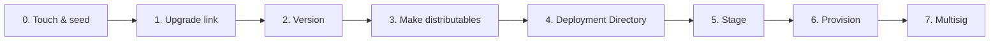

import { Steps, Step } from 'fumadocs-ui/components/steps'

This is **part 3 of 4** in the [getting started path](/getting-started). You take the production-shaped app from [part 2](/getting-started/production-shape) and walk it through the first half of Pear's release pipeline — minting a `pear://` link, building per-OS distributables, and staging the very first version onto that link. [Deploy over-the-air updates](/getting-started/update) (part 4 of 4) picks up from here and demonstrates the live OTA cycle, plus a tour of `pear provision` and multisig.

<include>./_hello-pear-electron-callout.mdx</include>

The full pipeline looks like this:



This part stops after step 5 — the first `pear stage` plus `pear release`. You do not need cosigners, a Windows machine, or Apple signing credentials. The deeper guides cover the production-only material:

- [Deploy a Pear desktop app](/how-to/operate-an-app/deployment) — every command, every release line.
- [Build desktop distributables](/how-to/operate-an-app/build-desktop-distributables) — code-signing, notarization, MSIX publisher details.
- [Release pipeline](/explanation/release-pipeline) — the conceptual picture.

## Before you start

You need:
1. The working production-shaped app from [part 2](/getting-started/production-shape).
2. [`pear`](/reference/cli):
    - Install it with `npm i -g pear` or run via `npx pear`.
    - Every `pear` command in this part also works as `npx pear ...`. This is useful if you want to run the commands from a different directory than the one you installed `pear` in.
3. [`pear-build`](https://npm.im/pear-build) — assembles per-OS makes into a deployment directory:
    - Install it with `npm i -g pear-build` or run via `npx pear-build`.

<Steps>

<Step>

### Touch and seed

`pear touch` mints a new `pear://` link backed by a fresh [Hypercore](/reference/building-blocks/hypercore). `pear seed` keeps that core online so other peers can fetch updates from you. The output should look like this (your link will be different):

```bash
pear touch
# pear://qxenz5wmspmryjc13m9yzsqj1conqotn8fb4ocbufwtz9mtbqq5o

pear seed pear://qxenz5wmspmryjc13m9yzsqj1conqotn8fb4ocbufwtz9mtbqq5o
```

Leave `pear seed` running in its own terminal for the rest of the tutorial — without an active seeder, peers cannot download your build. In production, run `pear seed` on at least one always-online machine (a small VPS works) so updates keep flowing while developer laptops sleep. See [hello-pear-electron 0. Touch and Seed](https://github.com/holepunchto/hello-pear-electron#touch-and-seed).

</Step>

<Step>

### Set the `upgrade` link

In a separate terminal, set the `upgrade` field in `package.json` to the link you just minted:

```bash
npm pkg set upgrade=pear://<your-pear-link>
```

After this, every distributable you build is opinionated about which `pear://` link it pulls updates from.

</Step>

<Step>

### Bump the version

`pear-runtime` only swaps the application drive when the new build advertises a higher version. If you forget this step, peers see your stage and do nothing:

```bash
npm version patch
```

This rewrites `package.json` (`1.0.0` → `1.0.1`) and creates a git tag. From now on, every release iteration starts with `npm version patch`.

</Step>

<Step>

### Make distributables

A "distributable" is the platform-native installer — `.app` on macOS, `.msix` on Windows, `.AppImage` on Linux. Pear uses [`electron-forge`](https://www.electronforge.io/) with a single [`forge.config.js`](https://github.com/holepunchto/hello-pear-electron/blob/main/forge.config.js) that configures makers for every platform, including Linux AppImage via [`pear-electron-forge-maker-appimage`](https://www.npmjs.com/package/pear-electron-forge-maker-appimage).

#### Install `electron-forge` and the makers you need

```bash
npm install --save-dev \
  @electron-forge/cli@^7.11.1 \
  @electron-forge/maker-dmg@^7.11.1 \
  @electron-forge/maker-msix@^7.11.1 \
  pear-electron-forge-maker-appimage@^2.0.0 \
  pear-electron-forge-maker-flatpak@^0.0.4 \
  pear-electron-forge-maker-snap@^0.0.10 \
  electron-forge-plugin-universal-prebuilds@^1.0.0 \
  electron-forge-plugin-prune-prebuilds@^1.0.0
```

Two electron-forge plugins matter:

- [`electron-forge-plugin-universal-prebuilds`](https://www.npmjs.com/package/electron-forge-plugin-universal-prebuilds) — bundles native prebuilds for every supported architecture.
- [`electron-forge-plugin-prune-prebuilds`](https://www.npmjs.com/package/electron-forge-plugin-prune-prebuilds) — trims the prebuilds you do not need for the current platform, keeping installers small.

#### Add scripts to `package.json`

Use one make entry point on every OS — Forge runs only the makers whose `platforms` match the host:

```json
"scripts": {
  "start": "electron-forge start -- --no-updates",
  "package": "electron-forge package",
  "make": "electron-forge make"
}
```

#### Add `forge.config.js`

Copy or diff against the canonical [`hello-pear-electron` `forge.config.js`](https://github.com/holepunchto/hello-pear-electron/blob/main/forge.config.js) rather than maintaining a separate inline copy in this tutorial. That file configures:

- **Packager** — `build/icon`, URL schemes from `package.json` `name`, optional macOS signing when `MAC_CODESIGN_IDENTITY` is set (notarization via `KEYCHAIN_PROFILE`).
- **Makers** — `@electron-forge/maker-dmg` (darwin), `@electron-forge/maker-msix` (win32), and Pear makers for Linux AppImage, Flatpak, and Snap.
- **Hooks** — `preMake` rewrites `build/AppxManifest.xml` version for MSIX; `postMake` moves Windows `.msix` artifacts into `out/<AppName>-win32-<arch>/`.
- **Plugins** — universal-prebuilds and prune-prebuilds.

You also need the template `build/` assets (`AppxManifest.xml`, `entitlements.mac.plist`, icon set under `build/icon/`, and Linux Flatpak/Snap metadata). See the [`hello-pear-electron` `build/` tree](https://github.com/holepunchto/hello-pear-electron/tree/main/build).

#### Run the maker on your OS

`npm run make` builds distributables for the **current host OS** only. Run it on macOS, Linux, and Windows (or on CI runners per OS) when you need a multi-arch deployment directory.

<Callout type="warning">
Brand icons before you make: `build/icon.icns` (macOS), `build/icon.ico` (Windows), `build/icon.png` plus sized PNGs under `build/icon/` (Linux makers). You can copy the set from [`hello-pear-electron`](https://github.com/holepunchto/hello-pear-electron/tree/main/build).
</Callout>

```bash
npm run make   # .app + .dmg on macOS; .AppImage (+ Flatpak/Snap) on Linux; .msix on Windows
```

The output lands in `out/PearChat-darwin-arm64/PearChat.app` (or the matching path for your platform).

<Callout type="info">
If the make fails with a `NODE_MODULE_VERSION` mismatch (for example after `nvm use` or upgrading Node between `npm install` and `npm run make`), run `npm rebuild` and try again. See [Node ABI mismatch during make](/how-to/operate-an-app/troubleshoot-desktop-releases#node-abi-mismatch-during-make).
</Callout>

<Callout type="info">
Code-signing, notarization, and MSIX publisher requirements are full topics on their own — production builds need them, but you can skip them for this dry run.

The full coverage is in [Build desktop distributables](/how-to/operate-an-app/build-desktop-distributables). See [Desktop release npm scripts](/reference/desktop-release-npm-scripts) for common `npm` entry points in sample repos.
</Callout>

</Step>

<Step>

### Build the deployment directory

You should run `pear-build` from **outside** the project folder (`pear-build` and the project folder must not be parent/child — see [stage size increases](https://github.com/holepunchto/hello-pear-electron#stage-size-increases)). Each `--<platform-arch>-app` flag points at one make's output. For example:

```bash
cd ..
pear-build \
  --package=./pear-chat/package.json \
  --darwin-arm64-app ./pear-chat/out/PearChat-darwin-arm64/PearChat.app \
  --target pear-chat-1.0.1
```

The result is `./pear-chat-1.0.1/by-arch/darwin-arm64/app/...` ready for the next step.

If you have makes from more than one platform — for example a Linux AppImage built on a colleague's machine — pass each one:

```bash
pear-build \
  --package=./pear-chat/package.json \
  --darwin-arm64-app ./pear-chat/out/PearChat-darwin-arm64/PearChat.app \
  --linux-x64-app ./pear-chat/out/PearChat-linux-x64/PearChat.AppImage \
  --win32-x64-app ./pear-chat/out/PearChat-win32-x64/PearChat.msix \
  --target pear-chat-1.0.1
```

`pear-build` assembles a Pear deployment directory from the per-platform makes. The layout must be as follows:

```text
PearChat-1.0.1/
├─ package.json
└─ by-arch/
   └─ <platform-arch>/
      └─ app/
```

</Step>

<Step>

### Stage and release the first version

`pear stage` syncs the deployment directory into the [Hypercore](/reference/building-blocks/hypercore) behind your `pear://` link. Always run `--dry-run` first and read the file-by-file diff:

```bash
pear stage --dry-run pear://<your-pear-link> ./pear-chat-1.0.1
```

Look for:

- Files you expect to ship — `electron/`, `workers/`, `renderer/`, `package.json`, `node_modules/...`.
- No surprise additions — stray `.DS_Store`, editor swap files, secrets, the deployment directory itself.
- Sensible byte counts — if a file is suddenly 100 MB, something is wrong.

If the diff looks right, drop the `--dry-run` flag and run it for real:

```bash
pear stage pear://<your-pear-link> ./pear-chat-1.0.1
```

`pear stage` writes the new content into the Hypercore but does **not** advance the `release` pointer that peers actually poll. Until you advance it, peers cannot fetch anything new. Run `pear release` after every stage you want peers to fetch:

```bash
pear release pear://<your-pear-link>
```

<Callout type="warning">
`pear release` is marked deprecated in `pear --help` ("use `pear provision` and `pear multisig`"), but it remains the simplest way to advance a stage link's release pointer for development OTA. Production deployments use [`pear provision`](/getting-started/update#provision-production-preview) and `pear multisig` instead, which both manage their own release pointers.
</Callout>

Your first version is now published. Peers running an app with the same `upgrade` link will see it on their next poll.

</Step>

</Steps>

## What you've learned

You now have a `pear://` link with your first build published behind it:

| Stage | What it is | Reversible? |
| --- | --- | --- |
| `pear touch` | Mints a new `pear://` link | Yes — just abandon it |
| Make + `pear-build` | Per-OS distributable folded into a Deployment Directory | Yes — rebuild |
| `pear stage` | Append-only sync into the staged Hypercore | History is permanent; updates are not |
| `pear release` | Advances the discoverable release pointer | Yes — re-release a different length |

Every release iteration after this is the same six commands: `npm version patch`, `npm run make` (on each OS you ship), `pear-build`, `pear stage --dry-run`, `pear stage`, `pear release`. Part 4 puts that loop on a running app and shows the OTA cycle from both sides.

## Where to go next

- **Continue the path:** [Deploy over-the-air updates](/getting-started/update) (part 4 of 4) — run the installed build, ship a second version, watch OTA fire end-to-end, and preview `pear provision` and multisig.
- [Deploy a Pear desktop app](/how-to/operate-an-app/deployment) — the canonical how-to with every command, every flag, and every recovery procedure.
- [Build desktop distributables](/how-to/operate-an-app/build-desktop-distributables) — code-signing, notarization, MSIX publisher details.
- [Troubleshoot desktop releases](/how-to/operate-an-app/troubleshoot-desktop-releases) — "the app did not update", lost write-access, stage size blowups.
- [Release pipeline](/explanation/release-pipeline) — the conceptual picture, deployment layers, and release lines.
- [Release pipeline glossary](/reference/release-pipeline-glossary) — terminology.
- [`hello-pear-electron`](https://github.com/holepunchto/hello-pear-electron) — the upstream template every snippet in this getting started path is based on.
