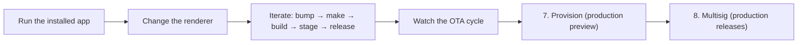

import { Steps, Step } from 'fumadocs-ui/components/steps'

This is **part 4 of 4** in the [getting started path](/getting-started). You start from the v1.0.1 you shipped in [part 3](/getting-started/ship): a `pear://` link, an active `pear seed`, and a packaged build that points its `upgrade` field at the same link. From here you put the live OTA cycle to work — run the installed app, change something visible in the renderer, stage a second version, and watch the [OTA update event lifecycle](/explanation/release-pipeline#ota-update-event-lifecycle) fire. The last two steps preview `pear provision` and multisig, the production-grade replacements for `pear release`.

<include>./_hello-pear-electron-callout.mdx</include>



You do not need cosigners, a Windows machine, or Apple signing credentials to follow along. The deeper guides cover the production-only material:

- [Deploy a Pear desktop app](/how-to/operate-an-app/deployment) — every command, every release line.
- [Build desktop distributables](/how-to/operate-an-app/build-desktop-distributables) — code-signing, notarization, MSIX publisher details.
- [Release pipeline](/explanation/release-pipeline) — the conceptual picture.

## Before you start

You need:
1. The shipped v1.0.1 from [part 3 — ship](/getting-started/ship). That part covered `pear touch`, the `upgrade` link, `npm version patch`, `electron-forge make`, `pear-build`, `pear stage`, and `pear release`.
2. The `pear seed` from part 3 still running. Without an active seeder, peers cannot fetch the new version.
3. The same `pear` and `pear-build` CLIs from part 3 (`npm i -g pear pear-build` or `npx ...`).

<Steps>

<Step>

### Open the installed build

```bash
open ./pear-chat/out/PearChat-darwin-arm64/PearChat.app
# Linux:   ./pear-chat/out/PearChat-linux-x64/PearChat.AppImage
# Windows: install PearChat-1.0.1.msix and launch from Start menu
```

The header shows `v1.0.1`. Send a few chat messages so you can confirm the transcript survives the restart. Leave the app open.

<Callout type="info">
This must be the **installed `.app`**, not `npm start`. The dev script forwards `--no-updates`, which intentionally disables OTA. Only the packaged build polls for updates.
</Callout>

<Callout type="warning">
On macOS, the first launch may prompt Gatekeeper because this build is unsigned. Right-click the `.app` → **Open** → **Open** to bypass it once. Production signing and notarization is covered in [Build desktop distributables](/how-to/operate-an-app/build-desktop-distributables).
</Callout>

</Step>

<Step>

### Make a visible change

Edit `renderer/index.html` and change the header so the new version is obviously different:

```diff
-    <h1 class="text-sm font-semibold">Pear chat</h1>
+    <h1 class="text-sm font-semibold">Pear chat — v2</h1>
```

Any visible tweak works (text, color, emoji). The point is to confirm the renderer asset on disk swaps after the update.

</Step>

<Step>

### Bump, make, build, stage, release

Same release cycle as part 3, with a patch bump. Run from your terminal in the project root — your packaged app keeps running in the GUI:

#### Bump the version
```bash
npm version patch          # 1.0.1 → 1.0.2
```

#### Make the distributables

```bash
npm run make:darwin
```

#### Build the deployment directory

```bash
cd ..
pear-build \
  --package=./pear-chat/package.json \
  --darwin-arm64-app ./pear-chat/out/PearChat-darwin-arm64/PearChat.app \
  --target pear-chat-1.0.2
```

#### Stage and release the deployment directory

```bash
pear stage pear://<your-pear-link> ./pear-chat-1.0.2
pear release pear://<your-pear-link>
```

<Callout type="warning">
On every cycle, the `--target` value and the deployment dir you pass to `pear stage` must match the version you just bumped to. The example above assumes you went from `1.0.1` to `1.0.2`; if you've already iterated past that, use `pear-chat-<current-version>` everywhere. Otherwise `pear-build` writes v`X` into a directory named after v`Y`, which makes the next bump confusing to debug. You can also omit `--target` and `pear-build` will auto-name the dir as `<name>-<version>` from `package.json`.
</Callout>

</Step>

<Step>

### Watch the OTA cycle fire

Within seconds the running app reacts. The events come from part 2's wiring (`pear.updater.on('updating'|'updated')` → preload bridge → renderer):

1. The version label in the header flips from `v1.0.1` to `updating…`.
2. The yellow **Update ready!** button appears.
3. Click it. `applyUpdate()` swaps the application drive, `appAfterUpdate()` restarts the process.
4. The header now reads **"Pear chat — v2"** and the version label shows `v1.0.2`. The Corestore-backed chat transcript replays from disk.

If nothing happens for more than a minute, check that `pear seed` is still running and that `upgrade` in `package.json` matches the link you staged to — see [App did not update](/how-to/operate-an-app/troubleshoot-desktop-releases#app-did-not-update).

<Callout type="info">
Part 2 wires the runtime with `delay: 0`, so updates fire as soon as the new content reaches the local drive. The default `pear-runtime-updater` delay is a random value up to **one hour** after the 60s boot grace period — great for production (seeders avoid a thundering herd) but invisible in a tutorial. If you keep that default and the **Update ready!** button never appears, restart the app to reset the grace period — see [Tune `PearRuntime` `delay` for live OTA visibility](/how-to/operate-an-app/troubleshoot-desktop-releases#tune-pearruntime-delay-for-live-ota-visibility).
</Callout>

<Callout type="info">
The walkthrough stops here. The remaining steps — provision and multisig — change real `pear://` links and require coordinating with at least one other signer, so a tutorial walkthrough is the wrong format. The next two sections summarize what each command does and link to the production guides.
</Callout>

</Step>

<Step>

### Provision (production preview)

A staged link contains the full append-only history — every file you ever staged, even ones you later deleted. For production releases you usually want a fresh, minimal core. `pear provision` resyncs a stage link onto a new link, dropping history along the way:

```bash
pear provision <versioned-stage-link> <target-link> <versioned-production-link>
```

A versioned link has the form `pear://<fork>.<length>.<key>`. You get `<length>` from the `pear stage` output for the run you want to ship.

Provisioning is what stakeholders, QA, and dogfooders install. The full walkthrough — including the recovery flow if a stage or provision link is lost — lives in [Deploy a Pear desktop app](/how-to/operate-an-app/deployment).

</Step>

<Step>

### Multisig (production releases)

A multisig drive is a [Hypercore](/reference/building-blocks/hypercore) where write access is gated by a quorum of signing keys instead of a single owner machine. This is what production Pear apps use so no single laptop can push a malicious update.

The setup, in 30 seconds:

1. Every signer generates a keypair: `npm i -g hypercore-sign && hypercore-sign-generate-keys`. Each signer's public key goes in a shared list.
2. One person writes a `multisig.json` with the signers' public keys, a quorum (e.g. 2 of 3), a namespace, and the provision link's key as `srcKey`.
3. `npm i -g hyper-multisig-cli && hyper-multisig link` outputs the new `pear://` link backed by the multisig config. Set this as your `upgrade` field.

The release flow becomes:

```bash
hyper-multisig request <length>     # prepare a signing request
hypercore-sign <signing request>     # each signer runs this; shares response
hyper-multisig verify <request> <responses...>
hyper-multisig commit <request>      # commits when quorum is reached
```

[Release pipeline](/explanation/release-pipeline) and [Deploy a Pear desktop app](/how-to/operate-an-app/deployment) cover the full quorum lifecycle, key rotation, recovering from lost write-access, and the [release lines](/explanation/release-pipeline#release-lines) pattern (development → staging → rc → prerelease → production) that real teams use.

</Step>

</Steps>

## What you've learned

You now have an end-to-end mental model for iterating a Pear Electron app:

| Stage | What it is | Reversible? |
| --- | --- | --- |
| Iterate loop | `npm version patch` → make → `pear-build` → `pear stage` → `pear release` | Yes — re-release a different length |
| OTA cycle | `pear.updater` emits `updating`/`updated`; renderer button calls `applyUpdate` + `appAfterUpdate` | Yes — restart loads the previous bundle until the next swap |
| `pear provision` | Resync onto a clean prerelease core | History is permanent on the new core |
| Multisig commit | Quorum signs and publishes | Cryptographically committed |

Every release iteration after part 3 is the same six commands: `npm version patch`, `npm run make:<os>`, `pear-build`, `pear stage --dry-run`, `pear stage`, `pear release`. Once provision and multisig are wired, `pear provision` and the four-step multisig flow replace `pear release`.

## Where to go next

- [Deploy a Pear desktop app](/how-to/operate-an-app/deployment) — the canonical how-to with every command, every flag, and every recovery procedure.
- [Build desktop distributables](/how-to/operate-an-app/build-desktop-distributables) — code-signing, notarization, MSIX publisher details.
- [Troubleshoot desktop releases](/how-to/operate-an-app/troubleshoot-desktop-releases) — "the app did not update", lost write-access, stage size blowups, OTA polling cadence.
- [Release pipeline](/explanation/release-pipeline) — the conceptual picture, deployment layers, and release lines.
- [Release pipeline glossary](/reference/release-pipeline-glossary) — terminology.
- [`hello-pear-electron`](https://github.com/holepunchto/hello-pear-electron) — the upstream template every snippet in this getting started path is based on.
