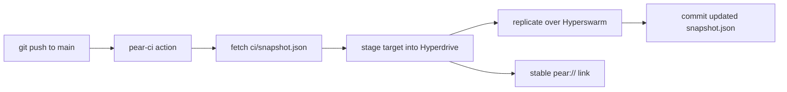

The simplest way to publish and update a Pear app is to let CI do it. The [`pear-ci` GitHub Action](https://github.com/holepunchto/actions/blob/main/pear-ci/action.yml) stages a directory from your repository into a Hyperdrive on every push, so shipping a new version is just a `git push`. There is no local `pear touch`, `pear seed`, or `pear release` to run by hand, and nothing to keep online between releases.

This is the goal-oriented recipe. If you need the full-control flow — release lines, provision, and multisig — use [Deploy your application](/how-to/operate-an-app/manual-deployment/deployment) instead. The two are not mutually exclusive: CI is the fast path for development and staging links, while the manual flow gives you production gating.

## How it works

The action wraps the [`pear-ci`](https://www.npmjs.com/package/pear-ci) tool. On each run it:

1. Installs `pear-ci` and fetches the committed `ci/snapshot.json` from `main`.
2. Mirrors your `target` directory into a Hyperdrive whose key is **derived deterministically from `primary-key` + `namespace`**, then replicates over [Hyperswarm](/reference/building-blocks/hyperswarm) until connected peers have synced.
3. Commits the updated `ci/snapshot.json` back to `main` (or opens a PR if the push is rejected).

Two properties make this work well in CI:

- **The `pear://` link is stable.** Because the drive key comes from the secret primary key plus the namespace, every run stages to the same link. You set that link once as your app's `upgrade` field and every push updates it.
- **The snapshot replaces persistent storage.** `ci/snapshot.json` records each core's length, so the next run only syncs what changed instead of re-uploading the whole drive or persisting a full Corestore between jobs.



## Before you begin

You need:

1. A GitHub repository for your app.
2. The directory you want to publish committed to that repo — typically the [`pear build`](/how-to/operate-an-app/build-and-package/build-desktop-distributables#build-the-deployment-directory) deployment directory, or your app source if you stage the runnable project directly.
3. A 32-byte hex **primary key** (created below) stored as a repository secret.
4. A **namespace** name (any string of letters, numbers, dots, hyphens, or underscores) that identifies this drive.

## Generate and store the primary key

Generate a random 32-byte key:

```bash
openssl rand -hex 32
# 9f2c... (64 hex characters)
```

Add it to your repository as a secret named `PEAR_PRIMARY_KEY` (**Settings → Secrets and variables → Actions → New repository secret**).

<Callout type="warning">
The primary key is the **write key** for your drive — anyone who has it can publish updates that your users will receive over the air. Keep it in a repository (or organization) secret, never commit it, and rotate it if it leaks. Rotating the key changes the derived `pear://` link, so you would need to update the `upgrade` field and re-onboard users.
</Callout>

## Add the workflow

Create `.github/workflows/pear-ci.yml`:

```yaml
name: Publish with pear-ci

on:
  push:
    branches: [main]

# pear-ci commits the updated snapshot back to main
permissions:
  contents: write
  pull-requests: write

concurrency:
  group: pear-ci
  cancel-in-progress: false

jobs:
  stage:
    runs-on: ubuntu-latest
    steps:
      - uses: actions/checkout@v4
      - uses: holepunchto/actions/pear-ci@main
        with:
          primary-key: ${{ secrets.PEAR_PRIMARY_KEY }}
          namespace: my-app
          target: dist
          dry-run: false
```

Set `namespace` to your chosen name and `target` to the repo-relative path of the directory you want to publish. The `concurrency` group prevents two runs from racing to commit `ci/snapshot.json` at the same time.

For the full list of inputs and outputs, see the [`pear-ci` GitHub Action reference](/reference/pear-ci-action).

## Wire up the `pear://` link

The first run prints the drive key it stages to:

```text
starting stage for key <drive-key>
```

That key is your app's `pear://` link. Set it as the [`upgrade`](/reference/configuration) field so installed builds poll it for updates:

```bash
npm pkg set upgrade=pear://<drive-key>
```

This is the same `upgrade` link that the [manual deploy flow](/how-to/operate-an-app/manual-deployment/deployment#1-set-the-upgrade-link) sets — the only difference is that CI now stages to it for you. Because the key is deterministic, you only do this once.

## Dry-run first

Before publishing for real, set `dry-run: true` in the workflow. The action computes and logs the file-by-file diff without writing anything to the drive — the same safety check as `pear stage --dry-run`:

```yaml
        with:
          primary-key: ${{ secrets.PEAR_PRIMARY_KEY }}
          namespace: my-app
          target: dist
          dry-run: true
```

Read the diff in the Actions log. Look for the files you expect, no surprise additions (`.DS_Store`, editor swap files, secrets), and sensible byte counts. When it looks right, set `dry-run: false` and push. Every subsequent push to `main` then stages and publishes automatically.

## Producing the build to stage

`pear-ci` stages whatever is in `target`. To build and sign that directory on CI first, pair it with [`make-pear-app`](/reference/github-actions#make-pear-app): one job produces signed, notarized distributables (see [Build and sign desktop apps in CI](/how-to/operate-an-app/github-actions/build-and-sign-in-ci)), and `pear-ci` stages the assembled deployment directory to your stable `pear://` link.

## See also

- [`pear-ci` GitHub Action reference](/reference/pear-ci-action) — every input, output, and the underlying CLI.
- [Holepunch GitHub Actions](/reference/github-actions) — the other shared actions, including `make-pear-app` and `pear-base`.
- [Build and sign desktop apps in CI](/how-to/operate-an-app/github-actions/build-and-sign-in-ci) — build and sign the artifacts `pear-ci` stages.
- [Deploy your application](/how-to/operate-an-app/manual-deployment/deployment) — the full manual flow with release lines, provision, and multisig.
- [Ship your app](/getting-started/build-a-peer-to-peer-chat/ship) — the type-along walkthrough of staging by hand.
- [Configuration](/reference/configuration) — the `upgrade` field and other `package.json` settings.
- [Release pipeline](/explanation/release-pipeline) — the conceptual picture of staging and OTA updates.
- [Troubleshoot desktop releases](/how-to/operate-an-app/manual-deployment/troubleshoot-desktop-releases) — when an update does not reach peers.
