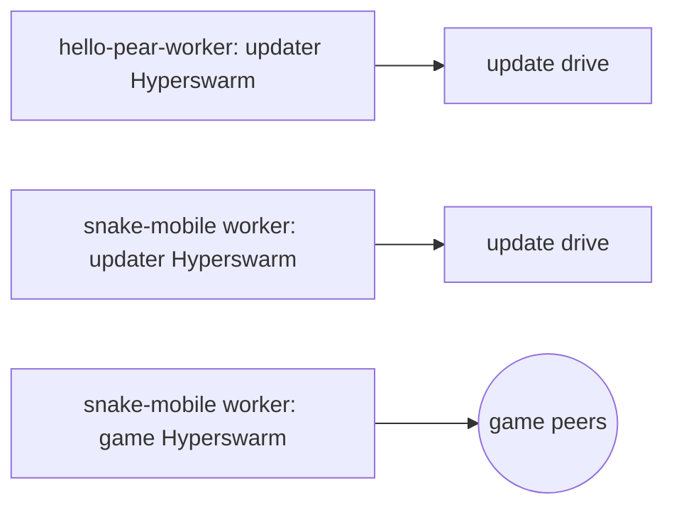

import { Steps, Step } from 'fumadocs-ui/components/steps'

This guide extends [Start from the hello-pear-react-native template](/getting-started/from-a-template/start-from-hello-pear-react-native)—read that first if you haven't; this page assumes the template is already running and picks up exactly where it leaves off, at `workers/main.js`.

The worked example throughout is [`holepunchto/snake-mobile`](https://github.com/holepunchto/snake-mobile), a real P2P multiplayer snake game built on the template. Its worker does not use [`hello-pear-worker`](https://github.com/holepunchto/hello-pear-worker) at all—it ships a custom `workers/main.js` with a second [Hyperswarm](/reference/building-blocks/hyperswarm) topic and a small JSON protocol in place of the template's plain updater strings. That is exactly the shape most real apps end up in: keep the OTA half the template already gives you, and add your own swarm and protocol next to it.

## What changes

| Layer | Change |
| --- | --- |
| Worker (`workers/main.js`) | A second `Hyperswarm` (the game topic) joins `hello-pear-worker`'s single updater swarm; a JSON message protocol (`join`/`leave`/`send`/`applyUpdate` in, `ready`/`connected`/`disconnected`/`data`/`update`/... out) replaces the plain updater strings. |
| View (`src/App.tsx`) | Routes between a setup screen, a loading screen, and a game screen based on worker messages, instead of rendering one screen with just an update banner. |
| `package.json` | No `hello-pear-worker` dependency—`hyperswarm`, `corestore`, and `hypercore-crypto` are used directly. |

Everything else is untouched: bundling with `bare-pack`, the updater swarm and drive, the `minver` gate, and where storage lives all work exactly as the template documents.



## Require `pear-mobile` directly

<Callout type="info">
`hello-pear-worker` does `require('pear-runtime')` and relies on its own `package.json`'s conditional `imports` to redirect that specifier to [`pear-mobile`](/reference/pear/mobile) on iOS, Android, and simulator hosts—see [Where the app logic goes](/getting-started/from-a-template/start-from-hello-pear-react-native#where-the-app-logic-goes). A custom worker that only ever runs on mobile doesn't need that indirection:

```js file=<rootDir>/examples/how-to/run-on-native/snake-mobile/workers/main.custom.js#L1 title="workers/main.js" skip="example-import"
```

snake-mobile's `package.json` carries a copy of the same `imports` block `hello-pear-worker` uses, but nothing in this app requires the bare specifier `pear-runtime` that it remaps, so the field has no effect here. Don't copy it into a mobile-only worker; requiring `pear-mobile` directly is simpler and is what this worker actually does.
</Callout>

<Steps>

<Step>

### Add a second Hyperswarm for the game topic

The updater swarm from `hello-pear-worker` stays exactly as-is. Alongside it, open a second `Hyperswarm` for the actual multiplayer topic, plus a `joined` variable holding the current topic:

```js file=<rootDir>/examples/how-to/run-on-native/snake-mobile/workers/main.custom.js#L49-L54 title="workers/main.js" skip="example-import"
```

`joined` doubles as a gate on the connection handler: a peer that connects before anyone has created or joined a game is dropped immediately rather than left dangling. Everything after that gate is the per-peer wiring that forwards traffic to the view:

```js file=<rootDir>/examples/how-to/run-on-native/snake-mobile/workers/main.custom.js#L68-L90 title="workers/main.js" skip="example-import"
```

`joined` is `null` until [`joinGame`](#serialize-join-and-leave) sets it, and back to `null` once [`leaveGame`](#serialize-join-and-leave) runs—so this same check also rejects any peer that reconnects mid-leave.

</Step>

<Step>

### Serialize join and leave

Only one game topic is ever joined at a time, and a fast leave-then-join from the UI must not race two discovery sessions for the same topic. `enqueue` chains every `joinGame`/`leaveGame` call onto one promise so they always run in order:

```js file=<rootDir>/examples/how-to/run-on-native/snake-mobile/workers/main.custom.js#L56-L62 title="workers/main.js" skip="example-import"
```

The two functions it serializes:

```js file=<rootDir>/examples/how-to/run-on-native/snake-mobile/workers/main.custom.js#L96-L118 title="workers/main.js" skip="example-import"
```

The comment on `leaveGame` matters: Hyperswarm keeps connections open across `leave()`, so without the explicit `peer.destroy()` loop, peers from a game you've left keep streaming state at you—and rejoining that same topic later never re-emits `'connection'` for them, since the connection never actually closed.

</Step>

<Step>

### Extend the protocol

`hello-pear-worker` speaks plain strings (`'updating'`, `'pear:applyUpdate'`, ...). A custom worker is free to speak whatever it wants over the same `FramedStream`-framed pipe—here, small JSON envelopes with a `type` field:

<Callout type="info">
Hand-rolled envelopes like these are worth reaching for only while the protocol is small. Once it grows past a handful of messages, [`hrpc`](https://www.npmjs.com/package/hrpc) generates typed methods for both ends from one schema instead—see [Structured RPC over IPC](/explanation/workers#structured-rpc-over-ipc). It rides any duplex stream, including this worklet pipe.
</Callout>

```js file=<rootDir>/examples/how-to/run-on-native/snake-mobile/workers/main.custom.js#L120-L146 title="workers/main.js" skip="example-import"
```

The full message set, extending the plain template's table:

| Direction | Message | Meaning |
| --- | --- | --- |
| view → worker | `{ type: 'join', topic }` | Join a game (`topic` a hex string), or create one (`topic: null`). |
| view → worker | `{ type: 'leave' }` | Leave the current game. |
| view → worker | `{ type: 'send', data }` | Broadcast local game state to every connected peer. |
| view → worker | `{ type: 'applyUpdate' }` | Apply a downloaded OTA update—same as the plain template. |
| worker → view | `{ type: 'ready', id, topic }` | The swarm has flushed; the game can start. |
| worker → view | `{ type: 'connected', id }` | A peer joined. |
| worker → view | `{ type: 'disconnected', id }` | A peer dropped. |
| worker → view | `{ type: 'data', id, payload }` | Game state from a peer. |
| worker → view | `{ type: 'update', connections }` | The peer count changed. |
| worker → view | `{ type: 'updating' }` / `{ type: 'updated' }` / `{ type: 'minverRequired', minver }` / `{ type: 'updateFailed', error }` / `{ type: 'updateApplied' }` | The same updater events the plain template sends as bare strings, now wrapped as typed messages so they can coexist with the game protocol on one pipe. |

</Step>

</Steps>

## Route the view

On the view side, the structural change from the plain template is routing between screens instead of rendering one screen with just an update banner. `screen` flips to `'game'` once a `ready` message arrives, and back to `'setup'` on leave:

```js file=<rootDir>/examples/how-to/run-on-native/snake-mobile/src/App.tsx#L195-L218 title="src/App.tsx" skip="example-import"
```

The `handleMessage` switch that sets `screen` from each incoming worker message—and the `createGame`/`joinGame`/`leaveGame` functions that write the outgoing `join`/`leave` commands—are ordinary React state handling once the protocol above is in place; nothing about them is specific to Bare or Hyperswarm.

## Where to go next

- [Start from the hello-pear-react-native template](/getting-started/from-a-template/start-from-hello-pear-react-native)—the template this guide extends.
- [Pear Mobile OTA](/reference/pear/mobile)—the `pear-mobile` API the updater half still runs on.
- [One core, many platforms](/explanation/bare-on-native)—why the worker's peer-to-peer logic is portable regardless of what protocol it speaks.
- [Structured RPC over IPC](/explanation/workers#structured-rpc-over-ipc)—replacing these hand-rolled JSON envelopes with schema-generated typed methods once the protocol grows past a few messages.
- [Type a native RPC bridge](/how-to/run-on-native/type-a-native-rpc-bridge)—the `bare-rpc` equivalent, for when one end is a native shell rather than JavaScript.
- [Handle app suspension](/how-to/run-on-native/handle-app-suspension)—keep both Hyperswarm instances in step with the OS lifecycle.
- [`holepunchto/snake-mobile`](https://github.com/holepunchto/snake-mobile)—the full app, including the game engine, screens, and UI this guide doesn't cover.
