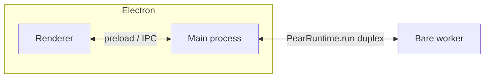

This page explains **why** a production-style Pear **Electron** app usually separates three concerns:
1. **over-the-air (OTA) updates**,
2. **persistent peer-to-peer storage**, and
3. **Bare workers** behind a single IPC stream.

Read it if you are sketching your own main/renderer/worker split or comparing a full runtime setup to the minimal [getting started chat](/pear/getting-started/build-a-peer-to-peer-chat/build-a-peer-to-peer-chat). 

## The short version

The pattern optimizes to:
* **ship new builds without a central server**
* **keep replication-capable storage beside the app**
* **keep native P2P modules out of the renderer**

A [**Bare worker**](/pear/explanation/workers) owns the [`pear-runtime`](/pear/reference/pear/runtime) instance together with [Hyperswarm](/p2p/reference/building-blocks/hyperswarm), [Hypercore](/p2p/reference/building-blocks/hypercore), and the [OTA updater](/pear/reference/pear/runtime#updates); Electron's [main process](#process-model) is a thin shell that spawns the worker and forwards [IPC](/pear/explanation/workers#the-ipc-contract); the [renderer](#process-model) stays a normal web view. Updates flow when the [**application Hyperdrive**](/p2p/reference/building-blocks/hyperdrive) changes; the runtime signals the UI, then swaps paths on disk so the [**next process start**](#updates) runs the new code.

<Callout type="info">
The official [`hello-pear-electron`](https://github.com/holepunchto/hello-pear-electron) template uses this worker-hosted shape, and the [getting started production-shape part](/pear/getting-started/build-a-peer-to-peer-chat/reshape-into-a-production-app) follows it—running the `pear-runtime` updater in its own dedicated Bare worker so update traffic never blocks the chat worker.
</Callout>

## Process model

The renderer does not load `hyperswarm`, `hypercore`, or other Bare-oriented modules directly. The main process starts the worker with [`PearRuntime.run`](/pear/reference/pear/runtime#running-workers) (or the instance method [`pear.run`](/pear/reference/pear/runtime#running-workers)) and forwards bytes between the worker’s [`Bare.IPC`](/pear/reference/pear/runtime#running-workers) stream and whatever bridge you expose to the renderer.

## Updates

An **update** is triggered when a **seeded application drive** gains new writes: the replicated [Hyperdrive](/p2p/reference/building-blocks/hyperdrive) behind your `pear://` link reflects a new staged or provisioned build. The runtime emits **`updating`** while it syncs, then **`updated`** when the new bundle is ready. These events are emitted on the runtime's [`pear.updater`](/pear/reference/pear/runtime#updates) sub-object—handlers attach with `pear.updater.on('updating')` / `pear.updater.on('updated')`, and the staged update is applied with `pear.updater.applyUpdate()`.

After `updated`, a common shell **repoints the active application path** to the freshly synced build and removes the old tree from disk so the **next start** runs the new code. That matches OTA expectations: sync in the background, switch on restart (or after your UI explicitly restarts).

<Callout type="info">
Disable updates per run (`--no-updates`) or with [`package.json` `updates: false`](/pear/reference/pear/runtime#disabling-updates) during local development so a seeded link does not replace your working tree mid-session.
</Callout>

## Storage

The runtime’s **`dir`** option is the root for **peer-to-peer and local application data**. In production that usually maps to per-OS application support directories; in development many teams use a **separate dev default** or a flag. [`pear.storage`](/pear/reference/pear/runtime#storage) is the string you pass into [`Corestore`](/p2p/reference/helpers/corestore) so every core shares one coherent on-disk layout.

<Callout type="info">
Passing **`--storage /path`** (or equivalent) spins up an **isolated Corestore**—the same idea as running two app instances on two machines: different storage roots, no key collisions.
</Callout>

## Workers

**Application P2P logic**—swarms, cores, drives—belongs in the worker entrypoint. Arguments you pass from `pear.run('./workers/main.js', [pear.storage, …])` show up as [`Bare.argv`](/bare/reference/bare/runtime#bareargv) inside the worker (`argv[0]`/`argv[1]` are reserved; **`argv[2]`** is the first user argument, which is why sample apps often pass storage at index `2`).

Rule of thumb: **main = shell + IPC**, **worker = data plane**, **renderer = view**.

## Where this differs from the minimal tutorial

The [getting started chat](/pear/getting-started/build-a-peer-to-peer-chat/build-a-peer-to-peer-chat) walkthrough uses [`PearRuntime.run()`](/pear/reference/pear/runtime#running-workers) so you can paste a tiny worker without configuring `upgrade` or `dir`. A shipped desktop app switches on the **full `new PearRuntime({ ... })` constructor** so OTA, storage, and the updater share one runtime object—the shape in the [`pear-runtime` reference](/pear/reference/pear/runtime). In the official [`hello-pear-electron`](https://github.com/holepunchto/hello-pear-electron) template, that constructor runs inside the Bare worker, keeping the main process a thin proxy; the [getting started production-shape part](/pear/getting-started/build-a-peer-to-peer-chat/reshape-into-a-production-app) does the same, running the updater in its own dedicated Bare worker.

## Where to go next

- [Start from the hello-pear-electron template](/pear/getting-started/from-a-template/start-from-hello-pear-electron)—a hands-on tour of this architecture in the official boilerplate.
- [Release pipeline](/pear/explanation/deployment-releasing-apps-p2p)—stage, provision, multisig, and diagrams for moving builds between links.
- [Release pipeline glossary](/pear/explanation/deployment-releasing-apps-p2p#glossary)—terminology in one table.
- [Storage and distribution](/pear/explanation/storage-and-distribution)—Pear-wide layout versus per-app `dir`.
- [Deploy your application](/pear/how-to/operate-an-app/manual-deployment/deployment)—when you are ready to run commands.

<Callout type="info">

**Related documentation**

**Getting Started:** [Part 1: Chat](/pear/getting-started/build-a-peer-to-peer-chat/build-a-peer-to-peer-chat) · [Part 2: Production-shaped](/pear/getting-started/build-a-peer-to-peer-chat/reshape-into-a-production-app) · [Part 3: Ship](/pear/getting-started/build-a-peer-to-peer-chat/ship) · [Part 4: Update](/pear/getting-started/build-a-peer-to-peer-chat/update)

**Operating an app**

- [Build desktop distributables](/pear/how-to/operate-an-app/build-and-package/build-desktop-distributables)
- [Desktop release npm scripts](/pear/reference/ci-and-release/desktop-release-npm-scripts)
- [Distribute as a binary](/pear/how-to/operate-an-app/build-and-package/distribute-as-binary)
- [Manage installed applications](/pear/how-to/manage-installed-applications)
- [Troubleshoot desktop releases](/pear/how-to/operate-an-app/manual-deployment/troubleshoot-desktop-releases)
- [Troubleshoot common issues](/pear/how-to/troubleshooting)

</Callout>
