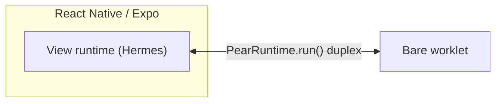

This page explains **why** a production-style Pear React Native/Expo app splits into two runtimes:
1. a **view runtime**—[Hermes](https://reactnative.dev/architecture/glossary#hermes), the JS thread your screens run on, and
2. a **Bare worklet** acting as the **local backend** for over-the-air updates, persistent peer-to-peer storage, and application logic.

It's the same three concerns [Pear desktop application architecture](/pear/explanation/pear-desktop-architecture) separates for Electron—OTA, storage, workers—just collapsed from three processes to two. Read it if you are sketching your own view/worklet split or comparing it to the desktop shape. For a file-by-file tour, see [Start from the hello-pear-react-native template](/p2p/getting-started/from-a-template/start-from-hello-pear-react-native).

## The short version

The pattern optimizes to:
* **ship JS-only OTA updates** without a store round trip for most changes
* **keep the peer-to-peer core off the UI thread**, in a worklet
* **mirror desktop's OTA/storage/worker split**, collapsed to two tiers instead of three

<Callout type="info">
The official [`hello-pear-react-native`](https://github.com/holepunchto/hello-pear-react-native) template uses this view/worklet shape, and [Start from the hello-pear-react-native template](/p2p/getting-started/from-a-template/start-from-hello-pear-react-native#how-the-pieces-connect) walks through it file by file.
</Callout>

## Process model

The view never imports `hyperswarm`, `corestore`, or other Bare-oriented modules directly. It starts the worklet with [`pear-mobile`](/pear/reference/pear/mobile)'s static `PearRuntime.run(filename, bundle, argv)`—a [`react-native-bare-kit`](/bare/reference/bare/bare-kit) `Worklet` under the hood—and talks to it over the returned `IPC` duplex. There's no separate host process to proxy through, unlike desktop's main process forwarding bytes between renderer and worker. The file-level version of this diagram, with the actual `App.tsx`/`workers/main.js` code on each side, lives in [How the pieces connect](/p2p/getting-started/from-a-template/start-from-hello-pear-react-native#how-the-pieces-connect).

## Updates

An update follows the same two-event lifecycle as desktop: `pear.updater` emits `updating` while syncing, then `updated` once the new bundle is staged—see [Updates](/pear/reference/pear/mobile#updates) for the exact API.

Mobile adds one thing desktop doesn't have: the `minver` gate. It exists because a mobile OTA replaces the **JavaScript bundle only**—native code changes still require an App Store or Play Store release, which stays gated behind platform review in a way desktop's self-contained distributables aren't. That asymmetry is why an OTA payload can require a newer native build than the one it's updating, and why `pear-mobile` checks for that before downloading rather than after. See [The `minver` gate](/pear/reference/pear/mobile#the-minver-gate) for the exact mechanics.

Activation timing also differs by platform, for a structural reason: neither iOS nor Android gives an app a way to hot-swap its own binary path the way a desktop shell renames a directory and relaunches. iOS re-reads the bundle URL on every JS reload; Android caches it when the React host is first created, so activation waits for a full process restart. See [Runtime activation](/pear/reference/pear/mobile-boot-control#runtime-activation) for the platform table.

## Storage

The concept is identical to desktop—one persistent root backs one coherent [Corestore](/p2p/reference/helpers/corestore) layout—but mobile can't let the shell pick an arbitrary path the way a desktop `dir` flag can. A mobile app sandbox doesn't expose a location outside itself, so the root has to be the OS-assigned per-app directory.

That's why [`pear-mobile`](/pear/reference/pear/mobile#options) resolves `dir` automatically—via `bare-storage`'s `persistent()`, landing on the app's Application Support directory on iOS and its `files` directory on Android—rather than expecting a shell to supply one the way desktop's `PearRuntime` constructor does.

## Workers

The rule of thumb is the same as desktop: application peer-to-peer logic—swarms, cores, drives—belongs in one worker entrypoint, not scattered across the view. See [Workers](/pear/explanation/workers) for the general pattern.

On mobile that worker is a **worklet**: a lighter in-process execution context hosted by [`react-native-bare-kit`](/bare/reference/bare/bare-kit), not a spawned OS subprocess the way desktop's Bare worker is. That distinction drives a second one: there's no filesystem path a mobile sandbox can hand a worklet the way desktop's `pear.run('./workers/main.js', …)` hands a path to a subprocess, so the worker ships as packed JS **content**—via [`bare-pack`](https://github.com/holepunchto/bare-pack)—instead. A stale bundle fails silently rather than erroring, which is why [Integrate Pear OTA into an existing mobile app](/pear/how-to/operate-an-app/integrate-pear-ota/mobile#bundle-the-worker) calls out re-running it after every worker change.

One knock-on effect: the worklet's `Bare.argv` has no reserved executable-path or entry-path slots the way a spawned desktop process does, since nothing is being exec'd—see the how-to guide's [worker source](/pear/how-to/operate-an-app/integrate-pear-ota/mobile#add-the-updater-worker) for how the shared `hello-pear-worker` code accounts for that.

## Where this differs from desktop

Desktop is **three** processes—renderer, Electron main, and a Bare worker—joined by a preload bridge plus an IPC proxy hop through main. Mobile is **two** runtimes—the view and a Bare worklet—joined by one direct IPC duplex, with nothing to proxy through.

The reason is structural, not a design choice made for mobile specifically: Electron's main process exists because Electron itself is two processes (a privileged main process and a sandboxed Chromium renderer), with the Bare worker sitting behind it as a third. React Native has no equivalent privileged layer between its JS thread and the OS—so `react-native-bare-kit` lets the JS thread start the worklet directly, and the proxy hop disappears along with the process that would have done the proxying.

The underlying shape is still the same. [`pear-mobile`'s "two entry points, one package"](/pear/reference/pear/mobile#two-entry-points-one-package)—a static `PearRuntime.run()` launcher on one side, the full `new PearRuntime()` constructor on the other—mirrors desktop's own split between [the minimal tutorial's `PearRuntime.run()`](/pear/explanation/pear-desktop-architecture#where-this-differs-from-the-minimal-tutorial) and a shipped app's full constructor. Mobile just needs both on every project, since there's no filesystem shortcut the way desktop's tutorial has one. This is the same worker-behind-one-IPC-stream pattern desktop uses, collapsed by one tier—not a different architecture.

## Where to go next

- [Start from the hello-pear-react-native template](/p2p/getting-started/from-a-template/start-from-hello-pear-react-native)—the file-level version of this page's process-model diagram, in a working template.
- [Pear desktop application architecture](/pear/explanation/pear-desktop-architecture)—the three-process version this page collapses.
- [Pear Mobile OTA](/pear/reference/pear/mobile)—the `pear-mobile` API: `PearRuntime.run`, the full constructor, and the `minver` gate.
- [Mobile OTA Boot Control](/pear/reference/pear/mobile-boot-control)—the boot-selection mechanics and version-sync rules this page only motivates.
- [Integrate Pear OTA into an existing mobile app](/pear/how-to/operate-an-app/integrate-pear-ota/mobile)—wiring steps for an app you already have.
- [Deploy your mobile application](/pear/how-to/operate-an-app/manual-deployment/mobile)—building and staging the OTA payload this architecture produces.
- [Release pipeline](/pear/explanation/deployment-releasing-apps-p2p)—stage, provision, multisig—the release model mobile reuses over a different payload shape.
- [Workers](/pear/explanation/workers)—the general host/worker pattern this page specializes for mobile.

<Callout type="info">

**Related documentation**

**Getting Started:** [Start from hello-pear-react-native](/p2p/getting-started/from-a-template/start-from-hello-pear-react-native)

**Mobile reference:** [Pear Mobile OTA](/pear/reference/pear/mobile) · [Mobile OTA Boot Control](/pear/reference/pear/mobile-boot-control)

**Operating an app:** [Integrate Pear OTA into an existing mobile app](/pear/how-to/operate-an-app/integrate-pear-ota/mobile) · [Deploy your mobile application](/pear/how-to/operate-an-app/manual-deployment/mobile) · [Troubleshoot common issues](/pear/how-to/troubleshooting)

**Related architecture:** [Pear desktop application architecture](/pear/explanation/pear-desktop-architecture) · [Workers](/pear/explanation/workers) · [Release pipeline](/pear/explanation/deployment-releasing-apps-p2p)

</Callout>
