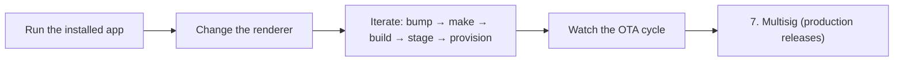

import { Steps, Step } from 'fumadocs-ui/components/steps'

This is **part 4 of 4** in the [getting started path](/pear/getting-started). You start from the v1.0.1 you shipped in [part 3](/pear/getting-started/build-a-peer-to-peer-chat/ship):

- a [**provision link**](/pear/getting-started/build-a-peer-to-peer-chat/ship#5-switch-upgrade-to-the-provision-link) in `package.json#upgrade`
- an active [`pear seed`](/pear/getting-started/build-a-peer-to-peer-chat/ship#5-switch-upgrade-to-the-provision-link) on that link
- a [packaged build](/pear/getting-started/build-a-peer-to-peer-chat/ship#6-rebuild-once) that embeds the same field.

From here you put the live OTA cycle to work:

1. [Run the installed app](#open-the-installed-build)
2. [Change something visible in the renderer](#make-a-visible-change)
3. [Stage v1.0.2 onto your **stage link**](#stage-and-provision-the-deployment-directory)
4. [Provision it onto the provision link](#stage-and-provision-the-deployment-directory)
5. [Watch the OTA cycle fire](#watch-the-ota-cycle-fire)—see the [OTA update event lifecycle](/pear/explanation/deployment-releasing-apps-p2p#ota-update-event-lifecycle)
6. [Preview multisig](#multisig-production-releases), the production gate on top of provision.

<include>../../../_snippets/_hello-pear-electron-callout.mdx</include>

<include>../../../_snippets/_interactive-menu-callout.mdx</include>



You do not need cosigners, a Windows machine, or Apple signing credentials to follow along. The deeper guides cover the production-only material:

- [Deploy a Pear desktop app](/pear/how-to/operate-an-app/manual-deployment/deployment)—every command, every release line.
- [Build desktop distributables](/pear/how-to/operate-an-app/build-and-package/build-desktop-distributables)—code-signing, notarization, MSIX publisher details.
- [Release pipeline](/pear/explanation/deployment-releasing-apps-p2p)—the conceptual picture.

## Before you start

You need:
1. The shipped v1.0.1 from [part 3—ship](/pear/getting-started/build-a-peer-to-peer-chat/ship). That part covered `pear touch`, the stage and provision links, `npm version patch`, `electron-forge make`, `pear build`, `pear stage`, and `pear provision`.
2. The `pear seed` on your **provision link** from part 3 still running. Without an active seeder, peers cannot fetch the new version.
3. The same `pear` CLI from part 3—`pear build` ships with it (`npm i -g pear` or `npx pear ...`).

<Steps>

<Step>

### Open the installed build

```bash
open ./pear-chat/out/PearChat-darwin-arm64/PearChat.app
# Linux:   ./pear-chat/out/PearChat-linux-x64/PearChat.AppImage
# Windows: install PearChat-1.0.1.msix and launch from Start menu
```

The header shows `v1.0.1`. Send a few chat messages so you can confirm the transcript survives the restart. Leave the app open.

<Callout type="info">
This must be the **installed `.app`**, not `npm start`. The dev script forwards `--no-updates`, which intentionally disables OTA. Only the packaged build polls for updates.
</Callout>

<Callout type="warning">
On macOS, the first launch may prompt Gatekeeper because this build is unsigned. Right-click the `.app` → **Open** → **Open** to bypass it once. Production signing and notarization is covered in [Build desktop distributables](/pear/how-to/operate-an-app/build-and-package/build-desktop-distributables).
</Callout>

</Step>

<Step>

### Make a visible change

Edit `renderer/index.html` and change the header so the new version is obviously different:

```diff
-    <h1 class="text-sm font-semibold">Pear chat</h1>
+    <h1 class="text-sm font-semibold">Pear chat — v2</h1>
```

Any visible tweak works (text, color, emoji). The point is to confirm the renderer asset on disk swaps after the update.

</Step>

<Step>

### Bump, make, build, stage, provision

Same release cycle as part 3, with a patch bump. Run from your terminal in the project root—your packaged app keeps running in the GUI:

#### Bump the version

```bash
npm version [<newversion> | major | minor | patch | premajor | preminor | prepatch | prerelease]
```

#### Note the change in the changelog

Add an entry for the new version to `CHANGELOG.md` at your project root—create the file if this is your first release note, and start it with a title line before the first `##` heading:

```md title="CHANGELOG.md"
# Pear chat changelog

## v1.0.2

### Changes
- Renamed the header to "Pear chat — v2".
```

Keep releases newest-first with a SemVer version as the first word of each `##` heading. `pear build` copies only `package.json` and `by-arch/` into the deployment directory, so you copy this file in before staging (below); peers then read it with `pear changelog pear://<provision-link>`. See [Publish a changelog for your app](/pear/how-to/operate-an-app/publish-a-changelog) for the format details.

#### Make the distributables

```bash
npm run make
```

#### Build the deployment directory

```bash
cd ..
pear build \
  --package=./pear-chat/package.json \
  --darwin-arm64-app ./pear-chat/out/PearChat-darwin-arm64/PearChat.app \
  --target pear-chat-1.0.2
```

#### Stage and provision the deployment directory

```bash
cp ./pear-chat/CHANGELOG.md ./pear-chat-1.0.2/   # release notes ride along with the build
pear stage pear://<stage-link> ./pear-chat-1.0.2
pear provision \
  pear://0.<length>.<stage-key> \
  pear://<provision-link> \
  pear://0.0.<provision-key>
```

Use the versioned link from the `pear stage` output for the first argument. `<provision-key>` is the key segment from `<provision-link>` (everything after `pear://`), same as in [part 3](/pear/getting-started/build-a-peer-to-peer-chat/ship#stage-and-provision-the-first-version).

<Callout type="warning">
On every cycle, the `--target` value and the deployment dir you pass to `pear stage` must match the version you just bumped to. The example above assumes you went from `1.0.1` to `1.0.2`; if you've already iterated past that, use `pear-chat-<current-version>` everywhere. Otherwise `pear build` writes v`X` into a directory named after v`Y`, which makes the next bump confusing to debug. You can also omit `--target` and `pear build` will auto-name the dir as `<name>-<version>` from `package.json`.
</Callout>

</Step>

<Step>

### Watch the OTA cycle fire

Within seconds the running app reacts. The events come from part 2's wiring (`pear.updater.on('updating'|'updated')` → preload bridge → renderer):

1. The version label in the header flips from `v1.0.1` to `updating…`.
2. The yellow **Update ready** button appears.
3. Click it. `applyUpdate()` swaps the application drive, `appAfterUpdate()` restarts the process.
4. The header now reads **"Pear chat—v2"** and the version label shows `v1.0.2`. The [Corestore](/p2p/reference/helpers/corestore)-backed chat transcript replays from disk.

If nothing happens for more than a minute, check that `pear seed` is still running on your **provision link** and that `upgrade` in `package.json` matches `<provision-link>`—see [App did not update](/pear/how-to/operate-an-app/manual-deployment/troubleshoot-desktop-releases#app-did-not-update).

<Callout type="info">
Part 2 wires the runtime with `delay: 0`, so updates fire as soon as the new content reaches the local drive. The default `pear-runtime-updater` delay is a random value up to **one hour** after the 60s boot grace period—great for production (seeders avoid a thundering herd) but invisible in a tutorial. If you keep that default and the **Update ready** button never appears, restart the app to reset the grace period—see [Tune `PearRuntime` `delay` for live OTA visibility](/pear/how-to/operate-an-app/manual-deployment/troubleshoot-desktop-releases#tune-pearruntime-delay-for-live-ota-visibility).
</Callout>

<Callout type="info">
The walkthrough stops here. Multisig changes real production links and requires coordinating with at least one other signer, so a tutorial walkthrough is the wrong format. The next section summarizes what it does and links to the production guides.
</Callout>

</Step>

<Step>

<span id="provision-production-preview" />

### Why stage and provision are separate links

A **stage link** keeps the full append-only history—every file you ever staged, even ones you later deleted. A **provision link** is the lean snapshot peers poll: [`pear provision`](/pear/reference/pear/cli#pear-provision) block-syncs from a versioned stage link onto the provision target, compacting deletions along the way. Part 3 and the iterate loop above already use that split; [Deploy your application](/pear/how-to/operate-an-app/manual-deployment/deployment#6-provision) covers recovery if a stage or provision link is lost.

</Step>

<Step>

### Multisig (production releases)

A multisig drive is a [Hypercore](/p2p/reference/building-blocks/hypercore) where write access is gated by a quorum of signing keys instead of a single owner machine. This is what production Pear apps use so no single laptop can push a malicious update.

The setup, in 30 seconds:

1. Every signer generates a signing key: `pear multisig keys get`. Each signer's public key goes in a shared list.
2. One person sets the `multisig` object in `pear.json` with the signers' `publicKeys`, a `quorum` (for example, 2 of 3), and a `namespace`. The provision link is not stored here—it is supplied as the source when you prepare and commit each request.
3. `pear multisig link` outputs the new `pear://` link, derived from the namespace, public keys, and quorum. Set this as your `upgrade` field.

The release flow becomes:

```bash
pear multisig request <versioned-provision-link>             # prepare a signing request
pear multisig sign <signing request>                         # each signer runs this; shares response
pear multisig verify <source-link> <signing request> [...responses]
pear multisig commit <source-link> <signing request> [...responses]   # commits when quorum is reached
```

[Release pipeline](/pear/explanation/deployment-releasing-apps-p2p) and [Deploy a Pear desktop app](/pear/how-to/operate-an-app/manual-deployment/deployment) cover the full quorum lifecycle, key rotation, recovering from lost write-access, and the [release lines](/pear/explanation/deployment-releasing-apps-p2p#release-lines) pattern (development → staging → rc → prerelease → production) that real teams use.

</Step>

</Steps>

## What you've learned

You now have an end-to-end mental model for iterating a Pear Electron app:

| Stage | What it is | Reversible? |
| --- | --- | --- |
| Iterate loop | `npm version patch` → make → `pear build` → `pear stage` → `pear provision` | Yes—reprovision from a different stage length |
| OTA cycle | `pear.updater` emits `updating`/`updated`; renderer button calls `applyUpdate` + `appAfterUpdate` | Yes—restart loads the previous bundle until the next swap |
| Stage vs provision | Stage link for append-only sync; provision link for what peers poll | History is permanent on the stage core |
| Multisig commit | Quorum signs and publishes | Cryptographically committed |

Every release iteration after part 3 is the same pattern: `npm version patch`, `npm run make` (on each OS you ship), `pear build`, `pear stage --dry-run`, `pear stage`, `pear provision`. Once multisig is wired, the four-step multisig flow replaces publishing directly to the provision link for production.

## Where to go next

- [Deploy a Pear desktop app](/pear/how-to/operate-an-app/manual-deployment/deployment)—the canonical how-to with every command, every flag, and every recovery procedure.
- [Build desktop distributables](/pear/how-to/operate-an-app/build-and-package/build-desktop-distributables)—code-signing, notarization, MSIX publisher details.
- [Troubleshoot desktop releases](/pear/how-to/operate-an-app/manual-deployment/troubleshoot-desktop-releases)—"the app did not update," lost write-access, stage size blowups, OTA polling cadence.
- [Release pipeline](/pear/explanation/deployment-releasing-apps-p2p)—the conceptual picture, deployment layers, and release lines.
- [Release pipeline glossary](/pear/explanation/deployment-releasing-apps-p2p#glossary)—terminology.
- [`hello-pear-electron`](https://github.com/holepunchto/hello-pear-electron)—the upstream template every snippet in this getting started path is based on.
