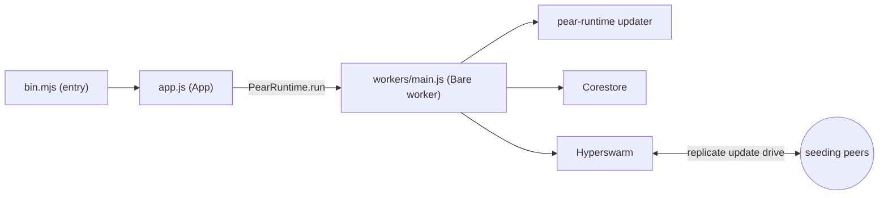

This is the terminal counterpart to [Start from the hello-pear-electron template](/pear/getting-started/from-a-template/start-from-hello-pear-electron). Instead of a desktop window, you start from a finished command-line boilerplate and learn how a Bare app wires peer-to-peer updates and replication through a worker—then ship it as a standalone binary.

[`holepunchto/hello-pear-bare`](https://github.com/holepunchto/hello-pear-bare) is Holepunch's official boilerplate for peer-to-peer terminal applications. Where the Electron template embeds [`pear-runtime`](/pear/reference/pear/runtime) into Electron, this template embeds it into [Bare](/bare/reference/modules/bare-modules), the zero-core embeddable JavaScript runtime. The application and runtime compile into a single standalone executable per OS and architecture with no peer dependencies—no Node.js, and no Bare or [Pear CLI](/pear/reference/pear/cli) required on the user's machine.

With this shape you can build CLIs, REPLs, TUIs, services and daemons, or transport hooks—anything headless—and ship it with peer-to-peer over-the-air (OTA) updates. The Pear CLI v3 is built on this same architecture: a Bare standalone executable that updates itself peer-to-peer through `pear-runtime`.

<include>../../../_snippets/_p2p-intro-callout.mdx</include>

Take this path when you want to distribute a terminal app as a single executable and update it over the air.
If you want to build a desktop app instead, follow the [hello-pear-electron template](/pear/getting-started/from-a-template/start-from-hello-pear-electron).

<include>../../../_snippets/_install-pear-cli-callout.mdx</include>

<include>../../../_snippets/_interactive-menu-callout.mdx</include>

## Clone and run

### 1. Clone the repository

Clone the repository and install dependencies with the following commands:

```bash
git clone https://github.com/holepunchto/hello-pear-bare
cd hello-pear-bare
npm install
```

### 2. Create a valid `upgrade` link

The template ships with a placeholder `upgrade` link in `package.json`. Until you replace it, startup fails with `INVALID_URL`. Create a real link with [`pear touch`](/pear/reference/pear/cli#pear-touch-flags):

```bash
pear touch
```

This prints a link, for example: `pear://qxenz5wmspmryjc13m9yzsqj1conqotn8fb4ocbufwtz9mtbqq5o`.

### 3. Set the `upgrade` link in `package.json`

Set the `upgrade` field in `package.json` to the link you just created:

```json
"upgrade": "pear://qxenz5wmspmryjc13m9yzsqj1conqotn8fb4ocbufwtz9mtbqq5o"
```

### 4. Run the app

`npm start` runs `bare bin.mjs --no-updates`: the process starts in development mode with over-the-air updates disabled, so a live release never swaps the binary while you work.

```bash
npm start
```

To exercise the updater locally, opt back in:

```bash
npm start -- --updates
```

## Map the template

| Path | What it is | Do you edit it? |
| --- | --- | --- |
| [`bin.mjs`](https://github.com/holepunchto/hello-pear-bare/blob/main/bin.mjs) | The entrypoint—parses CLI flags, resolves the storage path, constructs the `App`, and logs its updater events. | Yes—your startup and CLI. |
| [`app.js`](https://github.com/holepunchto/hello-pear-bare/blob/main/app.js) | The `App` class (a [`ready-resource`](https://github.com/holepunchto/ready-resource)). Spawns the Bare worker with [`PearRuntime.run`](/pear/reference/pear/runtime#running-workers), wraps its IPC in a [`FramedStream`](https://www.npmjs.com/package/framed-stream), and turns updater messages into events. | Sometimes—app lifecycle. |
| [`workers/main.js`](https://github.com/holepunchto/hello-pear-bare/blob/main/workers/main.js) | The Bare [worker](/pear/explanation/workers) that owns the peer-to-peer code and the [`pear-runtime`](/pear/reference/pear/runtime) updater. | Yes—this is your backend. |
| [`package.json`](https://github.com/holepunchto/hello-pear-bare/blob/main/package.json) | App metadata, scripts, the `upgrade` link, and the per-platform `make:*` build targets. | Yes—branding and release link. |
| [`scripts/make.js`](https://github.com/holepunchto/hello-pear-bare/blob/main/scripts/make.js) | Detects the host OS and architecture and runs the matching `make:` target. | Rarely. |
| [`test/index.js`](https://github.com/holepunchto/hello-pear-bare/blob/main/test/index.js) | The [`brittle`](https://github.com/holepunchto/brittle) test entry, run by `npm test`. | Yes—your tests. |

Like the Electron template, the peer-to-peer logic lives in a Bare [worker](/pear/explanation/workers); `bin.mjs` and `app.js` are the host that spawns it and drives updates. There's no renderer or preload bridge—your "frontend" is the terminal.

<Callout type="info">
Upstream ships the worker as the [`hello-pear-worker`](https://github.com/holepunchto/hello-pear-worker) package, so the template's `workers/main.js` is just `require('hello-pear-worker')`. That is where your peer-to-peer code goes—open [Corestore](/bare/reference/helpers/corestore) cores, join [Hyperswarm](/bare/reference/building-blocks/hyperswarm) topics, and run your protocol.
</Callout>

## How it's wired

The template is three layers: `bin.mjs` (entry + CLI), `app.js` (the host that runs the worker and updater), and the Bare [worker](/pear/explanation/workers) that holds your peer-to-peer code.

`bin.mjs` is the Bare entry process. It parses three flags with [`paparam`](https://github.com/holepunchto/paparam)—`--version`, `--storage`, and `--no-updates`—then constructs the `App`:

```js file=<rootDir>/examples/getting-started/hello-pear-bare/bin.mjs#L13-L19 title="bin.mjs"
```

It resolves a storage directory, then hands the runtime configuration to a `new App(...)`. In development (launched with `bare`) storage is a temporary directory; a packaged binary uses the persistent per-app directory from [`bare-storage`](/bare/reference/modules/bare-modules), and `--storage` overrides both—see [Storage and distribution](/pear/explanation/storage-and-distribution):

```js file=<rootDir>/examples/getting-started/hello-pear-bare/bin.mjs#L28-L41 title="bin.mjs"
```

`App` (in `app.js`) is a [`ready-resource`](https://github.com/holepunchto/ready-resource). When it opens, it spawns the Bare worker with [`PearRuntime.run`](/pear/reference/pear/runtime#running-workers)—passing the runtime config as arguments—and wraps the worker's IPC pipe in a [`FramedStream`](https://www.npmjs.com/package/framed-stream):

```js file=<rootDir>/examples/getting-started/hello-pear-bare/app.js#L20-L31 title="app.js"
```

The worker owns the peer-to-peer code and the [`pear-runtime`](/pear/reference/pear/runtime) updater. It messages the host, and `App` turns those into `updating`, `updated`, and `update-applied` events—which `bin.mjs` logs—applying each downloaded release automatically. `SIGHUP`, `SIGINT`, `SIGQUIT`, and `SIGTERM` handlers call `app.exit()` to close cleanly. For the model behind these updates, see [Pear OTA](/pear/reference/pear/runtime#updates):

```js file=<rootDir>/examples/getting-started/hello-pear-bare/bin.mjs#L43-L55 title="bin.mjs"
```



## Variants

The `main` branch above (a Bare worker thread) is one of three process shapes `holepunchto/hello-pear-bare` ships. All three share the same `upgrade` link, the same per-platform build targets, and the same [`pear install`](/pear/reference/pear/cli#pear-install)/[`pear seed`](/pear/explanation/availability-and-blind-peering#seeding-with-pear-seed) release flow. What differs is `app.js`, `bin.mjs`, and their dependencies—and **neither variant has a `workers/` directory at all**, so the `workers/main.js` row in [Map the template](#map-the-template) applies to `main` only; on both variants the peer-to-peer code and the updater live in the same process tree as the CLI. Pick the branch that matches how your CLI runs:

| Branch | Shape | Use it for |
| --- | --- | --- |
| [`main`](https://github.com/holepunchto/hello-pear-bare) (this page) | `pear-runtime` inside a Bare [worker](/pear/explanation/workers) thread | Long-lived programs (services, REPLs, TUIs) that keep peer-to-peer logic off the main thread. |
| [`variant/single-thread`](https://github.com/holepunchto/hello-pear-bare/tree/variant/single-thread) | `pear-runtime` constructed directly in the main Bare process—no worker, no IPC framing | Long-lived programs whose peer-to-peer logic doesn't need a separate thread. |
| [`variant/daemon`](https://github.com/holepunchto/hello-pear-bare/tree/variant/daemon) | `pear-runtime` runs inside a detached [`bare-daemon`](https://github.com/holepunchto/bare-daemon) process that the foreground command spawns and returns from immediately | Short-lived CLI invocations (like `git`) that shouldn't block on an update check—the command exits while the daemon updates in the background. |

Clone whichever branch fits, swapping it into step 1 of [Clone and run](#clone-and-run):

```bash
git clone -b variant/single-thread https://github.com/holepunchto/hello-pear-bare
```

### `single-thread`

Same `App` [`ready-resource`](https://github.com/holepunchto/ready-resource) shape as `main`, emitting the `updating`, `updated`, `update-applied`, and `error` events `bin.mjs` logs—plus `updating-delta`, which carries download progress and which `main`'s worker never actually forwards. (`main` also emits a generic `message` event for anything else the worker writes over the pipe; with no worker, single-thread has no equivalent.) The difference is in `_open()`, which constructs `PearRuntime` directly instead of spawning a worker and wrapping its IPC in a `FramedStream`:

```js file=<rootDir>/examples/getting-started/hello-pear-bare-single-thread/app.js#L23-L41 title="app.js"
```

See [`app.js`](https://github.com/holepunchto/hello-pear-bare/blob/variant/single-thread/app.js) on the `variant/single-thread` branch for the full file.

### `daemon`

`bin.mjs` spawns a **detached** updater and returns immediately—the foreground command never blocks on the network:

```js file=<rootDir>/examples/getting-started/hello-pear-bare-daemon/bin.mjs#L50-L57 title="bin.mjs"
```

`App.spawnUpdater` re-invokes the same executable with a hidden `--updater` flag through [`bare-daemon`](https://github.com/holepunchto/bare-daemon):

```js file=<rootDir>/examples/getting-started/hello-pear-bare-daemon/app.js#L11-L18 title="app.js"
```

The daemon acquires an `updater.lock` file in the storage directory—via [`fs-native-extensions`](https://github.com/holepunchto/fs-native-extensions)—so only one updater runs per storage directory at a time, and logs to `<storage>/updates.log` instead of stdout, since nothing is attached to read it.

`--update-window` (default `30000`, in milliseconds) bounds only how long the daemon waits for a download to **start**. Once one starts, it stays alive until the update is applied or errors out, however long that takes. See [`app.js`](https://github.com/holepunchto/hello-pear-bare/blob/variant/daemon/app.js) and [`bin.mjs`](https://github.com/holepunchto/hello-pear-bare/blob/variant/daemon/bin.mjs) on the `variant/daemon` branch for the full files.

Give a run longer to pick up a download before the daemon gives up:

```bash
npm start -- --updates --update-window 60000
```

<Callout type="warn">
Two steps from [Clone and run](#clone-and-run) behave differently on this branch. `npm start` **returns immediately** rather than staying up, so there is no `Ctrl+C` to press. And because the foreground process never constructs [`pear-runtime`](/pear/reference/pear/runtime), an unreplaced placeholder `upgrade` link does **not** fail with `INVALID_URL` in your terminal—the detached updater writes that error to `<storage>/updates.log`. Check that file first whenever updates appear not to run.
</Callout>

## Build a standalone binary

[`bare-build`](https://github.com/holepunchto/bare-build) compiles `bin.mjs` and its dependencies into a single standalone executable with no peer dependencies—users don't need Node.js, Bare, or the [Pear CLI](/pear/reference/pear/cli) installed. Build for your current host with:

```bash
npm run make
```

`scripts/make.js` detects your OS and architecture and runs the matching target, writing the binary to `out/<platform>-<arch>`. To build for a specific target—for example, in CI—call that target directly:

```bash
npm run make:darwin-arm64
```

The template ships a target for every supported platform:

- **macOS**: `darwin-arm64`, `darwin-x64`
- **Linux**: `linux-arm64`, `linux-x64`
- **Windows**: `win32-arm64`, `win32-x64`

Build each platform's binary on a matching host.

## Install over the air

Distribute the executable through the usual channels—a download on your website, `apt`, or Homebrew.
You can also install it peer-to-peer: once your `upgrade` link is [seeding](/pear/explanation/availability-and-blind-peering#seeding-with-pear-seed) a release, pull it directly with the [`pear install`](/pear/reference/pear/cli#pear-install) command:

```bash
pear install pear://<key>
```

After the first install, new releases reach users through the swarm—no reinstall needed. For how staging and seeding work, see [Deploy your application](/pear/how-to/operate-an-app/manual-deployment/deployment) and [Installing applications](/pear/explanation/storage-and-distribution#installing-applications).

## Example: add a flag

The boilerplate is a minimal CLI plus updater; `bin.mjs` holds the CLI and startup logic (your peer-to-peer code lives in the [worker](/pear/explanation/workers)). Flags are parsed with `paparam`, so adding one is a two-line change. Add a `--name` flag to the command definition:

```diff
 const cmd = command(
   appName,
   summary(pkg.description),
   flag('--version|-v', 'Print the current version'),
   flag('--storage <dir>', 'custom storage directory'),
-  flag('--no-updates', 'disable OTA updates for this run')
+  flag('--no-updates', 'disable OTA updates for this run'),
+  flag('--name <name>', 'who to greet on startup')
 )
```

Then log the greeting after the other startup logs:

```diff
 console.log(`Updates: ${updates === false ? 'disabled' : 'enabled'}`)
+
+if (cmd.flags.name) console.log(`Hello, ${cmd.flags.name}!`)
```

Run `npm start -- --name YourName`, and the process greets you on boot. That is the CLI layer in `bin.mjs`; your real peer-to-peer features go in the [worker](/pear/explanation/workers) (`workers/main.js`): 
* open a [Corestore](/bare/reference/helpers/corestore) core, 
* join a [Hyperswarm](/bare/reference/building-blocks/hyperswarm) topic, and 
* run your protocol. 

Reuse the storage directory the host passes to the worker so your data lands alongside the updater's—see [Storage and distribution](/pear/explanation/storage-and-distribution).

## Customize for your brand

Before you ship, set your identity in `package.json`:

- `name`, `productName`, `description`, `author`, and `license`.
- the `upgrade` `pear://` link (see [Create a valid upgrade link](#2-create-a-valid-upgrade-link)).

`bin.mjs` reads `productName || name` for both the binary name and the persistent storage directory, so set these before your first release. Then build with `npm run make` and release with [Deploy your application](/pear/how-to/operate-an-app/manual-deployment/deployment).

## Where to go next

- [Start from a template](/pear/getting-started/from-a-template)—both boilerplates, side by side.
- [Start from the hello-pear-electron template](/pear/getting-started/from-a-template/start-from-hello-pear-electron)—the desktop counterpart, with a renderer, preload bridge, and Bare worker.
- [Inside Bare](/bare/explanation/bare-runtime)—what the runtime this template builds on actually is, and its lifecycle.
- [How Pear and Bare fit together](/pear/explanation/pear-and-bare)—where Bare and Pear sit relative to each other.
- [Runtime and languages](/pear/explanation/runtime-and-languages)—where Bare fits among Pear's runtimes.
- [Bundle a Bare app](/bare/how-to/run-on-native/bundle-a-bare-app)—the `bare-pack` and `bare-build` paths behind `npm run make`.
- [Bare modules](/bare/reference/modules/bare-modules)—the Bare standard library this template builds on.
- [Pear OTA](/pear/reference/pear/runtime)—the `pear-runtime` API behind the updater.
- [Migrate from pear run to Pear OTA](/pear/how-to/operate-an-app/migration)—if you're moving an existing app onto `pear-runtime`.
- [Publish with GitHub Actions](/pear/how-to/operate-an-app/github-actions/publish-with-github-actions)—stage a stable `pear://` link on every push with the `pear-ci` action.
- [Deploy your application](/pear/how-to/operate-an-app/manual-deployment/deployment)—the full-control manual path for staging, provisioning, and release lines.
- [Seeding with `pear seed`](/pear/explanation/availability-and-blind-peering#seeding-with-pear-seed)—keep your `pear://` link online so peers can fetch releases.
