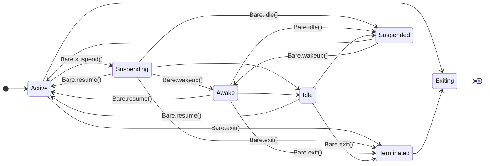

<mark style={{ backgroundColor: '#7dde9a', padding: '2px 8px', borderRadius: '4px', fontSize: '0.85em', fontWeight: 500 }}>stable</mark>

The core JavaScript API of [Bare](/explanation/bare-runtime) is exposed through the global `Bare` namespace. This page documents that surface. For the command-line runner, see the [`bare` CLI](/reference/bare/cli); for the standard-library modules layered on top, see [Bare modules](/reference/modules/bare-modules).

## Process properties

#### `Bare.platform`

The operating system Bare was compiled for. One of `android`, `darwin`, `ios`, `linux`, `win32`.

#### `Bare.arch`

The processor architecture Bare was compiled for. One of `arm`, `arm64`, `ia32`, `mips`, `mipsel`, `riscv64`, `x64`.

#### `Bare.argv`

The command-line arguments passed to the process when launched.

#### `Bare.pid`

The ID of the current process.

#### `Bare.exitCode`

The code returned once the process exits. If the process exits via `Bare.exit()` without a code, `Bare.exitCode` is used.

#### `Bare.version`

The Bare version string.

#### `Bare.versions`

An object of version strings for Bare and its dependencies.

## Lifecycle methods

#### `Bare.exit([code])`

Immediately terminate the process or current thread with exit status `code`, defaulting to `Bare.exitCode`.

#### `Bare.suspend([linger])`

Suspend the process and all threads, emitting a `suspend` event so work can stop. When no work remains and the process would otherwise exit, an `idle` event is emitted and the loop blocks instead of exiting.

#### `Bare.wakeup([deadline])`

Wake the process and all threads during suspension, emitting a `wakeup` event. Work may run until `deadline`, after which the process suspends again.

#### `Bare.idle()`

Immediately suspend the event loop and trigger the `idle` event.

#### `Bare.resume()`

Resume the process and all threads after suspension, emitting a `resume` event. May be called from a `suspend`, `wakeup`, or `idle` listener to cancel suspension.

## Events

Listeners attach with `Bare.on(event, listener)`.

#### `uncaughtException`— `(err)`

A JavaScript exception was thrown without being caught. By default uncaught exceptions are printed to `stderr` and the process is aborted; adding a listener overrides that default.

#### `unhandledRejection`— `(reason, promise)`

A promise was rejected without being handled. Default behaviour (print to `stderr`, abort) is overridden by adding a listener.

#### `beforeExit`— `(code)`

Emitted when the loop runs out of work, before the process or thread exits. Scheduling more work here keeps the process alive and re-arms the event. Not emitted on explicit `Bare.exit()` or an uncaught exception.

#### `exit`— `(code)`

Emitted when the process or thread exits.

<Callout type="warn">
Additional work **must not** be scheduled from an `exit` listener. If the process is forcefully terminated from within an `exit` listener, the remaining listeners will not run.
</Callout>

#### `suspend`— `(linger)`, `wakeup`— `(deadline)`, `idle`— `()`, `resume`— `()`

The lifecycle events described under [Lifecycle methods](#lifecycle-methods). Defer or pause outstanding work on `suspend`, do bounded work on `wakeup`, expect the loop to block after `idle`, and continue work on `resume`. A listener may call `Bare.resume()` to cancel the suspension before it completes.

## Lifecycle

Bare exposes process suspension so it can behave on platforms with strict application-lifecycle rules—mobile in particular. A suspended loop stays alive but idle rather than exiting, and can be woken for bounded bursts of work. The same transitions are available from C (`bare_suspend()`, `bare_wakeup()`, `bare_resume()`) and from JavaScript.



For the rationale, see [Inside Bare](/explanation/bare-runtime#the-lifecycle); for driving it from a native host, see [One core, many platforms](/explanation/bare-on-native).

## `Bare.Addon`

Loads native addons—typically C/C++ shared libraries.

<Callout type="info">
This is an advanced API most users never touch directly; native addons are normally loaded for you by the modules that need them.
</Callout>

- `Addon.cache`— the global cache of loaded addons.
- `Addon.host`— the target triplet identifying the current addon host.
- `Addon.resolve(specifier, parentURL[, options])`— resolve a native-addon specifier to a `url`.
- `Addon.load(url[, options])`— load a static or dynamic addon. Returns an `addon` with `addon.url` and `addon.exports`.

## `Bare.Thread`

Lightweight threads with synchronous joins—similar to Node.js workers but with a minimal surface.

- `Thread.isMainThread`— `true` on the main thread.
- `Thread.self`— the current thread as a `ThreadProxy`, or `null` on the main thread. `Thread.self.data` is the data passed on creation.
- `new Thread([filename][, options][, callback])` (or `Thread.create(...)`)— start a thread running `filename`. If `callback` is given, its body runs on the new thread with `Thread.self.data` as its argument. Options: `data`, `transfer`, `source`, `encoding`, `stackSize`.
- `thread.joined`— whether the thread has been joined.
- `thread.join()`— block until the thread exits.
- `thread.suspend([linger])`, `thread.wakeup([deadline])`, `thread.resume()`, `thread.terminate()`— drive the thread's lifecycle, equivalent to calling the matching `Bare.*` method inside it.

Higher-level worker threads are available in [`bare-worker`](/reference/modules/bare-modules).

## `Bare.IPC`

Optional streaming communication between an embedder and JavaScript. Defaults to `null`, meaning no streaming channel is set. When an embedder provides one, `Bare.IPC` is a [`bare-stream`](/reference/modules/bare-modules) `Duplex`. The higher-level [`bare-kit`](/reference/bare/bare-kit) IPC abstraction is built on this.

## Embedding

Bare can be embedded with the C API in [`include/bare.h`](https://github.com/holepunchto/bare/blob/main/include/bare.h):

```c
#include <bare.h>
#include <uv.h>

bare_t *bare;
bare_setup(uv_default_loop(), platform, &env /* Optional */, argc, argv, options, &bare);
bare_load(bare, filename, source, &module /* Optional */);
bare_run(bare, UV_RUN_DEFAULT);

int exit_code;
bare_teardown(bare, UV_RUN_DEFAULT, &exit_code);
```

If `source` is `NULL`, the contents of `filename` are read at runtime. For platform shells that wrap this API, see [`bare-ios`](https://github.com/holepunchto/bare-ios) and [`bare-android`](https://github.com/holepunchto/bare-android), or use [`bare-kit`](/reference/bare/bare-kit), which packages embedding behind a worklet API.

## See also

- [Inside Bare](/explanation/bare-runtime)—what the runtime adds and why.
- [`bare` CLI](/reference/bare/cli)—run scripts and start a REPL.
- [`bare-kit` reference](/reference/bare/bare-kit)—embed a Bare worklet in a native app.
- [Bare modules](/reference/modules/bare-modules)—the `bare-*` standard library.
