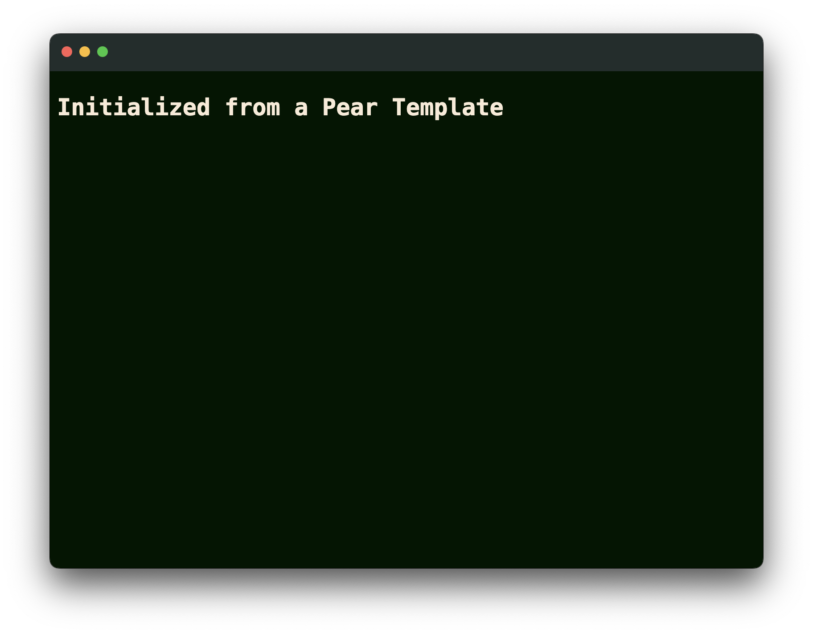

# Creating a Pear Init Template

This guides describes how to create a [`pear init`](../reference/pear/cli.md#pear-init-flags-linktypedesktop-dir) template which can be used to initialize a new Pear application. 

## Folder Structure

A template can be initialized from a local directory or P2P (Peer-to-Peer) using a `pear://` link.

A template folder should contain : 
* a `_template.json` file which describes the prompt structure.
* a `package.json` file which contains config parameters to be populated from the prompts.

> Note that optionally, if the `package.json` of the parent contains a `main` field it should specify a `__main__` file and a `main` parameter in the `_template.json` file. 

Create a template folder called `example` in the project directory, inside the folder create the new files. 

```bash
mkdir example
cd example
touch index.html package.json _template.json
```

## Template Structure 

Let's define the prompt structure in `_template.json`

### Parameter Object

Each parameter object in the `params` array defines a specific input parameter. 

```json
{
  "params": [
      {
        "name": "name",
        "prompt": "name"
      }
    // parameter objects....
  ]
}
```

Here are the possible fields for a parameter object:

### Required Fields

- `name` (string): The identifier for the parameter. This should be unique within the template.
- `prompt` (string): The text prompt that will be displayed to the user when asking for input for this parameter.

### Optional Fields

- `default` (any): The default value for the parameter if no input is provided.
- `validation` (string): A JavaScript function as a string that validates the input. It should return `true` for valid input and `false` for invalid input.
- `msg` (string): An error message to display if the validation fails.

### Example

Here's an example of a complete parameter object:

```json
{
  "name": "main",
  "default": "index.html",
  "prompt": "Enter the main HTML file name",
  "validation": "(value) => value.endsWith('.html')",
  "msg": "must have an .html file extension"
}
```

This parameter:
- Has the name "main"
- Defaults to "index.html" if no input is provided
- Prompts the user to enter the main HTML file name
- Validates that the input ends with ".html"
- Displays an error message if the validation fails

Replace the contents of `_template.json` with 

```json
{
  "params": [
    {
      "name": "name",
      "prompt": "name"
    },
    {
      "name": "main",
      "default": "index.html",
      "prompt": "main",
      "validation": "(value) => value.endsWith('.html')",
      "msg": "must have an .html file extension"
    },
    {
      "name": "height",
      "validation": "(value) => Number.isInteger(+value)",
      "prompt": "height",
      "msg": "must be an integer"
    },
    {
      "name": "width",
      "validation": "(value) => Number.isInteger(+value)",
      "prompt": "width",
      "msg": "must be an integer"
    },
    {
      "name": "license",
      "default": "Apache-2.0",
      "prompt": "license"
    }
  ]
}
```

## App Content

Replace the contents of `index.html` file with :

```html
<!DOCTYPE html>
<html>
<head>
  <style>
    body > h1:nth-of-type(1) {
      cursor: pointer
    }

    body {
      --title-bar-height: 42px;
      padding-top: var(--title-bar-height);
      background-color: #001601;
      font-family: monospace;
    }

    h1 {
      color: antiquewhite;
    }

    #bar {
      background: rgba(55, 60, 72, 0.6);
      backdrop-filter: blur(64px);
      -webkit-app-region: drag;
      height: var(--title-bar-height);
      padding: 0;
      border-top-left-radius: 8px;
      border-top-right-radius: 8px;
      color: #FFF;
      white-space: nowrap;
      box-sizing: border-box;
      position: fixed;
      z-index: 2;
      width: 100%;
      left: 0;
      top: 0;
    }

    pear-ctrl[data-platform=darwin] {
      margin-top: 18px;
      margin-left: 12px;
    }
  </style>
</head>
<body>
  <div id="bar"><pear-ctrl></pear-ctrl></div>
  <h1>Initialized from a Pear Template</h1>
</body>
</html>
```

Temporarily set the contents of `package.json` to:

```json
{
  "pear": {
    "name": "pear-init-template-tutorial",
    "type": "desktop"
  }
}
```

This is the minimal requirements for a Pear Application `package.json` to run.
This will allow us to test the template's `index.html` as a pear desktop
app.

Run the application using:

```bash
pear run --dev .
```



## Config file

Replace the contents of `package.json` with :

```json
{
  "name": "__name__",
  "pear": {
    "name": "__name__",
    "type": "desktop",
    "gui": {
      "backgroundColor": "#1F2430",
      "height": "__height__",
      "width": "__width__"
    }
  },
  "type": "module",
  "license": "__license__",
  "scripts": {
    "dev": "pear run -d .",
    "test": "brittle test/*.test.js"
  },
  "devDependencies": {
    "brittle": "^3.0.0",
    "pear-interface": "^1.0.0"
  }
}
```
> Note that any field that is supposed to be populated from the prompts has the value surrounded by double underscores i.e `__fieldName__`

## Initializing a new project

Go to a new project directory and use `pear init` to initialize from the created template.

Run the following command :

```bash
pear init [dir]
```

Here replace `[dir]` with the local template directory path. This can also be a `pear://` link.

This should now initialize a new Pear project from the created template.
