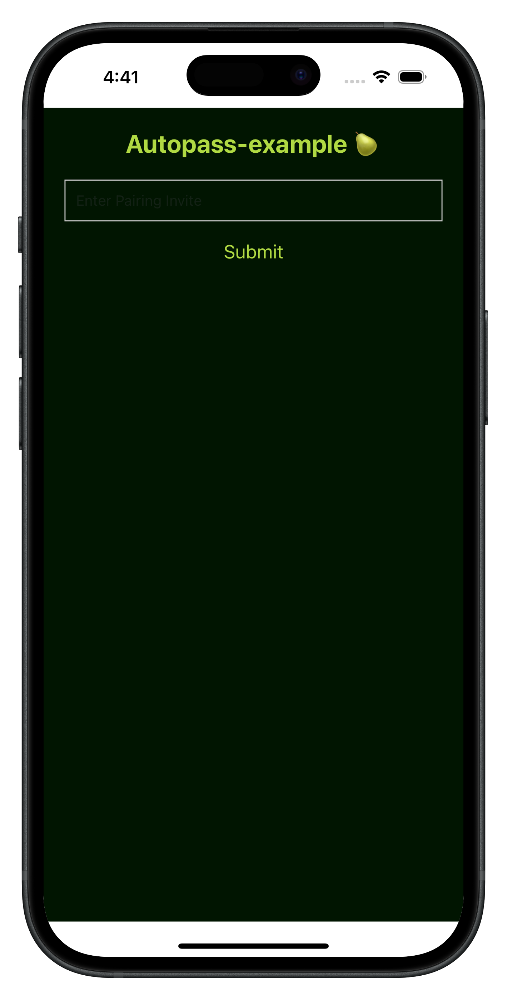

# Making a Bare Mobile Application

This guide demonstrates how to build and run a mobile application using [Bare and Expo](https://github.com/holepunchto/bare-expo).

We will be building an application that syncs data from the [Pearpass desktop application](https://github.com/holepunchto/pearpass-example/) using [autopass](https://github.com/holepunchto/autopass) and displaying a list of the passwords on mobile.

## Project Dependencies

1. Gradle version 8.10.2
2. Java 23
3. Android SDK (>= 29), NDK

## Project Setup

We will use the `bare-expo` template to build our application. To get started, first clone it with git in a new directory:

```bash
git clone https://github.com/holepunchto/bare-expo.git autopass-mobile-example
```

Change to the project directory:

```bash
cd autopass-mobile-example
```

And install the dependencies we will need:

```bash
npm i b4a bare-fs bare-rpc corestore autopass @react-native-clipboard/clipboard graceful-goodbye
```

```bash
npm i bare-pack @types/b4a --save-dev
```

## Directory Structure

`bare-expo` is a basic template for getting started with Bare applications on mobile. To build a "Pear-end", where the peer-to-peer (P2P) code of the application is run, we will change the directory structure a bit adding a dedicated directory for the Pear-end.

Create a new directory called `backend`. This is where we will store our Pear-end code that will be run by Bare.

```bash
mkdir backend
```

Create a new file `backend.mjs` in the `backend` directory, we will use this file as the entry point for anything P2P. All Bare code should be used here.

```bash
touch backend/backend.mjs
```

Our React Native UI code will go in the existing `app/index.tsx` file.

Finally we will use an RPC to communicate between React Native and the Pear-end.
To define a common set of command ids we create a `rpc-commands.mjs`.

```bash
touch rpc-commands.mjs
```

## Building the Application

### Building the UI

The `app/index.tsx` file that came with the `bare-expo` template serves as the entry point of the UI of the React Native app.

Replace the contents of `app/index.tsx` with:

```typescript
import React, { useState } from 'react'
import {
  View,
  Text,
  TextInput,
  Button,
  FlatList,
  Alert,
  StyleSheet
} from 'react-native'
import { documentDirectory } from 'expo-file-system'
import Clipboard from '@react-native-clipboard/clipboard'
import { Worklet } from 'react-native-bare-kit'
import bundle from './app.bundle.mjs'
import RPC from 'bare-rpc'
import b4a from 'b4a'
import { RPC_RESET, RPC_MESSAGE } from '../rpc-commands.mjs'

type PasswordEntry = {
  username: string
  password: string
  website: string
}

export default function App() {
  const [dataList, setDataList] = useState<PasswordEntry[]>([])
  const [pairingInvite, setPairingInvite] = useState('') // State for pairing invite
  const [isWorkletStarted, setIsWorkletStarted] = useState(false) // State to track worklet status

  const startWorklet = () => {
    const worklet = new Worklet()

    // Correctly passing the args to worklet.start
    worklet.start('/app.bundle', bundle, [String(documentDirectory), pairingInvite])
    const { IPC } = worklet
    // Initialise RPC
    new RPC(IPC, (req) => {
      // Handle incoming RPC requests

      if (req.command === RPC_MESSAGE) {
        const data = b4a.toString(req.data)
        const parsedData = JSON.parse(data) // Assuming data is a JSON string
        const entry: PasswordEntry = {
          username: parsedData[1],
          password: parsedData[2],
          website: parsedData[3]
        }
        // Update the dataList with the received entry
        setDataList((prevDataList) => [...prevDataList, entry])
      }

      if (req.command === RPC_RESET) {
        setDataList(() => [])
      }
    })

    setIsWorkletStarted(true) // Mark worklet as started
  }

  const copyToClipboard = (item: PasswordEntry) => {
    Clipboard.setString(item.password) // Copy password to clipboard
    Alert.alert('Copied to Clipboard', item.password)
  }

  return (
    <View style={styles.container}>
      <Text style={styles.heading}>Autopass-example 🍐</Text>
      {!isWorkletStarted ? ( // Show input if worklet hasn't started
        <>
          <TextInput
            style={styles.input}
            placeholder='Enter Pairing Invite'
            value={pairingInvite}
            onChangeText={setPairingInvite}
          />
          <Button title='Submit' onPress={startWorklet} color='#b0d943' />
        </>
      ) : (
        <FlatList
          data={dataList}
          keyExtractor={(_, index) => index.toString()}
          renderItem={({ item }) => (
            <View style={styles.dataItem}>
              <Text style={styles.itemText}>Username: {item.username}</Text>
              <Text style={styles.itemText}>Password: {item.password}</Text>
              <Text style={styles.itemText}>Website: {item.website}</Text>
              <Button
                title='Copy Password'
                onPress={() => copyToClipboard(item)}
                color='#b0d943'
              />
            </View>
          )}
        />
      )}
    </View>
  )
}

const styles = StyleSheet.create({
  container: {
    flex: 1,
    backgroundColor: '#011501',
    padding: 20
  },
  heading: {
    fontSize: 24,
    fontWeight: 'bold',
    color: '#b0d943',
    textAlign: 'center',
    marginBottom: 20
  },
  input: {
    height: 40,
    borderColor: '#ccc',
    borderWidth: 1,
    marginBottom: 10,
    paddingHorizontal: 10,
    color: '#333'
  },
  dataItem: {
    padding: 10,
    backgroundColor: '#f0f0f0',
    marginVertical: 5,
    borderRadius: 5
  },
  itemText: {
    fontSize: 16,
    color: '#333'
  }
})
```

### Building the Pear-end

Add the following code to `backend/backend.mjs`:

```js
// /* global Bare, BareKit */

import RPC from 'bare-rpc'
import fs from 'bare-fs'
import URL from 'bare-url'
import goodbye from 'graceful-goodbye'
import { join } from 'bare-path'
import { RPC_RESET, RPC_MESSAGE } from '../rpc-commands.mjs'

import Autopass from 'autopass'
import Corestore from 'corestore'
const { IPC } = BareKit

const path = join(URL.fileURLToPath(Bare.argv[0]), 'autopass-example')

const rpc = new RPC(IPC, (req, error) => {
  // Handle two way communication here
})

// For a clean start
if (fs.existsSync(path)) {
  fs.rmSync(path, {
    recursive: true,
    force: true
  })
}

fs.mkdirSync(path)
const invite = Bare.argv[1]
const pair = Autopass.pair(new Corestore(path), invite)
const pass = await pair.finished()
goodbye(() => pass.close())

await pass.ready()

pass.on('update', async (e) => {
  const req = rpc.request(RPC_RESET)
  req.send('data')

  for await (const data of pass.list()) {
    const value = JSON.parse(data.value)

    if (value[0] === 'password') {
      const req = rpc.request(RPC_MESSAGE)
      req.send(JSON.stringify(value))
    }
  }
})
```

Finally define the RPC command enums in `rpc-commands.mjs`:

```js
export const RPC_RESET = 0
export const RPC_MESSAGE = 1
```

## Bundling the Pear-end

Now we need to create a bundle with all of our Pear-end code, dependencies and references to native addon libraries so that Bare has everything it needs to run our code.

To create the bundle we will use `bare-pack`. Mobile apps link the native addons ahead of time, so we can target only the platform and use the `--linked` option to use those linked libraries. You can learn more about bundling with `bare-pack` [here](https://github.com/holepunchto/bare-pack).

To create a bundle that targets both iOS and Android, run:

```bash
npx bare-pack --target ios --target android  --linked --out app/app.bundle.mjs backend/backend.mjs
```

This will create a bundle and store it under the `app` directory as `app.bundle.mjs` which is imported by the UI.

## Running the application



### iOS

```bash
npm run ios
```

### Android

```bash
npm run android
```

## Viewing error logs

Any React Native error will be directly printed to the terminal. Bare (Pear-end) errors will not appear directly in the terminal but they can be viewed using `logcat` when running the app on Android.

To view logs while running on iOS on macOS use the built-in [Console.app](https://support.apple.com/en-in/guide/console/cnsl1012/mac) or the `log` tool using the predicate `subsystem == 'bare'`.

```bash
log stream --level=debug --predicate "subsystem == 'bare'"
```

For more information on consuming logs, see the [`liblog` README](https://github.com/holepunchto/liblog?tab=readme-ov-file#consuming-logs).

## Explanation

React Native uses Hermes as its Javascript engine by default. Hermes however does not support User Datagram Protocol (UDP) and the low level control needed for P2P applications. That's where Bare comes in. It provides simple ABI stable native bindings ([`libjs`](https://github.com/holepunchto/libjs)) that the Pear platform stack takes advantage of so you can write Javascript once and run it everywhere.

### `app/index.tsx`

```typescript
import { Worklet } from 'react-native-bare-kit'
```

In order to create a Bare thread, we import the `Worklet` class from `react-native-bare-kit`. This class is what we use to create a Bare thread and is where the Pear-end (P2P) code is run.

```typescript
import bundle from './app.bundle'
```

`app.bundle` was created while [bundling the Pear-end](#Bundling-the-Pear-end). This bundle contains all of our dependencies and the code from `app/backend.mjs` in a single file. We import this bundle so we can pass it to the worklet as the source to run.

```typescript
import RPC from 'bare-rpc'
```

[`bare-rpc`](https://github.com/holepunchto/bare-rpc/) provides a remote procedure call (RPC) on top of `react-native-bare-kit`'s inter-process communication (IPC) stream to communicate between the React Native UI and the Pear-end.

```typescript
import b4a from 'b4a'
```

`b4a` is a module for creating buffers using `Uint8Array`s where `Buffer`s are not available. We use this to decode the request data sent via the `bare-rpc` from the Pear-end.

```typescript
const worklet = new Worklet()
```

Creates a new `worklet` object, ideally we should only create a single worklet.

```typescript
worklet.start('/app.bundle', bundle, [String(documentDirectory), pairingInvite])
```

Here we start our worklet with the bundle we imported in the previous step. The `'/app.bundle'` is the filename for the bundle, `bundle` is the bundled source that we imported and `[String(documentDirectory), pairingInvite]` are the arguments to be passed to the Bare runtime. These arguments will be available to the Bare process as soon as it starts in `Bare.argv[]`.

```typescript
const { IPC } = worklet
```

Once the worklet has started, we can use its IPC stream to communicate between the UI and Pear-end, but using an RPC on top of the IPC is often easier.

```typescript
new RPC(IPC, (req) => {
  // Handle incoming RPC requests
})
```

To that end, we create an RPC passing it the IPC stream and defining an `onrequest` callback for when a request is received from the other end.

```typescript
if (req.command === RPC_MESSAGE) {
  const data = b4a.toString(req.data)
  const parsedData = JSON.parse(data) // Assuming data is a JSON string
  // Use the parsedData...
}
```

Inside the callback, we respond to the request by first checking which command we received and then processing its data. If you need to reply to a command, you can also `req.reply(data)`.

### `backend/backend.mjs`

```js
import RPC from 'bare-rpc'
import fs from 'bare-fs'

import Autopass from 'autopass'
import Corestore from 'corestore'
const { IPC } = BareKit
```

Here we import all necessary modules and define `IPC` getting it from `BareKit`. _BareKit and Bare are global in this file and available by default._

```js
Bare.argv[0]
```

As previously mentioned, arguments passed to the worklet are available in the `Bare.argv` property. So `Bare.argv[0]` contains the first argument passed to the Bare worklet.

```js
const pair = Autopass.pair(new Corestore(path), invite)
```

Start the pairing process with the other Autopass instance using the invite passed to the worklet. Checkout the `autopass` [README](https://github.com/holepunchto/autopass) to learn more.

```js
const req = rpc.request(RPC_RESET)
req.send('data')
```

Create a new RPC request, and send it with `'data'`, this will be received by the UI in the RPC's `onrequest` callback.
