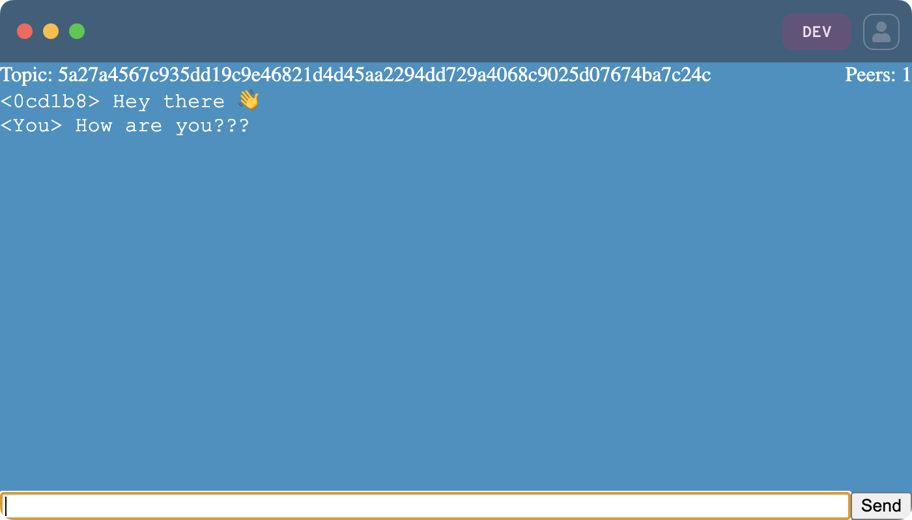

# Making a Pear Application

## Step 1. Install modules

This app uses these modules: `hyperswarm`, `hypercore-crypto`, and `b4a`.

```
$ npm i hyperswarm hypercore-crypto b4a
```

**Note**: If the modules are installed while the app is running an error is thrown similar to `Cannot find package 'hyperswarm' imported from /app.js`. When installing modules, close down the app, before they can be installed.

- [hyperswarm](https://www.npmjs.com/package/hyperswarm). One of the main building blocks. Find peers that share a "topic".
- [hypercore-crypto](https://www.npmjs.com/package/hypercore-crypto). A set of crypto function used in Pear.
- [b4a](https://www.npmjs.com/package/b4a). A set of functions for bridging the gap between the Node.js `Buffer` class and the `Uint8Array` class.

## Step 2. Write the javascript code, using `hyperswarm`

Open `app.js` in a code editor and replace with this:

``` js
import { teardown } from 'pear'
import Hyperswarm from 'hyperswarm'
import crypto from 'hypercore-crypto'
import b4a from 'b4a'

const swarm = new Hyperswarm()

// Unnannounce the public key before exiting the process
// (This is not a requirement, but it helps avoid DHT pollution)
teardown(() => swarm.destroy())

// When there's a new connection, listen for new messages, and add them to the UI
swarm.on('connection', peer => {
  const name = b4a.toString(peer.remotePublicKey, 'hex').substr(0, 6)
  peer.on('data', message => onMessageAdded(name, message))
})

// When there's updates to the swarm, update the peers count
swarm.on('update', () => {
  document.querySelector('#peers-count').textContent = swarm.connections.size
})

document.querySelector('#create-chat-room').addEventListener('click', createChatRoom)
document.querySelector('#join-chat-room').addEventListener('click', joinChatRoom)
document.querySelector('#message-form').addEventListener('submit', sendMessage)

async function createChatRoom() {
  // Generate a new random topic (32 byte string)
  const topicBuffer = crypto.randomBytes(32)
  joinSwarm(topicBuffer)
}

async function joinChatRoom() {
  const topicStr = document.querySelector('#join-chat-room-topic').value
  const topicBuffer = b4a.from(topicStr, 'hex')
  joinSwarm(topicBuffer)
}

async function joinSwarm(topicBuffer) {
  document.querySelector('#setup').classList.add('hidden')
  document.querySelector('#loading').classList.remove('hidden')

  // Join the swarm with the topic. Setting both client/server to true means that this app can act as both.
  const discovery = swarm.join(topicBuffer, { client: true, server: true })
  await discovery.flushed()

  const topic = b4a.toString(topicBuffer, 'hex')
  document.querySelector('#chat-room-topic').innerText = topic
  document.querySelector('#loading').classList.add('hidden')
  document.querySelector('#chat').classList.remove('hidden')
}

function sendMessage(e) {
  const message = document.querySelector('#message').value
  document.querySelector('#message').value = ''
  e.preventDefault()

  onMessageAdded('You', message)

  // Send the message to all peers (that you are connected to)
  const peers = [...swarm.connections]
  peers.forEach(peer => peer.write(message))
}

function onMessageAdded(from, message) {
  const $div = document.createElement('div')
  $div.textContent = `<${from}> ${message}`
  document.querySelector('#messages').appendChild($div)
}
```

## Step 3. Update gui settings

To make sure that the app looks the way intended, update the `pear` property in `package.json`. See all the possibly options in the [reference doc](../reference/configuration.md).

Open `package.json` and update the `"pear"` property:

```
{
  ...
  "pear": {
    "gui": {
      "backgroundColor": "#1F2430",
      "height": 540,
      "width": 720
    }
  }
  ...
}
```

## Step 4. Run the app

Now it's time to write the app.

As there will be two apps running, open two terminals, and run this in both of them:

```
$ pear dev
```

In the first app, click on `Create chat room`. When it has started the topic is at the top. This is a 32 byte public key that counts as the shared topic.

In the second app, paste in the topic that was shown in the first app, and then click on `Join chat room`.

<p align="center">
   
</p>

After that the two apps are able to send messages between them

View from the first app

<p align="center">
   
</p>


## Understanding the code

Looking through the code, a great part of it has to do with handling the layout. It's outside of the scope of this tutorial to delve into that, but shouldn't look unfamiliar to most. It's possible to use larger frameworks like React, but that won't be covered here.

There are two main differences between a more common client-server chat app vs this peer-to-peer chat app

### 1. Discovery

In a traditional client-server setup the server is hosted on an ip (or hostname) and a port, e.g. `http://localhost:3000`. This is what clients use to connect to the server.

In the code it says `swarm.join(topicBuffer, { client: true, server: true })`. Here `topicBuffer` is a 32 byte string. The creator of a chat room will generate a random byte string, which they will share with others, who can then join.

### 2. No servers

When the chat app was started there wasn't one of them that acting as a server, and another as a client. Instead they join/leave topics. This is an important point, because it means that even if the peer that created a chat room leaves, then it doesn't stop working.

## Next

Everything is starting to look good, and now that there's a running app, it's time to learn how we [share it with others](./sharing-a-pear-app.md).
