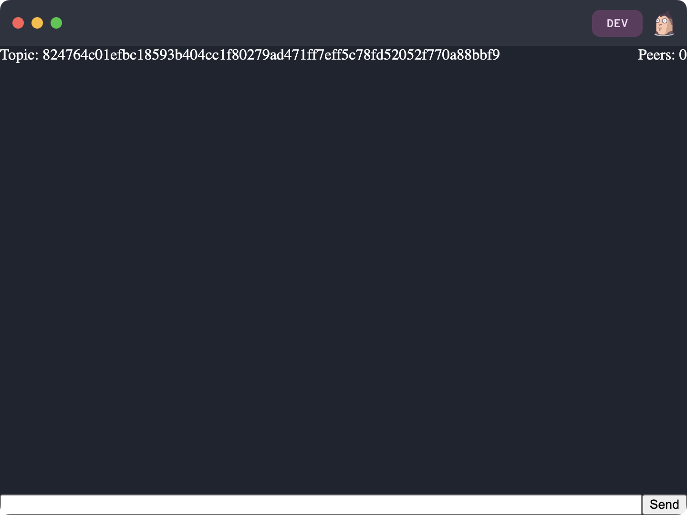
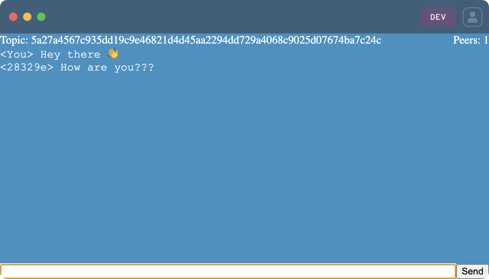

# Making a Pear Desktop Application

This guide demonstrates how to build a peer-to-peer chat application.

It continues where [Starting a Pear Desktop Project](./starting-a-pear-desktop-project.md) left off.

 Build with Pear - Episode 01: Developing with Pear 

## Step 1. HTML Structure and CSS Styles

The project folder should contain:

- `package.json`
- `index.html`
- `app.js`
- `test/index.test.js`

Start by defining the app's layout in `index.html`:

``` html
<!DOCTYPE html>
<html>
  <head>
    <style>
      pear-ctrl[data-platform="darwin"] { margin-top: 12px; margin-left: 10px; }

      #titlebar {
        -webkit-app-region: drag;
        height: 30px;
        width: 100%;
        position: fixed;
        left: 0;
        top: 0;
        background-color: #B0D94413;
        filter: drop-shadow(2px 10px 6px #888);
      }

      button, input {
        all: unset;
        border: 1px ridge #B0D944;
        background: #000;
        color: #B0D944;
        padding: .45rem;
        font-family: monospace;
        font-size: 1rem;
        line-height: 1rem;
      }

      body {
        background-color: #001601;
        font-family: monospace;
        margin: 0;
        padding: 0;
      }

      main {
        display: flex;
        height: 100vh;
        color: white;
        justify-content: center;
        margin: 0;
        padding: 0;
      }

      .hidden {
        display: none !important;
      }

      #or {
        margin: 1.5rem auto;
      }

      #setup {
        display: flex;
        flex-direction: column;
        align-items: center;
        justify-content: center;
      }

      #loading {
        align-self: center;
      }

      #chat {
        display: flex;
        flex-direction: column;
        width: 100vw;
        padding: .75rem;
      }

      #header {
        margin-top: 2.2rem;
        margin-bottom: 0.75rem;
      }

      #details {
        display: flex;
        justify-content: space-between;
      }

      #messages {
        flex: 1;
        font-family: 'Courier New', Courier, monospace;
        overflow-y: scroll;
      }

      #message-form {
        display: flex;
      }

      #message {
        flex: 1;
      }
    </style>
    <script type='module' src='./app.js'></script>
  </head>
  <body>
    <div id="titlebar">
      <pear-ctrl></pear-ctrl>
    </div>
    <main>
      <div id="setup">
        <div>
          <button id="create-chat-room">Create</button>
        </div>
        <div id="or">
          - or -
        </div>
        <form id="join-form">
          <button type="submit" id="join-chat-room">Join</button>
          <input required id="join-chat-room-topic" type="text" placeholder="Chat room Topic" />
        </form>
      </div>
      <div id="loading" class="hidden">Loading ...</div>
      <div id="chat" class="hidden">
        <div id="header">
          <div id="details">
            <div>
              Topic: <span id="chat-room-topic"></span>
            </div>
            <div>
              Peers: <span id="peers-count">0</span>
            </div>
          </div>
        </div>
        <div id="messages"></div>
        <form id="message-form">
          <input id="message" type="text" />
          <input type="submit" value="Send" />
        </form>
      </div>
    </main>
  </body>
</html>
```

**Note**: To make the `<pear-ctrl>` element draggable in Pear applications, wrap it in another element that uses the following CSS property: 
```css
-webkit-app-region : drag;
``` 
This non-standard CSS property tells the application that this element should act as a draggable region for the entire window.

Running `pear run --dev .` should show


## Step 2. Module dependencies

**Note**: Close the app before installing dependencies. If dependencies are installed while the app is running, an error is thrown.

Install the development dependencies using :
```
npm install
```
This will install the following : 
- [pear-interface](https://github.com/holepunchto/pear-interface) for documentation and auto-completion inside editor.
- [brittle](https://github.com/holepunchto/brittle) a TAP framework for testing.

The app uses these modules:

- [hyperswarm](https://www.npmjs.com/package/hyperswarm) to connect peers on a "topic".
- [hypercore-crypto](https://www.npmjs.com/package/hypercore-crypto) for basic cryptography.
- [b4a](https://www.npmjs.com/package/b4a) to manipulate buffers.

Install the dependencies with:

```
npm install hyperswarm hypercore-crypto b4a
```


## Step 3. JavaScript

Replace `app.js` with

``` js

// For interactive documentation and code auto-completion in editor
/** @typedef {import('pear-interface')} */ 

/* global Pear */
import Hyperswarm from 'hyperswarm'   // Module for P2P networking and connecting peers
import crypto from 'hypercore-crypto' // Cryptographic functions for generating the key in app
import b4a from 'b4a'                 // Module for buffer-to-string and vice-versa conversions 
const { teardown, updates } = Pear    // Functions for cleanup and updates

const swarm = new Hyperswarm()

// Unannounce the public key before exiting the process
// (This is not a requirement, but it helps avoid DHT pollution)
teardown(() => swarm.destroy())

// Enable automatic reloading for the app
// This is optional but helpful during production
updates(() => Pear.reload())

// When there's a new connection, listen for new messages, and add them to the UI
swarm.on('connection', (peer) => {
  // name incoming peers after first 6 chars of its public key as hex
  const name = b4a.toString(peer.remotePublicKey, 'hex').substr(0, 6)
  peer.on('data', message => onMessageAdded(name, message))
  peer.on('error', e => console.log(`Connection error: ${e}`))
})

// When there's updates to the swarm, update the peers count
swarm.on('update', () => {
  document.querySelector('#peers-count').textContent = swarm.connections.size
})

document.querySelector('#create-chat-room').addEventListener('click', createChatRoom)
document.querySelector('#join-form').addEventListener('submit', joinChatRoom)
document.querySelector('#message-form').addEventListener('submit', sendMessage)

async function createChatRoom() {
  // Generate a new random topic (32 byte string)
  const topicBuffer = crypto.randomBytes(32)
  joinSwarm(topicBuffer)
}

async function joinChatRoom (e) {
  e.preventDefault()
  const topicStr = document.querySelector('#join-chat-room-topic').value
  const topicBuffer = b4a.from(topicStr, 'hex')
  joinSwarm(topicBuffer)
}

async function joinSwarm (topicBuffer) {
  document.querySelector('#setup').classList.add('hidden')
  document.querySelector('#loading').classList.remove('hidden')

  // Join the swarm with the topic. Setting both client/server to true means that this app can act as both.
  const discovery = swarm.join(topicBuffer, { client: true, server: true })
  await discovery.flushed()

  const topic = b4a.toString(topicBuffer, 'hex')
  document.querySelector('#chat-room-topic').innerText = topic
  document.querySelector('#loading').classList.add('hidden')
  document.querySelector('#chat').classList.remove('hidden')
}

function sendMessage (e) {
  const message = document.querySelector('#message').value
  document.querySelector('#message').value = ''
  e.preventDefault()

  onMessageAdded('You', message)

  // Send the message to all peers (that you are connected to)
  const peers = [...swarm.connections]
  for (const peer of peers) peer.write(message)
}

// appends element to #messages element with content set to sender and message
function onMessageAdded (from, message) {
  const $div = document.createElement('div')
  $div.textContent = `<${from}> ${message}`
  document.querySelector('#messages').appendChild($div)
}
```

> Note that the `pear` dependency is used, even though it was not installed. This is the [Pear API](../reference/pear/api.md), available to any Pear project.


## Step 4. Chat

Open two app instances by running `pear run --dev .` in two terminals. 

In the first app, click on `Create`. A random topic will appear at the top.

Note that topics consist of 64 hexadecimal characters (32 bytes).

<p align="center">
  
</p>

Paste the topic into the second app, then click on `Join`.

<p align="center">
  
</p>

Once connected, messages can be sent between each chat application.

<p align="center">
   
</p>

### Discussion

#### Chatting With Another Machine

The two application instances used Hyperswarm's distributed hash table (DHT) to connect with each other.

The DHT enables connections across different machines, so chatting with other people is also possible, as long as they run the same application.

One option is to copy the code, but it is also possible to distribute the application itself over the DHT. This is the topic of [Sharing a Pear Application](./sharing-a-pear-app.md).

#### Joining Topics VS Joining Servers

In a traditional client-server setup, the server is hosted at an IP address (or hostname) and a port, e.g. `http://localhost:3000`. This is what clients use to connect to the server.

The code in `app.js` contains the line `swarm.join(topicBuffer, { client: true, server: true })`.

`topicBuffer` is the invitation: anyone who knows this topic can join the room and message the other members.

Note that all members are equal: there is no separate client or server. If the room creator goes offline, or even deletes the room from their machine, the other members can continue chatting.

#### Frontend Frameworks

Any frontend framework can be used with Pear.

## Next

* [Starting a Pear Terminal Project](./starting-a-pear-terminal-project.md)
* [Sharing a Pear Application](./sharing-a-pear-app.md)
