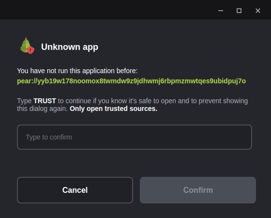

# Sharing a Pear Application

Applications can be shared with peers by seeding them to the network from an efficient local data structure (a [hypercore](../building-blocks/hypercore.md)). We call the mirroring of a local file system into the Pear platform Application Storage "staging". Seeding is sharing an app from a machine over the Distributed Hash Table (DHT) (via [hyperswarm](../building-blocks/hyperswarm.md)) so that other peers can replicate, consume and reseed the application.

 Build with Pear - Episode 02: Sharing Pear Applications 

This guide can either follow on from, [Making a Pear Desktop Application](./making-a-pear-desktop-app.md), [Making a Pear Terminal Application](./making-a-pear-terminal-app.md), or get setup quickly with the following:

```bash
mkdir staging-example
cd staging-example
pear init -y
```

If starting from [Making a Pear Desktop Application](./making-a-pear-desktop-app.md) or [Making a Pear Terminal Application](./making-a-pear-terminal-app.md) ensure that the command-line current working directory is set to the project folder of the application.

## Step 1. Stage the app

To view the help for the `pear stage` command run `pear help stage`.

The command signature for `pear stage` is `pear stage <channel|link> [dir]`.

Before a project is staged for the first time there is no key. The application name and `channel` name are involved in generating the application key, which is later used to run the application from the DHT.

By convention, for internal use we use the channel name `dev`:

```
pear stage dev
```

No need to specify `dir`, the command-line current working directory is already set to the project folder.

The channel name can be any valid name. Using `dev` for local development checks and internal collaboration, using `pear stage production` for production and `pear stage <custom-channel-name>` for any customizations/specializations of the application is a reasonable convention.

Stage will output a diff of changes - the first time will all be additions of course - and then it will output the application link.

If the application is a desktop application there will also be a warmup step where the application is opened in the background and analyzed for initialization-to-loaded critical-path. This metadata is stored along with the application into an application-dedicated hypercore inside Pear. This helps the desktop application load faster. All state is local and by default only the original machine that stages an application can write to this application-dedicated hypercore.

> Some frontend frameworks will load different assets based on whether the `NODE_ENV` environment variable is set to `production`. If the application has this need, use `NODE_ENV=production pear stage dev` in order to stage the production library code so that when Stage Warmup occurs the captured critical-path consists of production assets.

## Step 2. Run the app on the same machine

To view the help for the `pear run` command run `pear help run`.

The command signature for `pear run` is `pear run <link>`.

Copy the application link that was output when the application was staged in the prior step and pass it to `pear run`. For example, if the application link was `pear://nykmkrpwgadcd8m9x5khhh43j9izj123eguzqg3ygta7yn1s379o` the command to run would be:

```
pear run pear://nykmkrpwgadcd8m9x5khhh43j9izj123eguzqg3ygta7yn1s379o
```

`pear run`  opens the application from Pear's application storage. So far the application has remained local, in order to share it with other peers it must be seeded.

## Step 3. Seed the app

The application can be shared with other peers by announcing the application to the DHT and then supplying the application link to other peers.

To view the help for the `pear seed` command run `pear help seed`.

The command signature for `pear seed` is `pear seed <channel|link> [dir]`.

The staged application can be seeded with:

```
pear seed dev
```

The application name and `channel` name are involved in generating the application key so `pear seed` uses the project folder to determine the application name from the `package.json` (`pear.name` or else `name` field). There is no need to specify `dir` here as the command-line current working directory is already set to the project folder.

This will output something similar to the following

```
🍐 Seeding: chat [ dev ]
   ctrl^c to stop & exit

-o-:-
    pear://nykmkrpwgadcd8m9x5khhh43j9izj123eguzqg3ygta7yn1s379o
...
^_^ announced
```

As long as the process is running the application is being seeded. If other peers reseed the application the original process could be closed. Be sure to keep the terminal open while this process is running.


## Step 4. Run the app on another machine

It's important that the application seeding process from the former step is up and running otherwise peers will not be able to connect and replicate state.

With another machine or friend that has `pear` installed execute the `pear run <link>` command to load the application directly peer-to-peer. So with the same example application link it would be:

```
pear run pear://nykmkrpwgadcd8m9x5khhh43j9izj123eguzqg3ygta7yn1s379o
```

When `pear run` is executed on the peer machine there will be a security prompt to add the key to a list of trusted applications by typing 'TRUST'.

When running a terminal application using an untrusted key for the first time the prompt would be:

```
pear run pear://nykmkrpwgadcd8m9x5khhh43j9izj123eguzqg3ygta7yn1s379o
✖ Key pear://nykmkrpwgadcd8m9x5khhh43j9izj123eguzqg3ygta7yn1s379o is not known

Be sure that software is trusted before running it

Type "TRUST" to allow execution or anything else to exit

Trust application? 
```
The trust dialog is a security mechanism in Pear that appears when the user tries to run an application from an unknown or untrusted key for the first time. In case that the app is run in detached mode, for example, when clicking on a pear link in the browser, the trust dialog is a GUI (Graphical User Interface). 



> During development with `pear run --dev`, applications are automatically trusted, as they are assumed to be safe for testing purposes. Trust dialog can be suppressed using the  `--no-ask` flag with `pear run` in which case the application will automatically decline unknown keys.

The application has no state when it's opened for the first time, so the application may show a loader until it's ready to reveal.

The application staging machine that is running the seeding process should show output similar to:

```
🍐 Seeding: chat [ dev ]
   ctrl^c to stop & exit

-o-:-
    pear://nykmkrpwgadcd8m9x5khhh43j9izj123eguzqg3ygta7yn1s379o
...
^_^ announced
•-• peer join 8054f613d911b990834a0234507447c8ca88f4e778594c0e4fc480a314dc6d62
```

The `peer join` line displays the remote public key, in hex, of the peer that executed `pear run` with the application link. 

Once the application is closed on the peer machine the seeding output on the original machine will be similar to:

```
🍐 Seeding: staging-example [ dev ]
   ctrl^c to stop & exit

-o-:-
    pear//:nykmkrpwgadcd8m9x5khhh43j9izj123eguzqg3ygta7yn1s379o
...
^_^ announced
•-• peer join 8054f613d911b990834a0234507447c8ca88f4e778594c0e4fc480a314dc6d62
-_- peer drop 8054f613d911b990834a0234507447c8ca88f4e778594c0e4fc480a314dc6d62
```

### Discussion

#### Lazy loading large files & sparse replication

When Pear loads an application from a peer the staged files are sparsely replicated. Assets not in the critical loading path are only downloaded from peers on-demand. If the application doesn't request an asset or module during a user-session on a given machine it does not get replicated to that machine. Pear's Application Storage can contain very large files (terabytes) that can be accessed by peers on demand. It also makes sense to structure applications so that very large files are not in the critical loading path. So that means strategies such as lazy loading large payloads, avoiding autoplaying large media files and deferring non-essential scripts and styles is as effective with Pear (if not moreso) than with Internet Browsers.

#### Reseeding

The command signature for `pear seed` is `pear seed <channel|link> [dir]`.

If the application was staged on the machine, it will seed the application from the machine.

Otherwise, passing an application link to `pear seed`  will reseed the application from that link.

For example, given the link `pear://nykmkrpwgadcd8m9x5khhh43j9izj123eguzqg3ygta7yn1s379o`, executing `pear seed pear://nykmkrpwgadcd8m9x5khhh43j9izj123eguzqg3ygta7yn1s379o` on a peer that didn't originally stage that particular application will result in that process syncing up-to-date data from peers and providing it to peers who need it.

Once an application is being reseeded, the original seeding process can be closed on the staging machine. However any newly staged changes have to be seeded from that machine for reseeders to pick them up. Which means `pear seed` can be used "deploy" to reseeders by starting after staging, leaving it running until reseeders have synced and then stopping the process again.

## Next

* [Releasing a Pear Application](./releasing-a-pear-app.md)
