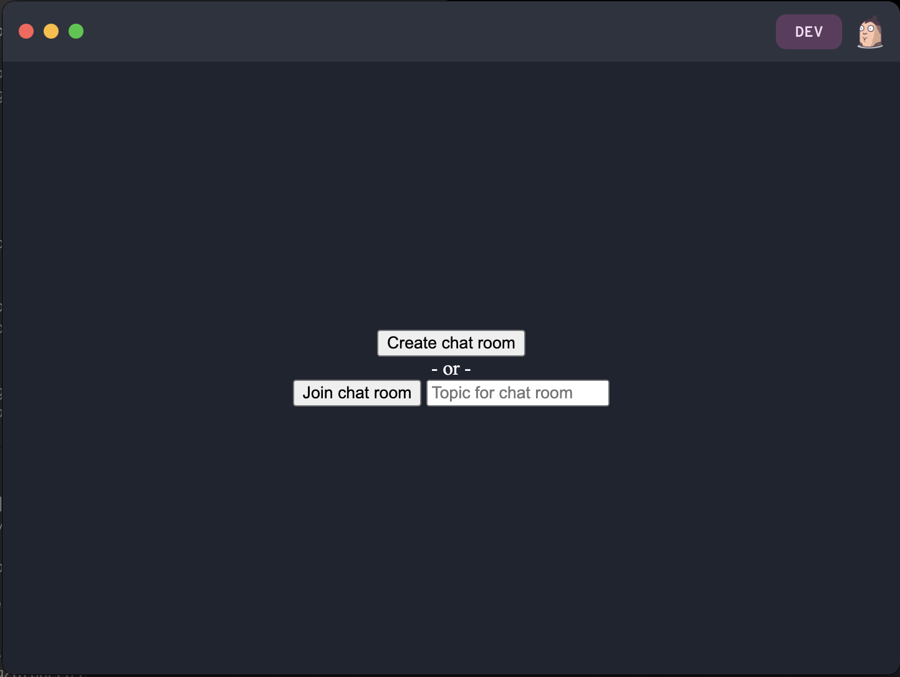

# Starting a Pear App

This tutorial will show how to create a basic chat app with Pear, and through that teach how to use some of the main building blocks.

In this first part of the app, users will be able to create chat rooms, connect to each other, and send messages.

## Step 1. Init

First create a new project using `pear init`.

```
$ mkdir chat
$ cd chat
$ pear init --yes
```

This will create a base structure for the project.

- `package.json`. Config for the app. Notice the `pear` property.
- `index.html`. The UI for the app.
- `app.js`. The main code.
- `test/index.test.js`. Skeleton for writing tests.

## Step 2. Test that everything works

Before writing any code, make sure that everything works the way it's supposed to by using `pear dev`.

```
$ pear dev
```

This will open the app. Because it's opened in development mode, developer tools are also opened.


## Step 3. Automatic reload

Pear apps have automatic reload included. This means that there is no need to stop and start the app again to see changes.

While keeping the app open with `pear dev`, open `index.html` in a code editor. Change `<h1>chat</h1>` to `<h1>Hello world</h1>` and go to the app again. It should now look like this:


## Step 4. Create a basic UI

To add some more interesting UI, let's have an example of a chat app, where users are able to create or join chat rooms and write messages to each other.


``` html
<!DOCTYPE html>
<html>
  <head>
    <style>
      body {
        display: flex;
        height: 100vh;
        color: white;
        justify-content: center;
        margin: 0;
        padding: 0;
      }

      .hidden {
        display: none !important;
      }

      #setup {
        display: flex;
        flex-direction: column;
        align-items: center;
        justify-content: center;
      }

      #loading {
        align-self: center;
      }

      #chat {
        display: flex;
        flex-direction: column;
        width: 100vw;
      }

      #header {
        display: flex;
        justify-content: space-between;
      }

      #messages {
        flex: 1;
        font-family: 'Courier New', Courier, monospace;
        overflow-y: scroll;
      }

      #message-form {
        display: flex;
      }

      #message {
        flex: 1;
      }
    </style>
    <script type='module' src='./app.js'></script>
  </head>
  <body>
    <div id="setup">
      <div>
        <button id="create-chat-room">Create chat room</button>
      </div>
      <div>
        - or -
      </div>
      <div>
        <button id="join-chat-room">Join chat room</button>
        <input id="join-chat-room-topic" type="text" placeholder="Topic for chat room" />
      </div>
    </div>
    <div id="loading" class="hidden">Loading ...</div>
    <div id="chat" class="hidden">
      <div id="header">
        <div>
          Topic: <span id="chat-room-topic"></span>
        </div>
        <div>
          Peers: <span id="peers-count">0</span>
        </div>
      </div>
      <div id="messages"></div>
      <form id="message-form">
        <input id="message" type="text" />
        <input type="submit" value="Send" />
      </form>
    </div>
  </body>
</html>
```

After running with `pear dev` it should look like this:




## Next

Now that there's some basic UI for a chat app, let's take a look at [making a Pear App](./making-a-pear-app.md).
