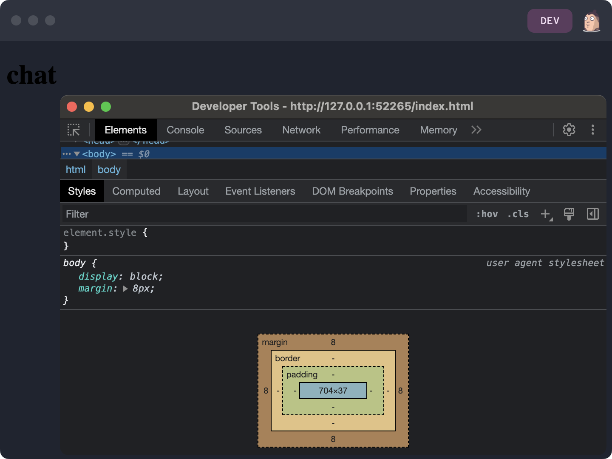
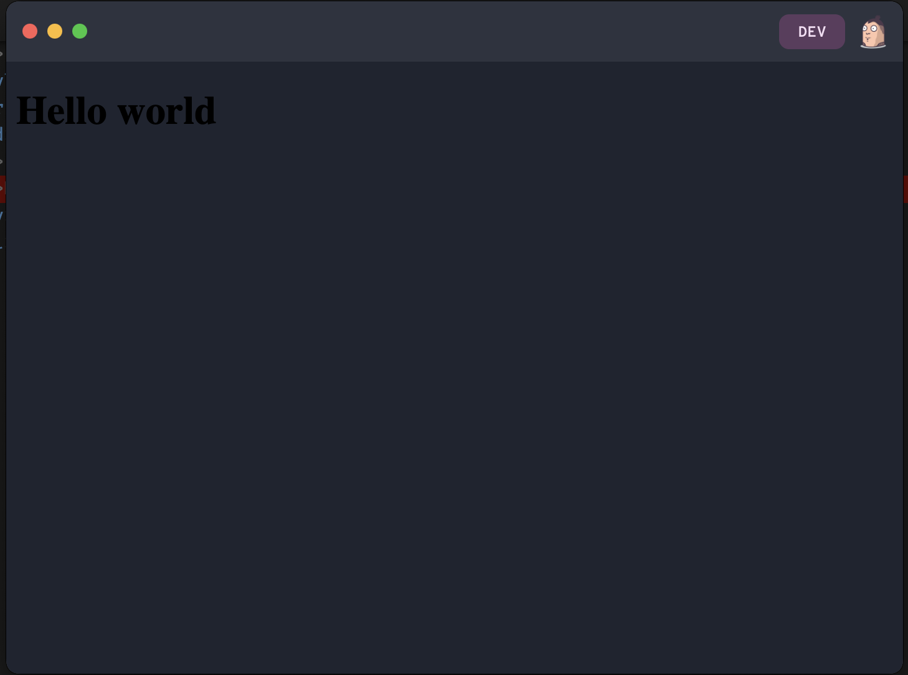

# Starting a Pear Desktop Project

This section shows how to generate, configure, and develop a Pear desktop project, in preparation for [Making a Pear Desktop Application](./making-a-pear-desktop-app.md).

 Build with Pear - Episode 01: Developing with Pear 

## Step 1. Initialization

Use `pear init` to create a new Pear project.

```
mkdir chat
cd chat
pear init --yes
```

This creates the base project structure.

- `package.json`. App configuration. Notice the `pear` property.
- `index.js`. App entrypoint.
- `app.js`. Main code.
- `test/index.test.js`. Test skeleton.

## Step 2. Verify Everything Works

Use `pear dev` to verify everything works as expected.

```
pear dev
```

The app should open in development mode. By default, developer tools are also opened.



## Step 3. Automatic Reload

Pear watches project files. When they change, the app is automatically reloaded.

While keeping the `pear dev` command running, open `index.html` in an editor.

Change `<h1>chat</h1>` to `<h1>Hello world</h1>`.

The app should now show:



> Live reload with hot-module reloading is possible by using the `pear.watch` configuration and the [`pear.updates`](../reference/api.md#pearupdateslistener-async-functionfunction) API. The [pear-hotmods](https://github.com/holepunchto/pear-hotmods) convenience module can also be used.

## Step 4. Configuration

Application configuration is under the `pear` property in `package.json`

Open `package.json` and update it to:

```
{
  ...
  "pear": {
    "gui": {
      "backgroundColor": "#012a02",
      "height": 400,
      "width": 700
    }
  }
  ...
}
```

Close the app and re-run `pear dev` to see the changes:  the background is now light blue, and the initial window size is different.

See the [Configuration Documentation](../reference/configuration.md) for all options.


## Next

* [Making a Pear Desktop Application](./making-a-pear-desktop-app.md)
