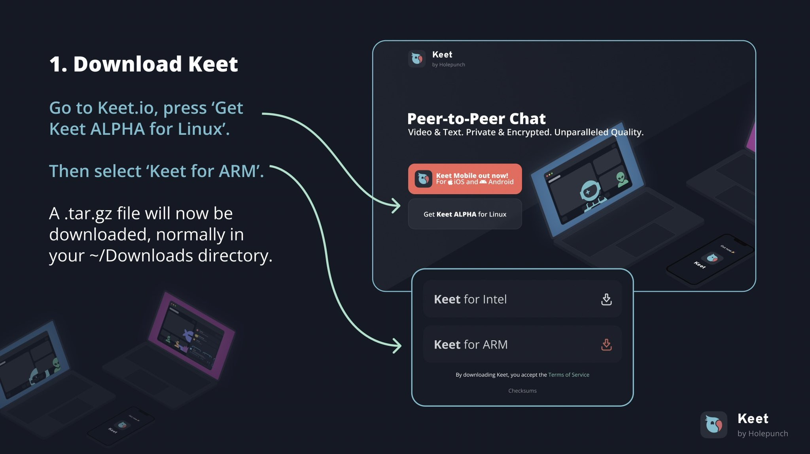
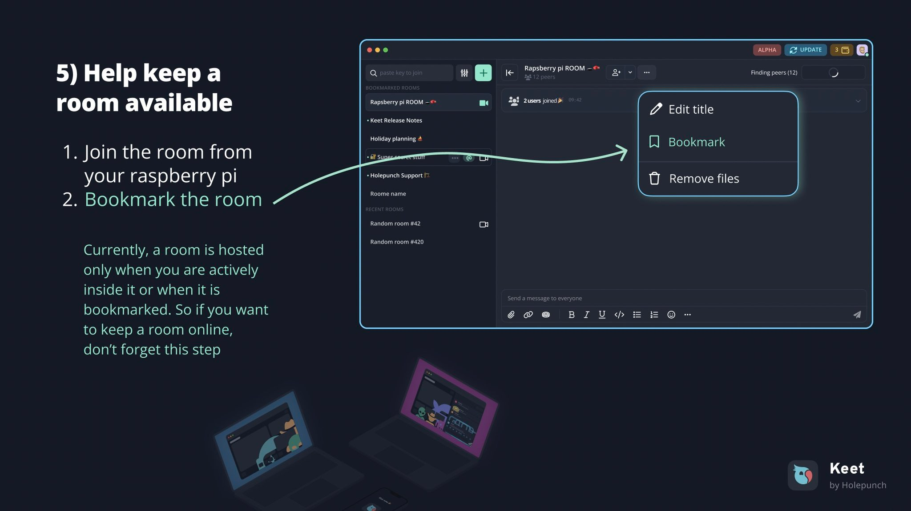

### Create your personal Keet P2P Chat Relay on a Raspberry PI 4


Prerequisite:  Raspberry Pi with 64-bit architecture - e.g., Raspberry Pi 4. Check out their [website](https://www.raspberrypi.org/) to discover more options.


## 1. Download Keet

Visit [Keet.io](https://keet.io/) and download Keet on your pi by selecting “(**Get Keet ALPHA for Linux**)" and "**Keet for ARM**”.



## 2. Install all the required dependencies

Use the following commands to install the necessary dependencies. This will ensure the seamless execution of the AppImages.

```bash
sudo apt install zlib1g zlib1g-dev
sudo apt install libfuse2
```


If the libfuse2 package is not found (e.g., in Ubuntu 22), add an APT repository called universe by executing: sudo add-apt-repository universe and then try step-2 again.


## 3. Run Keet

Now, extract the ```Keet-arm64.tar.gz``` file downloaded earlier. Next, run the ```Keet.AppImage``` of the extracted folder by double-clicking on it. This step will start up Keet for you.


## 4. Create a Room

To join a room from your phone, create a room on the Raspberry Pi, then open the invite menu and scan the QR code from your mobile device.


## 5. Bookmark the room

You can always bookmark the room to keep it available for yourself and other peers.



Voilà! You are all set up with your personal Peer-to-Peer Keet chat relay! 🍐
